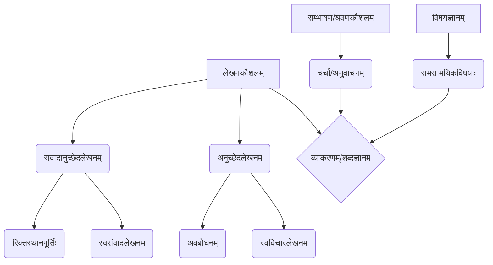

# Class 9 Sanskrit - Abhyasvan Chapter 104
**Language:** संस्कृतम्

```markdown
# [कक्षा ९] अभ्यासवान् भव - अध्यायः १०४ (संवादानुच्छेदलेखनम्)

## 🌟 मुख्यसंकल्पनाः (Core Concepts)

अस्मिन् पाठे छात्राः संस्कृतेन लेखनकौशलस्य विकासं करिष्यन्ति, विशेषतः संवादलेखने अनुच्छेदेलेखने च।

1.  **लेखनकौशलम् (Writing Skill)**
    *   **संवादानुच्छेदलेखनम् (Dialogue Passage Writing)**
        *   मञ्जूषा-साहाय्येन रिक्तस्थानपूर्तिः (Filling blanks with help box)
        *   सन्दर्भानुसारं वाक्यचयनम् (Selecting sentences based on context)
        *   स्वसंवादलेखनम् (Writing original dialogues)
    *   **अनुच्छेदलेखनम् (Paragraph Writing)**
        *   प्रदत्त-अनुच्छेदस्य अवबोधनम् (Comprehension of given paragraphs)
        *   स्वपरिचयलेखनम् (Writing self-introduction)
        *   विभिन्नविषयेषु स्वविचारलेखनम् (Writing own thoughts on various topics)
2.  **व्याकरणम् तथा शब्दज्ञानम् (Grammar and Vocabulary)**
    *   संवाद-अनुच्छेदमाध्यमेन व्याकरणनियमानां प्रयोगः (Application of grammar rules through dialogues/paragraphs)
    *   नूतनशब्दानां ज्ञानं प्रयोगश्च (Learning and using new words)
3.  **समसामयिकविषयाणां ज्ञानम् (Knowledge of Contemporary Topics)**
    *   पर्यावरणम् (Environment - Pollution)
    *   अर्थव्यवस्था (Economy - Demonetization, Career Choices)
    *   समाजः (Society - Discipline, Cleanliness, Health)
    *   शिक्षा (Education - Exams, Future Plans)
4.  **श्रवण-भाषण-कौशलम् (Listening-Speaking Skills)**
    *   (शिक्षकनिर्देशानुसारम्) अनुच्छेदश्रवणम् (Listening to paragraphs)
    *   विषयेषु चर्चा (Discussion on topics)

📊 **संकल्पनासोपानम् (Concept Hierarchy):**


## 📘 प्रमुखशिक्षणांशाः (Key Learnings)

1.  **संवादलेखनविधिः (Method of Dialogue Writing):**
    *   **सन्दर्भज्ञानम्:** संवादस्य विषयं, पात्राणां सम्बन्धं च अवगच्छन्तु। (Understand the topic and relationship between characters).
    *   **क्रमबद्धता:** प्रश्नानाम् उत्तराणां च स्वाभाविकं क्रमं पश्यन्तु। (Observe the natural order of questions and answers).
    *   **मञ्जूषाप्रयोगः:** प्रदत्त-मञ्जूषातः योग्यं वाक्यं चित्वा रिक्तस्थाने लिखन्तु। (Choose the appropriate sentence from the help box).
    *   **स्वलेखनम्:** सरलैः वाक्यैः स्वविचारान् प्रकटयितुं अभ्यासं कुर्वन्तु। (Practice expressing own ideas in simple sentences).
    *   📈 **संवादस्य संरचना (Structure of a Dialogue):**
        *   अभिवादनम्/प्रारम्भः (Greeting/Start) -> विषयप्रस्तुतिः (Topic Introduction) -> विचारविनिमयः (Exchange of Ideas) -> समापनम्/शुभाशंसा (Conclusion/Good Wishes).

2.  **अनुच्छेदलेखनविधिः (Method of Paragraph Writing):**
    *   **अवबोधनम्:** अनुच्छेदं पठित्वा तस्य मुख्यभावं ज्ञातुं प्रयतध्वम्। (Read the paragraph and try to understand its main idea).
    *   **स्वपरिचयः:** निर्दिष्टान् अंशान् अनुसृत्य सरलसंस्कृतेन स्वपरिचयं लिखन्तु। (Write self-introduction in simple Sanskrit following given points).
    *   **स्वविचारप्रकटनम्:** प्रदत्तविषये (यथा - प्रदूषणम्, अनुशासनम्) स्वमतानि स्पष्टतया लघुवाक्येषु लिखन्तु। (Write your opinions clearly in short sentences on the given topic).
    *   **सरलता स्पष्टता च:** वाक्यरचना सरला स्पष्टा च भवेत्। व्याकरणनियमान् पालयन्तु। (Sentence construction should be simple and clear. Follow grammar rules).

## 🧩 सक्रिय-अधिगमः (Active Learning)

*   **क्रियाकलापः (Activity):**
    *   **संवादपूर्तिः:** प्रदत्तैः दशभिः संवादैः मञ्जूषा-साहाय्येन रिक्तस्थानानि पूरयन्तु। (Fill blanks in 10 dialogues using the help box).
    *   **स्वसंवादलेखनम्:** भ्रात्रा, भगिन्या मित्रेण वा सह पञ्चवाक्येषु स्वकीयं संवादं रचयन्तु। (Compose your own 5-sentence dialogue with a sibling or friend - Ex 11).
    *   **स्वपरिचयलेखनम्:** प्रदत्तम् आदर्शम् अनुसृत्य स्वपरिचयं लिखन्तु। (Write your self-introduction following the given example).
    *   **विश्लेषणात्मकलेखनम् (Analytical Writing):**
        *   🔍 **प्रदूषणम्:** देहल्याः प्रदूषणसमस्यां पठित्वा तन्निवारणाय स्वविचारान् लिखन्तु। (Read about Delhi's pollution problem and write your ideas for its prevention).
        *   🏦 **विमुद्रीकरणम्:** विमुद्रीकरणस्य विषये पठित्वा तस्य पक्षे विपक्षे च स्वमतं लिखन्तु (इदमेकं **शोध-आधारित-विश्लेषणम्** अस्ति)। (Read about demonetization and write your opinion for and against it - this is a **research-based case study analysis**).
        *   🧘 **अनुशासनम् / परीक्षा:** अनुशासनस्य महत्त्वं परीक्षायाः अनुभवान् च विषयीकृत्य स्वविचारान् लिखन्तु। (Write your thoughts on the importance of discipline and experiences with exams).

*   **चर्चा (Discussion):**
    *   🌍 **वास्तविक-प्रभावस्य आलोचनात्मकं विश्लेषणम् (Critical analysis of real-world impacts):**
        *   पर्यावरणप्रदूषणस्य कारणानि परिणामाः निवारणोपायाः च। (Causes, effects, and solutions for environmental pollution).
        *   विमुद्रीकरणस्य उद्देश्यानि, जनानाम् अनुभवाः, अर्थव्यवस्थायाम् प्रभावः च। (Objectives of demonetization, people's experiences, and its impact on the economy).
    *   अनुशासनस्य जीवने महत्त्वम्। (Importance of discipline in life).
    *   परीक्षायाः भयं, तस्य सामना कथं करणीयम्? (Fear of exams, how to face it?).
    *   विभिन्न-वृत्ति-विकल्पाः (Career options discussed in dialogues 8 & 9).

## 📝 मूल्याङ्कनसिद्धता (Assessment Prep)

*   परीक्षायाम् एतादृशाः प्रश्नाः भवितुम् अर्हन्ति:
    *   **संवादपूर्तिः:** मञ्जूषा-साहाय्येन संवादस्य रिक्तस्थानानि पूरयत। (Fill blanks in a dialogue using a help box).
    *   **अनुच्छेद-अवबोधनम्:** अनुच्छेदं पठित्वा प्रश्नानाम् उत्तराणि लिखत। (Read a paragraph and answer questions).
    *   **लघु-अनुच्छेदलेखनम्:** प्रदत्ते विषये (यथा - मम दिनचर्या, मम प्रियः विषयः) पञ्च वाक्यानि लिखत। (Write 5 sentences on a given topic like 'My daily routine', 'My favorite subject').
    *   📝 **विशिष्ट-उदाहरण-विश्लेषणम् (Case Studies):** प्रदूषणम्, विमुद्रीकरणम् इत्यादिषु विषयेषु लघु-अनुच्छेदं पठित्वा स्वमतं प्रकटयितुं कथ्येत। (You might be asked to read a short passage on topics like pollution, demonetization and express your opinion).
    *   📊 **चित्राणि (Diagrams):** संवादस्य/अनुच्छेदस्य संरचनां ज्ञातुं चित्राणि उपयोगीनि भवितुम् अर्हन्ति। (Diagrams can be useful to understand the structure of dialogues/paragraphs).
*   **मुख्यम्:** सन्दर्भस्य सम्यक् ज्ञानम्, शुद्धः व्याकरणप्रयोगः, उचितः शब्दप्रयोगः च मूल्याङ्कने महत्त्वपूर्णाः भविष्यन्ति। (Key: Proper understanding of context, correct grammar usage, and appropriate vocabulary will be important in assessment).

## 🌏 भारतीयसन्दर्भः (Bharatiya Context)

अस्मिन् अध्याये अनेके भारत-विशिष्टाः सन्दर्भाः उल्लिखिताः सन्ति, ये राष्ट्रिय-आर्थिक-सामाजिक-विवरणैः सह सम्बद्धाः।

*   **पर्यावरणम् (Environment):**
    *   📊 **देहली-नगरे वायुप्रदूषणम्:** भारतस्य राजधानीक्षेत्रे गम्भीरा समस्या, यस्याः कारणानि (वाहनानि, पलालदहनम्, औद्योगिक-उत्सर्जनम्) परिणामाः (श्वासरोगः, नेत्रदाहः) च वर्णिताः। सर्वकारस्य प्रयासाः अपि सूचिताः (यथा - समविषम-नियमाः संवाद ४ मध्ये अप्रत्यक्षतः)। (Air pollution in Delhi: A serious problem in India's capital, its causes (vehicles, stubble burning, industrial emission) and effects (respiratory illness, eye irritation) are described. Government efforts are also indicated).
*   **अर्थव्यवस्था (Economy):**
    *   🏦 **विमुद्रीकरणम् (२०१६):** कृष्णधनस्य निवारणाय कृतः प्रमुखः आर्थिकः निर्णयः, तस्य प्रभावः च चर्चितः। (Demonetization (2016): A major economic decision to curb black money, and its impact are discussed).
    *   🌾 **कृषिः (Agriculture):** आधुनिकरीत्या कृषिकार्यस्य (वैज्ञानिकरीत्या) तथा सर्वकारीययोजनायाः (`भूमिसवास्थ्यपत्रम्` - Soil Health Card) उल्लेखः अस्ति (संवाद ९)। (Mention of modern farming methods and a government scheme - Soil Health Card).
    *   🎨 **कुटीरोद्योगः (Cottage Industry):** "मधुबनीचित्रकला" वृत्तिरूपेण चयनस्य उदाहरणम् (संवाद ९)। (Example of choosing "Madhubani Painting" as a career, representing cottage industry).
*   **समाजः (Society):**
    *   🧹 **स्वच्छता (Cleanliness):** परिसरस्य स्वच्छतायाः महत्त्वं तथा जनानां दायित्वं चर्चितम् (संवाद १०), यत् 'स्वच्छभारत-अभियानस्य' भावनां दर्शयति। (Importance of cleanliness of surroundings and citizens' responsibility discussed, reflecting the spirit of 'Swachh Bharat Abhiyan').
    *   🩺 **स्वास्थ्यम् (Health):** प्रदूषणस्य स्वास्थ्ये दुष्प्रभावः (संवाद ४), सन्तुलित-आहारस्य महत्त्वं तथा 'जङ्क-फूड्' इत्यस्य हानयः (संवाद ७) उल्लिखिताः। (Negative health impacts of pollution, importance of balanced diet, and harms of 'junk food' are mentioned).
*   **शिक्षा (Education):**
    *   🎓 भविष्यत्-योजनाः (Future Plans): छात्राणां मध्ये विभिन्नानां वृत्तीनां (चिकित्सा, अभियान्त्रिकी, वस्त्रालङ्करणम्, कला, कृषिः) चर्चा (संवाद ८, ९)। (Discussion among students about various career paths - medicine, engineering, fashion design, art, agriculture).

एते सर्वे विषयाः भारतस्य वर्तमान-सामाजिक-आर्थिक-पर्यावरणीय-स्थितिभिः सह सम्बद्धाः सन्ति। (All these topics are related to India's current socio-economic and environmental situation).
```