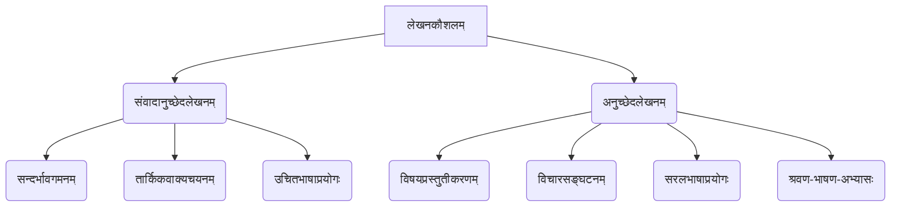

# Class 9 Sanskrit - Abhyasvan Chapter 104
**Language:** संस्कृतम्

```markdown
# [कक्षा ९] अभ्यासवान् - अध्यायः १०४ - संवादानुच्छेदलेखनम्

## 🌟 मूलसिद्धान्ताः (Core Concepts)

अस्मिन् पाठे वयं मुख्यतया द्वयोः लेखनकौशलयोः अभ्यासं कुर्मः - संवादलेखनम् (सम्भाषणस्य अंशान् पूरयित्वा) तथा च अनुच्छेदलेखनम् (लघुनिबन्धान् रचयित्वा)।

1.  **संवादलेखनम् / संवादानुच्छेदलेखनम् (Dialogue Completion/Writing)**
    *   **सन्दर्भस्य अवगमनम्:** संवादस्य विषयं, पात्राणां सम्बन्धं च अवगन्तुं क्षमता।
    *   **तार्किकक्रमस्य चयनम्:** मञ्जूषातः (सहायता-पेटिकातः) उचितं वाक्यं चित्वा संवादस्य प्रवाहं रक्षितुं कौशलम्।
    *   **उचित-शब्दावली-व्याकरणस्य प्रयोगः:** संवादस्य परिस्थित्यनुसारं सरल-संस्कृत-वाक्यानां प्रयोगः।
    *   **भावानुसारं वाक्यचयनम्:** प्रश्नानाम् उत्तराणि, भावनाः (यथा - आश्चर्यम्, चिन्ता, प्रसन्नता) च प्रकटयितुं समर्थता।

2.  **अनुच्छेदलेखनम् (Paragraph Writing)**
    *   **विषयस्य प्रस्तुतीकरणम्:** प्रदत्तविषये स्वविचारान् अथवा सूचनाः स्पष्टतया, सङ्क्षिप्ततया च लेखितुं योग्यता।
    *   **विचारसङ्घटनम्:** वाक्यानां क्रमबद्धं संयोजनं कृत्वा सुसम्बद्धम् अनुच्छेदं रचयितुं कौशलम्।
    *   **सरलभाषाप्रयोगः:** शुद्धव्याकरणयुक्तानां सरलानां संस्कृृतवाक्यानां निर्माणम्।
    *   **श्रवण-भाषण-कौशल-विकासः:** अनुच्छेदं पठित्वा, श्रुत्वा च तद्विषये चर्चां कर्तुं, स्वमतं प्रकटयितुं च सामर्थ्यम्।

📊 **सिद्धान्तसोपानम् (Concept Hierarchy):**


## 📘 मुख्य-अधिगमबिन्दवः (Key Learnings)

1.  **संवादपूरण-विधिः (Method for Dialogue Completion):**
    *   **प्रथमं सोपानम्:** सम्पूर्णं संवादं ध्यानेन पठन्तु, विषयं ज्ञातुं प्रयतन्तु च।
    *   **द्वितीयं सोपानम्:** रिक्तस्थानस्य पूर्वतनं परतनं च वाक्यं पठित्वा अपेक्षितस्य उत्तरस्य/कथनस्य अनुमानं कुर्वन्तु।
    *   **तृतीयं सोपानम्:** मञ्जूषायां दत्तानि वाक्यानि अवलोक्य सम्भावितम् उचितं वाक्यं चिन्वन्तु।
    *   **चतुर्थं सोपानम्:** चितं वाक्यं रिक्तस्थाने योजयित्वा पुनः संवादं पठन्तु यत् प्रवाहः समुचितः अस्ति न वा।
    *   **उदाहरणम् (संवादः १):** लता पृच्छति कुत्र गन्तुं सज्जा असि? राधिका वदति विद्यालयं गच्छामि (मञ्जूषातः 'ख')। पुनः लता पृच्छति - अस्मिन् वेषे? गणवेषः कुत्र? राधिका वदति - अद्य काव्यपाठ-प्रतियोगिता अस्ति, अहं भागं ग्रहीतुं गच्छामि (मञ्जूषातः 'ङ')। एवं क्रमेण संवादः पूरणीयः।

    📈 **संवादपूरण-प्रक्रिया (Dialogue Completion Process):**
    ```mermaid
    graph LR
        A[संवादपठनम्] --> B(सन्दर्भावगमनम्);
        B --> C(रिक्तस्थान-विश्लेषणम्);
        C --> D(मञ्जूषा-वाक्य-अवलोकनम्);
        D --> E(उचितवाक्यचयनम्);
        E --> F(संवादस्य पुनः पठनम्);
        F --> G(पूर्णः संवादः);
    ```

2.  **अनुच्छेदलेखन-विधिः (Method for Paragraph Writing):**
    *   **विषयचयनम्/अवगमनम्:** प्रदत्तं विषयं सम्यक् अवगच्छन्तु।
    *   **मुख्यविचार-सङ्कलनम्:** विषयेण सम्बद्धाः केचन मुख्यबिन्दवः चिन्तयन्तु।
    *   **रूपरेखा-निर्माणम्:** विचाराणां तार्किकं क्रमं निश्चिनुयुः (प्रस्तावना, विस्तारः, उपसंहारः)।
    *   **सरलवाक्येषु लेखनम्:** प्रत्येकं विचारं सरलेन संस्कृृतवाक्येन प्रकटयन्तु।
    *   **व्याकरणशुद्धिः:** शब्दरूपाणि, धातुरूपाणि, वाक्यविन्यासं च ध्यानेन पश्यन्तु।
    *   **उदाहरणम् ('मम परिचयः'):** स्वनाम, कक्षा, आयुः, निवासस्थानम्, परिवारः, रुचिः, लक्ष्यम् इत्यादि बिन्दून् क्रमेण सरलवाक्येषु लेखितुं शक्यते। यथा - मम नाम ____ अस्ति। अहं नवमकक्षायां पठामि। अहं ____ नगरे वसामि। मम परिवारे ____ सन्ति। मह्यं ____ रोचते। अहं भविषये ____ भवितुम् इच्छामि।

## 🧩 सक्रिय-अधिगमः (Active Learning)

*   **गतिविधिः (Activity): शोध-आधारित-विश्लेषणम् (Research-based Analysis) 🔍**
    *   **विषयः:** 'भारतस्य जलसङ्कटम्' अथवा 'डिजिटल-भारतम् अभियानस्य प्रभावः'।
    *   **कार्यम्:** छात्रैः एतेषु विषयेषु अन्तर्जालात् पुस्तकालयात् वा सूचनाः अन्वेष्टव्याः। ततः तैः लघु-अनुच्छेदः संस्कृतेन लेखितव्यः, यस्मिन् समस्यायाः कारणानि, परिणामाः, सर्वकारस्य प्रयासाः, स्वसुझावाः च स्युः। कक्षायां प्रस्तुतीकरणं करणीयम्।

*   **चर्चा (Discussion): वास्तविक-जगति प्रभावस्य आलोचनात्मकं विश्लेषणम् (Critical Analysis of Real-world Impacts) 🌍**
    *   **विषयाः:**
        1.  'पर्यावरण-प्रदूषणस्य (विशेषतः देहल्याः) निवारणाय अस्माकं किं योगदानं भवितुम् अर्हति?' (पाठस्य अनुच्छेदः २ आधारितः)
        2.  'विमुद्रीकरणस्य (Demonetization) लाभाः हानयः च के आसन्?' (पाठस्य अनुच्छेदः ४ आधारितः)
        3.  'परीक्षायाः भयं कथं दूरीकर्तुं शक्यते? परीक्षायाः वास्तविकम् उद्देश्यं किम् अस्ति?' (पाठस्य अनुच्छेदः ५ आधारितः)
        4.  'जीवने अनुशासनस्य किं महत्त्वम् अस्ति?' (पाठस्य अनुच्छेदः ३ आधारितः)
    *   **प्रक्रिया:** छात्राः लघुसमूहेषु विभज्य एतेषु विषयेषु स्वविचारान् संस्कृतेन प्रकटयेयुः, परस्परं तर्कवितर्कं कुर्युः च।

## 📝 मूल्याङ्कन-सिद्धता (Assessment Prep)

*   **संवादपूरणम्:** अभ्यासपुस्तिकायां दत्ताः इव संवादाः परीक्षायां भविष्यन्ति, येषु मञ्जूषातः उचितवाक्यानि चित्वा रिक्तस्थानानि पूरणीयानि। संवादस्य सन्दर्भं सम्यक् अवगन्तुं महत्त्वपूर्णम्। (यथा - अभ्यासः १ तः १०)
*   **अनुच्छेदलेखनम्:** प्रदत्तेषु विषयेषु (यथा - मम परिचयः, पर्यावरणम्, अनुशासनम्, मम प्रियं पुस्तकम्, मम विद्यालयः) पञ्चतः सप्त सरलसंस्कृतवाक्यानि लेखितुं अभ्यासः करणीयः। (यथा - अनुच्छेदलेखन-अभ्यासः १ तः ५)
*   **विश्लेषणात्मक-प्रश्नाः:** पाठे चर्चितानां विषयाणां (यथा - प्रदूषणम्, विमुद्रीकरणम्, करियर-चयनम्) विषये स्वमतं संस्कृतेन प्रकटयितुं सज्जता आवश्यकी।
*   **उदाहरण-विश्लेषणम् (Case Studies & Diagrams):**
    *   **प्रदूषणम् (Pollution):** देहली-प्रदूषणस्य कारणानि (वाहनानि, पलाल-दहनम्, औद्योगिकीकरणम्) परिणामाः (श्वासरोगः, नेत्रदाहः) च ज्ञातव्याः। निवारणोपायाः चर्चनीयाः।
    *   **विमुद्रीकरणम् (Demonetization):** अस्य उद्देश्यं (कृष्णधन-निरोधः), प्रभावः (जनानां कष्टम्, वित्तकोशेषु धनसङ्ग्रहः) च अवगन्तव्यः।
    *   **रेखाचित्राणि (Diagrams):** संवादपूरणस्य प्रक्रिया (उपर्युक्तं रेखाचित्रम्) अथवा अनुच्छेदलेखनस्य सोपानानि अवगन्तुं साहाय्यं करिष्यन्ति।

## 🌏 भारतीय-सन्दर्भः (Bharatiya Context)

अस्मिन् अध्याये अनेके भारतीय-सामाजिक-आर्थिक-सांस्कृतिक-विषयाः सङ्केतिताः सन्ति:

1.  **पर्यावरण-प्रदूषणम् (Environmental Pollution):** विशेषतः भारतस्य राजधानी **देहल्याः** वायुप्रदूषणस्य गम्भीरसमस्या (अनुच्छेदः २, संवादः ४) उल्लिखिता अस्ति, यत्र कारणानि (वाहनानि, **पलालदहनम् (Stubble Burning)**) तथा च सर्वकारस्य प्रयासाः (यथा - सम-विषम-नियमः) चर्चिताः।
2.  **विमुद्रीकरणम् (Demonetization):** **नवम्बर २०१६** मध्ये भारतसर्वकारेण कृतस्य विमुद्रीकरणस्य (५०० तथा १००० रूप्यकाणां निषेधः) उद्देश्यं (कृष्णधनस्य बहिरागमनम्) तथा च तस्य परिणामः (जनानां कष्टम्, वित्तकोशेषु धनसमायोजनम्) वर्णितः अस्ति (अनुच्छेदः ४)।
3.  **कौशल-विकासः एवं उद्यमिता (Skill Development & Entrepreneurship):** संवादः ९ मध्ये छात्राः स्वभविष्य-योजनाः चर्चयन्ति, यत्र **मधुबनी-चित्रकला (Madhubani Painting)** इत्यस्य प्रशिक्षणं प्राप्य **कुटीरोद्योगं (Cottage Industry)** चालयितुं इच्छा प्रकटीकृता अस्ति, यत् भारतीय-पारम्परिक-कला-कौशलस्य महत्त्वं दर्शयति।
4.  **कृषि-क्षेत्रम् (Agriculture Sector):** संवादः ९ मध्ये **कृषिविज्ञानं (Agricultural Science)** पठित्वा वैज्ञानिकरीत्या कृषिं कर्तुं तथा च **भूमिस्वास्थ्यपत्रस्य (Soil Health Card)** उपयोगस्य उल्लेखः अस्ति, यत् आधुनिक-कृषि-प्रविधिषु भारतस्य प्रगतिं सङ्केतयति।
5.  **स्वच्छता-अभियानम् (Cleanliness Drive):** संवादः १० मध्ये गृहात् बहिः अवकरक्षेपणस्य समस्या तथा च **परिवेशस्य स्वच्छतायाः** महत्त्वं चर्चितम् अस्ति, यत् भारतसर्वकारस्य **'स्वच्छभारत-अभियानम्'** इत्यनेन सह सम्बद्धम् अस्ति।
6.  **भारतीय-संस्कृतिः एवं भाषा (Indian Culture & Language):** संस्कृतश्लोकोच्चारण-प्रतियोगिता (संवादः ३), संस्कृतसाहित्ये स्नातकोत्तर-परीक्षा (संवादः २) इत्यादीनाम् उल्लेखः संस्कृतभाषायाः अध्ययनस्य महत्त्वं सूचयति।

एते सर्वे विषयाः छात्राणां समसामयिक-भारतीय-परिप्रेक्ष्ये अवगमनं वर्धयन्ति तथा च तान् स्वसमाजं प्रति अधिकं जागरूकान् कुर्वन्ति।
```