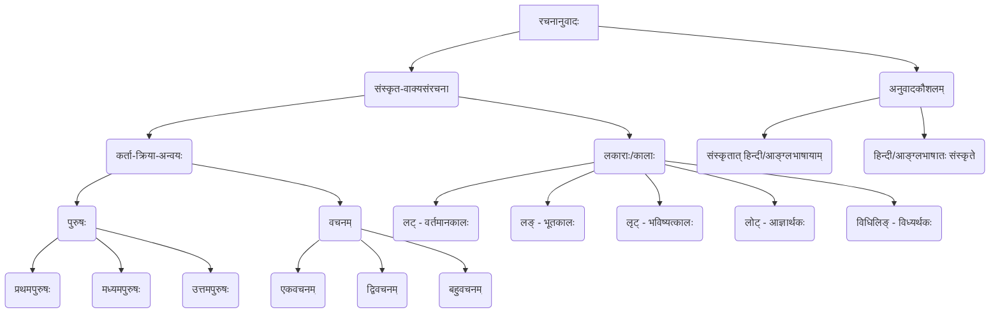

# Class 9 Sanskrit - Abhyasvan Chapter 105
**Language:** संस्कृतम्

```markdown
# [कक्षा ९] अभ्यासवान् भव - अध्यायः १०५ - रचनानुवादः

## 🌟 मूलसंकल्पनाः (Core Concepts)

अस्मिन् पाठे वयं संस्कृतभाषायां सरलवाक्यनिर्माणस्य अनुवादस्य च कौशलानि अभ्यस्यामः। मुख्यसंकल्पनाः अधोनिर्दिष्टाः सन्ति:

📊 **संकल्पना-सोपानम्:**



*   **कर्ता-क्रिया-अन्वयः:** वाक्ये कर्तुः पुरुषं वचनं च अनुसृत्य क्रियापदस्य रूपं भवति।
*   **पुरुषत्रयम्:** प्रथमः (सः, तौ, ते), मध्यमः (त्वम्, युवाम्, यूयम्), उत्तमः (अहम्, आवाम्, वयम्)।
*   **वचनत्रयम्:** एकवचनम्, द्विवचनम्, बहुवचनम्।
*   **पञ्च-लकाराः:** वाक्यस्य कालं भावं च सूचयितुं क्रियापदानां विभिन्नानि रूपाणि (लकाराः) प्रयुज्यन्ते।
*   **अनुवादः:** एकस्याः भाषायाः वाक्यानि अपरस्यां भाषायां परिवर्तयितुं व्याकरणनियमानां प्रयोगः।

## 📘 मुख्य-अधिगमबिन्दवः (Key Learnings)

अस्मिन् अध्याये वयं पञ्चप्रमुखान् लकारान् तेषां प्रयोगान् च पठामः:

1.  **लट् लकारः (वर्तमानकालः):** वर्तमानकाले जायमानां क्रियां दर्शयति।
    *   **उदाहरणानि:**
        *   `छात्रः पठति।` (Student reads)
        *   `अजौ तृणानि चरतः।` (Two goats graze grass)
        *   `नद्यः वहन्ति।` (Rivers flow)
        *   `त्वं कुत्र गच्छसि?` (Where do you go?)
        *   `अहं पाठं पठामि।` (I read a lesson)
        *   `वयं भोजनं कुर्मः।` (We eat meal)
    *   **कर्ता-क्रिया-तालिका (उदाहरणम् - पठ् धातुः):**
        | पुरुषः      | एकवचनम् | द्विवचनम् | बहुवचनम् |
        | :---------- | :------ | :------- | :------- |
        | प्रथमपुरुषः | पठति    | पठतः     | पठन्ति   |
        | मध्यमपुरुषः | पठसि    | पठथः     | पठथ     |
        | उत्तमपुरुषः  | पठामि   | पठावः    | पठामः    |

2.  **लङ् लकारः (भूतकालः):** अतीते सम्पन्नं कार्यं सूचयति। प्रायः धातोः पूर्वम् 'अ' उपसर्गः योज्यते।
    *   **उदाहरणानि:**
        *   `बालकः पाठम् अपठत्।` (The boy read a lesson)
        *   `कृषकौ क्षेत्रम् अकर्षताम्।` (Two farmers ploughed the field)
        *   `जनाः अभ्रमन्।` (People walked)
        *   `त्वं किम् अकरोः?` (What did you do?)
        *   `युवां पुस्तकम् अपठतम्।` (You two read the book)
        *   `आवां ग्रामम् अगच्छाव।` (We both went to the village)

3.  **लृट् लकारः (भविष्यत्कालः):** आगामिनि काले भविष्यमाणां क्रियां बोधयति। प्रायः धातु-प्रत्यययोः मध्ये 'स्य' अथवा 'ष्य' इत्यस्य प्रयोगः भवति।
    *   **उदाहरणानि:**
        *   `गजः चलिष्यति।` (Elephant will walk)
        *   `वैद्यौ औषधं दास्यतः।` (Two doctors will give medicine)
        *   `सैनिकाः देशं रक्षिष्यन्ति।` (Soldiers will protect the country)
        *   `त्वं विद्यालयं गमिष्यसि।` (You will go to school)
        *   `आवां सङ्गीतं श्रोष्यावः।` (We both will listen to music)
        *   `वयं देवं नंस्यामः।` (We will pray to God)

4.  **लोट् लकारः (आज्ञार्थकः):** आज्ञां, प्रार्थनां, अनुमतिं, आशीर्वादं वा प्रकटयति।
    *   **उदाहरणानि:**
        *   `सः पुस्तकं पठतु।` (Let him read the book / He must read the book)
        *   `तौ लेखं लिखताम्।` (Let them both write an essay)
        *   `ते दुग्धं पिबन्तु।` (Let them drink milk)
        *   `त्वं वस्त्राणि प्रक्षालय।` (You wash the clothes)
        *   `युवां नगरं गच्छतम्।` (You both go to the town)
        *   `अहं मन्त्रं वदानि।` (Let me recite the mantra / May I recite?)
        *   `वयं दुर्गुणं त्यजाम।` (Let us give up our bad habits)

5.  **विधिलिङ् लकारः (विध्यर्थकः/सम्भावनार्थकः):** 'चाहिए' (should/ought to) इत्यर्थे, विधौ, सम्भावनायां, निर्देशे च प्रयुज्यते।
    *   **उदाहरणानि:**
        *   `छात्रः ध्यानेन पठेत्।` (The student should read carefully)
        *   `बालिके सङ्गीतं शिक्षेताम्।` (Two girls should learn music)
        *   `भवन्तः कोलाहलं न कुर्युः।` (You people should not make noise)
        *   `त्वं पाठं पठेः।` (You should read the lesson)
        *   `युवां श्लोकं वदेतम्।` (You both should recite the shloka)
        *   `अहं गृहं गच्छेयम्।` (I should go home)
        *   `वयं भोजनं परिवेषयेम।` (We should serve the meal)

📈 **कर्ता-क्रिया-अन्वयः (संक्षेपेण):**
*   **प्रथमपुरुषः कर्ता** (सः, बालकः, ते, बालिकाः) -> **प्रथमपुरुषः क्रिया** (गच्छति, पठन्ति)
*   **मध्यमपुरुषः कर्ता** (त्वम्, युवाम्, यूयम्) -> **मध्यमपुरुषः क्रिया** (गच्छसि, पठथ)
*   **उत्तमपुरुषः कर्ता** (अहम्, आवाम्, वयम्) -> **उत्तमपुरुषः क्रिया** (गच्छामि, पठामः)
*   **एकवचनम् कर्ता** -> **एकवचनम् क्रिया** (बालकः पठति)
*   **द्विवचनम् कर्ता** -> **द्विवचनम् क्रिया** (बालकौ पठतः)
*   **बहुवचनम् कर्ता** -> **बहुवचनम् क्रिया** (बालकाः पठन्ति)

## 🧩 सक्रिय-अधिगमः (Active Learning)

1.  **क्रियाकलापः (Activity): वाक्यनिर्माण-क्रीडा 🎲**
    *   छात्रान् लघुसमूहेषु विभज्य तेभ्यः कर्तृपदानि (यथा - बालकः, सैनिकौ, वयम्, त्वम्), कर्मपदानि (यथा - पुस्तकम्, देशम्, भोजनम्, पाठम्) क्रियापदानां मूलरूपाणि (धातवः - पठ्, रक्ष्, खाद्, स्मृ) च ददतु।
    *   प्रत्येकसमूहः निर्दिष्टेन लकारेण (लट्, लङ्, लृट्, लोट्, विधिलिङ्) शुद्धानि वाक्यानि रचयतु।
    *   **उदाहरणम्:** कर्तृपदम् - `अहम्`, कर्मपदम् - `गीतम्`, धातुः - `गै (गाय्)`, लकारः - `लट्` -> वाक्यम्: `अहं गीतं गायामि।` | लकारः - `लृट्` -> वाक्यम्: `अहं गीतं गास्यामि।`
    *   अयं क्रियाकलापः छात्रेषु वाक्यरचनायाः क्षमतां वर्धयति (Bloom's: Creating)।

2.  **चर्चा (Discussion): अनुवादस्य समीचीनतायाः विश्लेषणम् 🔍**
    *   अभ्यासपुस्तिकायां दत्तानां हिन्दी/आङ्ग्लवाक्यानां संस्कृतानुवादं कुर्वन्तः छात्राः परस्परं चर्चां कुर्युः।
    *   **चर्चाबिन्दवः:**
        *   दत्तवाक्यस्य कालः कः? अतः कः लकारः प्रयोक्तव्यः?
        *   कर्तुः पुरुषः वचनं च किम्? क्रियापदस्य किं रूपं भविष्यति?
        *   अनुवादे काः सामान्यत्रुटयः भवन्ति? कथं ताः निवारयितुं शक्यन्ते? (यथा - `त्वं पठति` इति अशुद्धम्, शुद्धं तु `त्वं पठसि`)
    *   इदं विश्लेषणं छात्रेषु व्याकरणनियमानां प्रयोगे मूल्यांकनक्षमतां जनयति (Bloom's: Evaluating)।

## 📝 मूल्याङ्कन-सिद्धता (Assessment Prep)

*   **अनुवाद-प्रश्नाः:**
    *   **संस्कृतात् स्वभाषायाम्:**
        1.  `श्रमिकौ कार्यम् अकुरुताम्।`
        2.  `यूयं किं करिष्यथ?`
        3.  `आवां गृहकार्यं कुर्याव।`
        4.  `त्वं सत्यं वद।`
    *   **स्वभाषातः संस्कृते:**
        1.  दो छात्र पाठ याद करते हैं। (`द्वौ छात्रौ पाठं स्मरतः।`)
        2.  तुमने क्या खाया? (`त्वं किम् अखादः?`)
        3.  हम सब देश की सेवा करेंगे। (`वयं देशस्य सेवां करिष्यामः।`)
        4.  उसे घर जाना चाहिए। (`सः गृहं गच्छेत्।`)
*   **लकार-परिवर्तनम्:**
    *   `बालकः क्रीडति।` (इदं वाक्यं लङ्, लृट्, लोट्, विधिलिङ् लकारेषु परिवर्तयत।)
        *   लङ्: `बालकः अक्रीडत्।`
        *   लृट्: `बालकः क्रीडिष्यति।`
        *   लोट्: `बालकः क्रीडतु।`
        *   विधिलिङ्: `बालकः क्रीडेत्।`
*   **रिक्तस्थान-पूर्तिः (उचितक्रियापदेन):**
    1.  `अहं चित्रं ______।` (पश्, लट्) -> `पश्यामि`
    2.  `ते फलानि ______।` (खाद्, लङ्) -> `अखादन्`
    3.  `युवां शीघ्रं ______।` (गम्, लोट्) -> `गच्छतम्`
    4.  `वयं सत्यं ______।` (वद्, विधिलिङ्) -> `वदेम`

## 🌏 भारतीय-सन्दर्भः (Bharatiya Context)

*   **दैनन्दिन-जीवनस्य प्रतिबिम्बम्:** पाठे प्रयुक्तानि उदाहरणानि (यथा - `कृषकः क्षेत्रं कर्षति।`, `माता आगच्छति।`, `श्रमिकः पाषाणं त्रोटयति।`, `सैनिकाः देशं रक्षिष्यन्ति।`) भारतीयसमाजस्य जीवनशैल्याः चित्राणि सन्ति। एतेषां माध्यमेन छात्राः स्वपरिवेशेन सह सम्बद्धाः भवन्ति।
*   **भाषाणां जननी:** संस्कृतस्य वाक्यसंरचना (कर्ता-कर्म-क्रिया) अनेकासां भारतीयानां भाषाणां (यथा - हिन्दी, मराठी, गुजराती, बङ्गला) वाक्यविन्यासस्य आधारः अस्ति। अस्य ज्ञानं तासां भाषाणां व्याकरणस्य अवगमनेऽपि सहायकं भवति।
*   **सांस्कृतिक-महत्त्वम्:** भारते अनेकानि ध्येयवाक्यानि, प्रार्थनाः, मन्त्राः च संस्कृते एव सन्ति। यथा - `सत्यमेव जयते`, `योगः कर्मसु कौशलम्`, `वसुधैव कुटुम्बकम्`। सरलसंस्कृतवाक्यानाम् अभ्यासेन एतेषां वाक्यानाम् अर्थावबोधः सुकरः भवति। एतेन छात्राः स्वसांस्कृतिकमूलैः सह सम्बध्यन्ते।
```