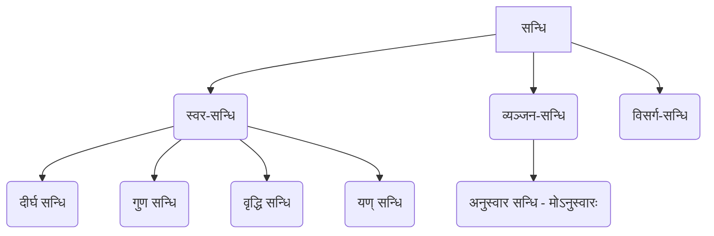

# Class 9 Sanskrit - Abhyasvan Chapter 107
**Language:** हिंदी

```markdown
# [कक्षा 9] अभ्यासवान् - अध्याय 107 (सन्धि)

## 🌟 मुख्य अवधारणाएँ (Core Concepts)

**सन्धि का अर्थ एवं प्रकार:**

*   **सन्धि:** दो वर्णों के मेल से होने वाले परिवर्तन को सन्धि कहते हैं।
    *   उदाहरण: सूर्य + आतपे = सूर्यात्पे (यहाँ 'अ' + 'आ' मिलकर 'आ' हो गया)
    *   उदाहरण: प्रति + अवदत् = प्रत्यवदत् (यहाँ 'इ' + 'अ' मिलकर 'य' बना)
*   **सन्धि-विच्छेद:** सन्धि युक्त शब्दों को उनके मूल रूप में अलग-अलग करना सन्धि-विच्छेद कहलाता है।
    *   उदाहरण: तदनन्तरम् = तत् + अनन्तरम्
    *   उदाहरण: नृपोऽवदत् = नृपः + अवदत्

**सन्धि के मुख्य भेद (Concept Hierarchy):**



*   **स्वर-सन्धि:** दो स्वरों के मेल से होने वाला परिवर्तन।
*   **व्यञ्जन-सन्धि:** व्यञ्जन के बाद स्वर या व्यञ्जन आने पर होने वाला परिवर्तन। (यहाँ 'मोऽनुस्वारः' नियम दिया गया है)
*   **विसर्ग-सन्धि:** विसर्ग (:) के बाद स्वर या व्यञ्जन आने पर होने वाला परिवर्तन। (उदाहरण दिया है: नृपः + अवदत् = नृपोऽवदत्)

## 📘 प्रमुख शिक्षण बिन्दु (Key Learnings)

**1. स्वर-सन्धि:**

*   **दीर्घ सन्धि (सूत्र: अकः सवर्णे दीर्घः):**
    *   **नियम:** जब दो समान ह्रस्व या दीर्घ स्वर (अ/आ, इ/ई, उ/ऊ, ऋ/ॠ) पास-पास आते हैं, तो दोनों मिलकर उसी वर्ण का दीर्घ स्वर (आ, ई, ऊ, ॠॄ) बन जाते हैं।
    *   **उदाहरण:**
        *   अ/आ + अ/आ = आ (जैसे: लोभ + आविष्टा = लोभाविष्टा)
        *   इ/ई + इ/ई = ई (जैसे: कपि + ईशः = कपीशः)
        *   उ/ऊ + उ/ऊ = ऊ (जैसे: भानु + उदयः = भानूदयः)
        *   ऋ/ॠ + ऋ/ॠ = ॠॄ (जैसे: मातृ + ऋणम् = मातॄणम्)
    *   **रेखाचित्र:**
        ```
        अ/आ + अ/आ  ──>  आ
        इ/ई + इ/ई  ──>  ई
        उ/ऊ + उ/ऊ  ──>  ऊ
        ऋ/ॠ + ऋ/ॠ  ──>  ॠॄ
        ```

*   **गुण सन्धि (सूत्र: आद् गुणः):**
    *   **नियम:** यदि 'अ' या 'आ' के बाद 'इ' या 'ई' आए तो 'ए', 'उ' या 'ऊ' आए तो 'ओ', तथा 'ऋ' या 'ॠॄ' आए तो 'अर्' हो जाता है।
    *   **उदाहरण:**
        *   अ/आ + इ/ई = ए (जैसे: यथा + इच्छा = यथेच्छा)
        *   अ/आ + उ/ऊ = ओ (जैसे: गृह + उद्यानम् = गृहोद्यानम्)
        *   अ/आ + ऋ/ॠॄ = अर् (जैसे: देव + ऋषिः = देवर्षिः)
    *   **रेखाचित्र:**
        ```
        अ/आ + इ/ई  ──>  ए
        अ/आ + उ/ऊ  ──>  ओ
        अ/आ + ऋ/ॠॄ ──>  अर्
        ```

*   **वृद्धि सन्धि (सूत्र: वृद्धिरेचि):**
    *   **नियम:** यदि 'अ' या 'आ' के बाद 'ए' या 'ऐ' आए तो 'ऐ', तथा 'ओ' या 'औ' आए तो 'औ' हो जाता है।
    *   **उदाहरण:**
        *   अ/आ + ए/ऐ = ऐ (जैसे: क्षण + एव = क्षणेनैव)
        *   अ/आ + ओ/औ = औ (जैसे: तव + औदार्यम् = तवौदार्यम्)
    *   **रेखाचित्र:**
        ```
        अ/आ + ए/ऐ  ──>  ऐ
        अ/आ + ओ/औ  ──>  औ
        ```

*   **यण् सन्धि (सूत्र: इको यणचि):**
    *   **नियम:** यदि 'इ/ई', 'उ/ऊ', 'ऋ/ॠ' के बाद कोई असमान स्वर आए तो 'इ/ई' का 'य्', 'उ/ऊ' का 'व्', और 'ऋ/ॠ' का 'र्' हो जाता है। बाद वाला स्वर य्/व्/र् में मात्रा के रूप में जुड़ जाता है।
    *   **उदाहरण:**
        *   इ/ई + असमान स्वर = य् + स्वर (जैसे: यदि + अपि = यद्यपि)
        *   उ/ऊ + असमान स्वर = व् + स्वर (जैसे: सु + आगतम् = स्वागतम्)
        *   ऋ/ॠ + असमान स्वर = र् + स्वर (जैसे: पितृ + आज्ञा = पित्राज्ञा)
    *   **रेखाचित्र:**
        ```
        इ/ई + असमान स्वर  ──>  य् + स्वर
        उ/ऊ + असमान स्वर  ──>  व् + स्वर
        ऋ/ॠ + असमान स्वर  ──>  र् + स्वर
        ```

**2. व्यञ्जन-सन्धि:**

*   **अनुस्वार सन्धि (सूत्र: मोऽनुस्वारः):**
    *   **नियम:** यदि किसी पद (शब्द) के अन्त में 'म्' हो और उसके बाद कोई व्यञ्जन वर्ण आए, तो 'म्' के स्थान पर अनुस्वार (ं) हो जाता है। यदि 'म्' के बाद कोई स्वर आए, तो 'म्' उस स्वर के साथ जुड़ जाता है।
    *   **उदाहरण:**
        *   म् + व्यञ्जन = ं (जैसे: किम् + कथयति = किं कथयति)
        *   म् + स्वर = म् + स्वर (जैसे: अहम् + इच्छामि = अहमिच्छामि)
    *   **रेखाचित्र:**
        ```
        ...म् + व्यञ्जन  ──>  ...ं + व्यञ्जन
        ...म् + स्वर     ──>  ...म्(स्वर युक्त)
        ```

## 🧩 सक्रिय अधिगम (Active Learning)

*   **गतिविधि: शोध-आधारित केस स्टडी विश्लेषण 🔍**
    *   **कार्य:** अपनी संस्कृत पाठ्यपुस्तक (जैसे 'शेमुषी') के किसी एक पाठ (गद्य या पद्य) को चुनें। उसमें आए कम से कम 10 सन्धि युक्त शब्दों को रेखांकित करें।
    *   **विश्लेषण:**
        1.  प्रत्येक रेखांकित शब्द का सन्धि-विच्छेद करें।
        2.  पहचानें कि प्रत्येक शब्द में कौन सी सन्धि (दीर्घ, गुण, वृद्धि, यण्, अनुस्वार आदि) हुई है।
        3.  उस सन्धि के नियम को संक्षेप में लिखें।
        4.  तालिका बनाकर प्रस्तुत करें।
    *   **उदाहरण तालिका:**

        | सन्धि युक्त शब्द | सन्धि-विच्छेद     | सन्धि का प्रकार | नियम संक्षेप में        |
        | :-------------- | :---------------- | :------------- | :--------------------- |
        | विद्यालयः       | विद्या + आलयः    | दीर्घ सन्धि    | आ + आ = आ             |
        | गणेशः          | गण + ईशः         | गुण सन्धि     | अ + ई = ए             |
        | सदैव           | सदा + एव         | वृद्धि सन्धि   | आ + ए = ऐ             |
        | इत्यादि         | इति + आदि        | यण् सन्धि     | इ + आ = या             |
        | संस्कृतम्       | सम् + कृतम्       | अनुस्वार सन्धि | म् + क् = ंक्           |

*   **चर्चा: वास्तविक दुनिया के प्रभावों का आलोचनात्मक विश्लेषण 🌍**
    *   **विषय:** संस्कृत मन्त्रों, श्लोकों या यहाँ तक कि हिन्दी जैसे आधुनिक भारतीय भाषाओं के शब्दों के सही उच्चारण और अर्थ समझने में सन्धि ज्ञान का क्या महत्व है?
    *   **चर्चा के बिन्दु:**
        1.  सन्धि के नियमों की अज्ञानता से उच्चारण में क्या त्रुटियाँ हो सकती हैं? (उदाहरण दें)
        2.  क्या गलत सन्धि-विच्छेद करने से अर्थ का अनर्थ हो सकता है? (उदाहरण: 'नारीश्वर' का विच्छेद 'नारि + ईश्वर' या 'नारी + श्वर'?)
        3.  प्राचीन भारतीय ग्रन्थों (जैसे वेद, उपनिषद्) को समझने में सन्धि की भूमिका।
        4.  हिन्दी, मराठी, बांग्ला आदि भाषाओं में संस्कृत सन्धि के नियमों का प्रभाव। (उदाहरण: 'राम + अयन' = रामायण, 'परम + ईश्वर' = परमेश्वर)
        5.  सन्धि ज्ञान दैनिक जीवन में कैसे उपयोगी हो सकता है?

## 📝 मूल्यांकन तैयारी (Assessment Prep)

*   **केस स्टडीज और आरेख:**
    *   नीचे दिए गए वाक्यों में रेखांकित पदों का सन्धि-विच्छेद करें और सन्धि का नाम लिखें:
        1.  <u>सूर्योदयः</u> रमणीयः भवति। (सूर्य + उदयः = सूर्योदयः, गुण सन्धि)
        2.  <u>तत्रैव</u> एकः वृक्षः अस्ति। (तत्र + एव = तत्रैव, वृद्धि सन्धि)
        3.  <u>गुरूपदेशः</u> अवश्यं श्रोतव्यः। (गुरु + उपदेशः = गुरूपदेशः, दीर्घ सन्धि)
        4.  <u>प्रत्येकम्</u> छात्रं पठति। (प्रति + एकम् = प्रत्येकम्, यण् सन्धि)
        5.  अहं <u>पाठं</u> पठामि। (पाठम् + पठामि -> पाठं पठामि, अनुस्वार सन्धि)
    *   निम्नलिखित पदों में सन्धि करें और सन्धि का नाम लिखें:
        1.  महा + उत्सवः = महोत्सवः (गुण सन्धि)
        2.  नदी + इव = नदीव (दीर्घ सन्धि)
        3.  अनु + अयः = अन्वयः (यण् सन्धि)
        4.  एक + एकम् = एकैकम् (वृद्धि सन्धि)
        5.  किम् + चित् = किञ्चित् (अनुस्वार/परसवर्ण - यहाँ अनुस्वार पर्याप्त)

*   **अभ्यास प्रश्न (पाठ्यपुस्तक आधारित):**
    *   पृष्ठ 86-91 पर दिए गए अभ्यास प्रश्नों (1 से 5 तक) को हल करें। विशेष रूप से उदाहरणों को समझें और रिक्त स्थानों की पूर्ति करें।
    *   **उदाहरण (प्रश्न 1 क):**
        *   ii. लोभ + आविष्टा = लोभाविष्टा (अ + आ = आ, दीर्घ सन्धि)
        *   iii. आगता तु = आगता + तु (यहाँ सन्धि नहीं है, या प्रश्न अपूर्ण हो सकता है - यदि 'आगतास्ते' होता तो आगताः + ते, विसर्ग सन्धि) - *पाठ्यपुस्तक के अनुसार सही उत्तर दें।*
        *   iv. एव + अत्र = एवात्र (अ + अ = आ, दीर्घ सन्धि)
        *   v. पूर्वार्धः = पूर्व + अर्धः (अ + अ = आ, दीर्घ सन्धि)

## 🌏 भारतीय सन्दर्भ (Bharatiya Context)

*   **पाणिनि और अष्टाध्यायी:** संस्कृत व्याकरण के नियम, जिनमें सन्धि के नियम भी शामिल हैं, महर्षि पाणिनि द्वारा उनके ग्रंथ 'अष्टाध्यायी' में वैज्ञानिक और व्यवस्थित रूप से संहिताबद्ध किए गए हैं। यह विश्व की प्राचीनतम व्याकरण कृतियों में से एक है।
*   **वैदिक मन्त्रोच्चारण:** वेदों के शुद्ध उच्चारण में सन्धि का ज्ञान अत्यंत महत्वपूर्ण है। मन्त्रों के सस्वर पाठ में वर्णों का सही मेल और उच्चारण आवश्यक होता है, जिसमें सन्धि नियम सहायक होते हैं। उदाहरण: ईशावास्योपनिषद् का पहला मन्त्र "ईशा वास्यम् इदं सर्वम्..." में 'ईशावास्यमिदम्' (ईशा + वास्यम् + इदम्) में सन्धि है।
*   **साहित्यिक ग्रन्थ:** रामायण, महाभारत, कालिदास की रचनाएँ (जैसे अभिज्ञानशाकुन्तलम्) आदि संस्कृत साहित्य सन्धि युक्त पदों से भरे पड़े हैं। इनके सही अर्थ और काव्य सौन्दर्य को समझने के लिए सन्धि का ज्ञान अनिवार्य है। उदाहरण: 'रामायण' (राम + अयन), 'महोत्सव' (महा + उत्सव)।
*   **आधुनिक भारतीय भाषाएँ:** हिन्दी, मराठी, गुजराती, बांग्ला, नेपाली जैसी अनेक आधुनिक भारतीय भाषाएँ संस्कृत से प्रभावित हैं। इन भाषाओं में प्रयोग होने वाले तत्सम शब्द (संस्कृत से ज्यों के त्यों लिए गए शब्द) अक्सर संस्कृत के सन्धि नियमों का पालन करते हैं। उदाहरण: हिन्दी में 'देवालय' (देव + आलय), 'सूर्योदय' (सूर्य + उदय), 'परमेश्वर' (परम + ईश्वर)। इससे इन भाषाओं की शब्दावली और संरचना को समझने में मदद मिलती है।
```