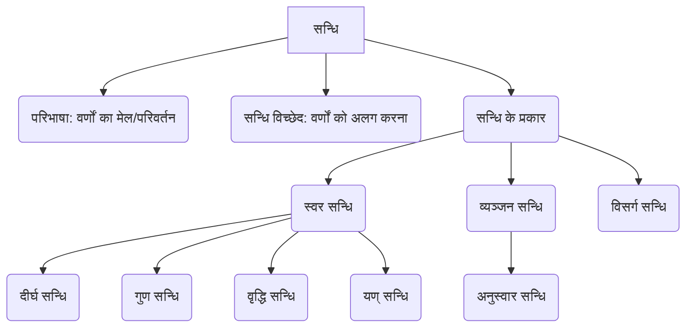

# Class 9 Sanskrit - Abhyasvan Chapter 107
**Language:** हिंदी

```markdown
# [कक्षा 9] अभ्यासवान् - अध्याय: सन्धि:

## 🌟 मुख्य अवधारणाएँ
**सन्धि की संकल्पना:**

1.  **सन्धि:**
    *   परिभाषा: दो वर्णों (स्वरों या व्यंजनों) के पास-पास आने पर उनमें होने वाले परिवर्तन या मेल को सन्धि कहते हैं।
    *   उद्देश्य: शब्दों के उच्चारण में सरलता लाना और भाषा प्रवाह को सहज बनाना।
    *   उदाहरण: सूर्य + आतपे = सूर्यात्पे (यहाँ 'अ' और 'आ' मिलकर 'आ' बन गए)।

2.  **सन्धि विच्छेद:**
    *   परिभाषा: सन्धि युक्त शब्द के वर्णों को अलग-अलग करके उनके मूल रूप में रखना सन्धि विच्छेद कहलाता है।
    *   उदाहरण: नृपोऽवदत् = नृपः + अवदत् (यहाँ 'ओ' और 'ऽ' को मूल 'विसर्ग' और 'अ' में बदला गया)।

**सन्धि के प्रकार (पाठ पर आधारित):**

*   **स्वर सन्धि:** जब दो स्वरों का मेल होता है।
    *   **दीर्घ सन्धि** (सूत्र: अकः सवर्णे दीर्घः)
    *   **गुण सन्धि** (सूत्र: आद् गुणः)
    *   **वृद्धि सन्धि** (सूत्र: वृद्धिरेचि)
    *   **यण् सन्धि** (सूत्र: इको यणचि)
*   **व्यञ्जन सन्धि:** जब व्यंजन का स्वर या व्यंजन से मेल होता है।
    *   **अनुस्वार सन्धि** (सूत्र: मोऽनुस्वारः)
*   **विसर्ग सन्धि:** जब विसर्ग (:) का स्वर या व्यंजन से मेल होता है। (पाठ में केवल उदाहरण दिया गया है, विस्तृत नियम नहीं)।

📊 **अवधारणा पदानुक्रम:**


## 📘 प्रमुख शिक्षण बिंदु
विस्तृत व्याख्याएँ और नियम:

1.  **दीर्घ सन्धि (अकः सवर्णे दीर्घः):**
    *   नियम: यदि ह्रस्व या दीर्घ अ, इ, उ, ऋ के बाद क्रमशः समान ह्रस्व या दीर्घ स्वर (अ, इ, उ, ऋ) आए, तो दोनों मिलकर उसी वर्ण का दीर्घ स्वर (आ, ई, ऊ, ॠ) हो जाते हैं।
    *   📈 **उदाहरण:**
        *   अ/आ + अ/आ = आ (जैसे: लोभ + आविष्टः = लोभाविष्टः)
        *   इ/ई + इ/ई = ई (जैसे: अति + इव = अतीव)
        *   उ/ऊ + उ/ऊ = ऊ (जैसे: गुरु + उपितम् = गुरूपितम्)
        *   ऋ/ॠ + ऋ/ॠ = ॠ (जैसे: पितृ + ऋणम् = पितॄणम्)

2.  **गुण सन्धि (आद् गुणः):**
    *   नियम: यदि 'अ' या 'आ' के बाद 'इ' या 'ई' आए तो 'ए', 'उ' या 'ऊ' आए तो 'ओ', तथा 'ऋ' या 'ॠ' आए तो 'अर्' हो जाता है।
    *   📈 **उदाहरण:**
        *   अ/आ + इ/ई = ए (जैसे: यथा + इच्छा = यथेच्छा)
        *   अ/आ + उ/ऊ = ओ (जैसे: सूर्य + उदयात् = सूर्योदयात्)
        *   अ/आ + ऋ/ॠ = अर् (जैसे: महा + ऋषिः = महर्षिः)

3.  **वृद्धि सन्धि (वृद्धिरेचि):**
    *   नियम: यदि 'अ' या 'आ' के बाद 'ए' या 'ऐ' आए तो 'ऐ', तथा 'ओ' या 'औ' आए तो 'औ' हो जाता है।
    *   📈 **उदाहरण:**
        *   अ/आ + ए/ऐ = ऐ (जैसे: गत्वा + एव = गत्वैव)
        *   अ/आ + ओ/औ = औ (जैसे: जल + ओघः = जलौघः)

4.  **यण् सन्धि (इको यणचि):**
    *   नियम: यदि 'इ/ई', 'उ/ऊ', 'ऋ/ॠ' के बाद कोई असमान स्वर आए, तो 'इ/ई' के स्थान पर 'य्', 'उ/ऊ' के स्थान पर 'व्', और 'ऋ/ॠ' के स्थान पर 'र्' हो जाता है। बाद वाला स्वर य्, व्, र् में मात्रा के रूप में जुड़ जाता है।
    *   📈 **उदाहरण:**
        *   इ/ई + असमान स्वर = य् + स्वर (जैसे: प्रति + अवदत् = प्रत्यवदत्)
        *   उ/ऊ + असमान स्वर = व् + स्वर (जैसे: मधु + अरिः = मध्वरिः)
        *   ऋ/ॠ + असमान स्वर = र् + स्वर (जैसे: पितृ + आदेशः = पित्रादेशः)

5.  **अनुस्वार सन्धि (मोऽनुस्वारः):**
    *   नियम: यदि किसी पद (शब्द) के अन्त में 'म्' हो और उसके बाद कोई व्यंजन वर्ण आए, तो 'म्' के स्थान पर अनुस्वार (ं) हो जाता है। यदि 'म्' के बाद कोई स्वर आए, तो वह स्वर 'म्' में जुड़ जाता है (संयोग होता है)।
    *   📈 **उदाहरण:**
        *   म् + व्यंजन = ं (जैसे: त्वम् + यासि = त्वं यासि)
        *   म् + स्वर = म् में स्वर का संयोग (जैसे: अहम् + इच्छामि = अहमिच्छामि)

## 🧩 सक्रिय अधिगम (Active Learning)

*   **गतिविधि: सन्धि नियमों का अनुप्रयोग एवं पहचान 🔍**
    *   पाठ्यपुस्तक में दिए गए अभ्यास (जैसे प्रश्न 1 से 5 तक) को हल करें।
    *   प्रत्येक उदाहरण में सन्धि करें या सन्धि विच्छेद करें।
    *   पहचानें कि कौन सा सन्धि नियम (दीर्घ, गुण, वृद्धि, यण्, अनुस्वार) लागू हो रहा है।
    *   उदाहरण:
        *   `लोभ + आविष्टः = ?` (यहाँ अ+आ=आ, अतः दीर्घ सन्धि) -> `लोभाविष्टः`
        *   `सूर्योदयात् = ? + ?` (यहाँ 'ओ' गुण सन्धि का परिणाम है, जो अ+उ से बनता है) -> `सूर्य + उदयात्`
        *   `प्रति + अवदत् = ?` (यहाँ इ+अ = य्+अ, अतः यण् सन्धि) -> `प्रत्यवदत्`
        *   `किम् + कथयति = ?` (यहाँ म् + व्यंजन, अतः अनुस्वार सन्धि) -> `किं कथयति`

*   **चर्चा: सन्धि का महत्व 🌍**
    *   आपस में चर्चा करें कि सन्धि सीखना क्यों आवश्यक है?
    *   संस्कृत के श्लोकों या सामान्य वाक्यों में सन्धि युक्त शब्दों को खोजने का प्रयास करें और उनका विच्छेद करें। उदाहरण: `तस्योपरि` (तस्य + उपरि - गुण सन्धि), `इत्यादि` (इति + आदि - यण् सन्धि)।
    *   सन्धि के नियमों को याद रखने के सरल तरीके क्या हो सकते हैं?

## 📝 मूल्यांकन तैयारी (Assessment Prep)

*   **अभ्यास प्रश्न:** पाठ में दिए गए सभी सन्धि और सन्धि विच्छेद के अभ्यासों को अच्छी तरह हल करें। 📝
*   **नियम स्मरण:** दीर्घ, गुण, वृद्धि, यण् और अनुस्वार सन्धि के सूत्रों और नियमों को उदाहरण सहित याद करें।
*   **पैटर्न पहचान:** विभिन्न शब्दों में सन्धि के पैटर्न (जैसे 'आ', 'ई', 'ऊ' दिखना -> दीर्घ; 'ए', 'ओ', 'अर्' दिखना -> गुण; 'ऐ', 'औ' दिखना -> वृद्धि; 'य्', 'व्', 'र्' दिखना -> यण्; 'ं' दिखना -> अनुस्वार) को पहचानना सीखें।
*   **उदाहरण अभ्यास:** पाठ के बाहर से भी सरल संस्कृत शब्दों में सन्धि करने और विच्छेद करने का अभ्यास करें।

## 🌏 भारतीय संदर्भ (Bharatiya Context)

*   **भाषा की नींव:** सन्धि संस्कृत व्याकरण का आधार स्तंभ है। संस्कृत, जिसे कई आधुनिक भारतीय भाषाओं (जैसे हिंदी, मराठी, बंगाली, गुजराती आदि) की जननी माना जाता है, को समझने के लिए सन्धि का ज्ञान अनिवार्य है। 🇮🇳
*   **ग्रंथों का अध्ययन:** भारत के प्राचीन ज्ञान भंडार - वेद, उपनिषद्, पुराण, रामायण, महाभारत, आयुर्वेद ग्रंथ, ज्योतिष ग्रंथ आदि - संस्कृत में रचित हैं। इन ग्रंथों के सही अर्थ और भाव को समझने के लिए सन्धि नियमों का ज्ञान आवश्यक है। 📜
*   **उच्चारण शुद्धि:** मंत्रों, श्लोकों और स्तोत्रों के शुद्ध एवं लयबद्ध उच्चारण में सन्धि की महत्वपूर्ण भूमिका है। सन्धि के कारण ही उच्चारण में प्रवाह और स्पष्टता आती है। 🕉️
*   **पाणिनि का योगदान:** महान भारतीय वैयाकरण आचार्य पाणिनि ने अपने प्रसिद्ध ग्रंथ 'अष्टाध्यायी' में संस्कृत व्याकरण के नियमों, जिनमें सन्धि के नियम भी शामिल हैं, को वैज्ञानिक और व्यवस्थित रूप से संहिताबद्ध किया है, जो आज भी विश्वभर में मानक माने जाते हैं।
```