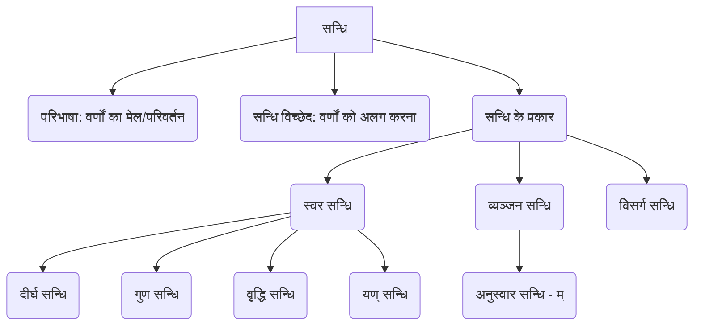

# Class 9 Sanskrit - Abhyasvan Chapter 107
**Language:** हिंदी

```markdown
# [कक्षा 9] अभ्यासवान् भव - सन्धि प्रकरण (पाठ 107)

## 🌟 मुख्य अवधारणाएँ (Core Concepts)

यहाँ सन्धि की मुख्य अवधारणाओं का क्रमबद्ध विवरण दिया गया है:

1.  **सन्धि की परिभाषा:**
    *   वर्णों का मेल (संयोजन) जिससे शब्द रचना होती है।
    *   वर्णों के मेल से होने वाला परिवर्तन।
    *   उदाहरण: सूर्य + आतपे = सूर्यात्पे (यहाँ 'अ' + 'आ' मिलकर 'आ' हो गया)।

2.  **सन्धि विच्छेद:**
    *   सन्धि द्वारा जुड़े हुए वर्णों को उनके मूल रूप में वापस लाना।
    *   उदाहरण: नृपोऽवदत् = नृपः + अवदत्।

3.  **सन्धि के मुख्य प्रकार:**
    *   **स्वर सन्धि:** स्वर वर्णों के मेल से होने वाला परिवर्तन।
        *   दीर्घ सन्धि (अकः सवर्णे दीर्घः)
        *   गुण सन्धि (आद् गुणः)
        *   वृद्धि सन्धि (वृद्धिरेचि)
        *   यण् सन्धि (इको यणचि)
    *   **व्यञ्जन सन्धि:** व्यञ्जन वर्ण के बाद स्वर या व्यञ्जन आने पर होने वाला परिवर्तन (यहाँ 'मोऽनुस्वारः' सूत्र का उदाहरण दिया गया है)।
    *   **विसर्ग सन्धि:** विसर्ग (:) के बाद स्वर या व्यञ्जन आने पर होने वाला परिवर्तन (पाठ में उदाहरण है: नृपः + अवदत् = नृपोऽवदत्)।

📊 **अवधारणा पदानुक्रम (Concept Hierarchy):**


## 📘 प्रमुख शिक्षण बिंदु (Key Learnings)

यहाँ सन्धि के नियमों को उदाहरणों सहित विस्तार से समझाया गया है:

1.  **दीर्घ सन्धि (अकः सवर्णे दीर्घः):**
    *   **नियम:** जब ह्रस्व या दीर्घ 'अ', 'इ', 'उ', 'ऋ' के बाद समान ह्रस्व या दीर्घ स्वर आता है, तो दोनों मिलकर उसी वर्ण का दीर्घ रूप बन जाते हैं।
    *   **उदाहरण:**
        *   अ/आ + अ/आ = आ (सूर्य + आतपे = सूर्यात्पे; लोभ + आविष्टः = लोभाविष्टः)
        *   इ/ई + इ/ई = ई (अति + इव = अतीव; कपि + ईशः = कपीशः)
        *   उ/ऊ + उ/ऊ = ऊ (गुरु + उपित‍म् = गुरूपित‍म्; भानु + उदयः = भानूदयः)
        *   ऋ/ॠ + ऋ/ॠ = ॠॄ (पितृ + ऋण‍म् = पितॄण‍म्; मातृ + ऋद्धिः = मातॄद्धिः)
    *   📈 **रेखाचित्र:** `[अ/आ] + [अ/आ] ➡️ [आ]`

2.  **गुण सन्धि (आद् गुणः):**
    *   **नियम:** जब 'अ' या 'आ' के बाद 'इ'/'ई', 'उ'/'ऊ', या 'ऋ'/'ॠ' आते हैं, तो क्रमशः 'ए', 'ओ', और 'अर्' हो जाता है।
    *   **उदाहरण:**
        *   अ/आ + इ/ई = ए (अनेन + इति = अनेनेति; यथा + इच्छा = यथेच्छा)
        *   अ/आ + उ/ऊ = ओ (वृक्षस्य + उपरि = वृक्षस्योपरि; सूर्य + उदयात् = सूर्योदयात्)
        *   अ/आ + ऋ/ॠ = अर् (महा + ऋषिः = महर्षिः; देव + ऋषिः = देवर्षिः)
    *   📈 **रेखाचित्र:** `[अ/आ] + [इ/ई] ➡️ [ए]`

3.  **वृद्धि सन्धि (वृद्धिरेचि):**
    *   **नियम:** जब 'अ' या 'आ' के बाद 'ए'/'ऐ' या 'ओ'/'औ' आते हैं, तो क्रमशः 'ऐ' और 'औ' हो जाता है।
    *   **उदाहरण:**
        *   अ/आ + ए/ऐ = ऐ (गत्वा + एव = गत्वैव; न + एतादृशः = नैतादृशः)
        *   अ/आ + ओ/औ = औ (जल + ओघः = जलौघः; तव + औदार्यम् = तवौदार्यम्)
    *   📈 **रेखाचित्र:** `[अ/आ] + [ए/ऐ] ➡️ [ऐ]`

4.  **यण् सन्धि (इको यणचि):**
    *   **नियम:** जब 'इ'/'ई', 'उ'/'ऊ', 'ऋ'/'ॠ' के बाद कोई भिन्न (असमान) स्वर आता है, तो 'इ'/'ई' का 'य्', 'उ'/'ऊ' का 'व्', और 'ऋ'/'ॠ' का 'र्' हो जाता है। बाद वाला स्वर उस व्यंजन में मात्रा के रूप में जुड़ जाता है।
    *   **उदाहरण:**
        *   इ/ई + असमान स्वर = य् + स्वर (प्रति + अवदत् = प्रत्यवदत्; यदि + अहम् = यद्यहम्)
        *   उ/ऊ + असमान स्वर = व् + स्वर (खलु + अयम् = खल्वयम्; मधु + अरिः = मध्वरिः; सु + आगतम् = स्वागतम्)
        *   ऋ/ॠ + असमान स्वर = र् + स्वर (पितृ + आदेशः = पित्रादेशः; मातृ + आज्ञा = मात्राज्ञा)
    *   📈 **रेखाचित्र:** `[इ/ई] + [असमान स्वर] ➡️ [य् + स्वर]`

5.  **अनुस्वार सन्धि (मोऽनुस्वारः - व्यञ्जन सन्धि का उदाहरण):**
    *   **नियम:** यदि किसी पद (शब्द) के अंत में 'म्' हो और उसके बाद कोई व्यञ्जन वर्ण आए, तो 'म्' के स्थान पर अनुस्वार (ं) हो जाता है। यदि 'म्' के बाद कोई स्वर आए, तो वह स्वर 'म्' में मिल जाता है (संयोग होता है)।
    *   **उदाहरण:**
        *   म् + व्यञ्जन = ं (त्वम् + यासि = त्वं यासि; किम् + कथयति = किं कथयति)
        *   म् + स्वर = म् + स्वर (अहम् + इच्छामि = अहमिच्छामि; हृदयम् + इच्छति = हृदयमिच्छति)

## 🧩 सक्रिय अधिगम (Active Learning)

1.  **गतिविधि: सन्धि पहचान 🔍**
    *   अपनी संस्कृत पाठ्यपुस्तक (जैसे शेमुषी) या किसी कहानी/श्लोक से कुछ वाक्य चुनें।
    *   उन वाक्यों में आए सन्धि युक्त शब्दों को रेखांकित करें।
    *   उनका सन्धि-विच्छेद करें और सन्धि का प्रकार (दीर्घ, गुण, वृद्धि, यण् आदि) पहचानें।
    *   उदाहरण: "तस्य गृहोद्याने एकः पुष्पोद्यानः आसीत्।" -> गृहोद्याने (गृह + उद्याने - गुण सन्धि), पुष्पोद्यानः (पुष्प + उद्यानः - गुण सन्धि)।

2.  **चर्चा: नियम स्मरण युक्तियाँ 🤔**
    *   सन्धि के विभिन्न नियमों (सूत्रों) को याद रखने के लिए आप क्या तरीके अपनाते हैं?
    *   क्या कोई विशेष पैटर्न या तुकबंदी है जो आपको मदद करती है?
    *   अपने सहपाठियों के साथ अपनी युक्तियाँ साझा करें और उनकी युक्तियाँ सीखें।

3.  **अभ्यास: सन्धि निर्माण और विच्छेद ✏️**
    *   दिए गए शब्दों का सन्धि करें: देव + आलयः = ?, महा + उत्सवः = ?, इति + आदि = ?, सत् + जनः = ?
    *   दिए गए शब्दों का सन्धि-विच्छेद करें: विद्यालयः = ?, गणेशः = ?, यद्यपि = ?, नमस्ते = ?
    *   (यह अभ्यास पुस्तिका में दिए गए प्रश्नों जैसा है।)

## 📝 मूल्यांकन तैयारी (Assessment Prep)

*   **प्रश्न प्रकार:** परीक्षा में मुख्य रूप से दो तरह के प्रश्न आते हैं:
    1.  दो शब्दों को जोड़कर सन्धि करना।
    2.  सन्धि युक्त शब्द का विच्छेद करना।
    3.  कभी-कभी सन्धि का नाम या नियम भी पूछा जा सकता है।
*   **अभ्यास:** पाठ में दिए गए सभी उदाहरणों और अभ्यास के प्रश्नों को हल करें।
    *   **उदाहरण:** सूर्यात्पे (सूर्य + आतपे), अतीव (अति + इव), गुरूपदेशः (गुरु + उपदेशः), महर्षिः (महा + ऋषिः), सदैव (सदा + एव), जलौघः (जल + ओघः), इत्यादि (इति + आदि), स्वागतम् (सु + आगतम्), त्वं यासि (त्वम् + यासि)।
*   **सूत्रों का महत्व:** सूत्रों (जैसे 'अकः सवर्णे दीर्घः', 'आद् गुणः') को समझने से नियम याद रखने में आसानी होती है। 🧠
*   **नियमित अभ्यास:** सन्धि के नियमों में निपुणता के लिए नियमित अभ्यास आवश्यक है।

## 🌏 भारतीय संदर्भ (Bharatiya Context)

*   **भाषा की नींव:** सन्धि संस्कृत भाषा की संरचना का एक महत्वपूर्ण अंग है। यह शब्दों को संक्षिप्त, सुन्दर और बोलने में प्रवाहमय बनाती है। 🗣️
*   **प्राचीन ग्रंथ:** हमारे प्राचीन और महत्वपूर्ण ग्रंथ जैसे वेद, उपनिषद, रामायण, महाभारत, पुराण, तथा आयुर्वेद और ज्योतिष के ग्रन्थ सन्धियुक्त संस्कृत में लिखे गए हैं। सन्धि का ज्ञान इन ग्रंथों के सही अर्थ को समझने के लिए अनिवार्य है। 📜
*   **आधुनिक भाषाओं पर प्रभाव:** संस्कृत की संधियाँ केवल संस्कृत तक ही सीमित नहीं हैं। हिन्दी, मराठी, गुजराती, बंगाली जैसी कई आधुनिक भारतीय भाषाओं में प्रयोग होने वाले तत्सम (संस्कृत से सीधे लिए गए) शब्दों में आज भी संस्कृत के सन्धि नियम लागू होते हैं। 🇮🇳
    *   **उदाहरण (हिन्दी):**
        *   विद्या + आलय = विद्यालय (दीर्घ सन्धि)
        *   गण + ईश = गणेश (गुण सन्धि)
        *   महा + उत्सव = महोत्सव (गुण सन्धि)
        *   सदा + एव = सदैव (वृद्धि सन्धि)
        *   प्रति + एक = प्रत्येक (यण् सन्धि)
```