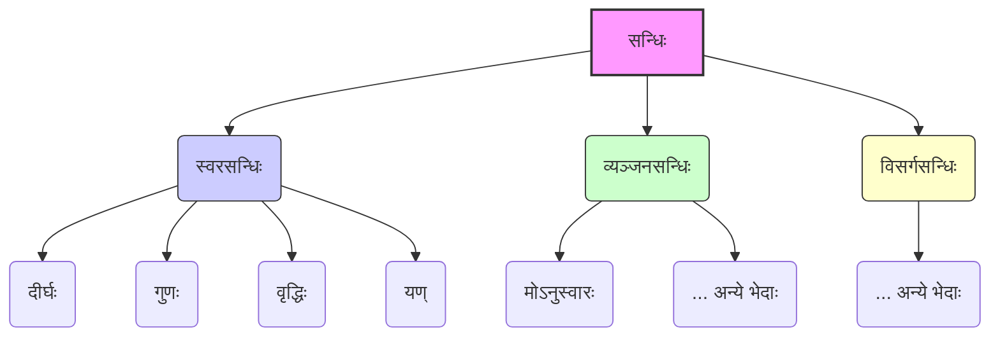

# Class 9 Sanskrit - Abhyasvan Chapter 107
**Language:** संस्कृतम्

```markdown
# [कक्षा ९] अभ्यासवान् - अध्यायः १०७ (सन्धिः)

## 🌟 मुख्याः अवधारणाः (Core Concepts)

**सन्धिः - परिभाषा एवं प्रकाराः** 📊

*   **सन्धिः किम् अस्ति?**
    *   पूर्वपदस्य अन्तिमवर्णस्य उत्तरपदस्य प्रथमवर्णस्य च मेलनेन यः वर्णविकारः (परिवर्तनम्) जायते, सः **सन्धिः** इति कथ्यते।
    *   यथा - `सूर्य + आतपे = सूर्यात्+अपे -> सूर्यात्अपे -> सूर्यात्पे` (अत्र 'अ+आ=आ' इति परिवर्तनम्)।
    *   `जगत् + ईशः = जगदीशः` (अत्र 'त्+ई=दी' इति परिवर्तनम्)।
*   **सन्धि-विच्छेदः किम् अस्ति?**
    *   सन्धियुक्तस्य पदस्य वर्णान् मूलरूपेषु पृथक् कृत्वा दर्शनं **सन्धि-विच्छेदः** इति कथ्यते।
    *   यथा - `सूर्यात्पे = सूर्य + आतपे`
    *   `जगदीशः = जगत् + ईशः`
*   **सन्धेः मुख्यभेदाः:**
    1.  **स्वरसन्धिः:** यदा स्वरवर्णेन सह स्वरवर्णस्य मेलनं भवति।
        *   दीर्घसन्धिः
        *   गुणसन्धिः
        *   वृद्धिसन्धिः
        *   यण्सन्धिः
        *   (अयादिसन्धिः, पूर्वरूपसन्धिः, पररूपसन्धिः - अत्र न चर्चिताः)
    2.  **व्यञ्जनसन्धिः:** यदा व्यञ्जनवर्णेन सह स्वरस्य अथवा व्यञ्जनस्य मेलनं भवति। (अस्मिन् पाठे 'मोऽनुस्वारः' इति चर्चितः)
    3.  **विसर्गसन्धिः:** यदा विसर्गेण सह स्वरस्य अथवा व्यञ्जनस्य मेलनं भवति। (अस्मिन् पाठे न चर्चितः)



## 📘 प्रमुख-शिक्षणबिन्दवः (Key Learnings)

अत्र वयं केचन प्रमुखाः सन्धिनियमाः उदाहरणैः सह पठामः। 📈

### 1. स्वरसन्धिः

#### क) दीर्घसन्धिः (सूत्रम् - अकः सवर्णे दीर्घः)
*   **नियमः:** यदि ह्रस्व-स्वराणाम् (अ, इ, उ, ऋ) अथवा दीर्घ-स्वराणाम् (आ, ई, ऊ, ॠ) पश्चात् तेषाम् एव सवर्णः (समानः) ह्रस्वः दीर्घः वा स्वरः आगच्छति, तर्हि उभयोः स्थाने एकः **दीर्घस्वरः** (आ, ई, ऊ, ॠ) आदेशः भवति।
*   **तालिका:**
    | पूर्ववर्णः | परवर्णः  | आदेशः | उदाहरणम्                     | सन्धिः      |
    | :------- | :------- | :---- | :--------------------------- | :---------- |
    | अ / आ    | अ / आ    | **आ** | सूर्य + आतपे                 | सूर्यात्पे   |
    |          |          |       | लोभ + आकृष्टाः              | लोभाकृष्टाः |
    | इ / ई    | इ / ई    | **ई** | अति + इव                    | अतीव       |
    |          |          |       | कपि + इन्द्रः                | कपीन्द्रः   |
    | उ / ऊ    | उ / ऊ    | **ऊ** | गुरु + उपदेशः               | गुरूपदेशः   |
    |          |          |       | भानु + उदयः                 | भानूदयः    |
    | ऋ / ॠ    | ऋ / ॠ    | **ॠ** | पितृ + ऋणम्                  | पितॄणम्     |
    |          |          |       | मातृ + ऋद्धिः                | मातॄद्धिः   |

#### ख) गुणसन्धिः (सूत्रम् - आद् गुणः)
*   **नियमः:** यदि 'अ' अथवा 'आ' वर्णयोः पश्चात् इ/ई, उ/ऊ, ऋ/ॠ वर्णाः आगच्छन्ति, तर्हि क्रमेण **ए, ओ, अर्** इति गुणादेशाः भवन्ति।
*   **तालिका:**
    | पूर्ववर्णः | परवर्णः  | आदेशः | उदाहरणम्                     | सन्धिः      |
    | :------- | :------- | :---- | :--------------------------- | :---------- |
    | अ / आ    | इ / ई    | **ए** | अनेन + इति                  | अनेनेति    |
    |          |          |       | यथा + इच्छा                 | यथेच्छया    |
    | अ / आ    | उ / ऊ    | **ओ** | वृक्षस्य + उपरि              | वृक्षस्योपरि |
    |          |          |       | गृह + उद्यानम्                | गृहोद्यानम् |
    | अ / आ    | ऋ / ॠ    | **अर्**| महा + ऋषिः                  | महर्षिः     |
    |          |          |       | देव + ऋषिः                  | देवर्षिः     |

#### ग) वृद्धिसन्धिः (सूत्रम् - वृद्धिरेचि)
*   **नियमः:** यदि 'अ' अथवा 'आ' वर्णयोः पश्चात् ए/ऐ अथवा ओ/औ वर्णाः आगच्छन्ति, तर्हि क्रमेण **ऐ, औ** इति वृद्ध्यादेशौ भवतः।
*   **तालिका:**
    | पूर्ववर्णः | परवर्णः  | आदेशः | उदाहरणम्                     | सन्धिः      |
    | :------- | :------- | :---- | :--------------------------- | :---------- |
    | अ / आ    | ए / ऐ    | **ऐ** | गत्वा + एव                   | गत्वैव      |
    |          |          |       | न + एतादृशः                 | नैतादृशः    |
    | अ / आ    | ओ / औ    | **औ** | जल + ओघः                   | जलौघः      |
    |          |          |       | तव + औदार्यम्               | तवौदार्यम्  |

#### घ) यण्सन्धिः (सूत्रम् - इको यणचि)
*   **नियमः:** यदि इ/ई, उ/ऊ, ऋ/ॠ वर्णानां पश्चात् कोऽपि **असमानः** (भिन्नः) स्वरः आगच्छति, तर्हि इ/ई स्थाने **य्**, उ/ऊ स्थाने **व्**, ऋ/ॠ स्थाने **र्** इति यणादेशाः भवन्ति। परवर्ती स्वरः यणादेशेन सह मिलति।
*   **तालिका:**
    | पूर्ववर्णः | परवर्णः (असमानः) | आदेशः (+ स्वरः) | उदाहरणम्        | सन्धिः      |
    | :------- | :--------------- | :------------- | :-------------- | :---------- |
    | इ / ई    | अ                | **य्** + अ = य | प्रति + अवदत्   | प्रत्यवदत्  |
    | इ / ई    | आ                | **य्** + आ = या | इति + आदि      | इत्यादि     |
    | इ / ई    | ए                | **य्** + ए = ये | तानि + एव      | तान्येव     |
    | उ / ऊ    | अ                | **व्** + अ = व | खलु + अयम्     | खल्वयम्     |
    | उ / ऊ    | आ                | **व्** + आ = वा | सु + आगतम्     | स्वागतम्     |
    | उ / ऊ    | ए                | **व्** + ए = वे | गुणेषु + एव     | गुणेष्वेव    |
    | ऋ / ॠ    | आ                | **र्** + आ = रा | पितृ + आदेशः    | पित्रादेशः   |
    | ऋ / ॠ    | इ                | **र्** + इ = रि | भ्रातृ + इच्छा   | भ्रात्रिच्छा |
    | ऋ / ॠ    | उ                | **र्** + उ = रु | कर्तृ + उपदेशः | कत्रुपदेशः   |

### 2. व्यञ्जनसन्धिः

#### क) अनुस्वारसन्धिः (सूत्रम् - मोऽनुस्वारः)
*   **नियमः:** यदि पदस्य अन्ते स्थितस्य 'म्' वर्णस्य पश्चात् कोऽपि **व्यञ्जनवर्णः** आगच्छति, तर्हि 'म्' इत्यस्य स्थाने **अनुस्वारः (ं)** भवति।
*   **नियमः (अन्यः):** यदि पदस्य अन्ते स्थितस्य 'म्' वर्णस्य पश्चात् कोऽपि **स्वरवर्णः** आगच्छति, तर्हि 'म्' परवर्तिना स्वरेण सह **संयुज्यते** (मिलति), अनुस्वारः न भवति।
*   **उदाहरणानि:**
    *   `त्वम् + यासि` -> `त्वं यासि` ('म्' + 'य्' (व्यञ्जनम्) -> 'ं')
    *   `किम् + कथयति` -> `किं कथयति` ('म्' + 'क्' (व्यञ्जनम्) -> 'ं')
    *   `अहम् + इच्छामि` -> `अहमिच्छामि` ('म्' + 'इ' (स्वरः) -> 'मि')
    *   `हृदयम् + इच्छति` -> `हृदयमिच्छति` ('म्' + 'इ' (स्वरः) -> 'मि')

## 🧩 सक्रिय-अधिगमः (Active Learning)

### गतिविधिः (Activity): सन्धि-विश्लेषणम् 🔍
अधः दत्तयोः वाक्ययोः सन्धियुक्तानि पदानि चित्वा तेषां सन्धि-विच्छेदं कृत्वा सन्धेः नाम लिखत।
१. `विद्यार्थी सदैव पठनाय विद्यालयं गच्छति।`
२. `महर्षिः वदति यत् परोपकारः एवोत्तमः धर्मः।`

*(छात्रैः स्वयम् उत्तरं दातव्यम्।)*
*   **उदाहरणम्:** `विद्यालयम् = विद्या + आलयम् (दीर्घसन्धिः)`

### चर्चा (Discussion): सन्धेः महत्त्वम् 🌍
कक्षायां चर्चां कुरुत - संस्कृते सन्धेः किं महत्त्वम् अस्ति?
*   किं सन्धिना शब्दानाम् उच्चारणं सरलं भवति?
*   किं सन्धिः वाक्यानां प्रवाहे सौन्दर्ये च सहायकः?
*   प्राचीनग्रन्थेषु (यथा - रामायणम्, महाभारतम्, वेदेषु) सन्धेः प्रयोगः कथं दृश्यते? उदाहरणानि ददत।
*   यदि सन्धिः न स्यात् तर्हि भाषायां किं परिवर्तनं भवेत्?

## 📝 मूल्याङ्कनार्थं सज्जता (Assessment Prep)

### अभ्यासप्रश्नाः (Case studies & diagrams) 📝

**1. सन्धियुक्तानि पदानि रचयत:**
    *   महा + उत्सवः = ? (गुणसन्धिः)
    *   नदी + इयम् = ? (दीर्घसन्धिः)
    *   एक + एकम् = ? (वृद्धिसन्धिः)
    *   यदि + अपि = ? (यण्सन्धिः)
    *   पुस्तकम् + पठति = ? (अनुस्वारसन्धिः)

**2. सन्धि-विच्छेदं कुरुत:**
    *   सूर्योदयः = ? + ? (गुणसन्धिः)
    *   कवीन्द्रः = ? + ? (दीर्घसन्धिः)
    *   तथैव = ? + ? (वृद्धिसन्धिः)
    *   प्रत्येकम् = ? + ? (यण्सन्धिः)
    *   सत्यं वद = ? + ? (अनुस्वारसन्धिः)

**3. नियम-तालिकां पूरयत:**

| सन्धिनाम    | सूत्रम् (यदि स्मर्यते) | नियमः (संक्षेपेण)        | एकम् उदाहरणम् |
| :---------- | :-------------------- | :----------------------- | :------------ |
| दीर्घसन्धिः | अकः सवर्णे दीर्घः     | अ/इ/उ/ऋ + सवर्णः = ?    | `हिम+आलयः=हिमालयः` |
| गुणसन्धिः   | आद् गुणः              | अ/आ + इ/उ/ऋ = ?/?/?    | ?             |
| वृद्धिसन्धिः | वृद्धिरेचि            | अ/आ + ए/ऐ/ओ/औ = ?/?    | ?             |
| यण्सन्धिः   | इको यणचि             | इ/उ/ऋ + असमानस्वरः = ?/?/? | ?             |
| अनुस्वारः   | मोऽनुस्वारः           | पदान्त 'म्' + व्यञ्जनम् = ? | ?             |

*(छात्रैः रिक्तस्थानानि पूरणीयानि।)*

## 🌏 भारतीयः सन्दर्भः (Bharatiya Context)

*   **पाणिनीयं व्याकरणम्:** सन्धेः नियमाः महर्षिणा पाणिनिना स्वस्य 'अष्टाध्यायी' इति विश्वप्रसिद्धे व्याकरणग्रन्थे सूत्ररूपेण बद्धाः। एतत् भारतीयज्ञानपरम्परायाः उत्कृष्टम् उदाहरणम् अस्ति। 📊
*   **भाषायाः प्रवाहः:** संस्कृतभाषायां सन्धिः शब्दानां सहज-उच्चारणाय, वाक्येषु लयबद्धतायै च अत्यावश्यकः अस्ति। अनेन भाषा श्रुतिमधुरा भवति।
*   **साहित्ये प्रयोगः:** वेद-मन्त्रेषु, उपनिषत्सु, रामायण-महाभारतादिषु काव्येषु, शास्त्रग्रन्थेषु च सन्धेः व्यापकः प्रयोगः दृश्यते। उदाहरणार्थम्, `राम + अयनम् = रामायणम्` (दीर्घसन्धिः)। `हित + उपदेशः = हितोपदेशः` (गुणसन्धिः)।
*   **शब्दनिर्माणम्:** सन्धिप्रक्रिया नूतनशब्दानां निर्माणे अपि सहायिका भवति, विशेषतः समासेषु। यथा - `राजन् + ऋषिः = राजर्षिः` (गुणसन्धिः)।

सन्धिज्ञानं संस्कृतभाषायाः सम्यक् अवगमनाय, शुद्धलेखनाय, शुद्ध-उच्चारणाय च अनिवार्यम् अस्ति।
```