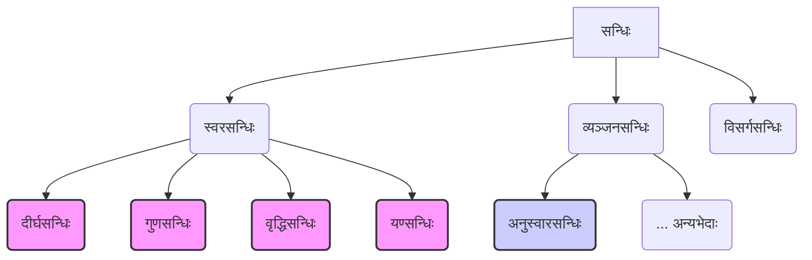

# Class 9 Sanskrit - Abhyasvan Chapter 107
**Language:** संस्कृतम्

```markdown
# [कक्षा ९] अभ्यासवान् भव - अध्यायः १०७ (सन्धिः)

(टिप्पणी: अयं पाठ्यांशः वस्तुतः 'अभ्यासवान् भव' इति अभ्यासपुस्तिकायाः सन्धि-प्रकरणम् अस्ति, न तु मुख्यपाठ्यपुस्तकस्य १०७ तमः अध्यायः।)

## 🌟 प्रमुख-अवधारणाः (Core Concepts)

**सन्धिः** इत्युक्ते वर्णानां मेलनेन जायमानं परिवर्तनम्। यदा द्वौ वर्णौ अत्यन्तं समीपं आगच्छतः, तदा तयोः मेलनेन कश्चन विकारः (परिवर्तनम्) उत्पद्यते, स एव सन्धिः।

**सन्धिविच्छेदः** इत्युक्ते सन्धियुक्तं पदं पुनः तस्य मूलरूपयोः वर्णयोः पृथक्करणम्।

**सन्धेः प्रकाराः (मुख्यतः)**
*   **स्वरसन्धिः**: यदा स्वरवर्णस्य परेण स्वरवर्णेन सह मेलनं भवति।
*   **व्यञ्जनसन्धिः**: यदा व्यञ्जनवर्णस्य परेण स्वरेण व्यञ्जनेन वा सह मेलनं भवति।
*   **विसर्गसन्धिः**: यदा विसर्गस्य (:) परेण स्वरेण व्यञ्जनेन वा सह मेलनं भवति।

**अवधारणा-सोपानचित्रम् 📊**



*(अस्मिन् पाठे वयं मुख्यतया स्वरसन्धेः भेदान् (दीर्घ, गुण, वृद्धि, यण्) तथा च व्यञ्जनसन्धेः अनुस्वारसन्धिं पठिष्यामः।)*

## 📘 मुख्य-शिक्षणबिन्दवः (Key Learnings)

अत्र केचन प्रमुखाः सन्धयः विस्तरेण दत्ताः सन्ति:

**1. दीर्घसन्धिः**
*   **सूत्रम्**: `अकः सवर्णे दीर्घः`
*   **नियमः**: यदि अ/आ, इ/ई, उ/ऊ, ऋ/ॠ वर्णानां पश्चात् तेषामेव सवर्णः (समानः) स्वरः आगच्छति, तर्हि द्वयोः स्थाने एकः दीर्घः स्वरः भवति।
    *   अ/आ + अ/आ = **आ** (सूर्य + आतपे = सूर्यात्)
    *   इ/ई + इ/ई = **ई** (अति + इव = अतीव)
    *   उ/ऊ + उ/ऊ = **ऊ** (गुरु + उपदेशः = गुरूपदेशः)
    *   ऋ/ॠ + ऋ/ॠ = **ॠॄ** (पितृ + ऋणम् = पितॄणम्)
*   **रेखाचित्रम् 📈**:
    ```
    [अ/आ] + [अ/आ]  ➔  [आ]
    [इ/ई] + [इ/ई]  ➔  [ई]
    [उ/ऊ] + [उ/ऊ]  ➔  [ऊ]
    [ऋ/ॠ] + [ऋ/ॠ]  ➔  [ॠॄ]
    ```

**2. गुणसन्धिः**
*   **सूत्रम्**: `आद् गुणः`
*   **नियमः**: यदि 'अ' अथवा 'आ' वर्णस्य पश्चात् इ/ई, उ/ऊ, ऋ/ॠ वर्णाः आगच्छन्ति, तर्हि क्रमेण **ए, ओ, अर्** आदेशाः भवन्ति।
    *   अ/आ + इ/ई = **ए** (गण + ईशः = गणेशः)
    *   अ/आ + उ/ऊ = **ओ** (सूर्य + उदयः = सूर्योदयः)
    *   अ/आ + ऋ/ॠ = **अर्** (महा + ऋषिः = महर्षिः)
*   **रेखाचित्रम् 📈**:
    ```
    [अ/आ] + [इ/ई]  ➔  [ए]
    [अ/आ] + [उ/ऊ]  ➔  [ओ]
    [अ/आ] + [ऋ/ॠ]  ➔  [अर्]
    ```

**3. वृद्धिसन्धिः**
*   **सूत्रम्**: `वृद्धिरेचि`
*   **नियमः**: यदि 'अ' अथवा 'आ' वर्णस्य पश्चात् ए/ऐ अथवा ओ/औ वर्णाः आगच्छन्ति, तर्हि क्रमेण **ऐ, औ** आदेशौ भवतः।
    *   अ/आ + ए/ऐ = **ऐ** (एक + एकम् = एकैकम्)
    *   अ/आ + ओ/औ = **औ** (जल + ओघः = जलौघः)
*   **रेखाचित्रम् 📈**:
    ```
    [अ/आ] + [ए/ऐ]  ➔  [ऐ]
    [अ/आ] + [ओ/औ]  ➔  [औ]
    ```

**4. यण्सन्धिः**
*   **सूत्रम्**: `इको यणचि`
*   **नियमः**: यदि इ/ई, उ/ऊ, ऋ/ॠ वर्णानां पश्चात् कोऽपि असमानः (भिन्नः) स्वरः आगच्छति, तर्हि इ/ई स्थाने **य्**, उ/ऊ स्थाने **व्**, ऋ/ॠ स्थाने **र्** आदेशाः भवन्ति। परवर्ती स्वरः य्/व्/र् इत्येतैः सह मिलति।
    *   इ/ई + असमानस्वरः = **य्** + स्वरः (प्रति + एकम् = प्रत्येकम्)
    *   उ/ऊ + असमानस्वरः = **व्** + स्वरः (सु + आगतम् = स्वागतम्)
    *   ऋ/ॠ + असमानस्वरः = **र्** + स्वरः (पितृ + आज्ञा = पित्राज्ञा)
*   **रेखाचित्रम् 📈**:
    ```
    [इ/ई] + [असमान स्वरः]  ➔  [य्] + [स्वरः]
    [उ/ऊ] + [असमान स्वरः]  ➔  [व्] + [स्वरः]
    [ऋ/ॠ] + [असमान स्वरः]  ➔  [र्] + [स्वरः]
    ```

**5. अनुस्वारसन्धिः**
*   **सूत्रम्**: `मोऽनुस्वारः`
*   **नियमः**: यदि पदस्य अन्ते स्थितस्य 'म्' वर्णस्य पश्चात् कोऽपि व्यञ्जनवर्णः आगच्छति, तर्हि 'म्' स्थाने अनुस्वारः (ं) भवति। यदि 'म्' पश्चात् स्वरवर्णः आगच्छति, तर्हि 'म्' परवर्तिना स्वरेण सह मिलति (संयोगः भवति)।
    *   म् + व्यञ्जनम् = **ं** (अहम् + गच्छामि = अहं गच्छामि)
    *   म् + स्वरः = **म् + स्वरः** (किम् + उक्तम् = किमुक्तम्)
*   **रेखाचित्रम् 📈**:
    ```
    [...म्] + [व्यञ्जनम्]  ➔  [...ं] + [व्यञ्जनम्]
    [...म्] + [स्वरः]     ➔  [...म्स्वरः]
    ```

## 🧩 सक्रिय-अधिगमः (Active Learning)

**1. क्रियाकलापः (Activity): शोध-आधारित-विश्लेषणम् 🔍**
*   **कार्यम्**: हितोपदेशात् अथवा पञ्चतन्त्रात् काञ्चित् लघुकथां चित्वा पठत। तस्यां कथायां न्यूनातिन्यूनं पञ्च (५) विभिन्नान् सन्धीन् (दीर्घ, गुण, वृद्धि, यण्, अनुस्वार) अन्विष्यत।
*   **प्रक्रिया**:
    *   सन्धियुक्तं पदं लिखत।
    *   तस्य पदस्य सन्धिविच्छेदं कुरुत।
    *   सन्धेः नाम लिखत (यथा - दीर्घसन्धिः)।
    *   प्रयुक्तं सन्धि-नियमं संक्षेपेण लिखत।
*   **उद्देश्यम्**: पठितनियमानां वास्तविक-ग्रन्थेषु प्रयोगं ज्ञातुं विश्लेषणक्षमतां वर्धयितुं च। (Bloom's Evaluating/Analyzing)

**2. विमर्शः (Discussion): वास्तविक-जगति प्रभावस्य आलोचनात्मकं विश्लेषणम् 🌍**
*   **प्रश्नः**: संस्कृते सन्धेः किं महत्त्वम् अस्ति? सन्धि-नियमानां ज्ञानं संस्कृत-पठने, अर्थावबोधने च कथं सहायकं भवति? किं भवन्तः अन्येषु भारतीयभाषासु (यथा - हिन्दी, मराठी, बाङ्गला) अपि सन्धि-सदृशान् नियमान् पश्यन्ति? उदाहरणैः सह चर्चां कुर्वन्तु।
*   **चर्चाबिन्दवः**:
    *   श्रुतिमाधुर्यम् (Euphony)
    *   संक्षिप्तता (Conciseness)
    *   उच्चारणसौकर्यम् (Ease of Pronunciation)
    *   शब्दनिर्माणम् (Word Formation)
    *   अन्यभाषासु प्रभावः (Influence on other languages)
*   **उद्देश्यम्**: सन्धेः भाषायां भूमिकां मूल्याङ्कयितुं, तस्य व्यापकप्रभावं च अवगन्तुम्। (Bloom's Evaluating)

## 📝 मूल्याङ्कन-सिद्धता (Assessment Prep)

**अभ्यासप्रश्नाः (Case studies & diagrams based questions) 📝**

**1. सन्धिं कुरुत:**
    क) विद्या + आलयः = ? (कः सन्धिः?)
    ख) नर + इन्द्रः = ? (कः सन्धिः?)
    ग) सदा + एव = ? (कः सन्धिः?)
    घ) इति + आदि = ? (कः सन्धिः?)
    ङ) सम् + सारः = ? (कः सन्धिः?)
    च) महा + उत्सवः = ? (कः सन्धिः?)
    छ) मधु + अरिः = ? (कः सन्धिः?)

**2. सन्धिविच्छेदं कुरुत:**
    क) देवालयः = ? + ? (कः सन्धिः?)
    ख) महर्षिः = ? + ? (कः सन्धिः?)
    ग) तथैव = ? + ? (कः सन्धिः?)
    घ) यद्यपि = ? + ? (कः सन्धिः?)
    ङ) रामं नमामि = ? + ? (कः सन्धिः?)
    च) परोपकारः = ? + ? (कः सन्धिः?)
    छ) मात्रंशः = ? + ? (कः सन्धिः?)

**3. रेखाचित्रं दृष्ट्वा नियमं लिखत, एकम् उदाहरणं च यच्छत:**
    क) `[अ/आ] + [उ/ऊ] ➔ [ओ]` -> नियमः? उदाहरणम्?
    ख) `[इ/ई] + [असमान स्वरः] ➔ [य्] + [स्वरः]` -> नियमः? उदाहरणम्?

**4. अधोदत्ते अनुच्छेदे सन्धियुक्तानि पदानि चित्वा तेषां विच्छेदं कुरुत:**
    "हिमालयो नाम नगाधिराजः। तत्र महर्षयः वसन्ति स्म। सूर्योदयः अतीव रमणीयः भवति। सर्वे जनाः तत्रैव गन्तुम् इच्छन्ति।"

## 🌏 भारतीय-सन्दर्भः (Bharatiya Context)

*   **भाषाणां जननी**: संस्कृतं बह्वीनां आधुनिकानां भारतीयभाषाणां (यथा हिन्दी, मराठी, गुजराती, बाङ्गला) जननी अथवा प्रभावकभाषा अस्ति। सन्धेः नियमाः एतासु भाषासु अपि शब्दरूपेषु उच्चारणेषु च प्रभावं दर्शयन्ति। 📊
*   **पाणिनेः योगदानम्**: महर्षिणा पाणिनिना विरचितः **'अष्टाध्यायी'** इति ग्रन्थः विश्वस्य प्राचीनतमेषु व्यवस्थितव्याकरणेषु अन्यतमः अस्ति। अस्मिन् ग्रन्थे एव सन्धि-नियमाः (यथा - `इको यणचि`, `अकः सवर्णे दीर्घः`) वैज्ञानिकरूपेण सूत्रबद्धिताः सन्ति। इदं भारतस्य प्राचीनज्ञानपरम्परायाः उत्कृष्टम् उदाहरणम् अस्ति। 🏛️
*   **दैनन्दिन-जीवने**: बहवः भारतीयाः शब्दाः, नामानि च सन्धि-नियमान् अनुसरन्ति, यथा - गणेशः (गण+ईशः), सुरेन्द्रः (सुर+इन्द्रः), परोपकारः (पर+उपकारः), हिमालयः (हिम+आलयः)। एते शब्दाः अस्माकं सांस्कृतिक-भाषिक-धरोहरस्य भागाः सन्ति। 🇮🇳
*   **उच्चारण-परम्परा**: सन्धि-नियमाः शब्दानां सहजं प्रवाहपूर्णम् उच्चारणं सुनिश्चितं कुर्वन्ति, यत् भारतीय-वाङ्गमयस्य (विशेषतः वेदमन्त्राणाम्) शुद्धोच्चारण-परम्परायाः महत्त्वपूर्णम् अङ्गम् अस्ति। 🗣️

```