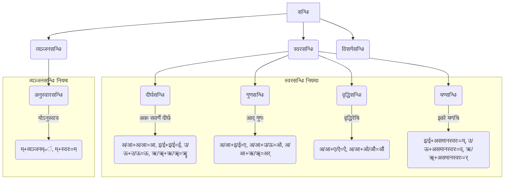

# Class 9 Sanskrit - Abhyasvan Chapter 107
**Language:** संस्कृतम्

```markdown
# [कक्षा ९] अभ्यासवान् - अध्यायः १०७ (सन्धिः)

## 🌟 मुख्याः अवधारणाः (Core Concepts)
अत्र सन्धेः विविधाः प्रकाराः, तेषां नियमाः च सोदाहरणं निरूपिताः सन्ति।



*   **सन्धिः**: वर्णयोः मेलनेन यत् परिवर्तनं भवति सः सन्धिः कथ्यते।
*   **सन्धिच्छेदः**: सन्धियुक्तस्य पदस्य वर्णान् पृथक् कृत्वा मूलरूपेण लेखनं सन्धिच्छेदः भवति।

## 📘 प्रमुखम् अधिगमम् (Key Learnings)

अस्मिन् पाठे वयं मुख्यतया स्वरसन्धेः चतुरः प्रकारान् (दीर्घः, गुणः, वृद्धिः, यण्) तथा च व्यञ्जनसन्धेः एकं प्रकारम् (अनुस्वारः) पठामः।

1.  **दीर्घसन्धिः (`अकः सवर्णे दीर्घः`)**:
    *   **नियमः**: यदि अ/आ, इ/ई, उ/ऊ, ऋ/ॠ इत्येतेषां वर्णानां पश्चात् ते एव सवर्णाः स्वराः आगच्छन्ति, तर्हि उभयोः स्थाने दीर्घः स्वरः (आ, ई, ऊ, ॠॄ) भवति।
    *   **उदाहरणानि**:
        *   `सूर्य + आतपे = सूर्यात्पे` (अ + आ = आ)
        *   `अति + इव = अतीव` (इ + इ = ई)
        *   `गुरु + उपदेशः = गुरूपदेशः` (उ + उ = ऊ) (पाठ्यपुस्तके 'गुरु+उचितम् = गुरूरुचितम्' इति अशुद्धं प्रतिभाति, शुद्धं 'गुरूपदिष्टम्' वा 'गुरूचितम्' भवेत्। उदाहरणार्थम् अत्र 'गुरूपदेशः' दत्तम्।)
        *   `पितृ + ऋणम् = पितॄणम्` (ऋ + ऋ = ॠॄ)

2.  **गुणसन्धिः (`आद् गुणः`)**:
    *   **नियमः**: यदि 'अ' अथवा 'आ' वर्णयोः पश्चात् इ/ई, उ/ऊ, ऋ/ॠ स्वराः आगच्छन्ति, तर्हि क्रमेण ए, ओ, अर् आदेशाः भवन्ति।
    *   **उदाहरणानि**:
        *   `अनेन + इति = अनेनेति` (अ + इ = ए)
        *   `वृक्षस्य + उपरि = वृक्षस्योपरि` (अ + उ = ओ)
        *   `महा + ऋषिः = महर्षिः` (आ + ऋ = अर्)

3.  **वृद्धिसन्धिः (`वृद्धिरेचि`)**:
    *   **नियमः**: यदि 'अ' अथवा 'आ' वर्णयोः पश्चात् ए/ऐ अथवा ओ/औ स्वराः आगच्छन्ति, तर्हि क्रमेण ऐ, औ आदेशाः भवन्ति।
    *   **उदाहरणानि**:
        *   `गत्वा + एव = गत्वैव` (आ + ए = ऐ)
        *   `जल + ओघः = जलौघः` (अ + ओ = औ)

4.  **यण्सन्धिः (`इको यणचि`)**:
    *   **नियमः**: यदि इ/ई, उ/ऊ, ऋ/ॠ वर्णानां पश्चात् कोऽपि असमानः स्वरः आगच्छति, तर्हि इ/ई स्थाने 'य्', उ/ऊ स्थाने 'व्', ऋ/ॠ स्थाने 'र्' आदेशाः भवन्ति। परवर्ती स्वरः मात्रा रूपेण तैः सह युज्यते।
    *   **उदाहरणानि**:
        *   `प्रति + अवदत् = प्रत्यवदत्` (इ + अ = य् + अ = य)
        *   `खलु + अयम् = खल्वयम्` (उ + अ = व् + अ = व)
        *   `पितृ + आदेशः = पित्रादेशः` (ऋ + आ = र् + आ = रा)

5.  **अनुस्वारसन्धिः (`मोऽनुस्वारः`)**:
    *   **नियमः**: यदि पदान्ते स्थितस्य 'म्' वर्णस्य पश्चात् कोऽपि व्यञ्जनवर्णः आगच्छति, तर्हि 'म्' स्थाने अनुस्वारः (ं) भवति। यदि स्वरः आगच्छति, तर्हि 'म्' परवर्तिना स्वरेण सह मिलति।
    *   **उदाहरणानि**:
        *   `त्वम् + यासि = त्वं यासि` (म् + य् = ं)
        *   `अहम् + इच्छामि = अहमिच्छामि` (म् + इ = मि)

## 🧩 सक्रियम् अधिगमम् (Active Learning)

*   **क्रियाकलापः (Activity)**: शोध-आधारित-विश्लेषणम् 🔍
    *   कस्यापि संस्कृतस्तोत्रस्य (यथा - गणेशस्तोत्रम्, शिवस्तोत्रम्) पङ्क्तीः पठित्वा तेषु प्रयुक्तान् सन्धिपदान् चिनुत। तेषां सन्धिच्छेदं कृत्वा सन्धेः नामानि लिखत। (उदाहरणार्थम् - `गजाननं भूतगणादिसेवितम्` इत्यत्र `गण + आदि = गणादि` (दीर्घसन्धिः))
*   **चर्चा (Discussion)**: वास्तविक-जगति प्रभावस्य आलोचनात्मकं विश्लेषणम् 🌍
    *   संस्कृतभाषायाः पठने, श्लोकानाम् अर्थावबोधे च सन्धिज्ञानस्य किं महत्त्वम् अस्ति? यदि सन्धिः न स्यात् तर्हि भाषायाः स्वरूपं कीदृशं भवेत्? अस्मिन् विषये कक्षायां चर्चां कुरुत।

## 📝 मूल्याङ्कन-सिद्धता (Assessment Prep)

अधः दत्तानां पदानां सन्धिं वा सन्धिच्छेदं वा कुरुत। सन्धेः नाम अपि लिखत (यथा पाठ्यपुस्तके दर्शितम्)। 📝

1.  **सन्धिं कुरुत**:
    *   लोभ + आकृष्टा = ? (...............)
    *   नदी + इयम् = ? (...............)
    *   तथा + एव = ? (...............)
    *   यदि + अपि = ? (...............)
    *   सु + आगतम् = ? (...............)
    *   किम् + करोति = ? (...............)

2.  **सन्धिच्छेदं कुरुत**:
    *   पूर्वाचार्यः = ? + ? (...............)
    *   कपीन्द्रः = ? + ? (...............)
    *   मानवोचितम् = ? + ? (...............)
    *   क्षणेनैव = ? + ? (...............)
    *   पर्यावरणम् = ? + ? (...............)
    *   कथमागतः = ? + ? (...............)

*(उत्तराणि पाठ्यपुस्तके प्रदत्तैः उदाहरणैः अभ्यासेन च सह मेलयितुं शक्यन्ते।)*

## 🌏 भारतीयः सन्दर्भः (Bharatiya Context)

सन्धिः केवलं व्याकरणस्य नियमः नास्ति, अपितु भारतीयभाषाणां, विशेषतः संस्कृतस्य, अभिन्नम् अङ्गम् अस्ति। 📊

*   **सांस्कृतिक-महत्त्वम्**: वेदमन्त्राणाम्, उपनिषद्-वाक्यानां, भगवद्गीतायाः श्लोकानां च शुद्धोच्चारणाय सन्धिज्ञानम् अत्यावश्यकम्। उदाहरणार्थम् - `ॐ भूर्भुवः स्वः` इत्यत्र `भुवः + स्वः` विसर्गसन्धिः। `ईशावास्यमिदं सर्वम्` इत्यत्र `ईश + आवास्यम् + इदम्` (दीर्घ-यण्)।
*   **भाषा-सौन्दर्यम्**: सन्धिना पदानि संक्षिप्ततराणि, श्रुतिमधुराणि, प्रवाहमयानि च भवन्ति। यथा - `हित + उपदेशः = हितोपदेशः`।
*   **अर्थ-स्पष्टता**: कदाचित् सन्धिः अर्थनिर्धारणेऽपि सहायकः भवति। सम्यक् सन्धिच्छेदेन एव पदस्य वास्तविकः अर्थः ज्ञायते। यथा - `कश्चित् = कः + चित्`।

अतः, संस्कृतभाषायाः गभीर-अध्ययनाय भारतीयसंस्कृतेः अवगमनाय च सन्धेः ज्ञानं महत्त्वपूर्णम् अस्ति।
```