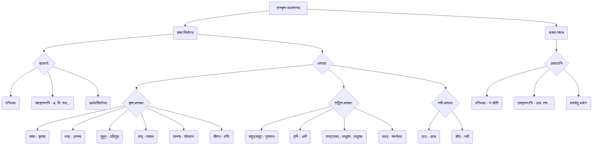

# Class 9 Sanskrit - Abhyasvan Chapter 108
**Language:** संस्कृतम्

```markdown
# [कक्षा ९] अभ्यासवान् - अध्यायः १०८ (उपसर्गाः, अव्ययानि, प्रत्ययाः च)

## 🌟 प्रमुख-अवधारणाः (Core Concepts)

अस्मिन् विभागे वयं संस्कृतव्याकरणस्य त्रीणि महत्त्वपूर्णानि अङ्गानि पठामः - उपसर्गाः, अव्ययानि, प्रत्ययाः च। एतेषां ज्ञानेन शब्दनिर्माणस्य, वाक्यरचनायाः च क्षमता वर्धते।

**अवधारणानां सोपानक्रमः (Concept Hierarchy) 📊**



## 📘 मुख्य-शिक्षणबिन्दवः (Key Learnings)

**१. उपसर्गाः (Prefixes):**
*   **परिभाषा:** ये शब्दांशाः धातोः शब्दस्य वा पूर्वं युज्यन्ते, ते उपसर्गाः कथ्यन्ते। ते प्रायः धातोः अर्थं परिवर्तयन्ति अथवा विशिष्टतां यच्छन्ति।
*   **श्लोकः:**
    > "उपसर्गेण धात्वर्थो बलादन्यत्र नीयते।
    > प्रहाराहार-संहार-विहार-परिहारवत्॥"
*   **उदाहरणम्:** 'हारः' इति शब्दः।
    *   प्र + हारः = **प्रहारः** (Assault)
    *   वि + हारः = **विहारः** (Stroll, Recreation)
    *   सम् + हारः = **संहारः** (Destruction)
    *   उप + हारः = **उपहारः** (Gift)
*   **मुख्यबिन्दवः:**
    *   उपसर्गाः धातोः/शब्दात् पूर्वं भवन्ति।
    *   ते अर्थं परिवर्तयन्ति अथवा पोषयन्ति।
    *   एकस्मिन् पदे एकाधिकाः उपसर्गाः अपि भवितुम् अर्हन्ति (यथा - **सम्+आ+गतः = समागतः**)।

**२. अव्ययानि (Indeclinables):**
*   **परिभाषा:** यानि पदानि त्रिषु लिङ्गेषु, सर्वासु विभक्तिषु, त्रिषु वचनेषु च समानरूपेण तिष्ठन्ति, तानि अव्ययानि कथ्यन्ते। तेषां रूपपरिवर्तनं न भवति ('न व्येति इति अव्ययम्')।
*   **श्लोकः:**
    > "सदृशं त्रिषु लिङ्गेषु सर्वासु च विभक्तिषु।
    > वचनेषु च सर्वेषु यन्न व्येति तदव्ययम्॥"
*   **उदाहरणानि:**
    *   स्थानवाचकानि: अत्र, तत्र, यत्र, कुत्र, सर्वत्र, एकत्र, अन्यत्र, उभयतः, परितः...
    *   कालवाचकानि: अद्य, ह्यः, श्वः, यदा, तदा, कदा, सदा, अधुना, सम्प्रति, इदानीम्, पुरा...
    *   रीतिवाचकानि: कथम्, यथा, तथा, शनैः, सहसा, अकस्मात्, वृथा...
    *   निश्चयार्थकानि: नूनम्, खलु, किल...
    *   समुच्चयार्थकानि: च, अपि, वा...
    *   निषेधार्थकानि: न, मा...
*   **वाक्यप्रयोगः:**
    *   **सहसा** निर्णयः न करणीयः। (Suddenly)
    *   अहं **श्वः** वाराणसीं गमिष्यामि। (Tomorrow)
    *   **यत्र-यत्र** धूमः **तत्र-तत्र** अग्निः। (Wherever... there)

**३. प्रत्ययाः (Suffixes):**
*   **परिभाषा:** ये शब्दांशाः धातोः शब्दस्य वा पश्चात् युज्यन्ते, ते प्रत्ययाः कथ्यन्ते। ते नूतनशब्दान् रचयन्ति अथवा अर्थविस्तारं कुर्वन्ति।
*   **प्रकाराः:**
    *   **कृत्-प्रत्ययाः:** धातुभिः सह युज्यन्ते।
    *   **तद्धित-प्रत्ययाः:** शब्दैः (संज्ञा, सर्वनाम, विशेषण) सह युज्यन्ते।
    *   **स्त्री-प्रत्ययाः:** पुंल्लिङ्गशब्दान् स्त्रीलिङ्गे परिवर्तयन्ति।

**क) कृत्-प्रत्ययाः (Primary Suffixes):**

| प्रत्ययः | अर्थः/प्रयोगः                 | उदाहरणम् (धातुः + प्रत्ययः = रूपम्) | वाक्ये प्रयोगः                               |
| :------- | :--------------------------- | :--------------------------------- | :------------------------------------------- |
| **क्त्वा** | पूर्वकालिकक्रिया ('कृत्वा') | गम् + क्त्वा = **गत्वा**           | बालकः आपणं **गत्वा** फलानि आनयति।           |
| **ल्यप्**  | उपसर्गयुक्तेषु क्त्वा-स्थाने | प्र + नम् + ल्यप् = **प्रणम्य**     | सः गुरुं **प्रणम्य** पठति।                   |
| **तुमुन्** | प्रयोजनार्थम् ('कर्तुम्')   | पठ् + तुमुन् = **पठितुम्**         | छात्राः **पठितुम्** विद्यालयं गच्छन्ति।      |
| **शतृ**   | वर्तमानकालः (परस्मैपदी) ('कुर्वन्') | गम् + शतृ = **गच्छन्** (पुं.), **गच्छन्ती** (स्त्री.) | **गच्छन्** बालकः अपतत्। **पठन्ती** बालिका हसति। |
| **शानच्** | वर्तमानकालः (आत्मनेपदी) ('कुर्वाणः') | सेव् + शानच् = **सेवमानः** (पुं.), **सेवमाना** (स्त्री.) | **सेवमानः** भक्तः ईश्वरं ध्यायति।             |
| **क्तिन्** | भाववाचकसंज्ञा ('करणम्')   | कृ + क्तिन् = **कृतिः**             | वाल्मीकेः **कृतिः** रामायणम् अस्ति।           |

**तुलनात्मक-तालिका (Comparative Table) 📈**

| विशेषता        | क्त्वा (ktvā)        | ल्यप् (lyap)          |
| :-------------- | :------------------- | :-------------------- |
| **अर्थः**       | पूर्वकालिकक्रिया     | पूर्वकालिकक्रिया      |
| **धातुयोगः**   | सामान्यधातुभिः सह   | उपसर्गयुक्तधातुभिः सह |
| **उदाहरणम्**   | कृत्वा, पठित्वा     | प्रणम्य, आगत्य       |

| विशेषता        | शतृ (śatṛ)          | शानच् (śānac)        |
| :-------------- | :------------------- | :-------------------- |
| **अर्थः**       | वर्तमानकालिकक्रिया   | वर्तमानकालिकक्रिया   |
| **धातुप्रकारः** | परस्मैपदी           | आत्मनेपदी           |
| **उदाहरणम्**   | गच्छन्, पठन्ती      | सेवमानः, मोदमाना     |

**ख) तद्धित-प्रत्ययाः (Secondary Suffixes):**

| प्रत्ययः       | अर्थः/प्रयोगः                     | उदाहरणम् (शब्दः + प्रत्ययः = रूपम्) | वाक्ये प्रयोगः                     |
| :------------- | :------------------------------- | :--------------------------------- | :--------------------------------- |
| **मतुप्/वतुप्** | 'अस्ति अस्य' (Possession)        | गुण + मतुप् = **गुणवान्** (वत्)     | **गुणवान्** जनः सर्वत्र पूज्यते।    |
|                |                                  | शक्ति + मतुप् = **शक्तिमान्** (मत्) | सः **शक्तिमान्** अस्ति।           |
| **इनि**        | 'अस्ति अस्य' (Possession)        | धन + इनि = **धनी** (धनिन्)         | **धनी** पुरुषः दानं करोति।        |
| **तरप्**       | द्वयोः मध्ये तुलना (Comparative) | लघु + तरप् = **लघुतरः**           | रामः मोहनात् **लघुतरः** अस्ति।    |
| **तमप्**       | बहूनां मध्ये तुलना (Superlative) | लघु + तमप् = **लघुतमः**           | एषः बालकेषु **लघुतमः** अस्ति।    |
| **मयट्**       | 'विकारः' (Made of) / 'प्राचुर्यम्' (Full of) | स्वर्ण + मयट् = **स्वर्णमयः**     | इदम् आभूषणं **स्वर्णमयम्** अस्ति। |
|                |                                  | आनन्द + मयट् = **आनन्दमयः**     | जीवनम् **आनन्दमयं** भवेत्।        |

**ग) स्त्री-प्रत्ययाः (Feminine Suffixes):**

*   **टाप् (आ):** अकारान्त-पुंल्लिङ्गशब्देभ्यः प्रायः 'आ' युज्यते।
    *   अज + टाप् = **अजा**
    *   बालक + टाप् + (इ) = **बालिका** (मध्ये 'क' पूर्वम् 'इ' आगमः)
    *   सरल + टाप् = **सरला**
*   **ङीप् (ई):** ऋकारान्तेभ्यः, नकारान्तेभ्यः, अन्येभ्यश्च बहुभ्यः शब्देभ्यः 'ई' युज्यते।
    *   नद + ङीप् = **नदी**
    *   देव + ङीप् = **देवी**
    *   कर्तृ + ङीप् = **कर्त्री**
    *   गोप + ङीप् = **गोपी**
    *   गुरु + ङीप् = **गुर्वी** (उकारस्य वकारः)

## 🧩 सक्रिय-अधिगमः (Active Learning)

*   **गतिविधिः (Activity): 🔍 शोध-आधारित-विश्लेषणम्**
    *   पञ्चतन्त्रतः एकां कथां चित्वा तस्यां प्रयुक्तान् न्यूनातिन्यूनं पञ्च उपसर्गाणि, पञ्च अव्ययानि, पञ्चविधान् प्रत्ययान् (कृत्/तद्धित/स्त्री) च अन्विष्य लिखन्तु। तेषां शब्दानां मूलप्रकृतिं (धातु/शब्द) प्रत्ययं च पृथक् कृत्वा तेषां अर्थे किं परिवर्तनम्/वैशिष्ट्यम् आगतम् इति विश्लेषयन्तु। (Evaluate the impact of these elements on meaning).
*   **चर्चा (Discussion): 🌍 वास्तविक-प्रभावस्य आलोचनात्मक-विश्लेषणम्**
    *   **विषयः १:** "कथं विभिन्नप्रत्ययानां प्रयोगेण एकस्मात् धातोः अनेके अर्थपूर्णाः शब्दाः निर्मीयन्ते? एतेन भाषायाः समृद्धिः कथं भवति?" इति विषये कक्षायां चर्चां कुर्वन्तु। (Evaluate how suffixes enrich the language).
    *   **विषयः २:** "संस्कृतसाहित्ये (यथा - गीता, उपनिषद्) अव्ययानां प्रयोगः कथं गाम्भीर्यम् आनयति?" उदाहरणसहितं स्वविचारान् प्रकटयन्तु। (Critically analyze the role of indeclinables in philosophical texts).

## 📝 मूल्याङ्कन-सिद्धता (Assessment Prep)

*   **रचनात्मक-अभ्यासः (Creative Practice):**
    *   अधः दत्तैः उपसर्गैः/अव्ययैः/प्रत्ययैः सह नूतनानि वाक्यानि रचयन्तु (Creating):
        *   उपसर्गः: **अनु, प्रति, अधि**
        *   अव्ययम्: **शनैः, इतस्ततः, विना**
        *   प्रत्ययः: **क्त्वा, तुमुन्, शतृ, मतुप्, टाप्**
*   **विश्लेषणात्मक-प्रश्नः (Analytical Question):**
    *   अधः दत्तं लघु-अनुच्छेदं पठित्वा तस्मिन् रेखाङ्कितानां पदानां प्रकृति-प्रत्यय-विभागं कृत्वा तेषां प्रकारं लिखन्तु (Analysis/Evaluation):
        > पुरा दशरथः नाम **<u>गुणवान्</u>** राजा आसीत्। सः एकदा मृगयां **<u>कर्तुम्</u>** वनं **<u>गत्वा</u>** श्रवणकुमारं **<u>पश्यन्</u>** अजानन् एव बाणेन अमारयत्। **<u>शोचमाना</u>** तस्य **<u>माता</u>** राजानम् अशपत्। एषा **<u>कृतिः</u>** राज्ञः दुःखस्य कारणम् अभवत्।
*   **मूल्याङ्कनात्मक-कार्यम् (Evaluative Task):**
    *   अधः दत्तेषु वाक्येषु व्याकरणदृष्ट्या का अशुद्धिः अस्ति? तां संशोधयन्तु कारणं च लिखन्तु (Evaluating):
        *   बालकः पठित्वा विद्यालयं गच्छति। (अशुद्धम् - ?)
        *   सा गुरुम् प्रणमित्वा आशीर्वादं प्राप्नोत्। (अशुद्धम् - ?)
        *   बलवान् बालिका क्रीडति। (अशुद्धम् - ?)

## 🌏 भारतीय-सन्दर्भः (Bharatiya Context)

संस्कृतव्याकरणस्य एते अंशाः भारतीयज्ञानपरम्परायां, संस्कृते च सर्वत्र दृश्यन्ते। एतेषां ज्ञानं भारतीयसाहित्यस्य, दर्शनस्य, विज्ञानस्य च अवगमने सहायकं भवति।

*   **योगदर्शने:** 'समाधिः' (सम्+आ+धा+इ), 'प्रत्याहारः' (प्रति+आ+हृ+अच्), 'आसनम्' (आस्+ल्युट्) इत्यादिषु शब्देषु उपसर्ग-प्रत्ययानां योगेन विशिष्टाः पारिभाषिकशब्दाः निर्मिताः। एतेषां विश्लेषणेन योगस्य गहनार्थाः स्पष्टाः भवन्ति। 🧘‍♀️
*   **आयुर्वेदे:** 'आरोग्यम्' (आ+रुज्+ण्यत् - रोगस्य अभावः), 'दीर्घायुः' (दीर्घम् आयुः यस्य सः - बहुव्रीहिसमासः, परन्तु आयुष्मत् इति मतुप् प्रत्ययेन अपि सम्बद्धम्), 'त्रिदोषः' (त्रयाणां दोषाणां समाहारः) इत्यादिषु शब्देषु व्याकरणनियमानां प्रयोगः दृश्यते। 🌿
*   **महाकाव्येषु (रामायणम्/महाभारतम्):** पात्राणां गुणानां वर्णनाय 'धर्मज्ञः', 'सत्यवादी' (इनि), 'रूपवती' (वतुप्+ङीप्), 'बलवान्' (वतुप्) इत्यादीनां तद्धितप्रत्ययानां प्रयोगः। युद्धवर्णनेषु 'प्रहारः', 'संहारः', 'विजयः' (वि+जि+अच्) इत्यादीनां उपसर्गयुक्तानां शब्दानां बाहुल्येन प्रयोगः। 🏹
*   **पञ्चतन्त्रे:** कथासु पात्राणां कार्याणि वर्णयितुं क्त्वा, ल्यप्, शतृ, शानच् प्रत्ययानां ('गत्वा', 'आगत्य', 'पश्यन्', 'ब्रुवाणः') बहुलः प्रयोगः दृश्यते, येन कथाप्रवाहः सुगमः भवति। 📚

एवं प्रकारेण, उपसर्गाः, अव्ययानि, प्रत्ययाः च न केवलं व्याकरणस्य नियमाः, अपितु ते भारतीयसंस्कृतेः, ज्ञानपरम्परायाः च अभिन्नेषु अङ्गेषु अर्थगाम्भीर्यं सौन्दर्यं च आनयन्ति।
```