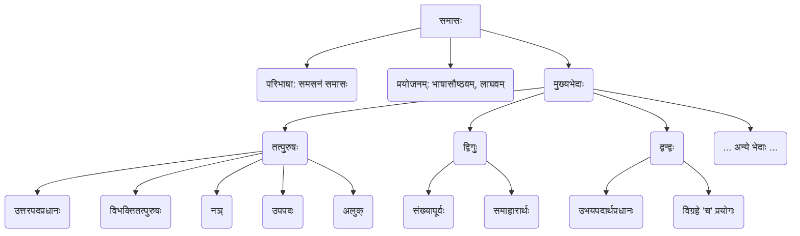

# Class 9 Sanskrit - Abhyasvan Chapter 109
**Language:** संस्कृतम्

```markdown
# [नवमी कक्षा] अभ्यासवान् - अध्यायः १०९ - समासाः

## 🌟 मुख्याः अवधारणाः (Core Concepts)

अस्मिन् पाठे वयं समासस्य (Samāsa - Compound Words) अवधारणां पठामः। समासः अर्थात् बहूनां पदानां मेलनेन एकपदस्य निर्माणम्। अनेन भाषायां सौष्ठवं (elegance) लाघवं (brevity) च आयाति।

**समासस्य संरचना (Structure of Samāsa):**
*   **पूर्वपदम् (Pūrvapadam):** समासस्य प्रथमः भागः।
*   **उत्तरपदम् (Uttarapadam):** समासस्य द्वितीयः (अन्तिमः) भागः।
*   **समस्तपदम् (Samastapadam):** पूर्वपदस्य उत्तरपदस्य च मेलनेन निर्मितं नूतनं पदम्।
*   **विग्रहः (Vigrahaḥ):** समस्तपदस्य अर्थं स्पष्टीकर्तुं प्रयुज्यमानं वाक्यं वा वाक्यांशः, यस्मिन् पदानि विभक्तियुक्तानि भवन्ति।

**पाठस्य मुख्याः समासभेदाः (Main Types in this Chapter):**
1.  **तत्पुरुषसमासः (Tatpuruṣa Samāsa):**
    *   प्रायः उत्तरपदस्य अर्थः प्रधानः भवति।
    *   विग्रहे पूर्वपदे द्वितीयादितः सप्तमीपर्यन्तं विभक्तिः भवति।
    *   **उपभेदाः (Sub-types):**
        *   विभक्तितत्पुरुषः (Based on Vibhakti - द्वितीया, तृतीया, चतुर्थी, पञ्चमी, षष्ठी, सप्तमी)
        *   नञ्-तत्पुरुषः (Nañ Tatpuruṣa - निषेधार्थकः 'न')
        *   उपपद-तत्पुरुषः (Upapada Tatpuruṣa - यत्र उत्तरपदं क्रियावाचकम्)
        *   अलुक्-तत्पुरुषः (Aluk Tatpuruṣa - यत्र पूर्वपदस्य विभक्तिः न लुप्यते)
        *   (कर्मधारयः द्विगुः च तत्पुरुषस्य एव भेदौ मन्येते, अत्र द्विगुः पृथक् पठ्यते।)
2.  **द्विगुसमासः (Dvigu Samāsa):**
    *   पूर्वपदं संख्यावाचि भवति।
    *   प्रायः समाहारस्य (समूहस्य) बोधः भवति।
    *   (तत्पुरुषस्य भेदः अपि मन्यते।)
3.  **द्वन्द्वसमासः (Dvandva Samāsa):**
    *   उभयोः पदयोः (पूर्वपदस्य उत्तरपदस्य च) अर्थः प्रधानः भवति।
    *   विग्रहे प्रत्येकं पदस्य अनन्तरं 'च' इत्यस्य प्रयोगः भवति।

📊 **अवधारणा सोपानचित्रम् (Concept Hierarchy):**


## 📘 प्रमुखशिक्षणबिन्दवः (Key Learnings)

1.  **समासः किम्? (What is Samāsa?)**
    *   **परिभाषा (Definition):** यदा अनेकपदानि मिलित्वा विभक्तिलोपं कृत्वा एकं पदं निर्मान्ति, तत् समस्तपदं भवति, इयं प्रक्रिया च समासः कथ्यते (`समसनं समासः`)।
    *   **उदाहरणम् (Example):** `राज्ञः पुरुषः` (विग्रहः) -> `राजपुरुषः` (समस्तपदम्)। अत्र षष्ठी विभक्तिः ('ज्ञः') लुप्ता।
    *   **लाभः (Benefit):** अनेन भाषायां संक्षिप्तता (brevity) सुन्दरता (elegance) च वर्धते। यथा, `नीले अक्षिणी यस्याः सा` इति वाक्यस्य स्थाने `नीलाक्षी` इति एकं पदं पर्याप्तम्।

2.  **तत्पुरुषसमासः (Tatpuruṣa Samāsa):**
    *   अस्मिन् समासे प्रायः **उत्तरपदस्य अर्थः प्रधानः** भवति।
    *   विग्रहे पूर्वपदे या विभक्तिः प्रयुज्यते, तस्याः नाम्ना सः तत्पुरुषः ज्ञायते।
    *   **उदाहरणानि (Examples):**
        | समस्तपदम्     | विग्रहः             | समासनाम             | विभक्तिः |
        |---------------|--------------------|----------------------|----------|
        | शरणागतः       | शरणम् आगतः        | द्वितीया-तत्पुरुषः    | द्वितीया  |
        | हरित्रातः       | हरिणा त्रातः        | तृतीया-तत्पुरुषः     | तृतीया   |
        | पाकशाला       | पाकाय शाला         | चतुर्थी-तत्पुरुषः    | चतुर्थी  |
        | रोगमुक्तः      | रोगात् मुक्तः       | पञ्चमी-तत्पुरुषः     | पञ्चमी   |
        | राजपुरुषः      | राज्ञः पुरुषः       | षष्ठी-तत्पुरुषः      | षष्ठी    |
        | जलमग्नः       | जले मग्नः          | सप्तमी-तत्पुरुषः     | सप्तमी   |
    *   **नञ्-तत्पुरुषः:** यदा पूर्वपदं 'न' (निषेधार्थकम्) भवति।
        *   यदि उत्तरपदं स्वरेण आरभ्यते, तर्हि 'न' स्थाने 'अन्' भवति। यथा - `न इष्टम्` -> `अनिष्टम्`।
        *   यदि उत्तरपदं व्यञ्जनेन आरभ्यते, तर्हि 'न' स्थाने 'अ' भवति। यथा - `न ज्ञानम्` -> `अज्ञानम्`।
    *   **उपपद-तत्पुरुषः:** यत्र उत्तरपदं क्रियापदं भवति (कृदन्तरूपम्) तथा पूर्वपदं तस्य कर्म/कारकं भवति। यथा - `कुम्भं करोति इति` -> `कुम्भकारः`।
    *   **अलुक्-तत्पुरुषः:** यत्र विग्रहे पूर्वपदस्य विभक्तिः समस्तपदे अपि दृश्यते (न लुप्यते)। यथा - `युधि स्थिरः` -> `युधिष्ठिरः` (अत्र सप्तमी विभक्तिः 'इ' दृश्यते)।

3.  **द्विगुसमासः (Dvigu Samāsa):**
    *   अस्मिन् समासे **पूर्वपदं संख्यावाचि** भवति (`संख्यापूर्वो द्विगुः`)।
    *   प्रायः अयं समासः **समूहं (समाहारम्)** सूचयति।
    *   समस्तपदं प्रायः नपुंसकलिङ्गे एकवचने भवति (यदि समाहारार्थः)।
    *   **उदाहरणानि (Examples):**
        | समस्तपदम्     | विग्रहः                          | अर्थः (Meaning)          |
        |---------------|-----------------------------------|--------------------------|
        | पञ्चपात्रम्    | पञ्चानां पात्राणां समाहारः        | पाँच पात्रों का समूह      |
        | त्रिभुवनम्    | त्रयाणां भुवनानां समाहारः        | तीन लोकों का समूह        |
        | चतुर्युगम्    | चतुर्णां युगानां समाहारः          | चार युगों का समूह         |
        | अष्टाध्यायी   | अष्टानाम् अध्यायानां समाहारः     | आठ अध्यायों का समूह      |

4.  **द्वन्द्वसमासः (Dvandva Samāsa):**
    *   अस्मिन् समासे **सर्वेषां पदानाम् (प्रायः पूर्वपदस्य उत्तरपदस्य च) अर्थः प्रधानः** भवति (`उभयपदार्थप्रधानो द्वन्द्वः`)।
    *   विग्रहं कुर्वन्तः प्रत्येकं पदस्य पश्चात् **'च'** इति अव्ययं योजयामः।
    *   समस्तपदस्य लिङ्गम् अन्तिमपदस्य अनुसारं, वचनं च मिलितपदानां संख्यानुसारं (प्रायः द्विवचनं/बहुवचनम्) भवति।
    *   **उदाहरणानि (Examples):**
        | समस्तपदम्         | विग्रहः                     | अर्थः (Meaning)              |
        |-------------------|----------------------------|------------------------------|
        | रामकृष् णौ       | रामः च कृष्णः च            | राम और कृष्ण                 |
        | पितरौ (मातापितरौ) | माता च पिता च             | माता और पिता                 |
        | कन्दमूलफलानि    | कन्दं च मूलं च फलं च       | कन्द, मूल और फल              |
        | पाणिपादम्        | पाणी च पादौ च (एतेषां समाहारः)| हाथ और पैर (का समूह)        |
        | सुखदुःखे         | सुखं च दुःखं च             | सुख और दुःख                  |

📈 **समासप्रक्रिया (Diagram of Compounding Process):**
```
[पदम् १ + (विभक्तिः)] + [पदम् २ + (विभक्तिः)] + ...  (विग्रहः)
           ↓ (विभक्तिलोपः + सन्धिः यदि आवश्यकः)
[पूर्वपदम् + उत्तरपदम्] (समस्तपदम्)
```
*उदाहरणम्:* `[राज्ञः] + [पुरुषः]` → `राज + पुरुषः` → `राजपुरुषः`

## 🧩 सक्रिय-अधिगमः (Active Learning)

*   **गतिविधिः (Activity): शोध-आधारित-विश्लेषणम् (Research-based Analysis) 🔍**
    *   छात्राः पञ्चतन्त्रतः, हितोपदेशतः वा श्रीमद्भगवद्गीतायाः कञ्चित् श्लोकं चित्वा तस्मिन् आगतानि न्यूनातिन्यूनं पञ्च समस्तपदानि अन्विष्यन्तु।
    *   तेषां पदानां विग्रहं कृत्वा समासस्य नाम लिखन्तु।
    *   **मूल्याङ्कनम् (Evaluation):** किं छात्राः शुद्धं विग्रहं कर्तुं समासनाम च अभिज्ञातुं समर्थाः सन्ति? किं ते विभिन्नप्रकारकान् समासान् ज्ञातवन्तः?
    *   **सृजनम् (Creation):** छात्राः स्वयमेव सरलानि समस्तपदानि रचयित्वा तेषां विग्रहं प्रदर्शयन्तु। यथा - `विद्यालयः` (विद्यायाः आलयः - षष्ठी तत्पुरुषः), `नीलकमलम्` (नीलं च तत् कमलम् - कर्मधारयः, यद्यपि अत्र न पठितः, तथापि ज्ञातुं शक्यते)।

*   **चर्चा (Discussion): वास्तविक-जगति प्रभावस्य आलोचनात्मकं विश्लेषणम् (Critical Analysis of Real-world Impacts) 🌍**
    *   **विषयः:** "समासानां प्रयोगेण भाषायां किं सौन्दर्यं, का च संक्षिप्तता आयाति?" (What beauty and brevity do compounds bring to language?)
    *   छात्राः उदाहरणैः सह चर्चां कुर्वन्तु। एकं वाक्यं समासं विना अपरं च समासेन सह लिखन्तु तुलयन्तु च। यथा:
        *   `गृहस्य उद्याने विशालः च एषः वृक्षः, तत् आरूढम् एकं वानरम् अपश्यत्।`
        *   `गृहोद्याने विशालवृक्षारूढम् एकं वानरम् अपश्यत्।`
    *   **आलोचना (Critique):** किं सर्वदा समासानां प्रयोगः उचितः? कदा विग्रहवाक्यस्य प्रयोगः अधिकं स्पष्टतां यच्छति? (Is using compounds always better? When might an analytical phrase provide more clarity?)
    *   **मूल्याङ्कनम् (Evaluation):** छात्राः भाषायां समासस्य महत्त्वं उपयोगितां च अवगच्छन्ति वा? किं ते तस्य प्रयोगस्य सीमाः अपि चिन्तयितुं शक्नुवन्ति?

## 📝 मूल्याङ्कन-सिद्धता (Assessment Prep)

*   **अभ्यासप्रश्नाः (Practice Questions):**
    1.  **अधोलिखितानां समस्तपदानां विग्रहं कृत्वा समासनाम लिखत (Write the vigraha and samāsa name for the following):**
        *   सप्तर्षयः (सप्तानाम् ऋषीणाम् समाहारः - द्विगुः)
        *   गृहकार्यम् (गृहस्य कार्यम् - षष्ठी तत्पुरुषः)
        *   भयभीतः (भयात् भीतः - पञ्चमी तत्पुरुषः)
        *   शीतोष्णम् (शीतं च उष्णं च - द्वन्द्वः)
        *   अधर्मः (न धर्मः - नञ् तत्पुरुषः)
        *   पञ्चवटी (पञ्चानां वटानां समाहारः - द्विगुः)
        *   युधिष्ठिरः (युधि स्थिरः - अलुक् तत्पुरुषः)
    2.  **अधोलिखितानां विग्रहाणां समस्तपदं रचयित्वा समासनाम लिखत (Form the samasta-pada and write the samāsa name for the following):**
        *   विद्यायाः आलयः (`विद्यालयः` - षष्ठी तत्पुरुषः)
        *   पञ्चानां तन्त्राणां समाहारः (`पञ्चतन्त्रम्` - द्विगुः)
        *   धर्मः च अर्थः च (`धर्मार्थौ` - द्वन्द्वः)
        *   न सत्यम् (`असत्यम्` - नञ् तत्पुरुषः)
        *   चोरात् भयम् (`चोरभयम्` - पञ्चमी तत्पुरुषः)
        *   कृष्णं श्रितः (`कृष्णश्रितः` - द्वितीया तत्पुरुषः)

*   **स्थित्यध्ययनम् (Case Study):**
    *   एकं लघु संस्कृतगद्यांशं दत्त्वा तस्मिन् प्रयुक्तान् तत्पुरुष-द्विगु-द्वन्द्वसमासान् रेखाङ्कितान् कृत्वा तेषां विग्रहं समासनाम च लेखितुं निर्देशः।
    *   **उदाहरणम्:** `एकदा **नीलाक्षी** **पितरौ** प्रणम्य, **लम्बोदरं** **घनश्यामं** च स्मृत्वा **गृहोद्याने** **विशालवृक्षस्य** अधः उपविष्टा। तत्र सा **कन्दमूलफलानि** खादति स्म।`
        *   नीलाक्षी (नीले अक्षिणी यस्याः सा - बहुव्रीहिः - *अत्र केवलं तत्पुरुष/द्विगु/द्वन्द्वम् एव पृच्छेत्*)
        *   पितरौ (माता च पिता च - द्वन्द्वः)
        *   लम्बोदरम् (लम्बम् उदरम् यस्य तम् - बहुव्रीहिः)
        *   घनश्यामम् (घन इव श्यामम् - कर्मधारयः)
        *   गृहोद्याने (गृहस्य उद्याने - षष्ठी तत्पुरुषः)
        *   विशालवृक्षस्य (विशालस्य वृक्षस्य - कर्मधारयः / विशालः च असौ वृक्षः तस्य - कर्मधारयः)
        *   कन्दमूलफलानि (कन्दं च मूलं च फलं च - द्वन्द्वः)
    *(शिक्षकः केवलं पाठे पठितान् भेदान् एव केन्द्रीकुर्यात्।)*

*   **रेखाचित्रम्/तालिका (Diagram/Table):**
    *   छात्राः तत्पुरुषस्य विभक्त्यनुसारं भेदान् उदाहरणसहितं तालिकायां योजयन्तु।
    ```
    | विभक्तिः | उदाहरणम् (समस्तपदम्) | विग्रहः         |
    |----------|----------------------|-----------------|
    | द्वितीया  | कृष्णश्रितः           | कृष्णं श्रितः   |
    | तृतीया   | ज्ञानेन हीनः         | ज्ञानहीनः        |
    | ...      | ...                  | ...             |
    | सप्तमी   | कार्यकुशलः          | कार्ये कुशलः    |
    ```

## 🌏 भारतीय-सन्दर्भः (Bharatiya Context)

1.  **भाषावैज्ञानिक-परम्परा (Linguistic Tradition):** समासः संस्कृतभाषायाः तथा च तस्मात् उद्भूतानां बहूनां आधुनिक-भारतीय-भाषाणां (यथा हिन्दी, मराठी, बङ्गला) महत्त्वपूर्णम् अङ्गम् अस्ति। महर्षिणा पाणिनिना स्वस्य 'अष्टाध्यायी' इति ग्रन्थे समासस्य नियमाः विस्तरेण वर्णिताः। इयं भारतीय-ज्ञानपरम्परायाः विश्लेषणात्मकचिन्तनस्य प्रतीकम् अस्ति।
2.  **साहित्यिक-उदाहरणानि (Literary Examples):** रामायण-महाभारत-पुराणादिषु ग्रन्थेषु समासानां बहुलः प्रयोगः दृश्यते।
    *   `धर्मक्षेत्रे कुरुक्षेत्रे` (भगवद्गीता) - अत्र `धर्मक्षेत्रे` (धर्मस्य क्षेत्रे - षष्ठी तत्पुरुषः), `कुरुक्षेत्रे` (कुरुणां क्षेत्रे - षष्ठी तत्पुरुषः)।
    *   `पञ्चवटी` (रामायणम्) - `पञ्चानां वटानां समाहारः` (द्विगुः)।
    *   `युधिष्ठिरः` (महाभारतम्) - `युधि स्थिरः` (अलुक्-तत्पुरुषः)।
    *   `घनश्यामः` (कृष्णस्य नाम) - `घन इव श्यामः` (उपमानपूर्वपद कर्मधारयः)।
3.  **संक्षिप्ततायाः महत्त्वम् (Importance of Brevity):** भारतीय-दर्शन-विज्ञान-काव्येषु गहनार्थान् सूत्ररूपेण वा संक्षिप्तपदेषु प्रकटयितुं समासानां प्रयोगः अतीव सहायकः अभवत्। अनेन ज्ञानस्य स्मरणं प्रसारणञ्च सुकरम् अभवत्। यथा, `अष्टाध्यायी` (अष्टानाम् अध्यायानां समाहारः - द्विगुः) इति नाम एव ग्रन्थस्य स्वरूपं सङ्क्षेपेण वदति।
```