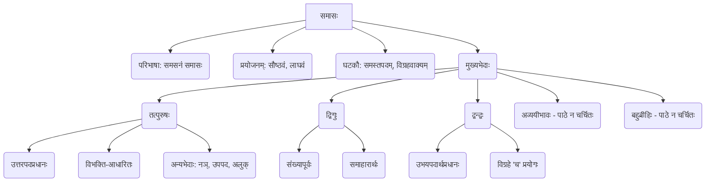
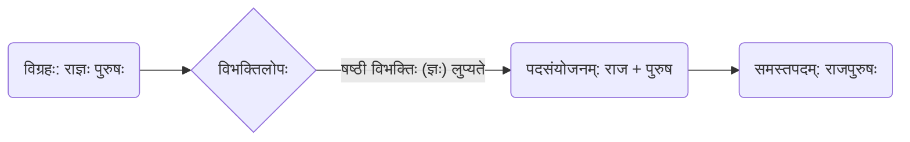

# Class 9 Sanskrit - Abhyasvan Chapter 109
**Language:** संस्कृतम्

```markdown
# [कक्षा ९] अभ्यासवान् - अध्यायः १०९ - समासाः

## 🌟 मुख्यसंकल्पनाः (Core Concepts)

अस्मिन् पाठे वयं संस्कृतव्याकरणस्य महत्त्वपूर्णम् अङ्गं "समासः" इति विषये पठामः।

1.  **समासस्य परिचयः**
    *   **परिभाषा:** बहूनां पदानां मिलित्वा एकपदभवनं **समासः** कथ्यते (`समसनं समासः`)। अस्मिन् प्रक्रियायां प्रायः पदानां मध्ये स्थितानां विभक्तीनां लोपः भवति।
    *   **प्रयोजनम्:** समासेन भाषायां **सौष्ठवं** (लालित्यम्) **लाघवं** (संक्षेपः) च आगच्छति।
    *   **समस्तपदम्:** समासप्रक्रियया निर्मितं नूतनम् एकं पदं **समस्तपदम्** इति उच्यते। (यथा - राज्ञः पुरुषः -> राजपुरुषः)
    *   **विग्रहवाक्यम्:** समस्तपदस्य अर्थं स्पष्टीकर्तुं यत् वाक्यं प्रयुज्यते, तत् **विग्रहवाक्यम्** इति कथ्यते। (यथा - राजपुरुषः -> राज्ञः पुरुषः)

2.  **समासस्य भेदाः (अस्मिन् पाठे चर्चिताः)**
    *   **तत्पुरुषसमासः:**
        *   लक्षणम्: यत्र **उत्तरपदस्य** (द्वितीयपदस्य) अर्थः प्रधानः भवति।
        *   विग्रहः: पूर्वपदे प्रायः द्वितीयातः सप्तमीपर्यन्तं विभक्तिः भवति। विभक्तेः आधारेण अस्य नामकरणं भवति (यथा - द्वितीया-तत्पुरुषः, तृतीया-तत्पुरुषः)।
        *   अन्यप्रकाराः: नञ्-तत्पुरुषः, उपपद-तत्पुरुषः, अलुक्-तत्पुरुषः।
    *   **द्विगुसमासः:**
        *   लक्षणम्: यत्र **प्रथमं पदं संख्यावाचि** भवति (`संख्यापूर्वो द्विगुः`)।
        *   अर्थः: अयं समासः प्रायः **समूहार्थं** (समाहारार्थं) बोधयति।
    *   **द्वन्द्वसमासः:**
        *   लक्षणम्: यत्र **उभयोः पदयोः** (अथवा सर्वेषां पदानाम्) अर्थः प्रधानः भवति (`उभयपदार्थप्रधानो द्वन्द्वः`)।
        *   विग्रहः: विग्रहे प्रत्येकं पदस्य अनन्तरं 'च' इत्यस्य प्रयोगः भवति।

📊 **संकल्पना-सोपानम्:**


## 📘 प्रमुखाः शिक्षणबिन्दवः (Key Learnings)

1.  **समासः किम्?**
    *   यदा द्वे वा अधिकानि पदानि मिलित्वा एकं पदं भवन्ति तदा समासः भवति। अनेन वाक्यं संक्षिप्तं सुन्दरं च भवति।
    *   **उदाहरणम्:** पाठारम्भे शुभ्रः पङ्कजं 'पङ्के जातः' इति, मनोजं 'मनसि जायते' इति, यशोदां 'यशः ददाति या' इति, घनश्यामं 'घन इव श्यामः' इति, सुरेशं 'सुराणाम् ईशः' इति च वदति। एतानि विग्रहवाक्यानि सन्ति। तेषां समस्तपदानि क्रमशः पङ्कजः, मनोजः, यशोदा, घनश्यामः, सुरेशः इति।

2.  **तत्पुरुषसमासः (उत्तरपदप्रधानः)**
    *   अस्मिन् समासे द्वितीयपदस्य अर्थः मुख्यः भवति। पूर्वपदं विग्रहे विभक्तियुक्तं भवति।
    *   **उदाहरणानि:**
        *   `शरणागतः` = शरणम् आगतः (द्वितीया तत्पुरुषः) - अत्र 'आगतः' (आश्रितः) इति अर्थः प्रधानः।
        *   `हरित्रातः` = हरिणा त्रातः (तृतीया तत्पुरुषः) - अत्र 'त्रातः' (रक्षितः) इति अर्थः प्रधानः।
        *   `पाकशाला` = पाकाय शाला (चतुर्थी तत्पुरुषः) - अत्र 'शाला' (स्थानम्) इति अर्थः प्रधानः।
        *   `रोगमुक्तः` = रोगात् मुक्तः (पञ्चमी तत्पुरुषः) - अत्र 'मुक्तः' इति अर्थः प्रधानः।
        *   `राजपुरुषः` = राज्ञः पुरुषः (षष्ठी तत्पुरुषः) - अत्र 'पुरुषः' इति अर्थः प्रधानः।
        *   `जलमग्नः` = जले मग्नः (सप्तमी तत्पुरुषः) - अत्र 'मग्नः' (डूबा हुआ) इति अर्थः प्रधानः।
    *   **नञ्-तत्पुरुषः:** यत्र प्रथमपदं 'न' (निषेधार्थकम्) भवति।
        *   `अज्ञानम्` = न ज्ञानम्।
        *   `अनिष्टम्` = न इष्टम्। (स्वरवर्णात् पूर्वं 'न' स्थाने 'अन्')
        *   `असत्यम्` = न सत्यम्। (व्यञ्जनवर्णात् पूर्वं 'न' स्थाने 'अ')
    *   **उपपद-तत्पुरुषः:** यत्र उत्तरपदं क्रियावाचकं भवति, पूर्वपदं च कर्मकारकम्।
        *   `कुम्भकारः` = कुम्भं करोति इति।
    *   **अलुक्-तत्पुरुषः:** यत्र पूर्वपदस्य विभक्तिः न लुप्यते।
        *   `युधिष्ठिरः` = युधि (युद्धे) स्थिरः।

3.  **द्विगुसमासः (संख्यापूर्वो द्विगुः)**
    *   यस्य समासस्य प्रथमं पदं संख्यावाचकं भवति, सः द्विगुः। अयं प्रायः समूहं (समाहारं) दर्शयति।
    *   **उदाहरणानि:**
        *   `पञ्चपात्रम्` = पञ्चानां पात्राणां समाहारः। (पाँच पात्रों का समूह)
        *   `त्रिभुवनम्` = त्रयाणां भुवनानां समाहारः। (तीन लोकों का समूह)
        *   `चतुर्युगम्` = चतुर्णां युगानां समाहारः। (चार युगों का समूह)
        *   `अष्टाध्यायी` = अष्टानाम् अध्यायानां समाहारः। (आठ अध्यायों का समूह - पाणिनेः व्याकरणग्रन्थः)

4.  **द्वन्द्वसमासः (उभयपदार्थप्रधानः)**
    *   अस्मिन् समासे द्वयोः वा सर्वेषां पदानाम् अर्थः समानरूपेण प्रधानः भवति।
    *   विग्रहे प्रत्येकं पदस्य अनन्तरं 'च' (और) इति योजितम्।
    *   **उदाहरणानि:**
        *   `रामकृष्णौ` = रामः च कृष्णः च।
        *   `पितरौ` (अथवा `मातापितरौ`) = माता च पिता च।
        *   `कन्दमूलफलानि` = कन्दं च मूलं च फलं च।
        *   `पाणिपादम्` = पाणी च पादौ च (एतेषां समाहारः)।

📈 **समासप्रक्रियायाः सोपानम् (उदाहरणम् - राजपुरुषः):**


## 🧩 सक्रिय-अधिगमः (Active Learning)

1.  **गतिविधिः (Activity): नाम-विश्लेषणम् 🔍**
    *   छात्राः स्वमित्राणां, परिवारे सदस्यानां, प्रसिद्धजनानां वा नामानि स्वीकृत्य तेषु येषां नामानि समस्तपदानि सन्ति, तेषां विग्रहं कर्तुं समासनाम ज्ञातुं च प्रयतन्ताम्।
    *   **उदाहरणम्:** नीलकण्ठः (नीलः कण्ठः यस्य सः - बहुव्रीहिः), गजाननः (गजस्य आननं यस्य सः - बहुव्रीहिः), पङ्कजम् (पङ्के जायते यत् तत् - उपपदतत्पुरुषः)। एषा गतिविधिः पाठे चर्चितानां समासानाम् अतिरिक्तं ज्ञानम् अपि वर्धयिष्यति।

2.  **चर्चा (Discussion): समासानां दैनन्दिन-प्रयोगः 🌍**
    *   कक्षायां छात्राः समूहेषु चर्चां कुर्युः यत् वयं दैनन्दिनजीवने वार्तालापे, पठने, लेखने च कथं समासानां प्रयोगं कुर्मः (ज्ञात्वा अज्ञात वा)।
    *   **चिन्तनीयप्रश्नाः:**
        *   किं समासाः भाषां सरलां कुर्वन्ति अथवा कठिनाम्?
        *   समाचारपत्रेषु, पुस्तकेषु, विज्ञापनेषु च समासानां कानि उदाहरणानि भवन्तः पश्यन्ति? (यथा - 'राष्ट्रपतिः', 'प्रधानमन्त्री', 'रेलयानम्', 'शीतयुद्धम्', 'नवरात्रिः')
        *   यदि समासाः न अभविष्यन्, तर्हि भाषा कीदृशी अभविष्यत्?

## 📝 मूल्याङ्कन-सिद्धता (Assessment Prep)

*   **समस्तपदानां विग्रहः समासनाम च:**
    *   पाठ्यपुस्तके दत्तानाम् अभ्यासानां साधना करणीया।
    *   **उदाहरणानि:**
        *   `सप्तर्षयः` -> सप्तानां ऋषीणां समाहारः (द्विगुः) / सप्त च ते ऋषयः च (कर्मधारयः - परन्तु अत्र द्विगुः अधिकः सम्भाव्यः) - *पाठस्य आधारेण द्विगुः इति लेखनीयम्।*
        *   `सुखदुःखे` -> सुखं च दुःखं च (द्वन्द्वः)
        *   `गृहकार्यम्` -> गृहस्य कार्यम् (षष्ठी तत्पुरुषः)
        *   `अधर्मः` -> न धर्मः (नञ् तत्पुरुषः)

*   **विग्रहवाक्यानां समस्तपदं समासनाम च:**
    *   **उदाहरणानि:**
        *   `विद्यायाः आलयः` -> विद्यालयः (षष्ठी तत्पुरुषः)
        *   `पञ्चानां वटानां समाहारः` -> पञ्चवटी (द्विगुः)
        *   `सीता च रामः च` -> सीतारामौ (द्वन्द्वः)
        *   `न सत्यम्` -> असत्यम् (नञ् तत्पुरुषः)

📝 **संक्षिप्त-पुनरावलोकन-तालिका:**

| समासः      | मुख्यलक्षणम्                               | उदाहरणम् (समस्तपदम्) | विग्रहः                     |
|------------|-------------------------------------------|----------------------|-----------------------------|
| **तत्पुरुषः** | उत्तरपदप्रधानः, पूर्वपदे विभक्तिः        | शरणागतः             | शरणम् आगतः              |
|            |                                           | राजपुरुषः            | राज्ञः पुरुषः              |
|            | (नञ्) निषेधार्थकः 'न'/'अ'/'अन्'          | अज्ञानम्             | न ज्ञानम्                  |
| **द्विगुः**   | प्रथमपदं संख्यावाचि, समाहारार्थः         | त्रिभुवनम्           | त्रयाणां भुवनानां समाहारः |
|            |                                           | पञ्चपात्रम्           | पञ्चानां पात्राणां समाहारः |
| **द्वन्द्वः**  | उभयपदप्रधानः, विग्रहे 'च' इत्यस्य प्रयोगः | रामकृष् णौ           | रामः च कृष्णः च           |
|            |                                           | पितरौ                | माता च पिता च             |

## 🌏 भारतीय-सन्दर्भः (Bharatiya Context)

*   संस्कृतभाषायां समासाः भारतीयसंस्कृतेः अभिन्नम् अङ्गम्। एतेषां प्रयोगः प्राचीनकालात् साहित्ये, दर्शने, विज्ञाने, नामकरणे च दृश्यते।
*   **उदाहरणानि:**
    1.  **ग्रन्थनामानि:** `अष्टाध्यायी` (पाणिनेः व्याकरणग्रन्थः - द्विगुः), `महाभारतम्` (महत् च तत् भारतम् - कर्मधारयः), `रामायणम्` (रामस्य अयनम् - षष्ठी तत्पुरुषः)।
    2.  **देवतानामानि/पौराणिकनामानि:** `गङ्गाधरः` (गङ्गां धरति यः सः - उपपद/बहुव्रीहिः), `चक्रपाणिः` (चक्रं पाणौ यस्य सः - बहुव्रीहिः), `युधिष्ठिरः` (युधि स्थिरः - अलुक् तत्पुरुषः)।
    3.  **स्थाननामानि:** `प्रयागराजः` (प्रयागः राजा इव - उपमितसमासः/ प्रयागाणां राजा - षष्ठी तत्पुरुषः), `पञ्चवटी` (पञ्चानां वटानां समाहारः - द्विगुः), `हस्तिनापुरम्` (हस्तिनः पुरम् - षष्ठी तत्पुरुषः)।
*   समासानां सम्यक् ज्ञानेन संस्कृतवाङ्मयस्य गहनार्थान् अवगन्तुं साहाय्यं भवति। एते भाषां सङ्क्षिप्तां प्रभावपूर्णां च कुर्वन्ति, यत् भारतीयज्ञानपरम्परायाः वैशिष्ट्यम् अस्ति।

```