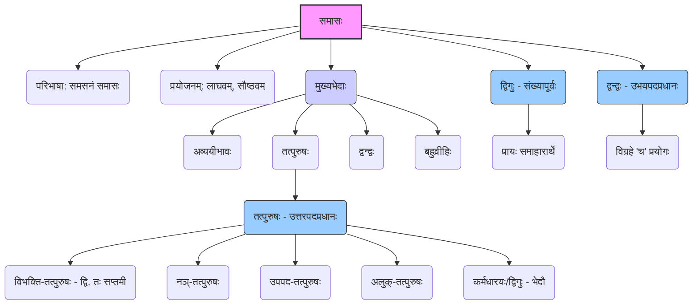

# Class 9 Sanskrit - Abhyasvan Chapter 109
**Language:** संस्कृतम्

```markdown
# [नवमी कक्षा] अभ्यासवान् - १०९ पाठः - समासाः

## 🌟 मुख्याः अवधारणाः (Core Concepts)

अस्मिन् पाठे **समास**-प्रकरणस्य परिचयः तथा च केषाञ्चन प्रमुखभेदानां विवरणं वर्तते।

1.  **समासस्य परिभाषा एवं प्रयोजनम्:**
    *   **समसनं समासः:** बहूनां पदानाम् एकपदीभवनं समासः कथ्यते।
    *   **प्रयोजनम्:** भाषायां **सौष्ठवम्** (elegance) **लाघवं** (brevity) च आनयति।
    *   **प्रक्रिया:** पदानां मध्ये स्थितानां विभक्तीनां लोपं कृत्वा एकं पदं (समस्तपदम्) निर्मीयते।

2.  **मुख्यपदे:**
    *   **समस्तपदम्:** समासप्रक्रियया निर्मितं नूतनम् एकपदम्। (यथा - `राजपुरुषः`)
    *   **विग्रहवाक्यम्:** समस्तपदस्य अर्थं स्पष्टीकर्तुं विभक्तियुक्तानां पदानां प्रयोगः। (यथा - `राज्ञः पुरुषः`)

3.  **समासस्य मुख्यभेदाः (संक्षेपेण उल्लिखिताः):**
    *   अव्ययीभावः
    *   तत्पुरुषः
    *   द्वन्द्वः
    *   बहुव्रीहिः

4.  **अस्मिन् पाठे विस्तरेण पठिताः समासाः:**
    *   **तत्पुरुषसमासः (उत्तरपदप्रधानः):**
        *   **परिभाषा:** यस्मिन् समासे उत्तरपदस्य (द्वितीयपदस्य) अर्थः प्रधानः भवति।
        *   **प्रकाराः (विभक्त्याधारेण):** द्वितीया-तत्पुरुषः, तृतीया-तत्पुरुषः, चतुर्थी-तत्पुरुषः, पञ्चमी-तत्पुरुषः, षष्ठी-तत्पुरुषः, सप्तमी-तत्पुरुषः।
        *   **अन्यभेदाः (उल्लिखिताः):**
            *   **नञ्-तत्पुरुषः:** यत्र प्रथमपदं 'न' (अ/अन् रूपेण) भवति, निषेधार्थकः। (यथा - `अज्ञानम्`)
            *   **उपपद-तत्पुरुषः:** यत्र उत्तरपदं क्रियावाचकं भवति, पूर्वपदं च उपपदम्। (यथा - `कुम्भकारः`)
            *   **अलुक्-तत्पुरुषः:** यत्र पूर्वपदस्य विभक्तिः न लुप्यते। (यथा - `युधिष्ठिरः`)
            *   (कर्मधारयः द्विगुः च तत्पुरुषस्य एव भेदौ इति ज्ञातव्यम्।)
    *   **द्विगुसमासः (संख्यापूर्वो द्विगुः):**
        *   **परिभाषा:** यस्य समासस्य प्रथमपदं संख्यावाचि भवति, प्रायः समाहारार्थं (समूहार्थं) द्योतयति।
    *   **द्वन्द्वसमासः (उभयपदार्थप्रधानो द्वन्द्वः):**
        *   **परिभाषा:** यस्मिन् समासे सर्वेषां पदानाम् (पूर्वपदस्य उत्तरपदस्य च) अर्थः प्रधानः भवति।
        *   **विग्रहे:** प्रत्येकं पदस्य पश्चात् 'च' इत्यस्य प्रयोगः भवति।

📊 **अवधारणानां सङ्क्षिप्तचित्रणम्:**


## 📘 प्रमुखशिक्षणबिन्दवः (Key Learnings)

**१. समासः किम्?**
यदा अनेकानि पदानि मिलित्वा स्वविभक्तिं त्यक्त्वा एकं पदं भवन्ति, सः समासः कथ्यते। अनेन भाषा सरला, संक्षिप्ता, सुन्दरा च भवति। यथा - `राज्ञः पुरुषः` इत्यस्य स्थाने `राजपुरुषः` इति प्रयोगः।

**२. तत्पुरुषसमासः (उत्तरपदप्रधानः)**
*   अस्मिन् समासे द्वितीयपदस्य अर्थः मुख्यः भवति।
*   विग्रहवाक्ये पूर्वपदे या विभक्तिः भवति, तस्याः विभक्तेः नाम्ना सः तत्पुरुषसमासः ज्ञायते। समस्तपदे तस्याः विभक्तेः लोपः भवति।

    | समस्तपदम्     | विग्रहः                    | समासनाम            | विभक्तिः (विग्रहे) |
    |---------------|----------------------------|---------------------|-------------------|
    | शरणागतः       | शरणम् आगतः                | द्वितीया-तत्पुरुषः   | द्वितीया          |
    | हरित्रातः      | हरिणा त्रातः               | तृतीया-तत्पुरुषः    | तृतीया           |
    | पाकशाला       | पाकाय शाला                | चतुर्थी-तत्पुरुषः   | चतुर्थी          |
    | रोगमुक्तः      | रोगात् मुक्तः              | पञ्चमी-तत्पुरुषः    | पञ्चमी           |
    | राजपुरुषः      | राज्ञः पुरुषः              | षष्ठी-तत्पुरुषः     | षष्ठी            |
    | जलमग्नः       | जले मग्नः                 | सप्तमी-तत्पुरुषः    | सप्तमी           |
    | **नञ्-तत्पुरुषः** |                            |                     |                   |
    | अज्ञानम्       | न ज्ञानम्                  | नञ्-तत्पुरुषः       | (निषेधार्थकम् 'न') |
    | अनुचितम्      | न उचितम्                  | नञ्-तत्पुरुषः       | (स्वरपूर्वम् 'अन्') |
    | **उपपद-तत्पुरुषः**|                            |                     |                   |
    | कुम्भकारः      | कुम्भं करोति इति          | उपपद-तत्पुरुषः     | (क्रियापदम् उत्तरे) |
    | **अलुक्-तत्पुरुषः**|                            |                     |                   |
    | युधिष्ठिरः      | युधि स्थिरः               | अलुक्-तत्पुरुषः     | (विभक्तिः न लुप्ता)|

**३. द्विगुसमासः (संख्यापूर्वो द्विगुः)**
*   अस्य समासस्य प्रथमं पदं संख्यावाचकं भवति।
*   प्रायः अयं समासः समूहम् (समाहारम्) बोधयति। समस्तपदं प्रायः नपुंसकलिङ्गे एकवचने भवति (समाहारे)।

    | समस्तपदम्     | विग्रहः                       | अर्थः             |
    |---------------|-------------------------------|-------------------|
    | पञ्चपात्रम्    | पञ्चानां पात्राणां समाहारः     | पाँच पात्रों का समूह |
    | त्रिभुवनम्     | त्रयाणां भुवनानां समाहारः      | तीन लोकों का समूह  |
    | चतुर्युगम्     | चतुर्णां युगानां समाहारः       | चार युगों का समूह   |
    | अष्टाध्यायी    | अष्टानाम् अध्यायानां समाहारः   | आठ अध्यायों का समूह|

**४. द्वन्द्वसमासः (उभयपदार्थप्रधानो द्वन्द्वः)**
*   अस्मिन् समासे पूर्वपदम् उत्तरपदं च (अथवा सर्वाणि पदानि) समानरूपेण प्रधानानि भवन्ति।
*   विग्रहवाक्ये प्रत्येकं पदस्य अनन्तरं 'च' (और) इत्यस्य प्रयोगः भवति।
*   समस्तपदस्य लिङ्गं वचनं च अन्तिमपदस्य अनुसारं अथवा समुदायस्य अनुसारं भवति।

    | समस्तपदम्        | विग्रहः                    | अर्थः                 |
    |------------------|----------------------------|-----------------------|
    | रामकृष् णौ       | रामः च कृष्णः च            | राम और कृष्ण         |
    | मातापितरौ (पितरौ)| माता च पिता च             | माता और पिता         |
    | कन्दमूलफलानि    | कन्दं च मूलं च फलं च       | कन्द, मूल और फल       |
    | पाणिपादम्        | पाणी च पादौ च (एतेषां समाहारः) | हाथ और पैर (का समूह) |
    | धर्मार्थकाममोक्षाः| धर्मः च अर्थः च कामः च मोक्षः च | धर्म, अर्थ, काम और मोक्ष |

📈 **भाषायां समासस्य प्रभावः:**
*   **संक्षिप्तता:** `नीले अक्षिणी यस्याः सा` -> `नीलाक्षी`
*   **प्रवाहः:** वाक्यं पठने सरलं भवति।
*   **सौन्दर्यम्:** भाषायां विशिष्टं सौष्ठवं जायते।

## 🧩 सक्रिय-अधिगमः (Active Learning)

*   **गतिविधिः (Activity) 🔍:**
    *   पाठ्यपुस्तके दत्तानि समस्तपदानि (यथा - `घनश्यामः`, `लम्बोदरः`, `गृहोद्यानम्`, `सप्तर्षयः`) चित्वा तेषां विग्रहवाक्यानि लिखन्तु, समासस्य नामानि च अभिज्ञातुं प्रयतन्ताम्।
    *   स्वयं पञ्च नूतनानि समस्तपदानि (तत्पुरुषस्य, द्वन्द्वस्य, द्विगोः च) रचयन्तु, तेषां विग्रहं च लिखन्तु। (उदा. `पञ्चवटी`, `सुखदुःखे`, `देशभक्तः`)
*   **चर्चा (Discussion) 🌍:**
    *   संस्कृतभाषायां समासस्य प्रयोगः कथं भाषां प्रभावयति? (How does the use of Samasa affect the Sanskrit language?)
    *   किं भवन्तः हिन्दी-आदि-आधुनिक-भारतीयभाषासु अपि समासस्य प्रयोगान् पश्यन्ति? उदाहरणानि ददतु। (Do you see the use of compounds in modern Indian languages like Hindi? Give examples.)
    *   समासज्ञानस्य किं महत्त्वम् अस्ति? (What is the importance of knowing Samasa?)

## 📝 मूल्याङ्कन-सिद्धता (Assessment Prep)

*   **परीक्षायां सम्भाव्याः प्रश्नाः:**
    1.  **समस्तपदं दत्त्वा विग्रहं लिखत, समासनाम च लिखत।** (Given a compound word, write its analysis and the name of the Samasa.)
        *   यथा - `विद्यालयः` -> `विद्यायाः आलयः` (षष्ठी-तत्पुरुषः)
    2.  **विग्रहवाक्यं दत्त्वा समस्तपदं रचयत, समासनाम च लिखत।** (Given an analysis sentence, form the compound word and write the name of the Samasa.)
        *   यथा - `पञ्चानां वटानां समाहारः` -> `पञ्चवटी` (द्विगुः)
    3.  **रेखाङ्कितपदेषु समासम् अभिज्ञाय लिखत।** (Identify the Samasa in the underlined words.)

*   **अभ्यासार्थं केचन प्रश्नाः (📝):**
    *   **विग्रहं कुरुत, नाम लिखत च:** `देशभक्तिः`, `नवरात्रिः`, `शीतोष्णम्`, `अधर्मः`, `सप्ताहः`।
    *   **समस्तपदं रचयत, नाम लिखत च:** `कृष्णं श्रितः`, `भोजनाय पात्रम्`, `चोरात् भयम्`, `गङ्गायाः जलम्`, `मुखं च नासिका च`, `त्रयाणां लोकानां समाहारः`, `न सत्यम्`।

## 🌏 भारतीय-सन्दर्भः (Bharatiya Context)

*   समासप्रक्रिया संस्कृतभाषायाः वैशिष्ट्यम् अस्ति, यत् अनेकासु आधुनिक-भारतीयभाषासु (यथा - हिन्दी, मराठी, बङ्गला, गुजराती, कन्नड, तेलुगु इत्यादिषु) अपि दृश्यते। एतासु भाषासु बहवः तत्सम-तद्भव-शब्दाः समासयुक्ताः सन्ति।
*   **उदाहरणानि:**
    *   `राजपुत्रः` (संस्कृतम्) -> `राजपुत्र` (हिन्दी)
    *   `त्रिभुवनम्` (संस्कृतम्) -> `त्रिभुवन` (हिन्दी/मराठी)
    *   `मातापितरौ` (संस्कृतम्) -> `माता-पिता` (हिन्दी)
    *   `पञ्चतन्त्रम्` (प्रसिद्धः कथाग्रन्थः) - `पञ्चानां तन्त्राणां समाहारः` (द्विगुः)
    *   `नवरात्रिः` (उत्सवः) - `नवानां रात्रीणां समाहारः` (द्विगुः)
*   भारतीयसंस्कृतौ, साहित्ये, दर्शनेषु च समासयुक्तानां शब्दानां प्रयोगः बहुलतया प्राप्यते, येन विचाराः सङ्क्षेपेण गहनतया च अभिव्यक्ताः भवन्ति।

*(समासस्य ज्ञानं संस्कृतभाषायाः अवगमनाय तथा च अन्यभारतीयभाषाणां शब्दसम्पदः वर्धनाय अत्यावश्यकम् अस्ति।)*
```