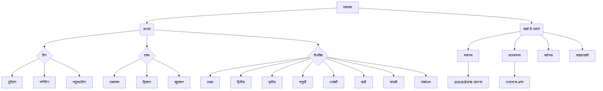

# Class 9 Sanskrit - Abhyasvan Chapter 110
**Language:** हिंदी

```markdown
# [कक्षा 9] अभ्यासवान् भव - अध्याय 110: शब्‍दरूपाणि

## 🌟 मुख्य अवधारणाएँ (Core Concepts)

यह अध्याय संस्कृत भाषा में **शब्दरूपों** पर केंद्रित है। शब्दरूप का अर्थ है कि वाक्य में प्रयोग के अनुसार संज्ञा (noun), सर्वनाम (pronoun) और विशेषण (adjective) शब्दों के रूप में परिवर्तन होना। यह परिवर्तन मुख्य रूप से तीन कारकों पर निर्भर करता है:

1.  **लिंग (Gender):**
    *   पुल्लिंग (Masculine) - जैसे: देवः, बालकः, मुनिः, भानुः, पितृ
    *   स्त्रीलिंग (Feminine) - जैसे: रमा, लता, नदी, धेनुः, मातृ
    *   नपुंसकलिंग (Neuter) - जैसे: फलम्, पुस्तकम्, मधु

2.  **वचन (Number):**
    *   एकवचन (Singular) - एक का बोध कराने वाला (जैसे: देवः - एक देवता)
    *   द्विवचन (Dual) - दो का बोध कराने वाला (जैसे: देवौ - दो देवता)
    *   बहुवचन (Plural) - दो से अधिक का बोध कराने वाला (जैसे: देवाः - अनेक देवता)

3.  **विभक्ति (Case):** वाक्य में शब्द के कार्य (कारक) को दर्शाने वाले रूप। संस्कृत में 7 विभक्तियाँ और एक सम्बोधन होता है:
    *   प्रथमा (कर्ता कारक - Nominative)
    *   द्वितीया (कर्म कारक - Accusative)
    *   तृतीया (करण कारक - Instrumental)
    *   चतुर्थी (सम्प्रदान कारक - Dative)
    *   पञ्चमी (अपादान कारक - Ablative)
    *   षष्ठी (सम्बन्ध कारक - Genitive)
    *   सप्तमी (अधिकरण कारक - Locative)
    *   सम्बोधन (Vocative) - किसी को पुकारने के लिए

**शब्दों के प्रकार (अन्तिम वर्ण के आधार पर):**
*   **स्वरान्त (Vowel-ending):**
    *   अकारान्त (अ-ending): देव, फल
    *   आकारान्त (आ-ending): रमा, लता
    *   इकारान्त (इ-ending): मुनि, कवि
    *   ईकारान्त (ई-ending): नदी, जननी
    *   उकारान्त (उ-ending): भानु, धेनु, मधु
    *   ऋकारान्त (ऋ-ending): पितृ, मातृ
*   **व्यञ्जनान्त (Consonant-ending):** राजन्, भवत्, आत्मन्, विद्वस्, वाच् आदि।
*   **सर्वनाम (Pronouns):** तत्, यत्, किम्, अस्मद्, युष्मद्, सर्व आदि।
*   **संख्यावाची शब्द (Numerals):** एक, द्वि, त्रि, चतुर् (लिंगानुसार बदलते हैं), पञ्चन् से आगे (सभी लिंगों में समान)।

📊 **अवधारणा पदानुक्रम:**


## 📘 प्रमुख शिक्षण बिंदु (Key Learnings)

1.  **शब्दरूप का महत्व:** संस्कृत वाक्यों का सही अर्थ समझने और सही वाक्य बनाने के लिए शब्दरूपों का ज्ञान अनिवार्य है। विभक्ति के प्रयोग से ही पता चलता है कि वाक्य में कौन कर्ता है, कौन कर्म है, किससे क्रिया हो रही है आदि।
    *   *उदाहरण:* `रामः रावणं बाणेन हन्ति।` (राम रावण को बाण से मारते हैं।) यहाँ प्रथमा (रामः), द्वितीया (रावणं), और तृतीया (बाणेन) विभक्तियों से कर्ता, कर्म और करण का बोध होता है।

2.  **अकारान्त पुल्लिंग (देव):** 'अ' पर समाप्त होने वाले पुल्लिंग शब्द।
    *   *पैटर्न:* प्रथमा - देवः, देवौ, देवाः; द्वितीया - देवम्, देवौ, देवान्; तृतीया - देवेन, देवाभ्याम्, देवैः...
    *   *अन्य उदाहरण:* बालक, राम, गज, विद्यालय।
    *   *प्रयोग:* `बालकः पठति।` (लड़का पढ़ता है।) `अहं बालकं पश्यामि।` (मैं लड़के को देखता हूँ।)

3.  **आकारान्त स्त्रीलिंग (रमा):** 'आ' पर समाप्त होने वाले स्त्रीलिंग शब्द।
    *   *पैटर्न:* प्रथमा - रमा, रमे, रमाः; द्वितीया - रमाम्, रमे, रमाः; तृतीया - रमया, रमाभ्याम्, रमाभिः...
    *   *अन्य उदाहरण:* लता, सीता, बालिका, शाखा।
    *   *प्रयोग:* `लता वर्धते।` (बेल बढ़ती है।) `सीतया कार्यं कृतम्।` (सीता द्वारा कार्य किया गया।)

4.  **अकारान्त नपुंसकलिंग (फल):** 'अ' पर समाप्त होने वाले नपुंसकलिंग शब्द।
    *   *पैटर्न:* प्रथमा और द्वितीया विभक्ति समान होती हैं - फलम्, फले, फलानि। तृतीया से सप्तमी तक रूप पुल्लिंग (देव) के समान चलते हैं - फलेन, फलाभ्याम्, फलैः...
    *   *अन्य उदाहरण:* पुस्तक, मित्र, जल, वन।
    *   *प्रयोग:* `फलम् पतति।` (फल गिरता है।) `अहं फलं खादामि।` (मैं फल खाता हूँ।) `पुस्तकेन ज्ञानं वर्धते।` (पुस्तक से ज्ञान बढ़ता है।)

5.  **अन्य स्वरान्त और व्यञ्जनान्त शब्द:** इकारान्त (मुनि), ईकारान्त (नदी), उकारान्त (भानु, धेनु, मधु), ऋकारान्त (पितृ, मातृ) तथा व्यञ्जनान्त (राजन्, भवत्) शब्दों के रूप विशिष्ट नियमों के अनुसार बनते हैं, जिन्हें याद करना होता है। पाठ में इनके उदाहरण और तालिकाएँ दी गई हैं।

6.  **सर्वनाम शब्दरूप:** सर्वनाम शब्दों (जैसे - तत्, एतत्, किम्, अस्मद्, युष्मद्) के रूप भी लिंग, वचन और विभक्ति के अनुसार बदलते हैं। ये अक्सर विशेषण की तरह प्रयुक्त होते हैं और अपने विशेष्य (जिस संज्ञा/सर्वनाम की विशेषता बता रहे हैं) के लिंग, वचन, विभक्ति का अनुसरण करते हैं।
    *   *उदाहरण:* `सः बालकः पठति।` (वह लड़का पढ़ता है।) `सा बालिका पठति।` (वह लड़की पढ़ती है।) `तत् फलम् पतति।` (वह फल गिरता है।)

7.  **संख्यावाची शब्दरूप:**
    *   'एक' शब्द तीनों लिंगों में अलग-अलग रूप लेता है (एकः, एका, एकम्) और केवल एकवचन में प्रयुक्त होता है।
    *   'द्वि' (दो) तीनों लिंगों में रूप बदलता है (द्वौ, द्वे, द्वे) और केवल द्विवचन में प्रयुक्त होता है।
    *   'त्रि' (तीन) तीनों लिंगों में रूप बदलता है (त्रयः, तिस्रः, त्रीणि) और केवल बहुवचन में प्रयुक्त होता है।
    *   'चतुर्' (चार) तीनों लिंगों में रूप बदलता है (चत्वारः, चतस्रः, चत्वारि) और केवल बहुवचन में प्रयुक्त होता है।
    *   'पञ्चन्' (पाँच) से आगे के संख्यावाची शब्दों के रूप तीनों लिंगों में समान रहते हैं और प्रायः बहुवचन में प्रयुक्त होते हैं।

📈 **विभक्ति प्रयोग तालिका (उदाहरण):**

| विभक्ति   | कारक चिह्न (हिन्दी) | उदाहरण (देव शब्द) | वाक्य में प्रयोग (अर्थ)                 |
| :--------- | :------------------ | :---------------- | :-------------------------------------- |
| प्रथमा     | ने (कर्ता)         | देवः              | **देवः** रक्षति। (देवता रक्षा करता है।)   |
| द्वितीया   | को (कर्म)          | देवम्             | भक्तः **देवम्** पूजयति। (भक्त देवता को पूजता है।) |
| तृतीया     | से/द्वारा (करण)     | देवेन             | **देवेन** कार्यं कृतम्। (देवता द्वारा कार्य किया गया।) |
| चतुर्थी    | के लिए (सम्प्रदान) | देवाय             | **देवाय** नमः। (देवता के लिए नमस्कार।)    |
| पञ्चमी     | से (अलग होना)      | देवात्             | **देवात्** वरं प्राप्नोति। (देवता से वर प्राप्त करता है।) |
| षष्ठी      | का/की/के (सम्बन्ध)   | देवस्य            | **देवस्य** मन्दिरम् अस्ति। (देवता का मन्दिर है।) |
| सप्तमी     | में/पर (अधिकरण)    | देवे              | **देवे** श्रद्धा अस्ति। (देवता में श्रद्धा है।) |
| सम्बोधन   | हे! अरे! (पुकारना)  | हे देव!           | **हे देव!** मां रक्ष। (हे देवता! मेरी रक्षा करो।) |

## 🧩 सक्रिय अधिगम (Active Learning)

*   **गतिविधि: वाक्य विश्लेषण (Sentence Analysis Activity) 🔍**
    *   पाठ में दिए गए `प्रयोगः` खंडों से वाक्य चुनें (जैसे: `गजः शनैः चलति।`, `महेशः पाठं पठति।`, `छात्रा कलमेन लिखति।`)।
    *   प्रत्येक वाक्य में रेखांकित संज्ञा या सर्वनाम शब्दों को पहचानें।
    *   उन शब्दों का मूल शब्द (प्रातिपदिक), लिंग, वचन और विभक्ति ज्ञात करें।
    *   तालिका बनाकर विश्लेषण प्रस्तुत करें। यह गतिविधि शब्दरूपों के व्यावहारिक प्रयोग को समझने में मदद करेगी।

*   **चर्चा: संस्कृत वाक्यों में विभक्ति के महत्व पर चर्चा (Discussion on Importance of Cases) 🌍**
    *   कक्षा में चर्चा करें कि यदि वाक्यों में सही विभक्ति का प्रयोग न किया जाए तो अर्थ कैसे बदल सकता है या अस्पष्ट हो सकता है।
    *   उदाहरणों के माध्यम से समझाएं कि कैसे विभक्ति शब्दों के बीच संबंध स्थापित करती है।
    *   सोचें कि संस्कृत के प्राचीन ग्रंथों (जैसे कहानियों, श्लोकों) को समझने के लिए शब्दरूपों का ज्ञान क्यों आवश्यक है।

## 📝 मूल्यांकन तैयारी (Assessment Prep)

*   **शब्दरूप स्मरण:** विभिन्न प्रकार के शब्दों (अकारान्त, आकारान्त, इकारान्त, सर्वनाम, संख्या आदि) के शब्दरूपों को कंठस्थ करें। विशेष रूप से देव, लता, फल, मुनि, नदी, पितृ, मातृ, तत्, किम्, अस्मद्, युष्मद् के रूप महत्वपूर्ण हैं।
*   **रिक्त स्थान पूर्ति:** अभ्यास में दिए गए प्रश्नों की तरह, वाक्यों में कोष्ठक में दिए गए शब्द का निर्देशानुसार (विभक्ति, वचन) सही रूप भरकर रिक्त स्थान भरने का अभ्यास करें।
    *   *उदाहरण:* `सः पठनाय ______ गच्छति। (विद्यालय - द्वितीया)` -> `सः पठनाय **विद्यालयम्** गच्छति।`
*   **विकल्प चयन:** दिए गए विकल्पों में से सही शब्दरूप चुनने का अभ्यास करें।
    *   *उदाहरण:* `वृक्षे ______ खगौ स्तः। (द्वि)` -> विकल्प: (क) द्वौ (ख) द्वे (ग) द्वाभ्याम्। सही उत्तर: (क) द्वौ (क्योंकि खगौ पुल्लिंग द्विवचन है)।
*   **संख्या प्रयोग:** संख्याओं को संस्कृत शब्दों में लिखना और वाक्यों में उनका सही प्रयोग करना सीखें (विशेषकर 1 से 4 तक लिंग भेद का ध्यान रखते हुए)।
    *   *उदाहरण:* `मम हस्ते ______ पुस्तकानि सन्ति। (3)` -> `मम हस्ते **त्रीणि** पुस्तकानि सन्ति।` (क्योंकि पुस्तकानि नपुंसकलिंग बहुवचन है)।
*   **वाक्य विश्लेषण:** सरल संस्कृत वाक्यों में प्रयुक्त शब्दरूपों को पहचानकर उनका लिंग, वचन, विभक्ति बताने का अभ्यास करें।

📝 **अभ्यास हेतु तालिका (नमूना):**

| मूल शब्द | लिंग        | विभक्ति | एकवचन | द्विवचन | बहुवचन |
| :------- | :---------- | :------- | :------ | :------ | :------ |
| बालक    | पुल्लिंग    | प्रथमा   | बालकः  | बालकौ  | बालकाः |
| लता     | स्त्रीलिंग   | द्वितीया  | लताम्   | लते    | लताः   |
| फल      | नपुंसकलिंग | तृतीया   | फलेन   | फलाभ्याम् | फलैः   |
| मुनि     | पुल्लिंग    | चतुर्थी  | मुनये   | मुनिभ्याम् | मुनिभ्यः |
| नदी     | स्त्रीलिंग   | पञ्चमी   | नद्याः  | नदीभ्याम् | नदीभ्यः |
| पितृ     | पुल्लिंग    | षष्ठी    | पितुः   | पित्रोः | पितॄणाम् |
| अस्मद्   | (तीनों लिंग) | सप्तमी   | मयि    | आवयोः  | अस्मासु |

## 🌏 भारतीय संदर्भ (Bharatiya Context)

*   **संस्कृत भाषा का महत्व:** संस्कृत भारत की प्राचीनतम और शास्त्रीय भाषाओं में से एक है। भारत का अधिकांश प्राचीन ज्ञान, साहित्य, दर्शन, विज्ञान (आयुर्वेद, ज्योतिष, गणित) संस्कृत में ही लिखा गया है। वेद, उपनिषद्, रामायण, महाभारत, पुराण, कालिदास की रचनाएँ आदि समझने के लिए संस्कृत का ज्ञान, विशेषकर शब्दरूप और धातुरूप का ज्ञान, आवश्यक है।
*   **व्याकरणिक संरचना:** पाणिनि द्वारा रचित 'अष्टाध्यायी' संस्कृत व्याकरण का आधार स्तंभ है। यह अत्यंत तार्किक और वैज्ञानिक संरचना प्रस्तुत करती है। शब्दरूपों का व्यवस्थित अध्ययन इसी संरचना का एक महत्वपूर्ण हिस्सा है, जो भाषा की शुद्धता और स्पष्टता सुनिश्चित करता है।
*   **सांस्कृतिक उदाहरण:** पाठ में प्रयुक्त शब्द जैसे राम, सीता, वाल्मीकि, मुनि, ऋषि, गिरि (पर्वत - जैसे हिमालय), नदी (जैसे गंगा) भारतीय संस्कृति और इतिहास से गहरे जुड़े हुए हैं। इनके शब्दरूपों को सीखते हुए छात्र अप्रत्यक्ष रूप से अपनी सांस्कृतिक जड़ों से भी जुड़ते हैं।
*   **संख्याओं का भारतीय ज्ञान:** शून्य और दाशमिक प्रणाली का आविष्कार भारत में हुआ। संस्कृत में संख्याओं के लिए विशिष्ट नाम और उनके प्रयोग के नियम भारतीय गणितीय परंपरा की समृद्धि दर्शाते हैं। इस अध्याय में संख्याओं के शब्दरूप सीखना उस परंपरा का एक छोटा सा परिचय है।

```