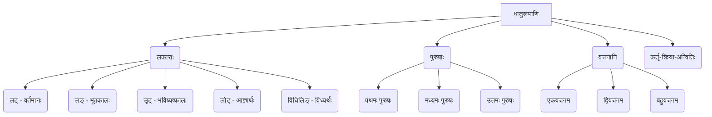

# Class 9 Sanskrit - Abhyasvan Chapter 111
**Language:** संस्कृतम्

```markdown
# [कक्षा ९] अभ्यासवान् - अध्यायः १११ - धातुरूपाणि

## 🌟 मुख्याः अवधारणाः (Core Concepts) 📊

अस्मिन् पाठे वयं संस्कृतभाषायाः महत्त्वपूर्णम् अङ्गं "धातुरूपाणि" पठामः। धातवः क्रियायाः मूलरूपाणि भवन्ति। तेषां रूपाणि कालानुसारं, पुरुषानुसारं, वचनानुसारं च परिवर्तन्ते।

1.  **धातवः**: क्रियायाः मूलम् (यथा - पठ्, गम्, भू, अस्)।
2.  **लकाराः (कालाः/अर्थाः)**: क्रियायाः कालं वा भावं सूचयन्ति।
    *   **लट् लकारः**: वर्तमानकालः (Present Tense) - यथा, सः **पठति**।
    *   **लङ् लकारः**: भूतकालः (Past Tense) - यथा, त्वं **आसीः**।
    *   **लृट् लकारः**: भविष्यत्कालः (Future Tense) - यथा, आवां **चलिष्यावः**।
    *   **लोट् लकारः**: आज्ञार्थः/आदेशार्थः (Imperative Mood) - यथा, अत्र मा **तिष्ठ**।
    *   **विधिलिङ् लकारः**: सम्भावनार्थः/विध्यर्थः (Potential Mood) - यथा, अद्य वर्षा **भवेत्**।
3.  **पुरुषाः**: क्रियायाः कर्तारं निर्दिशन्ति।
    *   **प्रथमः पुरुषः**: सः, सा, तत्, ते, ताः, तानि (He, She, It, They)
    *   **मध्यमः पुरुषः**: त्वम्, युवाम्, यूयम् (You)
    *   **उत्तमः पुरुषः**: अहम्, आवाम्, वयम् (I, We)
4.  **वचनानि**: कर्तुः सङ्ख्यां सूचयन्ति।
    *   **एकवचनम्**: एकः कर्ता।
    *   **द्विवचनम्**: द्वौ कर्तारौ।
    *   **बहुवचनम्**: बहवः कर्तारः।
5.  **कर्तृ-क्रिया-अन्वितिः**: वाक्ये कर्तृपदस्य पुरुष-वचनानुसारम् एव क्रियापदस्य (धातुरूपस्य) प्रयोगः भवति।



## 📘 प्रमुखशिक्षणबिन्दवः (Key Learnings) 📈

1.  **लकाराणां परिचयः**: संस्कृते क्रियापदानि भिन्न-भिन्न-लकारेषु प्रयुज्यन्ते। पञ्च प्रमुखाः लकाराः (लट्, लङ्, लृट्, लोट्, विधिलिङ्) विभिन्नकालान् अर्थान् च बोधयन्ति।
2.  **पुरुष-वचन-ज्ञानम्**: प्रत्येकस्मिन् लकारे क्रियापदानि त्रिषु पुरुषेषु (प्रथमः, मध्यमः, उत्तमः) त्रिषु वचनेषु (एकवचनम्, द्विवचनम्, बहुवचनम्) च भवन्ति।
3.  **कर्तृ-क्रिया-सम्बन्धः**: वाक्यस्य कर्तृपदं यस्मिन् पुरुषे वचने च भवति, क्रियापदमपि तस्मिन्नेव पुरुषे वचने च प्रयोक्तव्यम्। यथा -
    *   **सः** (प्र.पु., ए.व.) **पठति** (प्र.पु., ए.व.)।
    *   **त्वं** (म.पु., ए.व.) **पठसि** (म.पु., ए.व.)।
    *   **अहं** (उ.पु., ए.व.) **पठामि** (उ.पु., ए.व.)।

4.  **पठ्-धातोः लट्लकारस्य उदाहरणम्**: (अनेन कर्तृ-क्रिया-अन्वितिः स्पष्टा भवति)

    | पुरुषः      | एकवचनम् (कर्ता) | क्रियापदम् | द्विवचनम् (कर्तारौ) | क्रियापदम् | बहुवचनम् (कर्तारः) | क्रियापदम् |
    | :---------- | :-------------- | :-------- | :----------------- | :-------- | :----------------- | :-------- |
    | **प्रथमः**  | सः/सा/तत्      | पठति     | तौ/ते/ते           | पठतः     | ते/ताः/तानि        | पठन्ति    |
    | **मध्यमः** | त्वम्            | पठसि     | युवाम्             | पठथः     | यूयम्              | पठथ      |
    | **उत्तमः**  | अहम्            | पठामि    | आवाम्             | पठावः    | वयम्               | पठामः     |

## 🧩 सक्रिय-अधिगमः (Active Learning)

*   **गतिविधिः (Activity) 🔍**: `वाक्येषु क्रियापदानाम् अन्वेषणम्` - कस्याञ्चित् लघुकथायां वा समाचारपत्रस्य अनुच्छेदे (यथा पाठे रेलदुर्घटनायाः वर्णनम् अस्ति) विभिन्नलकारेषु प्रयुक्तानि क्रियापदानि चिनुत, तेषां लकारं, पुरुषं, वचनं च लिखत। (Identify verb forms in a short story or news clipping, noting their tense/mood, person, and number).
*   **चर्चा (Discussion) 🌍**: `शुद्धक्रियापदप्रयोगस्य महत्त्वम्` - अशुद्धक्रियापदप्रयोगेण वाक्यस्य अर्थः कथं परिवर्तते? स्पष्ट-सम्प्रेषणाय (clear communication) शुद्धधातुरूपाणां प्रयोगः कियत् आवश्यकः? उदाहरणैः सह चर्चां कुरुत। (Discuss how incorrect verb forms change meaning and the importance of correct forms for clear communication).

## 📝 मूल्याङ्कनसिद्धता (Assessment Prep) 📝

*   **अभ्यासप्रकाराः**:
    *   `रिक्तस्थानपूर्तिः`: कोष्ठके दत्तस्य धातोः उचितं लकाररूपं चित्वा रिक्तस्थानानि पूरयत। (Fill in the blanks with the correct verb form).
    *   `अशुद्धिशोधनम्`: प्रदत्तेषु वाक्येषु वा अनुच्छेदेषु अशुद्धानि क्रियापदानि शुद्धानि कुरुत। (Correct the incorrect verb forms in given sentences/paragraphs).
    *   `वाक्यनिर्माणम्`: प्रदत्तैः क्रियापदैः अर्थपूर्णानि वाक्यानि रचयत। (Construct meaningful sentences using given verb forms).
    *   `तालिका-विश्लेषणम्`: पठ्-धातोः लट्लकारस्य तालिका इव अन्येषां धातूनां लकाराणां च तालिकाः अभ्यस्यत, कर्तृ-क्रिया-अन्वितिं च अवगच्छत। (Analyze conjugation tables like the one provided for पठ् धातु).

*   **उदाहरणानि**: पाठ्यपुस्तके दत्ताः अभ्यासप्रश्नाः (1, 2, 3, 4) अस्याः सिद्धतायाः उत्तमानि उदाहरणानि सन्ति।

## 🌏 भारतीयसन्दर्भः (Bharatiya Context) 📊

*   संस्कृतधातुरूपाणां ज्ञानं भारतीयभाषाणां (यथा हिन्दी, मराठी, गुजराती, बङ्गला इत्यादयः) व्याकरणस्य अवगमने सहायकं भवति, यतः तासु अनेकाः शब्दाः क्रियारूपाणि च संस्कृतात् एव आगतानि सन्ति।
*   प्राचीनभारतीयग्रन्थेषु (वेदाः, उपनिषदः, पुराणानि, काव्यानि) क्रियापदानां विविधाः प्रयोगाः दृश्यन्ते। धातुरूपाणां सम्यक् ज्ञानेन एव वयं तेषां ग्रन्थानाम् अर्थं सम्यक्तया अवगन्तुं शक्नुमः।
*   पाठ्ये दत्ताः अभ्यासाः (यथा रेलदुर्घटनाविषयकः अभ्यासः) दर्शयन्ति यत् संस्कृतव्याकरणस्य नियमाः आधुनिकविषयाणां वर्णने अपि तथैव प्रयोज्याः सन्ति। एतेन व्याकरणस्य सार्वकालिकी प्रासङ्गिकता ज्ञायते।

```