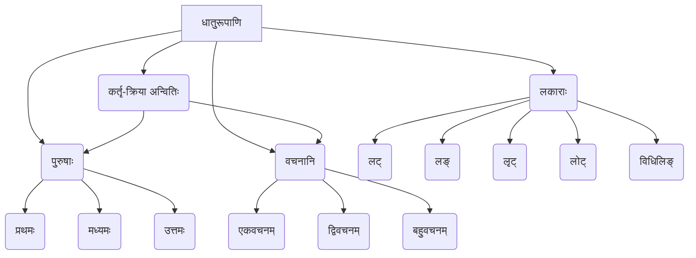

# Class 9 Sanskrit - Abhyasvan Chapter 111
**Language:** संस्कृतम्

```markdown
# [कक्षा ९] अभ्यासवान् - अध्यायः १११

## 🌟 मुख्याः अवधारणाः (Core Concepts)
अत्र संस्कृतभाषायाः क्रियापदानां (धातुरूपाणाम्) संरचनायाः प्रयोगस्य च विस्तृतं ज्ञानं दीयते।

**१. धातुरूपाणि:**
   - **अर्थः:** क्रियायाः मूलरूपं 'धातुः' इति कथ्यते। धातोः विभिन्नकालेषु पुरुषेषु वचनेषु च यानि रूपाणि भवन्ति, तानि 'धातुरूपाणि' इति उच्यन्ते।
   - **महत्त्वम्:** वाक्येषु क्रियायाः सम्यक् प्रयोगाय धातुरूपाणां ज्ञानम् अनिवार्यम्।

**२. लकाराः (कालाः/अर्थाः):**
   - संस्कृते मुख्यतः दश लकाराः सन्ति, परन्तु अस्मिन् पाठे पञ्च प्रमुखाः लकाराः वर्णिताः सन्ति।
   - **पञ्च प्रमुखाः लकाराः:**
     *   **लट् लकारः:** वर्तमानकालः (Present Tense) - यथा, पठति (He/She reads)
     *   **लङ् लकारः:** अनद्यतन-भूतकालः (Past Tense, not of today) - यथा, अपठत् (He/She read)
     *   **लृट् लकारः:** सामान्य-भविष्यत्कालः (Future Tense) - यथा, पठिष्यति (He/She will read)
     *   **लोट् लकारः:** आज्ञार्थः/अनुज्ञार्थः (Imperative Mood - command/request) - यथा, पठतु (Let him/her read)
     *   **विधिलिङ् लकारः:** विध्यर्थः/संभावनार्थः (Potential Mood - should/may/might) - यथा, पठेत् (He/She should read)

**३. पुरुषः (Person):**
   - क्रियापदं यस्य कृते प्रयुज्यते, सः पुरुषः।
   - **त्रयः पुरुषाः:**
     *   **प्रथमः पुरुषः (Third Person):** सः, सा, तत्, ते, ताः, तानि, रामः, सीता इत्यादयः।
     *   **मध्यमः पुरुषः (Second Person):** त्वम्, युवाम्, यूयम्।
     *   **उत्तमः पुरुषः (First Person):** अहम्, आवाम्, वयम्।

**४. वचनम् (Number):**
   - कर्तृपदस्य संख्यानुसारं क्रियापदस्य वचनं भवति।
   - **त्रीणि वचनानि:**
     *   **एकवचनम् (Singular):** एकस्य कृते।
     *   **द्विवचनम् (Dual):** द्वयोः कृते।
     *   **बहुवचनम् (Plural):** त्रिभ्यः अधिकेभ्यः वा कृते।

**५. कर्तृ-क्रिया अन्वितिः (Subject-Verb Agreement):**
   - वाक्ये कर्तृपदस्य पुरुषः वचनं च यत् भवति, क्रियापदस्य (धातोः) अपि स एव पुरुषः वचनं च भवति।

📊 **अवधारणा-पदानुक्रमः (Concept Hierarchy):**


## 📘 मुख्याः शिक्षणबिन्दवः (Key Learnings)

**१. लकाराणां परिचयः प्रयोगश्च:**
   - **लट् (वर्तमानकालः):** अधुना या क्रिया प्रचलति। यथा - बालकः **पठति**। वयं **पठामः**।
   - **लङ् (भूतकालः):** या क्रिया पूर्वम् अभवत्। यथा - ह्यः त्वं कुत्र **आसीः**? रामः पाठम् **अपठत्**।
   - **लृट् (भविष्यत्कालः):** या क्रिया आगामिकाले भविष्यति। यथा - श्वः आवाम् आपणं **गमिष्यावः**। सः लेखं **लेखिष्यति**।
   - **लोट् (आज्ञा/प्रार्थना):** आज्ञादाने, निर्देशने, प्रार्थनायां च प्रयुज्यते। यथा - त्वं सत्यं **वद**। सर्वे सुखिनः **भवन्तु**। अत्र मा **तिष्ठ**।
   - **विधिलिङ् (विधिः/सम्भावना):** 'चाहिए' (should) इत्यर्थे अथवा सम्भावनायाम् (may/might)। यथा - छात्रैः ध्यानपूर्वकं **पठेयुः**। अद्य वर्षा **भवेत्**।

**२. पुरुष-वचन-अनुसारं क्रियारूपम् (पठ् धातुः, लट् लकारः):**
   - कर्तृपदानुसारं क्रियापदस्य परिवर्तनम् अधः तालिकायां दर्शितम् अस्ति।

   📈 **तालिका: पठ् धातोः लट् लकारे रूपाणि**
   | पुरुषः      | एकवचनम् (कर्तृपदम्) | द्विवचनम् (कर्तृपदम्) | बहुवचनम् (कर्तृपदम्) |
   | :---------- | :------------------- | :-------------------- | :------------------- |
   | **प्रथमः**  | पठति (सः/सा/तत्)    | पठतः (तौ/ते/ते)       | पठन्ति (ते/ताः/तानि) |
   | **मध्यमः** | पठसि (त्वम्)         | पठथः (युवाम्)         | पठथ (यूयम्)          |
   | **उत्तमः**  | पठामि (अहम्)         | पठावः (आवाम्)         | पठामः (वयम्)         |

**३. सामान्यनियमः:**
   - `एवमेव सर्वेषु धातुषु सर्वेषु लकारेषु च क्रियायाः (धातुरूपाणां) प्रयोगः भवति।` अर्थात्, यथा 'पठ्' धातोः रूपाणि भवन्ति, तथैव अन्येषाम् धातूनाम् अपि सर्वेषु लकारेषु, पुरुषेषु, वचनेषु च रूपाणि भवन्ति (गणानुसारं परिवर्तनं भवति)।

## 🧩 सक्रिय-अधिगमः (Active Learning)

**१. क्रियाकलापः (Activity): शोध-आधारित-विश्लेषणम् 🔍**
   - **विषयः:** अभ्यास-पुस्तिकायां प्रदत्तस्य द्वितीय-अभ्यासस्य (रेलदुर्घटना-समाचारपत्रस्य) विश्लेषणम्।
   - **कार्यम्:**
     *   दत्तं समाचारपत्र-अंशं पठन्तु।
     *   तस्मिन् क्रियापदानाम् (धातुरूपाणाम्) अशुद्धीः चिनुत। (लकारः, पुरुषः, वचनम् इति दृष्ट्या)।
     *   अशुद्धान् पदान् शुद्धीकृत्य सम्पूर्णम् अंशं पुनः लिखन्तु।
     *   (उदाहरणम् - `ह्यः अहं समाचारपत्रे अपठम् यत्...` इति शुद्धम् रूपम्।)
   - **उद्देश्यम्:** भूतकालस्य (लङ् लकारस्य) प्रयोगे, कर्तृ-क्रिया-अन्वितौ च दक्षता प्राप्तुम्। (Bloom's: Analyzing, Applying)

**२. चर्चा (Discussion): वास्तविक-जगति प्रभावस्य आलोचनात्मक-विश्लेषणम् 🌍**
   - **विषयः:** संस्कृते क्रियापदानां शुद्धप्रयोगस्य महत्त्वम्।
   - **चर्चा-बिन्दवः:**
     *   यदि क्रियापदस्य लकारः, पुरुषः, अथवा वचनम् अशुद्धं भवति, तर्हि अर्थस्य कीदृशः अनर्थः भवितुम् अर्हति? (द्वितीय-अभ्यासात् उदाहरणानि दत्त्वा चर्चां कुर्वन्तु)।
     *   स्पष्ट-संवहनाय व्याकरणस्य, विशेषतः धातुरूपाणां, शुद्धता कियत् आवश्यकी?
     *   संस्कृत-व्याकरणस्य (यथा धातुरूपाणि) सुव्यवस्थित-प्रकृतिः भाषायाः वैज्ञानिकतां कथं प्रदर्शयति?
   - **उद्देश्यम्:** व्याकरण-शुद्धेः महत्त्वं मूल्याङ्कयितुम्, भाषायाः संरचनां च अवगन्तुम्। (Bloom's: Evaluating)

**३. रचनम् (Creation):**
   - **कार्यम्:** 'गम्' (गच्छ्) अथवा 'भू' (भव्) धातोः पञ्चसु प्रमुखेषु लकारेषु (लट्, लङ्, लृट्, लोट्, विधिलिङ्) सर्वेषु पुरुषेषु वचनेषु च रूपाणि लिखन्तु, यथा 'पठ्' धातोः तालिका प्रदत्ता अस्ति।
   - **उद्देश्यम्:** धातुरूपाणां स्मरणं प्रयोगं च अभ्यसितुम्, तालिका-निर्माण-कौशलं वर्धयितुम्। (Bloom's: Creating, Applying)

## 📝 मूल्याङ्कन-सिद्धता (Assessment Prep)

*   **अभ्यास-प्रश्नाः:**
    *   रिक्तस्थानपूर्तिः (Fill in the blanks): कोष्ठके दत्तस्य धातोः उचितं लकार-पुरुष-वचन-रूपं योजयित्वा वाक्यानि पूरयन्तु (यथा अभ्यासः १, ३)।
    *   अशुद्धि-संशोधनम् (Error Correction): दत्तेषु वाक्येषु अथवा अनुच्छेदेषु क्रियापदानाम् अशुद्धीः संशोधयन्तु (यथा अभ्यासः २)।
    *   वाक्यनिर्माणम् (Sentence Construction): प्रदत्तैः क्रियापदैः सार्थकानि वाक्यानि रचयन्तु (यथा अभ्यासः ४)।
*   **विशिष्ट-अभ्यासः:**
    *   **प्रकरण-अध्ययनम् (Case Studies):** रेलदुर्घटना-समाचारपत्रस्य विश्लेषणं (अभ्यासः २) एकं प्रकरण-अध्ययनम् अस्ति। ईदृशानाम् अन्य-अनुच्छेदानाम् विश्लेषणस्य अभ्यासः करणीयः।
    *   **तालिका/आरेखम् (Diagrams/Tables):** विभिन्नानां धातूनां (यथा - पठ्, गम्, भू, कृ, अस्) पञ्चलकारेषु रूपाणां तालिकाः निर्मातुं अभ्यस्यन्तु। कर्तृ-क्रिया-अन्वितिं दर्शयितुं रेखाचित्राणि अपि उपयुक्तानि भवितुम् अर्हन्ति।

## 🌏 भारतीय-सन्दर्भः (Bharatiya Context)

*   **भाषा-परम्परा:** संस्कृतं भारतस्य प्राचीनतमा शास्त्रीया भाषा अस्ति। अस्याः व्याकरणं, विशेषतः पाणिनेः अष्टाध्यायी, अतीव सुव्यवस्थितं वैज्ञानिकं च अस्ति। धातुरूपाणां व्यवस्था अस्याः वैज्ञानिकतायाः उत्कृष्टम् उदाहरणम् अस्ति।
*   **पाणिनीय-व्याकरणम्:** महर्षिणा पाणिनिना धातूनां वर्गीकरणं (गण-व्यवस्था), प्रत्ययानां विधानं, रूपाणां सिद्धिप्रक्रिया च सूत्रेषु निबद्धा। इयं व्यवस्था सहस्राधिकवर्षेभ्यः भाषायाः संरचनां स्थिरं शुद्धं च स्थापयति।
*   **सांस्कृतिक-महत्त्वम्:** वेदाः, उपनिषदः, रामायणं, महाभारतम्, पुराणानि, काव्यानि च संस्कृतभाषायामेव रचितानि। एतेषु ग्रन्थेषु धातुरूपाणां विविधः समृद्धः च प्रयोगः दृश्यते, यः भारतीय-चिन्तनस्य संस्कृतेश्च अभिव्यक्तये महत्त्वपूर्णः अस्ति। धातुरूपाणां सम्यक् ज्ञानेन एव एतेषां ग्रन्थानाम् अर्थावबोधः सुकरः भवति।

*(**टिप्पणी:** यद्यपि निर्देशे "National economic/social data 📊" इत्यस्य उल्लेखः आसीत्, तथापि प्रदत्तः पाठ्यांशः पूर्णतया व्याकरण-सम्बद्धः अस्ति, आर्थिक-सामाजिक-आंकडैः सह तस्य प्रत्यक्षः सम्बन्धः नास्ति। अतः अत्र भारतीय-सन्दर्भः भाषायाः व्याकरणस्य च परम्परया सह सम्बद्धः कृतः अस्ति।)*
```