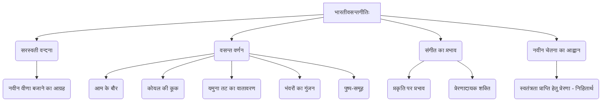
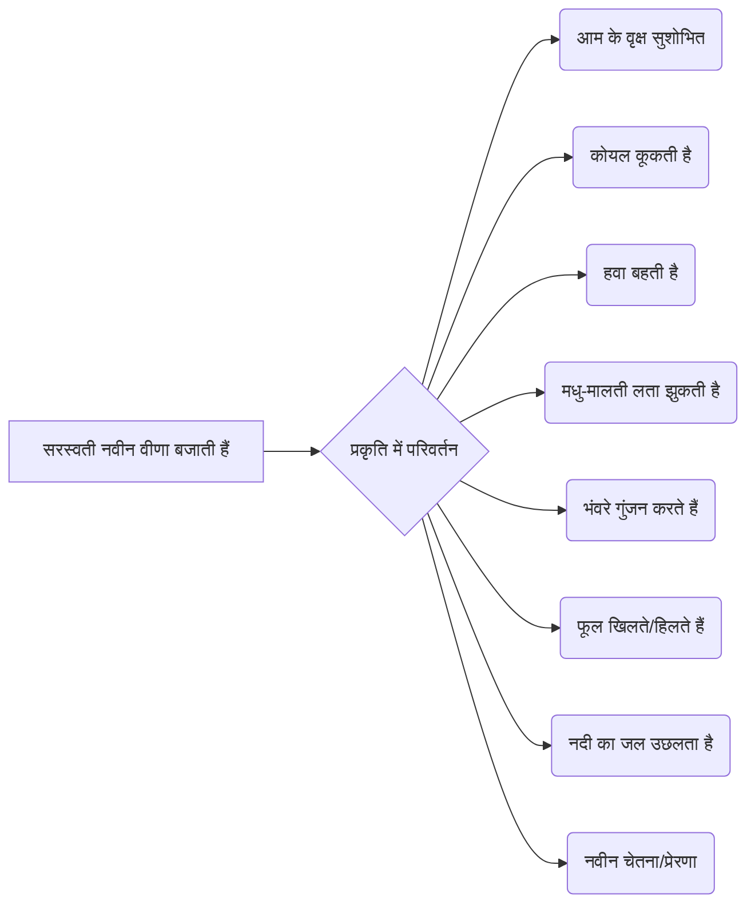

# Class 9 Sanskrit - Shemushi Chapter 101
**Language:** हिंदी

```markdown
# [कक्षा 9] शेमुषी - अध्याय 101 (भारतीवसन्तगीतिः)

*(**नोट:** यह सारांश पाठ्यपुस्तक 'शेमुषी भाग 1' के **प्रथम पाठ (अध्याय 1) "भारतीवसन्तगीतिः"** पर आधारित है, जैसा कि प्रदान की गई सामग्री में वर्णित है।)*

## 🌟 मुख्य अवधारणाएँ (Core Concepts)

यह पाठ, "भारतीवसन्तगीतिः", एक प्रेरणादायक संस्कृत गीत है। इसकी मुख्य अवधारणाएँ इस प्रकार हैं:

1.  **सरस्वती वन्दना:**
    *   कवि द्वारा ज्ञान और कला की देवी सरस्वती से प्रार्थना।
    *   नवीन वीणा बजाने का आग्रह।
2.  **वसन्त ऋतु का सौन्दर्य वर्णन:**
    *   प्रकृति में वसन्त के आगमन से होने वाले मनमोहक परिवर्तन।
    *   आम के मंजर (बौर), कोयल की कूक, यमुना तट की हवा, भंवरों का गुंजन, फूलों का खिलना।
3.  **संगीत का प्रभाव:**
    *   वीणा के मधुर स्वर का प्रकृति और प्राणियों पर प्रभाव।
    *   संगीत से चेतना और प्रेरणा जगाने की शक्ति।
4.  **नवीनता और प्रेरणा का आह्वान:**
    *   ऐसी वीणा बजाने की प्रार्थना जो नई चेतना लाए।
    *   (ऐतिहासिक संदर्भ) स्वतंत्रता संग्राम के लिए प्रेरणा जगाने का भाव।
5.  **प्रकृति और कला का संबंध:**
    *   प्रकृति का सौन्दर्य कला (संगीत) को प्रेरित करता है।
    *   कला (संगीत) प्रकृति के सौन्दर्य को और बढ़ाती है।

📊 **अवधारणा पदानुक्रम (Concept Hierarchy):**



## 📘 प्रमुख शिक्षाएँ (Key Learnings)

इस गीत के माध्यम से कवि वसन्त ऋतु के सौन्दर्य का वर्णन करते हुए देवी सरस्वती से एक नवीन, प्रेरणादायक धुन बजाने की प्रार्थना करते हैं।

1.  **प्रथम पद:** कवि सरस्वती से आग्रह करते हैं कि वे ऐसी नवीन वीणा बजाएँ और सुन्दर नीतियों से युक्त मधुर गीत गाएँ। इस वसन्त ऋतु में मीठे आमों की मंजरियों से पीली हो गई रसीले आम के पेड़ों की पंक्तियाँ सुशोभित हो रही हैं और मनमोहक कूक वाली कोयलों के समूह सुन्दर लग रहे हैं।
2.  **द्वितीय पद:** यमुना नदी के तट पर, जहाँ बेंत की लताएँ हैं, जल-कणों से युक्त हवा धीरे-धीरे बह रही है। ऐसी सुन्दरता को देखकर और फूलों से झुकी हुई मधु-मालती लता को देखकर, हे सरस्वती! आप नवीन वीणा बजाओ।
3.  **तृतीय पद:** चन्दन की सुगंधित हवा से स्पर्श किए गए मनमोहक पत्तों वाले वृक्षों, फूलों के गुच्छों और सुन्दर कुंजों पर काले भंवरों की गुंजार करती हुई पंक्ति को देखकर, हे सरस्वती! आप नवीन वीणा बजाओ।
4.  **चतुर्थ पद:** आपकी ओजस्वी वीणा को सुनकर लताओं के अत्यन्त शांत फूल भी हिल उठें और नदियों का निर्मल जल क्रीड़ा करता हुआ उछल पड़े। हे सरस्वती! ऐसी नवीन वीणा बजाओ।

📈 **वीणा के स्वर का प्रकृति पर प्रभाव (Diagram):**


*यह चित्र दर्शाता है कि कैसे सरस्वती की वीणा के बजने से वसन्त ऋतु की प्रकृति जीवंत और मनमोहक हो उठती है, जो एक नई चेतना का प्रतीक है।*

## 🧩 सक्रिय अधिगम (Active Learning)

1.  **गतिविधि: शोध-आधारित अध्ययन 🔍**
    *   **विषय:** कवि पं. जानकी वल्लभ शास्त्री के जीवन और उनकी अन्य रचनाओं (विशेषकर 'काकली' संग्रह) पर शोध करें। पता लगाएँ कि उनकी कविताओं में प्रकृति और संगीत का क्या महत्व है।
    *   **प्रक्रिया:** पुस्तकालय या इंटरनेट का उपयोग करके जानकारी एकत्र करें और एक संक्षिप्त रिपोर्ट तैयार करें।
    *   **वैकल्पिक:** वसन्त ऋतु पर लिखी गई अन्य संस्कृत या हिन्दी कविताओं (जैसे निराला या मैथिलीशरण गुप्त की कविताएँ) को खोजें और उनकी तुलना 'भारतीवसन्तगीतिः' से करें।

2.  **चर्चा: आलोचनात्मक विश्लेषण 🌍**
    *   **विषय 1:** इस गीत के ऐतिहासिक संदर्भ (स्वाधीनता संग्राम की पृष्ठभूमि) पर चर्चा करें। क्या आपको लगता है कि संगीत और कविता समाज में परिवर्तन लाने या लोगों को प्रेरित करने में भूमिका निभा सकते हैं? कैसे?
    *   **विषय 2:** कविता में वर्णित प्रकृति के विभिन्न तत्वों (आम, कोयल, यमुना, भंवरे आदि) के सौन्दर्य और उनके प्रतीकात्मक अर्थ पर चर्चा करें। आज के समय में प्रकृति का हमारे जीवन में क्या महत्व है?

## 📝 मूल्यांकन तैयारी (Assessment Prep)

इस पाठ से परीक्षा में निम्नलिखित प्रकार के प्रश्न पूछे जा सकते हैं:

1.  **शब्दार्थ:** पाठ में आए कठिन संस्कृत शब्दों के हिन्दी अर्थ (जैसे - निनादय, मृदुम्, मञ्जरी, पिञ्जरीभूतमालाः, लसन्ति, सरसाः, रसालाः, कलापाः, काकली, सनीरे, समीरे, कलिन्दात्मजायाः, सवानीरतीरे, नताम्, मधुमाधवीनाम्, ललितपल्लवे, पुष्पपुञ्जे, मलयमारुतोच्चुम्बिते, मञ्जुकुञ्जे, स्वनन्तीम्, ततिम्, प्रेक्ष्य, मलिनाम्, अलीनाम्, सुमम्, शान्तिशीलम्, उच्छलेत्, कान्तसलिलम्, सलीलम्, आकर्ण्य)।
2.  **एक पद/पूर्ण वाक्य में उत्तर:** कविता की विषय-वस्तु पर आधारित प्रश्न (जैसे - कवि किसे सम्बोधित कर रहा है? कवि कैसी वीणा बजाने की प्रार्थना करता है? वसन्त में क्या होता है?)।
3.  **पद्यांश आधारित प्रश्न:** कविता का कोई अंश देकर उस पर आधारित प्रश्न (अर्थ, विशेषण-विशेष्य, कर्ता-क्रिया आदि)।
4.  **अन्वय और भावार्थ:** श्लोकों का अन्वय लिखना और उनका हिन्दी में भावार्थ स्पष्ट करना।
5.  **विलोम/पर्यायवाची शब्द:** पाठ में आए शब्दों के विलोम या पर्यायवाची शब्द लिखना।
6.  **वाक्य निर्माण:** दिए गए संस्कृत शब्दों का प्रयोग करके वाक्य बनाना।
7.  **उच्च स्तरीय प्रश्न:**
    *   कविता का केन्द्रीय भाव या संदेश अपने शब्दों में लिखें।
    *   कवि ने सरस्वती से 'नवीन' वीणा बजाने के लिए क्यों कहा है? 'नवीन' से क्या तात्पर्य हो सकता है? (Bloom's: Analysis/Evaluation)
    *   कविता में वर्णित प्रकृति के सौन्दर्य का अपने शब्दों में वर्णन करें या उससे प्रेरित होकर एक छोटा अनुच्छेद लिखें। (Bloom's: Creation)

📝 **तैयारी के लिए सुझाव:**
*   कविता को लय के साथ पढ़ें और उसका अर्थ समझें।
*   सभी शब्दार्थ याद करें।
*   श्लोकों का अन्वय और भावार्थ लिखने का अभ्यास करें।
*   पाठ के अंत में दिए गए अभ्यास प्रश्नों को हल करें।
*   कविता के प्रतीकात्मक अर्थ और ऐतिहासिक संदर्भ को समझें।

## 🌏 भारतीय संदर्भ (Bharatiya Context)

यह कविता भारतीय संस्कृति और परंपरा से गहराई से जुड़ी हुई है:

1.  **देवी सरस्वती:** ज्ञान, संगीत, कला और विद्या की देवी के रूप में सरस्वती की पूजा भारत में प्राचीन काल से होती आ रही है। वीणा उनका प्रमुख वाद्य यंत्र है।
2.  **वसन्त ऋतु:** भारत में वसन्त ऋतु (फरवरी-मार्च) को ऋतुराज माना जाता है। यह नई शुरुआत, उल्लास और प्रकृति के नव-सौन्दर्य का प्रतीक है। कविता में वर्णित आम के बौर, कोयल की कूक इसी ऋतु के परिचायक हैं।
3.  **प्रकृति वर्णन:** कविता में भारतीय प्रकृति के तत्व जैसे यमुना नदी (कलिन्दात्मजा), आम (रसालः), मालती लता (मधुमाधवी), भंवरे (अलि), कोयल (कोकिल) आदि का सुन्दर चित्रण है, जो भारतीय साहित्य और कला में बहुधा प्रयोग किए जाते हैं।
4.  **संगीत और काव्य:** भारतीय परंपरा में संगीत और काव्य का महत्वपूर्ण स्थान है। इन्हें ईश्वरीय आराधना, ज्ञान प्राप्ति और सामाजिक चेतना जगाने का माध्यम माना गया है।
5.  **ऐतिहासिक चेतना:** जैसा कि पाठ में संकेत दिया गया है, यह गीत स्वाधीनता संग्राम की पृष्ठभूमि में लिखा गया था। भारत के स्वतंत्रता आंदोलन में कविताओं और गीतों ने लोगों में राष्ट्रीयता की भावना जगाने और उन्हें प्रेरित करने में महत्वपूर्ण भूमिका निभाई। यह गीत भी उसी परंपरा का हिस्सा है, जो कला के माध्यम से नव-जागरण का आह्वान करता है।

*(**नोट:** इस पाठ का संबंध सीधे तौर पर आर्थिक आंकड़ों (Economic Data) से नहीं है, बल्कि यह साहित्यिक, सांस्कृतिक और ऐतिहासिक संदर्भों से जुड़ा है।)*
```