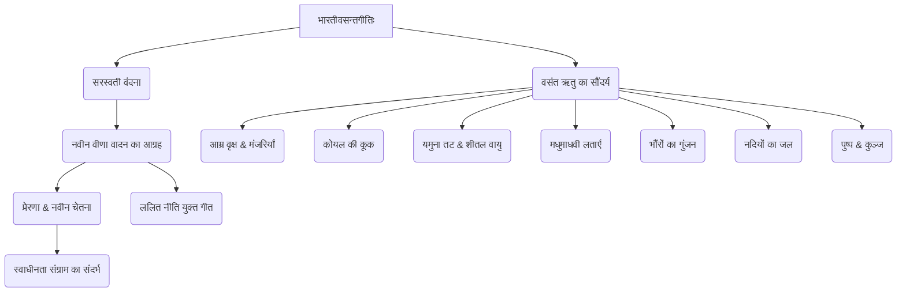

# Class 9 Sanskrit - Shemushi Chapter 101
**Language:** हिंदी

```markdown
# कक्षा 9 शेमुषी - पाठ 1: भारतीवसन्तगीतिः

## 🌟 मुख्य अवधारणाएँ (Core Concepts)

इस पाठ का केंद्र बिंदु देवी सरस्वती की वंदना है, जिसमें वसंत ऋतु की सुंदरता से प्रेरित होकर कवि उनसे एक नई, प्रेरणादायक वीणा बजाने का आग्रह करते हैं।

1.  **सरस्वती वंदना:**
    *   ज्ञान और कला की देवी सरस्वती का आवाहन।
    *   'वाणी' (सरस्वती का एक नाम) के रूप में संबोधन।
2.  **नवीन वीणा का आग्रह:**
    *   ऐसी वीणा बजाने की प्रार्थना जो नई चेतना जगाए।
    *   संगीत के माध्यम से प्रेरणा और परिवर्तन की कामना।
3.  **वसंत ऋतु का सौंदर्य चित्रण:**
    *   **प्रकृति के तत्व:**
        *   आम के वृक्ष (रসাল): मंजरियों से पीले (पिञ्जरीभूत) और रसपूर्ण (सरस)।
        *   कोयल (कोकिल): मधुर कूक (काकली)।
        *   वायु (समीर): यमुना (कलिन्दात्मजा) के तट पर बेंत (सवानीर) से घिरे स्थान पर जलकणों से युक्त (सनीरे) होकर धीरे-धीरे (मन्दमन्दम्) बहना।
        *   लताएँ: फूलों से झुकी हुई मधुमाधवी लताएँ, सुन्दर पत्तों (ललितपल्लव) वाले पौधे, पुष्पों के गुच्छे (पुष्पपुञ्ज), सुन्दर कुञ्ज (मञ्जुकुञ्ज)।
        *   भौंरे (अलि): काले (मलिन) भौंरों की गुंजार करती पंक्तियाँ (ध्वनन्तीं ततिम्)।
        *   नदियाँ: वीणा सुनकर नदियों का सुन्दर जल (कान्तसलिलम्) क्रीड़ा करता हुआ (सलीलम्) उछलना।
        *   फूल (सुमम्): लताओं के शांत फूल (शान्तिशीलम् सुमम्) का हिल उठना।
    *   **स्थान:** यमुना नदी का तट, मलय पर्वत से आने वाली हवा (मलयमारुत) से स्पर्शित कुञ्ज।
4.  **गीत का भाव:**
    *   ललित नीति से युक्त (ललित-नीति-लीनाम्) मधुर गीत गाने का आग्रह।
    *   ओजस्वी (अदीनाम्) वीणा की ध्वनि का प्रभाव।
5.  **कवि और संदर्भ:**
    *   कवि: पं. जानकी वल्लभ शास्त्री।
    *   संग्रह: 'काकली'।
    *   पृष्ठभूमि: स्वाधीनता संग्राम, नवीन चेतना का आवाहन।

📊 **अवधारणा पदानुक्रम:**


## 📘 मुख्य शिक्षाएँ (Key Learnings)

इस गीतिका में कवि प्रकृति के मनमोहक दृश्यों को देखकर देवी सरस्वती से ऐसी वीणा बजाने का आग्रह करते हैं जिससे सम्पूर्ण प्रकृति और जनमानस में एक नई चेतना का संचार हो।

1.  **श्लोक 1:** हे सरस्वती (वाणि)! नवीन वीणा बजाओ और सुन्दर नीतियों से पूर्ण मधुर गीत गाओ। इस वसंत ऋतु में मधुर मंजरियों से पीली हो गई रसभरे आम के वृक्षों की पंक्तियाँ सुशोभित हो रही हैं और मनमोहक कूक वाली कोयलों के समूह सुन्दर लग रहे हैं।
    *   **मुख्य बिन्दु:** वसंत में आम और कोयल का सौंदर्य, नवीन वीणा और मधुर गीत का आग्रह।
2.  **श्लोक 2:** यमुना नदी के बेंत की लताओं से घिरे तट पर, जल-बिन्दुओं से युक्त हवा के धीरे-धीरे बहने पर, फूलों से झुकी हुई मधुमाधवी लता को देखकर, हे सरस्वती! नवीन वीणा बजाओ।
    *   **मुख्य बिन्दु:** यमुना तट का दृश्य, शीतल मंद पवन, झुकी हुई लताएँ।
3.  **श्लोक 3:** मलय पर्वत की वायु से स्पर्श किए गए सुन्दर पत्तों वाले वृक्षों पर, फूलों के गुच्छों पर तथा सुन्दर कुञ्जों पर गुंजार करते हुए काले भौंरों की पंक्ति को देखकर, हे सरस्वती! नवीन वीणा बजाओ।
    *   **मुख्य बिन्दु:** मलय पवन का स्पर्श, वृक्ष, पुष्प, कुञ्ज और भौंरों का गुंजन।
4.  **श्लोक 4:** तुम्हारी ओजस्वी वीणा को सुनकर लताओं के अत्यंत शांत पुष्प हिल उठें और नदियों का मनमोहक जल क्रीड़ा करता हुआ उछल पड़े। हे सरस्वती! नवीन वीणा बजाओ।
    *   **मुख्य बिन्दु:** वीणा के ओजस्वी स्वर का प्रभाव - शांत पुष्पों का हिलना, नदियों के जल का उछलना।

📈 **भाव प्रवाह:**
```mermaid
graph LR
    A[प्रकृति का सौंदर्य (वसंत)] --> B(कवि की प्रेरणा);
    B --> C(सरस्वती से आग्रह);
    C --> D(नवीन वीणा वादन);
    D --> E(ओजस्वी/मधुर संगीत);
    E --> F(प्रकृति में स्पंदन);
    E --> G(जनमानस में नवीन चेतना);
    F --> H(फूलों का हिलना, नदियों का उछलना);
    G --> I(स्वाधीनता हेतु प्रेरणा);
```

## 🧩 सक्रिय अधिगम (Active Learning)

*   **गतिविधि: पद्यांश विश्लेषण (Verse Analysis) 🔍**
    *   छात्र समूहों में विभाजित होकर कविता के किसी एक पद्यांश का चयन करें।
    *   उस पद्यांश में वर्णित प्राकृतिक सौंदर्य, प्रयुक्त विशेषणों, और कवि की भावनाओं का गहन विश्लेषण करें।
    *   विश्लेषण को चार्ट या प्रस्तुति के रूप में कक्षा में प्रस्तुत करें। (मूल्यांकन/Evaluation)
*   **चर्चा: कविता का संदर्भ और प्रासंगिकता (Context and Relevance) 🌍**
    *   इस गीतिका की रचना स्वाधीनता संग्राम की पृष्ठभूमि में हुई थी। चर्चा करें कि उस समय इस गीत ने लोगों को कैसे प्रेरित किया होगा?
    *   क्या इस कविता के भाव आज भी प्रासंगिक हैं? यदि हाँ, तो कैसे? यह आज के समाज को क्या संदेश देती है? (मूल्यांकन/Evaluation, सृजन/Creating)
*   **शोध कार्य (Research):**
    *   पं. जानकी वल्लभ शास्त्री के जीवन और उनकी अन्य रचनाओं (विशेषकर 'काकली' संग्रह) के बारे में जानकारी एकत्र करें।
    *   पाठ में उल्लिखित कवियों - सूर्यकांत त्रिपाठी 'निराला' और मैथिलीशरण गुप्त की समान भाव वाली कविताओं को खोजें और उनकी तुलना 'भारतीवसन्तगीतिः' से करें। (अनुप्रयोग/Applying, सृजन/Creating)

## 📝 मूल्यांकन तैयारी (Assessment Prep)

*   **पद्यांश आधारित प्रश्न:** दिए गए पद्यांशों का सप्रसंग हिन्दी में भावार्थ लिखना।
    *   *उदाहरण:* `वहति मन्दमन्दं सनीरे समीरे...` इस पंक्ति का संदर्भ सहित अर्थ स्पष्ट करें।
*   **वस्तुनिष्ठ प्रश्न:** एक पद में उत्तर देना, पूर्ण वाक्य में उत्तर देना, पर्यायवाची/विलोम शब्द चुनना।
    *   *उदाहरण:* कवि कां सम्बोधयति? (उत्तर: वाणीम्/सरस्वतीम्)
    *   *उदाहरण:* वसन्ते किं भवति? (उत्तर: वसन्ते सरसाः रसालाः लसन्ति, कोकिलाः कूजन्ति च।)
*   **विश्लेषणात्मक प्रश्न:**
    *   कवि सरस्वती से कैसी वीणा बजाने का आग्रह करते हैं और क्यों?
    *   कविता में वर्णित वसंत ऋतु के सौंदर्य का अपने शब्दों में वर्णन करें।
    *   'भारतीवसन्तगीतिः' कविता के माध्यम से कवि क्या संदेश देना चाहते हैं?
*   **रचनात्मक प्रश्न:** कविता के आधार पर प्रकृति का चित्र बनाना या वसंत ऋतु पर एक छोटा अनुच्छेद लिखना।

📝 **उदाहरण केस स्टडी/विश्लेषण:**
*   **केस:** श्लोक 4 (`तवाकर्ण्य वीणामदीनां नदीनाम्...`)
*   **विश्लेषण:**
    *   **वीणा का विशेषण:** 'अदीनाम्' (ओजस्विनी) - यह सामान्य मधुर संगीत से अलग, एक शक्तिशाली, प्रेरणादायक ध्वनि का सूचक है।
    *   **प्रभाव:**
        *   'शान्तिशीलम् सुमम् चलेत्' - शांत, स्थिर पुष्पों का भी हिल उठना (सूक्ष्म प्रभाव)।
        *   'नदीनां कान्तसलिलम् सलीलम् उच्छलेत्' - नदियों के जल का क्रीड़ापूर्वक उछलना (व्यापक, ऊर्जावान प्रभाव)।
    *   **निष्कर्ष:** कवि ऐसी वीणा चाहते हैं जो जड़-चेतन सबमें स्फूर्ति और उत्साह भर दे, जो शांति को भंग न करे बल्कि उसमें एक नई ऊर्जा का संचार करे। यह स्वाधीनता के लिए आवश्यक जोश और उत्साह का प्रतीक है।

## 🌏 भारतीय संदर्भ (Bharatiya Context)

यह कविता भारतीय संस्कृति, साहित्य और इतिहास से गहराई से जुड़ी हुई है।

1.  **सांस्कृतिक प्रतीक:**
    *   **सरस्वती:** ज्ञान, संगीत, कला और विद्या की देवी, जिनकी वंदना भारतीय परंपरा का अभिन्न अंग है।
    *   **वीणा:** सरस्वती का वाद्य यंत्र, भारतीय शास्त्रीय संगीत और ज्ञान का प्रतीक।
    *   **वसंत ऋतु:** भारत में ऋतुओं का राजा, नवीनता, उल्लास और प्रकृति के पुनर्जीवन का प्रतीक।
2.  **साहित्यिक संदर्भ:**
    *   **कवि:** पं. जानकी वल्लभ शास्त्री आधुनिक संस्कृत साहित्य के प्रमुख कवि हैं, जिन्होंने संस्कृत में गीत, गजल जैसी आधुनिक विधाओं को लोकप्रिय बनाया।
    *   **भाषा:** संस्कृत भाषा में रचित यह गीतिका भारत की प्राचीन साहित्यिक परंपरा की निरंतरता को दर्शाती है।
    *   **तुलना:** निराला ('वीणावादिनि वर दे') और मैथिलीशरण गुप्त ('भारतवर्ष में गूँजे हमारी भारती') जैसे हिंदी कवियों ने भी समान भावों (राष्ट्रप्रेम, सरस्वती वंदना) को व्यक्त किया है, जो भारतीय साहित्य में इस विषय की व्यापकता को दिखाता है।
3.  **ऐतिहासिक संदर्भ:**
    *   **स्वाधीनता संग्राम:** यह गीत उस काल में लिखा गया जब भारत अपनी स्वतंत्रता के लिए संघर्ष कर रहा था। इसका उद्देश्य संगीत के माध्यम से लोगों में राष्ट्रीय चेतना और स्वतंत्रता प्राप्ति के लिए उत्साह जगाना था। यह साहित्य की सामाजिक और राष्ट्रीय भूमिका का उदाहरण है।
4.  **प्राकृतिक चित्रण:**
    *   कविता में **यमुना नदी**, **आम के वृक्ष (रसाल)**, **मलय पर्वत से आने वाली वायु (मलयमारुत)** जैसे भारत-विशिष्ट प्राकृतिक तत्वों का उल्लेख है, जो भारतीय भौगोलिक और प्राकृतिक परिवेश को दर्शाता है।

📊 **राष्ट्रीय/सामाजिक डेटा (National/Social Data - प्रासंगिक रूप में):**
*   यह कविता दर्शाती है कि कैसे कला और साहित्य (जैसे संगीत और कविता) सामाजिक परिवर्तन और राष्ट्रीय आंदोलनों (जैसे भारतीय स्वतंत्रता संग्राम) में महत्वपूर्ण भूमिका निभा सकते हैं। यह सांस्कृतिक अभिव्यक्ति की शक्ति का प्रमाण है।
*   विभिन्न कवियों (संस्कृत और हिंदी) द्वारा समान विषयों का प्रयोग भारत की सांस्कृतिक और साहित्यिक एकता को दर्शाता है।
```