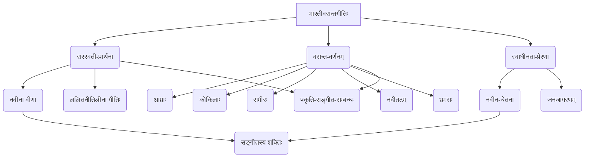

# Class 9 Sanskrit - Shemushi Chapter 101
**Language:** संस्कृतम्

```markdown
# कक्षा ९ - शेमुषी - प्रथमः पाठः - भारतीवसन्तगीतिः

## 🌟 मुख्यसंकल्पनाः (Core Concepts)

1.  **सरस्वती-वन्दना (Prayer to Saraswati)**
    *   नवीनां वीणां वादयितुं प्रार्थना (Request to play a new Veena)
    *   ललितनीतिलीनां मृदुं गीतिं गातुं प्रार्थना (Request to sing a gentle song based on beautiful principles)
2.  **वसन्तर्तोः सौन्दर्यवर्णनम् (Description of Spring's Beauty)** 🌸
    *   आम्रमञ्जरीणां पीतवर्णः (Yellow hue of mango blossoms)
    *   कोकिलानां मधुरं कूजनम् (Sweet cooing of cuckoos)
    *   मन्दं वहन् समीरः (Gently flowing breeze)
    *   यमुनायाः वेतसलतावृत्तं तटम् (Banks of Yamuna covered with cane creepers)
    *   पुष्पेषु भ्रमराणां गुञ्जनम् (Humming of bees on flowers)
    *   चन्दनसुगन्धितः वायुः (Sandalwood-scented wind)
3.  **प्रकृति-सङ्गीतयोः सम्बन्धः (Connection between Nature and Music)** 🎶
    *   प्रकृतेः सौन्दर्येण सङ्गीताय प्रेरणा (Inspiration for music from nature's beauty)
    *   सङ्गीतस्य प्रकृतौ प्रभावः (Effect of music on nature)
4.  **नवीनचेतनायाः आवाहनम् (Call for New Awakening)** 🔥
    *   स्वाधीनतासङ्ग्रामस्य पृष्ठभूमौ रचितम् (Composed in the backdrop of the freedom struggle)
    *   जनमानसे नूतनस्फूर्तिः उत्साहश्च आनेतुं प्रयासः (Attempt to bring new spirit and enthusiasm among people)
5.  **सङ्गीतस्य/वीणायाः शक्तिः (Power of Music/Veena)** 💪
    *   सङ्गीतेन परिवर्तनम् आनेतुं क्षमता (Ability of music to bring change)
    *   ओजस्विनी वीणा (Powerful Veena)

📊 **संकल्पना-सोपानम् (Concept Hierarchy):**


## 📘 प्रमुख-अधिगमबिन्दवः (Key Learnings)

1.  **सरस्वत्यै प्रार्थना (Prayer to Saraswati):** कविः सरस्वतीं प्रार्थयते यत् सा एकां **नवीनां वीणाम्** वादयतु तथा च मनोहरां नीतिपूर्णां **मृदुं (कोमलां) गीतिं** गायतु। 'नवीना' इति विशेषणपदं महत्त्वपूर्णम् अस्ति। एतत् न केवलं नूतनरागस्य सङ्केतं ददाति, अपितु तत्कालीनसामाजिक-राजनैतिक-परिस्थितौ (स्वाधीनतासङ्ग्रामकाले) **नूतनजागरणस्य, परिवर्तनस्य च** आवश्यकतां सूचयति।
2.  **वसन्तस्य मनोहारी चित्रणम् (Captivating Depiction of Spring):** गीते वसन्तर्तोः जीवन्तं चित्रणं कृतम् अस्ति।
    *   **आम्रवृक्षाः (Mango Trees):** मधुराभिः मञ्जरीभिः (पुष्पैः) पीतवर्णीयाः पङ्क्तयः शोभन्ते (`मधुरमञ्जरीपिञ्जरीभूतमालाः`)।
    *   **कोकिलाः (Cuckoos):** तेषां मधुरः ध्वनिः (`काकली`) श्रूयते।
    *   **समीरः (Breeze):** यमुनायाः तीरे, यत्र वेतसलताः सन्ति (`सवानीरतीरे`), जलकणैः युक्तः (`सनीरः`) वायुः मन्दं मन्दं (`मन्दमन्दम्`) वहति।
    *   **लताः (Creepers):** मधुमालतीलताः (`मधुमाधवीनाम्`) वायुना नम्राः (`नताम्`) जाताः सन्ति।
    *   **भ्रमराः (Bees):** चन्दनवृक्षस्य सुगन्धितवायुना (`मलयमारुतोच्चुम्बिते`) स्पृष्टेषु सुन्दरलतागृहेषु (`मञ्जुकुञ्जे`), पुष्पसमूहेषु (`पुष्पपुञ्जे`) च कृष्णवर्णीयाः भ्रमराः (`मलिनामलीनाम्`) ध्वनिं कुर्वन्तः (`स्वनन्तीम्`) दृश्यन्ते।
3.  **सङ्गीतस्य अपेक्षितः प्रभावः (Desired Effect of Music):** कविः कल्पयति यत् सरस्वत्याः ओजस्विन्याः (`अदीनाम्`) वीणायाः नादं श्रुत्वा प्रकृतौ अपि स्पन्दनं भवेत्।
    *   लतानां शान्तानि पुष्पाणि (`सुमनः शान्तिशीलम्`) अपि चलेयुः (`चलेत्`)।
    *   नदीनां सुन्दरं जलं (`कान्तसलिलम्`) क्रीडया सह (`सलीलम्`) उछलेत् (`उच्छलेत्`)।
    *   एतत् सङ्गीतस्य शक्तिं दर्शयति यत् तत् जडप्रकृतौ अपि चेतनां सञ्चारयितुं शक्नोति, तथैव मानवेषु नूतनोत्साहं जनयितुं शक्नोति।
4.  **गीतेः ऐतिहासिकः सन्दर्भः (Historical Context of the Song):** यथा 'योग्यताविस्तार' भागे उल्लेखितम्, इयं गीतिः **भारतस्य स्वाधीनतासङ्ग्रामस्य पृष्ठभूमौ** लिखिता। अस्याः उद्देश्यं केवलं प्रकृतेः वर्णनं नास्ति, अपितु **जनसमुदायं स्वाधीनताप्राप्तये प्रेरयितुं** नूतनचेतनायाः आवाहनमपि अस्ति। 'नवीना वीणा' तस्याः एव नूतनचेतनायाः प्रतीकः अस्ति।

📈 **प्रकृति-प्रेरणा-प्रभावः (Nature-Inspiration-Impact Flowchart):**
```mermaid
graph LR
    A[वसन्तस्य सौन्दर्यम् <br/>(आम्राः, कोकिलाः, समीरः, भ्रमराः)] --> B(कवेः प्रेरणा);
    B --> C(सरस्वत्यै प्रार्थना <br/> नवीनां वीणां वादयितुम्);
    C --> D(ओजस्विनी वीणानादः);
    D --> E(प्रकृतौ स्पन्दनम् <br/> पुष्पाणि चलन्ति, नदीजलम् उछलति);
    D --> F(जनेषु नूतनजागरणम् <br/> स्वाधीनतायै प्रेरणा);
```

## 🧩 सक्रिय-अधिगमः (Active Learning)

1.  **गतिविधिः (Activity): शोध-आधारितं विश्लेषणम् (Research-based Case Study Analysis) 🔍**
    *   **कार्यम्:** भारतस्य स्वाधीनतासङ्ग्रामकाले रचितानि अन्यानि संस्कृत-हिन्दी-क्षेत्रीयभाषागीतानि अन्विष्यत। तेषां गीतानां तुलना 'भारतीवसन्तगीतिः' इत्यनेन सह कुरुत।
    *   **विश्लेषणबिन्दवः:**
        *   का भाषा शैली च प्रयुक्ता? (Language and style used?)
        *   के प्रतीकाः (यथा अत्र 'नवीना वीणा') प्रयुक्ताः? (Symbols used?)
        *   कथं प्रकृतिचित्रणं राष्ट्रियभावनाभिः सह योजितम्? (How is nature depiction linked to nationalistic feelings?)
        *   गीतानां प्रभावः तत्कालीनसमाजे कियत् आसीत्? (Impact of the songs on contemporary society?)
    *   **उद्देश्यम्:** विभिन्नेषु काव्येषु राष्ट्रियचेतनायाः अभिव्यक्तेः मूल्याङ्कनम्। (Evaluating the expression of national consciousness in different poems - *Bloom's: Evaluating*)
2.  **चर्चा (Discussion): वास्तविकजीवने प्रभावस्य आलोचनात्मकं विश्लेषणम् (Critical Analysis of Real-world Impacts) 🌍**
    *   **विषयः:** सामाजिकेषु राजनैतिकेषु च परिवर्तनेषु सङ्गीतस्य, कलायाः, कवितायाः च भूमिका कियती महत्त्वपूर्णा अस्ति? (How important is the role of music, art, and poetry in social and political changes?)
    *   **चर्चाप्रश्नाः:**
        *   'भारतीवसन्तगीतिः' कथं जनान् स्वाधीनतायै प्रेरितवती स्यात्? (How might this poem have inspired people for freedom?)
        *   किं भवन्तः अन्यत् किमपि उदाहरणं जानन्ति यत्र सङ्गीतेन/कलया समाजे परिवर्तनम् आगतम्? (Do you know other examples where music/art brought social change?)
        *   अद्यत्वे एतादृशानां काव्यानां का प्रासङ्गिकता अस्ति? (What is the relevance of such poetry today?)
    *   **उद्देश्यम्:** कलायाः सामाजिकप्रभावस्य गभीरतया अवगमनं तथा च तस्य आलोचनात्मकं मूल्याङ्कनम्। (Understanding the social impact of art and critically evaluating it - *Bloom's: Evaluating*)

## 📝 मूल्याङ्कन-सिद्धता (Assessment Prep)

1.  **प्रकरण-अध्ययनम् (Case Studies):**
    *   कस्यापि एकस्य पद्यस्य (यथा तृतीयः श्लोकः - `ललितपल्लवे...`) विस्तृतं विश्लेषणं कुर्वन्तु - तस्मिन् वर्णितानि प्रकृति-तत्त्वानि, प्रयुक्ताः अलङ्काराः (यथा अनुप्रासः), निहितः भावः च लिखन्तु। (Detailed analysis of a stanza focusing on nature elements, figures of speech, and implied meaning).
2.  **रेखाचित्राणि (Diagrams):** 📈
    *   गीते वर्णितानां वसन्त-तत्त्वानां (आम्रमञ्जरी, कोकिलः, समीरः, यमुना, भ्रमरः, लताः) एकं **मानसचित्रं (Mind Map)** रचयन्तु।
    *   कवेः प्रार्थनायाः प्रवाहं दर्शयितुं **प्रवाहचित्रं (Flowchart)** निर्मान्तु (यथा उपरि दत्तम्)।
3.  **अभ्यासप्रश्नाः (Practice Questions):**
    *   श्लोकानाम् अन्वयं लिखत। (Write the anvaya of the verses).
    *   श्लोकानां सरलसंस्कृतेन/हिन्दीभाषया/आङ्ग्लभाषया भावार्थं लिखत। (Write the meaning of the verses in simple Sanskrit/Hindi/English).
    *   शब्दार्थान्, विलोमपदानि च लिखत। (Write word meanings and antonyms).
    *   प्रदत्तैः पदैः वाक्यानि रचयत (उदा. `निनादय`, `मन्दमन्दम्`, `समीरः`)। (Construct sentences using given words).
    *   गीतस्य मुख्यं सन्देशं स्वाधीनतासङ्ग्रामस्य सन्दर्भे स्पष्टीकुरुत। (Explain the main message of the song in the context of the freedom struggle).

## 🌏 भारतीय-सन्दर्भः (Bharatiya Context)

1.  **प्रस्तावना (Introduction - From Bhoomi Suktam verses provided):** पाठस्य आरम्भे दत्ताः भूमि-सूक्तस्य ऋचाः (अथर्ववेदतः) मातरं भूमिं स्तौति। यस्यां महासागराः, नद्यः, जलस्रोतांसि सन्ति, यस्याम् अन्नं वर्धते, यस्यां विविधाः जनाः (कृषकाः, व्यापारिणः) निवसन्ति, या प्राणिनः धारयति, सा भूमिः अस्मान् पोषयतु इति प्रार्थना अस्ति। एतत् भारतस्य भूमेः प्रति आदरभावं दर्शयति। 🇮🇳
2.  **सांस्कृतिक-तत्त्वानि (Cultural Elements):**
    *   **सरस्वती देवी:** ज्ञानस्य, सङ्गीतस्य, कलायाः च हिन्दू देवी। तस्याः वन्दना भारतीयपरम्परायाः अभिन्नम् अङ्गम्।
    *   **वीणा:** एकं प्राचीनं प्रसिद्धं च भारतीयं तन्तुवाद्यम्, यत् प्रायः सरस्वत्या सह सम्बद्धम्।
    *   **वसन्त ऋतुः:** भारते अयम् ऋतुः नवजीवनस्य, उल्लासस्य, सौन्दर्यस्य च प्रतीकः अस्ति। गीते वर्णितानि तत्त्वानि (आम्रः, कोकिलः, यमुना, मलयपवनः) भारतीयप्रकृत्या सह गाढतया सम्बद्धानि सन्ति।
3.  **ऐतिहासिकः सन्दर्भः (Historical Context):**
    *   **स्वाधीनतासङ्ग्रामः:** गीतस्य रचना भारतस्य स्वाधीनता-आन्दोलनस्य काले अभवत्। एतत् काव्यं केवलं सौन्दर्यबोधाय नास्ति, अपितु राष्ट्रियभावनां जागरयितुं, जनान् सङ्घर्षाय प्रेरयितुं च रचितम् अस्ति। ✊
4.  **साहित्यिक-परम्परा (Literary Tradition):**
    *   **पण्डितजानकीवल्लभशास्त्री:** आधुनिकसंस्कृतसाहित्यस्य प्रमुखः कविः।
    *   **समानान्तर-रचनाः:** पाठे **सूर्यकान्तत्रिपाठी 'निराला'** (`वीणावादिनि वर दे`) तथा **मैथिलीशरणगुप्त** (`भारतवर्ष में गूँजे हमारी भारती`) इत्येतयोः अपि उल्लेखः अस्ति, येषाम् अपि रचनासु समानः राष्ट्रियः भावः दृश्यते। एतत् भारतीयसाहित्ये राष्ट्रियचेतनायाः धारां दर्शयति। 📚

*(**टिप्पणी:** अत्र आर्थिक/सामाजिक-आँकडानां (Economic/Social Data) स्थाने सांस्कृतिकः, ऐतिहासिकः, साहित्यिकश्च भारतीयसन्दर्भः अधिकः प्रासङ्गिकः अस्ति।)*
```