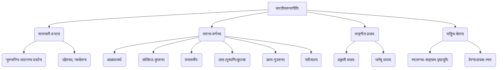

# Class 9 Sanskrit - Shemushi Chapter 101
**Language:** संस्कृतम्

```markdown
# [नवमी कक्षा] शेमुषी - प्रथमः पाठः - भारतीवसन्तगीतिः

## 🌟 मुख्य-अवधारणाः (Core Concepts)

अस्मिन् पाठे प्रस्तुताः मुख्य-अवधारणाः अधोनिर्दिष्टक्रमेण सन्ति:

1.  **सरस्वती-वन्दना (Prayer to Saraswati):**
    *   कविना वाणीं (सरस्वतीं) प्रति नूतनां वीणां वादयितुं प्रार्थना कृता अस्ति।
    *   उद्देश्यम् - नूतन-चेतनायाः सञ्चारः, प्रकृतेः सौन्दर्यवर्धनम् च।

2.  **वसन्तर्तौ प्रकृतेः सौन्दर्यम् (Beauty of Nature in Spring):**
    *   **आम्रवृक्षाः (Mango Trees):** मधुरमञ्जरीभिः पीतवर्णीयाः, सरसाः च।
    *   **कोकिलानां कूजनम् (Cuckoo's Singing):** ललितम् (मनोहरम्) अस्ति।
    *   **मन्दसमीरः (Gentle Breeze):** यमुनायाः तटे जलकणैः युक्तः मन्दं मन्दं वहति।
    *   **लताः पुष्पाणि च (Creepers and Flowers):**
        *   मधुमाधवीलताः नताः (झुकि हुइ)।
        *   ललितपल्लवाः पादपाः, पुष्पपुञ्जाः, मञ्जुकुञ्जाः च।
        *   मलयानिलस्पर्शेन सुगन्धिताः।
    *   **भ्रमराणां गुञ्जनम् (Humming of Bees):** कृष्णवर्णीयाः भ्रमराः कुञ्जेषु गुञ्जन्ति।
    *   **नदीनां जलम् (River Water):** वीणां श्रुत्वा क्रीडासहितं (सलिलम्) उच्छलेत्।

3.  **सङ्गीतस्य प्रभावः (Impact of Music):**
    *   वीणायाः मधुरध्वनिना प्रकृतौ नवजीवनस्य सञ्चारः भवेत्।
    *   शान्ताः सुमनः (पुष्पाणि) अपि चलेयुः।
    *   नदीनां जलं उल्लसितं भवेत्।
    *   मानवहृदयेषु स्फूर्तिः, नूतनचेतना च आगच्छेत्।

4.  **राष्ट्रिय-चेतना (National Consciousness):**
    *   (योग्यता-विस्तारे उल्लेखितम्) गीतिकायाः पृष्ठभूमिः स्वातन्त्र्यसङ्ग्रामः अस्ति।
    *   कविः एतादृशस्य वीणास्वरस्य परिकल्पनां करोति यः स्वातन्त्र्यप्राप्तये जनसमुदायं प्रेरयेत्।

📊 **अवधारणा-चित्रम् (Concept Map):**


## 📘 मुख्य-शिक्षणबिन्दवः (Key Learnings)

1.  **कवेः प्रार्थना (Poet's Prayer):** कविः पण्डितजानकीवल्लभशास्त्री सरस्वतीं प्रार्थयते यत् सा नूतनां वीणां वादयतु येन वसन्तर्तौ प्रकृतिः अधिकं मनोहरा भवेत्, जनेषु च नवचेतनायाः सञ्चारः स्यात्। (`निनादय नवीनामये वाणि! वीणाम्`)
2.  **वसन्तस्य मनोहारी चित्रणम् (Captivating Depiction of Spring):**
    *   पीतवर्णीय-आम्रमञ्जरीभिः युक्ताः सरसाः आम्रवृक्षाः शोभन्ते (`मधुर-मञ्जरी-पिञ्जरी-भूत-मालाः`)।
    *   मनोहर-कूजनं कुर्वन्तः कोकिलाः सन्ति (`ललित-कोकिला-काकलीनाम् कलापाः`)।
    *   यमुनानद्याः वेतसलताभिः आवृते तटे जलकणयुक्तः वायुः मन्दं मन्दं प्रवहति (`कलिन्दात्मजायाः सवानीरतीरे, वहति मन्दमन्दं सनीरे समीरे`)।
    *   चन्दनवृक्षस्य सुगन्धितवायुना स्पृष्टाः नवपल्लवाः, पुष्पसमूहाः, सुन्दराः कुञ्जाः च सन्ति, येषु कृष्णवर्णाः भ्रमराः गुञ्जन्ति (`ललित-पल्लवे पादपे पुष्पपुञ्जे, मलयमारुतोच्चुम्बिते मञ्जुकुञ्जे, स्वनन्तीन्ततिम्प्रेक्ष्य मलिनामलीनाम्`)।
    *   पुष्पैः नम्रा मधुमाधवीलताः अपि दृश्यन्ते (`नतां पङ्क्तिमालोक्य मधुमाधवीनाम्`)।
3.  **वीणायाः अपेक्षितः प्रभावः (Desired Impact of the Veena):**
    *   कविः इच्छति यत् सरस्वत्याः ओजस्विन्याः वीणायाः स्वरेण लताणां शान्तानि पुष्पाणि अपि कम्पितानि भवेयुः (`लतानां नितान्तं सुमं शान्तिशीलम् चलेत्`)।
    *   नदीनां स्वच्छं जलं क्रीडया सह उच्छलितं भवेत् (`उच्छलेत्कान्तसलिलं सलीलम्`)।
    *   एषः स्वरः केवलं प्रकृतिमेव नहि, अपितु मानवसमाजम् अपि नवस्फूर्तिं प्रति प्रेरयेत्।
4.  **गीतस्य गूढार्थः (Deeper Meaning of the Song):** यद्यपि गीतं प्रकृतेः वर्णनं करोति, तथापि अस्य रचना स्वातन्त्र्यसङ्ग्रामस्य पृष्ठभूमौ अभवत्। अतः, अत्र नूतन-वीणा-स्वरः तं स्वरं सङ्केतयति यः परतन्त्रभारतस्य जनेषु स्वातन्त्र्याय नूतनां चेतनां जागरयेत्।

📈 **प्रकृति-परिवर्तन-रेखाचित्रम् (Diagram of Nature's Transformation):**
*   **पूर्वम् (Before):** शान्त-प्रकृतिः
*   **वीणावादनम् (Veena Playing):** ओजस्वी स्वरः
*   **पश्चात् (After):**
    *   आम्रमञ्जर्यः पीताः, सरसाः च।
    *   कोकिलाः मधुरं कूजन्ति।
    *   समीरः मन्दं वहति।
    *   लतासुमनः चलन्ति।
    *   नदीजलं उच्छलति।
    *   भ्रमराः गुञ्जन्ति।
    *   **समग्रप्रभावः:** नवजीवनम्, स्फूर्तिः, सौन्दर्यम्।

## 🧩 सक्रिय-अधिगमः (Active Learning)

*   **गतिविधिः (Activity):**
    1.  **काव्य-विश्लेषणम् (Poem Analysis):** छात्रसमूहाः प्रत्येकं श्लोकं पठित्वा तस्मिन् वर्णितानां प्रकृतेः तत्त्वानां सूचीं निर्मान्तु। तेषां तत्त्वानां मानवेषु किं भावात्मकं प्रभावं भवितुमर्हति इति चिन्तयन्तु। (🔍 Research-based case study analysis - Analyzing poetic elements and their emotional impact).
    2.  **सृजनात्मक-लेखनम् (Creative Writing):** पाठेन प्रेरितः भूत्वा, छात्राः वसन्तर्तुं वा स्वप्रियम् ऋतुं वर्णयन्तः संस्कृते चतुरः पङ्क्तीः लिखन्तु। ते स्वकवितायां सङ्गीतस्य वा ध्वनेः प्रभावमपि योजयितुं शक्नुवन्ति। (Bloom's: Creating)

*   **चर्चा (Discussion):**
    1.  **गीतस्य प्रासंगिकता (Relevance of the Song):** "अद्यत्वेऽपि 'भारतीवसन्तगीतिः' इव गीतानि समाजं कथं प्रेरयितुं शक्नुवन्ति?" इति विषये कक्षायां चर्चां कुर्वन्तु। किं सङ्गीतं परिवर्तनस्य साधनं भवितुमर्हति? (🌍 Critical analysis of real-world impacts - Role of music/art in society).
    2.  **प्रकृति-मानव-सम्बन्धः (Nature-Human Connection):** अस्मिन् गीते प्रकृतिः सजीवा इव चित्रिता। प्रकृतेः घटकानां (यथा - वायुः, नदी, पुष्पाणि) मानवानां भावनाभिः सह कीदृशः सम्बन्धः अस्ति? उदाहरणैः सह स्पष्टीकुरुत। (Bloom's: Evaluating)

## 📝 मूल्याङ्कन-सिद्धता (Assessment Prep)

1.  **आशय-स्पष्टीकरणम् (Explanation of Meaning):**
    *   प्रथमस्य/द्वितीयस्य/तृतीयस्य/चतुर्थस्य श्लोकस्य आशयं सरलसंस्कृतेन/हिन्दीभाषया/आङ्ग्लभाषया लिखत।
    *   कविः वाणीं किं कर्तुं प्रार्थयते? तस्य प्रार्थनायाः कः उद्देश्यः अस्ति?
2.  **प्रकृति-वर्णनम् (Description of Nature):**
    *   पाठानुसारं वसन्तर्तौ कानि कानि परिवर्तनानि भवन्ति? सूचीं रचयत।
    *   यमुनातटे कीदृशं वातावरणं चित्रितम् अस्ति?
    *   📝 **चित्र-आधारित-प्रश्नः (Diagram-based Question):** पाठे वर्णितानां वसन्तदृश्यनां रेखाचित्रं निर्माय तेषां मुख्यतत्त्वानां नामानि लिखत। (e.g., Draw the scene by the Yamuna with creepers, breeze, river).
3.  **विश्लेषणात्मक-प्रश्नाः (Analytical Questions):**
    *   "ललित-नीति-लीनाम्" इत्यस्य कः अभिप्रायः?
    *   वीणायाः श्रवणेन लतासु, नदीषु च कः प्रभावः भविष्यति इति कविः कल्पयति?
    *   (उच्चस्तरीय-चिन्तनम्) किं भवन्तः मन्यन्ते यत् एषा कविता केवलं प्रकृतिवर्णनपरा अस्ति उत अस्याः कश्चन अन्यः गभीरः अर्थः अपि अस्ति? तर्कसहितं स्पष्टीकुरुत।
4.  **शब्दार्थ-व्याकरणम् (Vocabulary and Grammar):**
    *   पदानां पर्यायवाचिनः/विलोमशब्दान् लिखत (यथा अभ्यासे दत्तम्)।
    *   दत्तैः पदैः वाक्यानि रचयत (यथा - निनादय, मन्दमन्दम्, मारुतः, सलिलम्, सुमनः)।

## 🌏 भारतीय-सन्दर्भः (Bharatiya Context)

1.  **सरस्वती-उपासना (Worship of Saraswati):** भारते सरस्वती विद्यायाः, कलायाः, सङ्गीतस्य च देवी मन्यते। वसन्तपञ्चमी पर्वणि तस्याः विशेषपूजा भवति। एषा कविता तां भारतीयपरम्परां दर्शयति।
2.  **प्रकृति-प्रेम (Love for Nature):** भारतीयसंस्कृतौ प्रकृतेः महत्त्वपूर्णं स्थानम् अस्ति। नद्यः (यथा **यमुना**), वृक्षाः (यथा **आम्रः**), पर्वताः (यथा **मलयाचलः** यस्य उल्लेखः 'मलयमारुतः' इत्यत्र अस्ति) पूजनीयाः मन्यन्ते। कवितायां प्रकृतेः सूक्ष्मं सजीवं च वर्णनं भारतीयदृष्टिकोणं प्रकटयति।
3.  **सङ्गीतस्य महत्त्वम् (Importance of Music):** वीणा एकं प्राचीनं भारतीयं वाद्ययन्त्रम् अस्ति। भारतीयसङ्गीतपरम्परा अतीव समृद्धा अस्ति। सङ्गीतं न केवलं मनोरञ्जनस्य अपितु आध्यात्मस्य, प्रेरणायाः च स्रोतः मन्यते।
4.  **राष्ट्रिय-जागरणम् (National Awakening):** योग्यता-विस्तारे यथा उल्लिखितम्, एषा कविता स्वातन्त्र्य-आन्दोलनस्य काले लिखिता। तस्मिन् समये अनेके कवयः (यथा **सूर्यकान्त त्रिपाठी 'निराला'**, **मैथिलीशरण गुप्तः**) स्वकविताभिः जनेषु राष्ट्रभक्तिं जागरयन्ति स्म। पण्डितजानकीवल्लभशास्त्रिणः एषा रचना अपि तस्यामेव परम्परायां गण्यते, यत्र वीणायाः स्वरः राष्ट्रस्य नूतनजागरणाय आह्वानं करोति।
5.  **भाषा-साहित्यम् (Language and Literature):** आधुनिककालेऽपि संस्कृतेन उच्चस्तरीय-काव्यस्य रचना सम्भवति इति एषा कविता प्रमाणयति। पण्डितजानकीवल्लभशास्त्री आधुनिकसंस्कृतसाहित्यस्य प्रमुखः कविः अस्ति, यः गीत-गजल-सदृशैः नूतनप्रकारैः संस्कृतकाव्यं समृद्धं कृतवान्।

📊 **सांस्कृतिक-तत्त्वानि (Cultural Elements):**
*   देवी: सरस्वती
*   पर्व: वसन्तपञ्चमी (सम्बन्धितः)
*   वाद्यम्: वीणा
*   नदी: यमुना
*   वृक्षः: आम्रः
*   पर्वतः: मलयाचलः (सङ्केतः)
*   कवयः: जानकीवल्लभशास्त्री, निराला, गुप्त
*   भावः: प्रकृतिप्रेम, राष्ट्रभक्तिः, कला-सङ्गीत-प्रेम
```