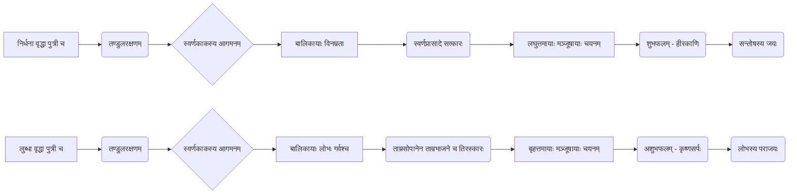

# Class 9 Sanskrit - Shemushi Chapter 102
**Language:** संस्कृतम्

```markdown
# [कक्षा ९] शेमुषी - द्वितीयः पाठः - स्वर्णकाकः

## 🌟 मूलाधाराः अवधारणाः (Core Concepts)
अस्मिन् पाठे वर्णिताः प्रमुखाः अवधारणाः अधः दत्ताः सन्ति:

1.  **लोभः (Greed)**
    *   लोभस्य स्वरूपम् (Nature of Greed)
    *   लोभस्य दुष्परिणामाः (Negative Consequences of Greed) - यथा द्वितीयया बालिकया अनुभूतम्।
2.  **त्यागः/सन्तोषः (Sacrifice/Contentment)**
    *   त्यागस्य/सन्तोषस्य स्वरूपम् (Nature of Sacrifice/Contentment)
    *   त्यागस्य/सन्तोषस्य सुपरिणामाः (Positive Results of Sacrifice/Contentment) - यथा प्रथमया बालिकया प्राप्तम्।
3.  **कर्मफलम् (Consequences of Actions)**
    *   सत्कर्मणः शुभं फलम् (Good results of good deeds)
    *   दुष्कर्मणः अशुभं फलम् (Bad results of bad deeds)
4.  **विनम्रतायाः महत्त्वम् (Importance of Humility)**
5.  **सत्यनिष्ठा (Honesty)**

📊 **अवधारणा-पदानुक्रमः (Concept Hierarchy)**

```mermaid
graph TD
    A[स्वर्णकाकः कथा] --> B(नैतिकशिक्षा);
    B --> C{कर्मफलम्};
    C --> D[सत्कर्म (त्यागः, सन्तोषः, विनम्रता)];
    C --> E[दुष्कर्म (लोभः, गर्वः)];
    D --> F(शुभपरिणामः - हीरकाणि);
    E --> G(अशुभपरिणामः - कृष्णसर्पः);
```

## 📘 प्रमुखाः शिक्षणबिन्दवः (Key Learnings)

1.  **कथासारः (Story Summary):**
    *   एका निर्धना वृद्धा तस्याः विनम्रा सुन्दरी पुत्री च।
    *   मात्रा पुत्री तण्डुलान् सूर्यातपे खगेभ्यः रक्षितुम् आदिष्टा।
    *   एकः विचित्रः स्वर्णपक्षः रजतचञ्चुः स्वर्णकाकः आगच्छति, तण्डुलान् खादति च।
    *   बालिकायाः प्रार्थनया काकः तां सूर्योदयात् प्राक् पिप्पलवृक्षम् अनु आगन्तुं कथयति, तण्डुलमूल्यं दातुं प्रतिजानाति च।
    *   बालिका स्वर्णमयं प्रासादं दृष्ट्वा आश्चर्यचकिता भवति।
    *   काकः तस्यै सोपानत्रयस्य (स्वर्णमयम्, रजतमयम्, ताम्रमयम्) विकल्पं ददाति, सा ताम्रमयं वृणुते, परन्तु स्वर्णसोपानेन प्रासादम् आरोहति।
    *   भोजनार्थं स्थालिकात्रयस्य विकल्पे सा ताम्रस्थालिकां वृणुते, परन्तु स्वर्णस्थालिकायां भोजनं प्राप्नोति।
    *   काकः तस्यै तिसॄणां मञ्जूषाणां विकल्पं ददाति, सा लघुत्तमां मञ्जूषां गृह्णाति।
    *   गृहे मञ्जूषायां बहुमूल्यानि हीरकाणि दृष्ट्वा सा प्रहर्षिता धनिका च सञ्जाता।
    *   तस्मिन्नेव ग्रामे अपरा लुब्धा वृद्धा तस्याः पुत्री च।
    *   लुब्धा बालिका अपि तथैव करोति, परन्तु सा काकं निर्भर्त्सयति, स्वर्णसोपानं स्वर्णस्थालिकां च याचते।
    *   काकः तस्यै ताम्रमयं सोपानं ताम्रभाजने भोजनं च ददाति।
    *   मञ्जूषाणां विकल्पे सा बृहत्तमां मञ्जूषां गृह्णाति।
    *   गृहे मञ्जूषायाम् एकं भीषणं कृष्णसर्पं दृष्ट्वा सा लोभस्य फलं प्राप्नोति। ततः सा लोभं परित्यजति।

2.  **नैतिकशिक्षा (Moral Lesson):**
    *   लोभः विनाशाय कल्पते (Greed leads to destruction)। यथा उक्तम् - "लोभः पापस्य कारणम्"।
    *   सन्तोषः, त्यागः, विनम्रता च सदैव सम्मानं सुखं च आनयन्ति (Contentment, sacrifice, and humility always bring respect and happiness)। यथा - "सन्तोषः परमं सुखम्"।

3.  **व्याकरणबिन्दवः (Grammar Points):**
    *   **क्त्वान्त-ल्यबन्त-पदानि:** 'कृत्वा' (करके) अर्थे क्त्वा (यथा - दृष्ट्वा) तथा ल्यप् (यथा - विलोक्य, आगत्य) प्रत्यययोः प्रयोगः। यदि धातोः पूर्वम् उपसर्गः अस्ति तर्हि 'ल्यप्' प्रयुज्यते, अन्यथा 'क्त्वा'।
    *   **तमप् प्रत्ययः:** बहूनां मध्ये एकस्य वैशिष्ट्यं दर्शयितुम् (Superlative degree) 'तमप्' प्रत्ययः प्रयुज्यते (यथा - लघुतमम्)।
    *   **पञ्चमी विभक्तिः:** 'अपाये' (separation), 'भये' (fear), 'रक्षणे' (protection), 'बहिः' (outside) योगे च पञ्चमी विभक्तिः प्रयुज्यते (यथा - वृक्षात् पत्राणि पतन्ति, चौरात् बिभेति, ग्रामात् बहिः)।
    *   **सन्धिः:** पाठे आगताः सन्धियुक्ताः शब्दाः (यथा - न्यवसत् = नि + अवसत्, सूर्योदयः = सूर्य + उदयः, वृक्षस्योपरि = वृक्षस्य + उपरि, चादाय = च + आदाय, इत्युक्त्वा = इति + उक्त्वा)।
    *   **विलोमपदानि:** (Antonyms) यथा - पश्चात् ≠ पुरा, हसितुम् ≠ रोदितुम्, अधः ≠ उपरि, श्वेतः ≠ कृष्णः, सूर्योदयः ≠ सूर्यास्तः, प्रबुद्धः ≠ सुप्तः।

📈 **कथाप्रवाहः (Story Flow Diagram)**



## 🧩 सक्रिय-अधिगमः (Active Learning)

### 🔍 गतिविधिः (Activity): शोध-आधारित-विश्लेषणम् (Research-based Analysis)
*   छात्रैः भारतीय-संस्कृतौ अथवा अन्य-संस्कृतिषु प्रचलिताः एतादृश्यः लोककथाः अन्वेष्टव्याः यत्र लोभस्य अथवा सन्तोषस्य परिणामः दर्शितः स्यात्।
*   'पञ्चतन्त्र', 'हितोपदेश' इत्यादिभ्यः कथाः पठित्वा स्वर्णकाकस्य कथया सह तुलना करणीया।
*   **उद्देश्यम्:** विभिन्नासु संस्कृतिषु समाननैतिकमूल्यानाम् अन्वेषणम्, तुलनात्मकविश्लेषणक्षमतायाः विकासः च।

### 🌍 चर्चा (Discussion): वास्तविकजीवने प्रभावस्य विश्लेषणम् (Analysis of Real-world Impacts)
*   अस्याः कथायाः वर्तमानकाले का प्रासंगिकता अस्ति? (What is the relevance of this story today?)
*   लोभः कथं व्यक्तिं समाजं च नकारात्मकतया प्रभावितं करोति? उदाहरणानि दीयन्ताम्। (How does greed negatively affect individuals and society? Give examples.)
*   सन्तोषस्य त्यागस्य च जीवने किं महत्त्वम् अस्ति? एते गुणाः कथं सुखमयं जीवनं दातुं शक्नुवन्ति? (What is the importance of contentment and sacrifice in life? How can these qualities lead to a happier life?)
*   **उद्देश्यम्:** कथायाः नैतिकशिक्षां वास्तविकजीवनस्य परिस्थितिभिः सह योजयितुं छात्रान् प्रेरयितुम्, आलोचनात्मकचिन्तनं वर्धयितुं च।

## 📝 मूल्याङ्कन-सिद्धता (Assessment Prep)

*   **कथा-आधारित-प्रश्नाः:** कथायाः घटनाक्रमानुसारं प्रश्नाः, पात्रचित्रणसम्बद्धाः प्रश्नाः (उदा. - निर्धनायाः बालिकायाः स्वभावः कीदृशः आसीत्? लुब्धा बालिका किमर्थं बृहत्तमां मञ्जूषाम् अचिनोत्?)।
*   **नैतिकमूल्य-विश्लेषणम्:** कथायाः मुख्यशिक्षां स्पष्टीकर्तुं, लोभस्य दुष्परिणामान् सोदाहरणं वर्णयितुं च प्रश्नाः।
*   **व्याकरणम्:**
    *   सन्धि-विच्छेदः / सन्धि-करणम्।
    *   प्रकृति-प्रत्यय-विभागः / संयोगः (विशेषतः क्त्वा, ल्यप्, तमप्)।
    *   पञ्चमीविभक्तेः प्रयोगः (रिक्तस्थानपूर्तिः, वाक्येषु प्रयोगः)।
    *   विलोमपदानि / समानार्थकपदानि।
    *   रेखाङ्कितपदानि आधृत्य प्रश्ननिर्माणम्।
*   **उदाहरणम्:**
    *   *प्रश्नः:* लुब्धया बालिकया लोभस्य किं फलं प्राप्तम्? (What consequence did the greedy girl face due to her greed?)
    *   *प्रश्नः:* 'विलोक्य' इति पदे कः प्रत्ययः? ('विलोक्य' - Which suffix is used in this word?)
    *   *प्रश्नः:* 'वृक्षात्' पत्राणि पतन्ति। अत्र 'वृक्षात्' इति पदे का विभक्तिः? किमर्थम्? ('वृक्षात्' - Which case ending is used here and why?)

## 🌏 भारतीय-सन्दर्भः (Bharatiya Context)

*   **नैतिकमूल्यानि:** इयं कथा भारतीयसंस्कृतौ गभीरतया प्रतिष्ठितैः मूल्यैः सह सम्बद्धा अस्ति, यथा - 'अपरिग्रहः' (non-possession), 'सन्तोषः' (contentment), 'कर्मण्येवाधिकारस्ते मा फलेषु कदाचन' (भगवद्गीता - कर्मणि एव अधिकारः अस्ति, फलेषु न) इति। पञ्चतन्त्र-हितोपदेशादिषु अनेकाः कथाः सन्ति याः लोभस्य दुष्परिणामान् वर्णयन्ति।
*   **सामाजिक-आर्थिक-सन्दर्भः:** कथायां निर्धनतायाः उल्लेखः अस्ति। भारतदेशे अद्यत्वे अपि आर्थिक-असमानता एकं प्रमुखं सामाजिकं तथ्यम् अस्ति। यद्यपि धनार्जनम् आवश्यकम्, तथापि इयं कथा स्मारयति यत् अत्यधिकः लोभः अनर्थाय भवति तथा च आन्तरिकः सन्तोषः एव वास्तविकं धनम् अस्ति। धनस्य अपेक्षया सदाचारस्य महत्त्वम् अधिकम् इति भारतीयं चिन्तनम् अत्र प्रतिबिम्बितम्।
*   **लोककथा-परम्परा:** भारतस्य विशाले देशे विभिन्नेषु प्रदेशेषु एतादृश्यः अनेकाः लोककथाः श्रूयन्ते, याः मनोरञ्जनद्वारा नैतिकशिक्षां प्रयच्छन्ति। 'स्वर्णकाकः' कथा (यद्यपि मूलतः वर्म(म्यांमार)देशस्य) तादृशीं सार्वभौमिकीं शिक्षां वहति या भारतीय-परम्परया सह सामञ्जस्यं भजते।

```