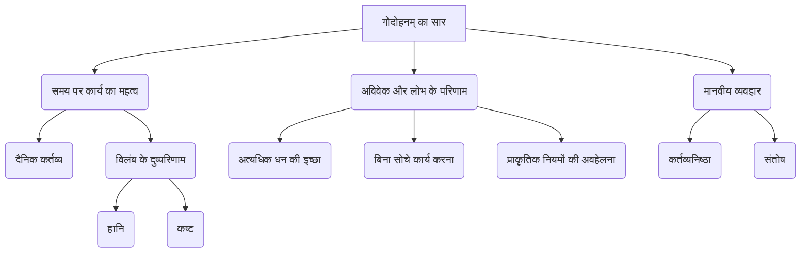
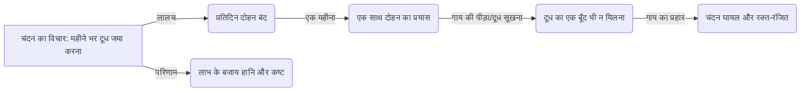

# Class 9 Sanskrit - Shemushi Chapter 103
**Language:** हिंदी

```markdown
# [कक्षा 9] शेमुषी - अध्याय 3: गोदोहनम्

*(टिप्पणी: प्रदान किए गए पाठ के अनुसार यह अध्याय 3 है, न कि 103।)*

## 🌟 मूल अवधारणाएँ (Core Concepts)

इस नाटक की मुख्य अवधारणाएँ निम्नलिखित पदानुक्रम में समझी जा सकती हैं:

1.  **समय पर कार्य करने का महत्व (Importance of Timely Action)**
    *   दैनिक कार्यों को प्रतिदिन पूरा करना (Completing daily tasks daily)
        *   श्लोक: `कार्यमद्यतनीयं यत् तदद्यैव विधीयताम्। विपरीता गतिर्यस्य स कष्टं लभते ध्रुवम्॥` (आज का काम आज ही करना चाहिए, जिसकी गति विपरीत होती है, वह निश्चित ही कष्ट पाता है।)
        *   श्लोक: `क्षिप्रमक्रियमाणस्य आदानस्य प्रदानस्य कर्तव्यस्य च कर्मणः। तत् रसं कालः पिबति॥` (शीघ्र न किए जाने वाले लेने-देने और करने योग्य कर्म के रस को समय पी जाता है।)
    *   कार्य में विलंब के दुष्परिणाम (Negative consequences of delaying work)
        *   लाभ के स्थान पर हानि (Loss instead of profit)
        *   शारीरिक और मानसिक कष्ट (Physical and mental suffering)

2.  **अविवेक और लोभ के परिणाम (Consequences of Greed and Lack of Forethought)**
    *   अत्यधिक धन की इच्छा (Desire for excessive wealth)
        *   चंदन का एक महीने में अमीर बनने का विचार।
    *   बिना सोचे-समझे कार्य करना (Acting without thinking)
        *   श्लोक: `सुविचार्य विधातव्यं कार्यं कल्याणकांक्षिणा। यः करोत्यविचार्यैतत् स विषीदति मानवः॥` (कल्याण चाहने वाले को कार्य सोच-समझकर ही करना चाहिए। जो मनुष्य बिना विचारे यह करता है, वह दुखी होता है।)
    *   प्रकृति के नियमों की अवहेलना (Ignoring natural laws)
        *   गाय का दूध एक महीने तक न दुहना।

3.  **मानवीय व्यवहार और नैतिकता (Human Behavior and Ethics)**
    *   कर्तव्यनिष्ठा बनाम आलस्य (Dutifulness vs. Laziness)
    *   संतोष का महत्व (Importance of Contentment)

📊 **अवधारणा पदानुक्रम:**


## 📘 मुख्य शिक्षाएँ (Key Learnings)

इस नाटक से हमें कई महत्वपूर्ण शिक्षाएँ मिलती हैं:

1.  **दैनिक कार्य उसी दिन करें:**
    *   चंदन ने अधिक लाभ के लालच में महीने भर गाय (नंदिनी) का दूध नहीं दुहा। उसने सोचा कि महीने के अंत में एक साथ सारा दूध दुहकर बेचेगा।
    *   **परिणाम:** महीने के अंत में गाय ने दूध देना बंद कर दिया और पीड़ा के कारण चंदन को लात मारकर घायल कर दिया।
    *   **शिक्षा:** जो काम रोज़ किया जाना चाहिए, उसे रोज़ ही करना चाहिए। उसे टालने से न केवल काम बिगड़ता है, बल्कि हानि भी होती है। (`कार्यमद्यतनीयं...`)

2.  **लालच और अविवेक दुख का कारण है:**
    *   चंदन की त्वरित धनवान बनने की इच्छा (लोभ) ने उसे अविवेकी बना दिया। उसने यह नहीं सोचा कि एक महीने तक दूध न दुहने से गाय को कष्ट होगा और दूध सूख भी सकता है।
    *   मल्लिका ने भी पति के विचार को बिना सोचे-समझे 'अत्युत्तम विचार' मान लिया।
    *   **शिक्षा:** कोई भी कार्य करने से पहले उसके अच्छे-बुरे परिणामों पर विचार करना आवश्यक है (`सुविचार्य विधातव्यं...`)। लालच में आकर बिना सोचे-समझे उठाया गया कदम दुख और पश्चाताप का कारण बनता है।

3.  **समय किसी का इंतजार नहीं करता:**
    *   नाटक का अंतिम श्लोक (`क्षिप्रमक्रियमाणस्य...`) बताता है कि जो कार्य सही समय पर नहीं किया जाता, समय उसके सार (रस) को नष्ट कर देता है।
    *   चंदन ने दूध दुहने का सही समय (प्रतिदिन) गंवा दिया, इसलिए अंत में उसे दूध रूपी 'रस' नहीं मिला।
    *   **शिक्षा:** हमें हर काम उसके निर्धारित समय पर ही पूरा करने का प्रयास करना चाहिए।

📈 **चंदन की योजना बनाम वास्तविकता (Diagram):**



## 🧩 सक्रिय शिक्षण (Active Learning)

1.  **गतिविधि: शोध-आधारित केस स्टडी विश्लेषण 🔍**
    *   **विषय:** "विलंब और अविवेकपूर्ण योजना के आर्थिक परिणाम"।
    *   **कार्य:** छात्र छोटे समूहों में भारत में कृषि, लघु उद्योग या व्यक्तिगत वित्त प्रबंधन से संबंधित वास्तविक जीवन का एक उदाहरण चुनें जहाँ किसी कार्य में अत्यधिक देरी या गलत योजना के कारण बड़ा आर्थिक नुकसान हुआ हो। (उदाहरण: फसल कटाई में देरी, किसी उत्पाद को गलत समय पर बाजार में लाना, बिना सोचे निवेश करना)।
    *   **प्रस्तुति:** अपने शोध के निष्कर्षों को प्रस्तुत करें और बताएं कि "गोदोहनम्" नाटक की शिक्षाएँ उस स्थिति पर कैसे लागू होती हैं।

2.  **चर्चा: वास्तविक जीवन के प्रभावों का आलोचनात्मक विश्लेषण 🌍**
    *   **प्रश्न:**
        *   चंदन का चरित्र समाज में किस प्रकार की मानसिकता को दर्शाता है? क्या आज भी लोग त्वरित लाभ के लिए ऐसे अविवेकी निर्णय लेते हैं? उदाहरण दें।
        *   "दैनिक कार्य को उसी दिन पूरा करना" - यह सिद्धांत विद्यार्थी जीवन, पारिवारिक जीवन और राष्ट्र निर्माण में कैसे महत्वपूर्ण है?
        *   इस नाटक में मल्लिका की क्या भूमिका है? क्या वह चंदन के गलत निर्णय में बराबर की भागीदार है? क्यों?
        *   पशुओं के प्रति हमारे क्या कर्तव्य होने चाहिए? नाटक इस बारे में क्या संकेत देता है?

## 📝 मूल्यांकन तैयारी (Assessment Prep)

1.  **केस स्टडी (Case Studies):**
    *   **स्थिति 1:** एक छात्र पूरे सत्र पढ़ाई नहीं करता और सोचता है कि परीक्षा से एक सप्ताह पहले सब पढ़ लेगा। "गोदोहनम्" के आधार पर उसके संभावित परिणाम क्या होंगे?
    *   **स्थिति 2:** एक दुकानदार त्योहारी सीजन में अधिक लाभ कमाने के लिए माल जमा करता रहता है और कीमतें बहुत बढ़ा देता है। ग्राहक दूसरी दुकानों से सामान खरीद लेते हैं। नाटक की कौन सी शिक्षा यहाँ लागू होती है?
    *   **विश्लेषण:** इन स्थितियों का विश्लेषण करें और नाटक के श्लोकों (`कार्यमद्यतनीयं...`, `सुविचार्य विधातव्यं...`, `क्षिप्रमक्रियमाणस्य...`) से जोड़ते हुए अपने उत्तर लिखें।

2.  **रेखाचित्र/प्रवाह चार्ट (Diagrams):**
    *   नाटक की प्रमुख घटनाओं का क्रम दर्शाने वाला एक प्रवाह चार्ट (flowchart) बनाएँ।
    *   कारण और प्रभाव (Cause and Effect) का रेखाचित्र बनाएँ: चंदन के लालच से शुरू होकर उसके घायल होने तक के घटनाक्रम को दर्शाएँ।
    *   श्लोक `क्षिप्रमक्रियमाणस्य...` के अर्थ को एक साधारण रेखाचित्र के माध्यम से समझाएँ (जैसे: समय की धारा बह रही है, कार्य का अवसर चूक गया)।

## 🌏 भारतीय संदर्भ (Bharatiya Context)

1.  **कृषि और पशुपालन:** यह नाटक भारत के ग्रामीण जीवन और अर्थव्यवस्था में पशुपालन (विशेषकर गाय) के महत्व को दर्शाता है। भारत विश्व का सबसे बड़ा दुग्ध उत्पादक देश है, और डेयरी फार्मिंग लाखों किसानों की आजीविका का आधार है। नाटक की कहानी समय पर पशुओं की देखभाल और प्रबंधन के महत्व को रेखांकित करती है, जो भारतीय कृषि परंपराओं का अभिन्न अंग है।
2.  **पंचतंत्र और हितोपदेश:** नाटक की नैतिक शिक्षाएँ (लालच बुरी बला है, बिना विचारे काम न करें, समय पर काम करें) भारतीय कथा साहित्य जैसे पंचतंत्र और हितोपदेश की कहानियों के समान हैं, जो व्यावहारिक ज्ञान और नैतिकता सिखाती हैं।
3.  **सामाजिक मूल्य:**
    *   **त्योहार और समुदाय:** गाँव के मुखिया के घर महीने के अंत में होने वाला 'महोत्सव' भारतीय समाज में सामुदायिक जीवन और उत्सवों के महत्व को दर्शाता है, जिसके लिए दूध जैसे संसाधनों की आवश्यकता होती है।
    *   **पारिवारिक संरचना:** नाटक में दिखता है कि घर के प्रबंधन (गृह व्यवस्था) और आर्थिक कार्यों (दुग्ध दोहन व्यवस्था) में पति-पत्नी (चंदन और मल्लिका) दोनों की भूमिका है। मल्लिका का सखियों के साथ तीर्थयात्रा (काशी विश्वनाथ) पर जाना उस समय की सामाजिक व्यवस्था में महिलाओं की स्वतंत्रता का भी संकेत देता है (जैसा कि योग्यता विस्तार में उल्लेखित है)।
    *   **ईमानदारी:** कुम्हार (देवेश) का चरित्र ईमानदारी का प्रतीक है, जो मल्लिका के आभूषण लेने से इंकार कर देता है और कहता है कि वह पाप कर्म नहीं करेगा। यह भारतीय संस्कृति में नैतिक मूल्यों के महत्व को दर्शाता है।

यह नाटक केवल एक कहानी नहीं, बल्कि भारतीय जीवन-मूल्यों, आर्थिक बुद्धिमत्ता और समय प्रबंधन पर एक महत्वपूर्ण पाठ है।
```