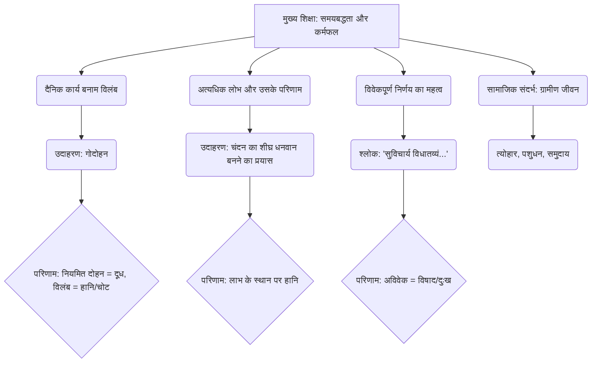

# Class 9 Sanskrit - Shemushi Chapter 103
**Language:** हिंदी

```markdown
# [कक्षा 9] शेमुषी - अध्याय 103: गोदोहनम्

## 🌟 मुख्य अवधारणाएँ (Core Concepts)
यह नाटक 'चतुर्व्यूहम्' पुस्तक से लिया गया है और लालच व अविवेक के दुष्परिणामों को दर्शाता है। मुख्य अवधारणाएँ इस प्रकार हैं:

1.  **समय पर कार्य करने का महत्व:**
    *   दैनिक कार्यों को उसी दिन पूरा करना क्यों आवश्यक है।
    *   कार्य को टालने (विलंब करने) के नकारात्मक प्रभाव।
2.  **अत्यधिक लोभ का दुष्परिणाम:**
    *   शीघ्र धनवान बनने की इच्छा कैसे हानि का कारण बन सकती है।
    *   असंतोष और अविवेकपूर्ण निर्णय।
3.  **कर्म और उसका फल:**
    *   जैसा कर्म (या अकर्म), वैसा फल।
    *   प्रकृति के नियमों का पालन न करने का परिणाम (गाय का दूध सूख जाना)।
4.  **विवेकपूर्ण निर्णय:**
    *   कार्य करने से पहले उसके संभावित परिणामों पर विचार करना।
    *   अविवेक (बिना सोचे-समझे कार्य करना) कैसे दुःख का कारण बनता है।
5.  **ग्रामीण जीवन और मूल्य:**
    *   त्योहारों का महत्व, पशुधन (गाय) का स्थान, सामुदायिक आवश्यकताएँ।

📊 **अवधारणा पदानुक्रम (Concept Hierarchy):**



## 📘 प्रमुख सीख (Key Learnings)
इस नाटक से हमें कई महत्वपूर्ण बातें सीखने को मिलती हैं:

1.  **नियमितता ही सफलता की कुंजी है:**
    *   चंदन ने सोचा कि महीने भर दूध जमा करके वह अधिक लाभ कमाएगा। लेकिन गाय को नियमित रूप से न दुहने के कारण, उसके शरीर में दूध बनना बंद हो गया और वह सूख गई।
    *   **शिक्षा:** प्रकृति और जीवन के कार्य एक नियमित क्रम में चलते हैं। दैनिक कार्यों को टालने से वे बेहतर नहीं होते, बल्कि बिगड़ जाते हैं।
    *   📈 **चित्रण:**
        *   **सही तरीका:** प्रतिदिन दोहन → नियमित दूध प्राप्ति → स्वास्थ्य + आय
        *   **गलत तरीका (चंदन):** महीने भर दोहन नहीं → गाय को पीड़ा + दूध सूखना → अंतिम दिन दोहन का प्रयास → गाय का प्रहार + शून्य दूध + हानि

2.  **लालच बुरी बला है:**
    *   चंदन का मुख्य उद्देश्य अधिक से अधिक धन कमाना था। इसी लालच में उसने गाय को एक महीने तक न दुहने का अविवेकपूर्ण निर्णय लिया।
    *   **शिक्षा:** अत्यधिक लालच व्यक्ति को अंधा बना देता है और वह सही-गलत का भेद नहीं कर पाता, जिससे अंततः उसे हानि ही उठानी पड़ती है।
    *   📈 **चित्रण (लालच का चक्र):**
        *   अधिक धन की इच्छा (लालच) → अविवेकपूर्ण योजना (महीने भर दूध न दुहना) → प्रकृति के नियम का उल्लंघन → अपेक्षित लाभ के स्थान पर हानि (दूध न मिलना, चोट लगना)

3.  **हर कार्य का एक निश्चित समय होता है:**
    *   नाटक के अंत में श्लोक (`कार्यमद्यतनीयं यत्...`, `आदानस्य प्रदानस्य...`) इसी बात पर जोर देते हैं कि जो कार्य आज करना है, उसे आज ही कर लेना चाहिए। समय बीत जाने पर उस कार्य का रस (महत्व, लाभ) समाप्त हो जाता है।
    *   **शिक्षा:** समय किसी की प्रतीक्षा नहीं करता। सही समय पर किए गए कार्य ही फलदायी होते हैं।

4.  **सोच-समझकर कार्य करना चाहिए:**
    *   मल्लिका अंत में कहती है कि कल्याण चाहने वाले व्यक्ति को भली-भाँति विचार करके ही कार्य करना चाहिए (`सुविचार्य विधातव्यं...`)। जो बिना विचारे कार्य करता है, वह दुखी होता है।
    *   **शिक्षा:** कोई भी कदम उठाने से पहले उसके संभावित अच्छे और बुरे परिणामों पर विचार करना आवश्यक है।

## 🧩 सक्रिय अधिगम (Active Learning)

*   **🔍 गतिविधि: शोध-आधारित केस स्टडी विश्लेषण (Research-based Case Study Analysis)**
    *   **कार्य:** छात्र वास्तविक जीवन से (जैसे कृषि, व्यवसाय, या छात्र जीवन से) कोई ऐसा उदाहरण खोजें जहाँ किसी कार्य को टालने या अत्यधिक लालच के कारण असफलता मिली हो।
    *   **प्रस्तुति:** छात्र उस केस स्टडी का विश्लेषण करें: क्या निर्णय लिए गए? उनके पीछे क्या सोच थी? परिणाम क्या हुए? इस नाटक की शिक्षाओं से उसकी तुलना करें।
    *   **उद्देश्य:** नाटक की शिक्षाओं को वास्तविक जीवन की परिस्थितियों में लागू करना और मूल्यांकन करना (Bloom's: Evaluating)।

*   **🌍 चर्चा: वास्तविक दुनिया के प्रभावों का आलोचनात्मक विश्लेषण (Critical Analysis of Real-world Impacts)**
    *   **विषय:** "आज के समय में 'गोदोहनम्' नाटक की प्रासंगिकता"।
    *   **चर्चा बिंदु:**
        *   "आज का काम कल पर मत टालो" - यह सिद्धांत आधुनिक आर्थिक गतिविधियों (जैसे शेयर बाजार, प्रोजेक्ट मैनेजमेंट, कृषि चक्र) पर कैसे लागू होता है?
        *   आधुनिक समाज में लालच किन रूपों में प्रकट होता है और उसके क्या परिणाम हो सकते हैं?
        *   क्या त्वरित लाभ कमाने की इच्छा हमेशा गलत होती है? विवेकपूर्ण जोखिम और लालच में क्या अंतर है?
    *   **उद्देश्य:** नाटक के नैतिक मूल्यों पर गहन चिंतन करना और समकालीन संदर्भ में उनका मूल्यांकन व संश्लेषण करना (Bloom's: Evaluating/Creating)।

## 📝 मूल्यांकन तैयारी (Assessment Prep)

*   **केस स्टडीज (Case Studies):**
    *   छोटी परिस्थितियाँ दी जाएँगी (जैसे, एक छात्र का परीक्षा के लिए आखिरी रात पढ़ना, एक दुकानदार का त्यौहार पर दाम बढ़ाने के लिए माल रोक लेना)। छात्रों को 'गोदोहनम्' के आधार पर संभावित परिणामों का विश्लेषण करने और अपने उत्तर का कारण बताने के लिए कहा जाएगा।
    *   **उदाहरण प्रश्न:** "एक किसान अच्छी फसल होने पर सोचता है कि दाम बढ़ने की प्रतीक्षा में वह फसल की कटाई कुछ हफ़्तों बाद करेगा। 'गोदोहनम्' नाटक के आधार पर उसके इस निर्णय के संभावित परिणाम क्या हो सकते हैं? विश्लेषण करें।"

*   **रेखाचित्र/प्रवाह चार्ट (Diagrams):**
    *   छात्रों को नाटक में दिखाए गए कारण-प्रभाव संबंध (जैसे, लालच → निर्णय → परिणाम) या कर्मफल के चक्र को दर्शाने वाले प्रवाह चार्ट बनाने के लिए कहा जा सकता है।
    *   **उदाहरण कार्य:** "चंदन के लालच से लेकर उसकी अंतिम हानि तक की घटनाओं को एक प्रवाह चार्ट के माध्यम से दर्शाएं।"

*   **मूल्य-आधारित प्रश्न:**
    *   चंदन और मल्लिका के कार्यों का नैतिक मूल्यांकन करने वाले प्रश्न।
    *   **उदाहरण प्रश्न:** "क्या चंदन का अधिक दूध बेचकर धन कमाने का विचार गलत था? यदि नहीं, तो उसकी गलती कहाँ हुई? नाटक के आधार पर स्पष्ट करें।"

## 🌏 भारतीय संदर्भ (Bharatiya Context)

*   **📊 भारत में डेयरी उद्योग और ग्रामीण अर्थव्यवस्था:**
    *   भारत विश्व के सबसे बड़े दुग्ध उत्पादक देशों में से एक है। लाखों ग्रामीण परिवार अपनी आजीविका के लिए डेयरी फार्मिंग पर निर्भर हैं।
    *   नाटक दिखाता है कि पशुधन (जैसे गाय) का स्वास्थ्य और नियमित देखभाल (जैसे समय पर दोहन) दुग्ध उत्पादन और ग्रामीण आय के लिए कितना महत्वपूर्ण है। चंदन की गलती (एक माह तक दोहन न करना) अवैज्ञानिक है और वास्तविक डेयरी प्रबंधन के सिद्धांतों के विपरीत है, जहाँ नियमित दोहन आवश्यक है।
    *   यह नाटक ग्रामीण अर्थव्यवस्था में दूध के महत्व को उजागर करता है (जैसे, महोत्सव के लिए 300 लीटर दूध की आवश्यकता)।

*   **📈 सूक्ष्म-उद्यम और सतत अभ्यास:**
    *   चंदन का दूध बेचकर लाभ कमाने का प्रयास एक प्रकार का ग्रामीण सूक्ष्म-उद्यम है।
    *   नाटक यह शिक्षा देता है कि ऐसे उद्यमों में सफलता के लिए केवल लाभ की इच्छा کافی नहीं है, बल्कि सही ज्ञान, विवेकपूर्ण योजना और सतत अभ्यास (नियमितता) भी आवश्यक है। 'शॉर्टकट' या लालच भरे अव्यावहारिक तरीके अक्सर विफलता का कारण बनते हैं।

*   **🌍 सामाजिक और सांस्कृतिक मूल्य:**
    *   नाटक में ग्राम प्रमुख के घर होने वाला 'महोत्सव' भारतीय समाज में सामुदायिक उत्सवों और आयोजनों के महत्व को दर्शाता है।
    *   मल्लिका का सखियों के साथ काशी विश्वनाथ मंदिर की तीर्थयात्रा पर जाना धार्मिक और सांस्कृतिक आस्थाओं को प्रतिबिंबित करता है।
    *   कुम्भकार (देवेश) का चरित्र पारंपरिक व्यवसायों और उनमें निहित ईमानदारी (आभूषण लेने से इंकार करना) को दर्शाता है।
    *   मल्लिका का स्वतंत्र रूप से तीर्थयात्रा का निर्णय लेना और चंदन का घर की जिम्मेदारी संभालना, उस समय के समाज में महिलाओं की स्थिति और पारिवारिक जिम्मेदारियों में साझेदारी के कुछ पहलुओं की ओर संकेत करता है।

*   **🇮🇳 राष्ट्रीय आर्थिक/सामाजिक डेटा (उदाहरण):**
    *   भारत में दुग्ध उत्पादन कृषि जीडीपी में महत्वपूर्ण योगदान देता है और करोड़ों लोगों को रोजगार प्रदान करता है। 'गोदोहनम्' की कहानी इस क्षेत्र में नियमितता और सही प्रबंधन के महत्व को रेखांकित करती है। (छात्र इस विषय पर वर्तमान डेटा खोजने के लिए प्रोत्साहित किए जा सकते हैं)।
```