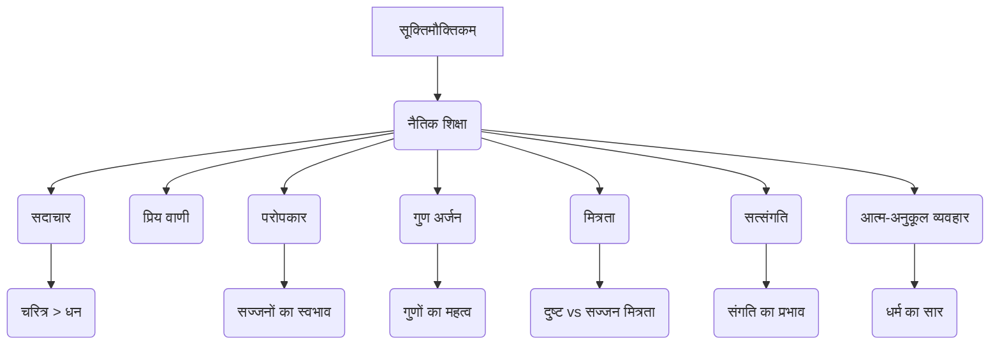

# Class 9 Sanskrit - Shemushi Chapter 104
**Language:** हिंदी

```markdown
# [कक्षा 9] शेमुषी - अध्याय 4: सूक्तिमौक्तिकम्

## 🌟 मुख्य अवधारणाएँ (Core Concepts)

यह पाठ (सूक्तिमौक्तिकम् - अर्थात् सूक्तियों रूपी मोती) नैतिक शिक्षाओं का एक संग्रह है, जो विभिन्न संस्कृत ग्रंथों से लिए गए हैं। इसका उद्देश्य छात्रों को जीवन के महत्त्वपूर्ण मूल्यों से अवगत कराना है।

1.  **नैतिक शिक्षा का महत्व**
    *   संस्कृत साहित्य में नीतिग्रंथों की समृद्ध परंपरा।
    *   नैतिक शिक्षाओं का पालन जीवन को सफल बनाता है।
2.  **प्रमुख नैतिक मूल्य**
    *   **सदाचार (चरित्र) की महिमा:**
        *   धन की तुलना में चरित्र की रक्षा अधिक महत्वपूर्ण है (मनुस्मृति)।
        *   चरित्रहीन व्यक्ति मृत समान होता है।
    *   **प्रिय वाणी की आवश्यकता:**
        *   मधुर वचन सभी प्राणियों को प्रसन्न करते हैं (चाणक्यनीति)।
        *   मीठा बोलने में कंजूसी नहीं करनी चाहिए।
    *   **परोपकार का स्वभाव:**
        *   सज्जनों की संपत्ति दूसरों की भलाई के लिए होती है (सुभाषितरत्नभाण्डागारम्)।
        *   प्रकृति (नदी, वृक्ष, बादल) भी परोपकार का उदाहरण प्रस्तुत करती है।
    *   **गुण अर्जन की प्रेरणा:**
        *   मनुष्यों को सदैव गुण प्राप्त करने का प्रयत्न करना चाहिए (मृच्छकटिकम्)।
        *   गुणी निर्धन व्यक्ति, गुणहीन धनी व्यक्ति से श्रेष्ठ होता है।
        *   गुणवान व्यक्ति के संपर्क में गुण बने रहते हैं, गुणहीन के संपर्क में दोष बन जाते हैं (हितोपदेशः)।
    *   **मित्रता का स्वरूप:**
        *   दुष्ट और सज्जन की मित्रता में अंतर होता है (नीतिशतकम्)।
        *   दुष्ट की मित्रता दिन के पूर्वार्ध की छाया की तरह (पहले बड़ी, फिर घटती हुई) होती है।
        *   सज्जन की मित्रता दिन के परार्ध की छाया की तरह (पहले छोटी, फिर बढ़ती हुई) होती है।
    *   **सत्संगति का प्रभाव एवं प्रशंसा:**
        *   अच्छे लोगों (हंसों) का साथ महत्वपूर्ण है; उनके जाने से उस स्थान (सरोवर) की हानि होती है (भामिनीविलासः)।
        *   संगति से ही गुण और दोष उत्पन्न होते हैं (हितोपदेशः)।
    *   **आत्म-अनुकूल व्यवहार (धर्म का सार):**
        *   जो व्यवहार स्वयं को पसंद न हो, वैसा व्यवहार दूसरों के साथ नहीं करना चाहिए (विदुरनीति)।

📊 **अवधारणा पदानुक्रम:**


## 📘 मुख्य शिक्षाएँ (Key Learnings)

इस पाठ में संकलित सूक्तियाँ हमें व्यावहारिक जीवन के लिए बहुमूल्य मार्गदर्शन प्रदान करती हैं:

1.  **चरित्र की रक्षा (श्लोक 1):** हमें अपने चरित्र (वृत्तम्) की यत्नपूर्वक रक्षा करनी चाहिए। धन (वित्तम्) तो आता-जाता रहता है (एति च याति च)। धन से क्षीण हुआ व्यक्ति वास्तव में क्षीण नहीं होता, परन्तु चरित्र से क्षीण हुआ व्यक्ति मरे हुए के समान (हतः हतः) होता है।
    *   📈 **रेखाचित्र:** एक तराजू दिखाएं जिसमें एक पलड़े पर 'चरित्र' और दूसरे पर 'धन' हो, जिसमें 'चरित्र' का पलड़ा भारी हो।

2.  **धर्म का सार (श्लोक 2):** धर्म के सार (धर्मसर्वस्वम्) को सुनो और सुनकर धारण करो (अवधार्यताम्)। जो अपने प्रतिकूल (आत्मनः प्रतिकूलानि) हो, वैसा आचरण दूसरों के प्रति नहीं करना चाहिए (परेषां न समाचरेत्)।

3.  **प्रिय वचन (श्लोक 3):** प्रिय वाक्य बोलने (प्रियवाक्यप्रदानेन) से सभी प्राणी (सर्वे जन्तवः) प्रसन्न (तुष्यन्ति) होते हैं। इसलिए वही (प्रिय वचन) बोलना चाहिए। ऐसे वचन बोलने में दरिद्रता (दरिद्रता) या कंजूसी क्यों?

4.  **परोपकार (श्लोक 4):** नदियाँ (नद्यः) अपना जल स्वयं नहीं पीतीं (स्वयमेव नाम्भः पिबन्ति), वृक्ष (वृक्षाः) अपने फल स्वयं नहीं खाते (स्वयं न खादन्ति फलानि), बादल (वारिवाहाः) निश्चय ही (खलु) अपने द्वारा उगाये अन्न (सस्यम्) को स्वयं नहीं खाते (नादन्ति)। सज्जनों की सम्पत्तियाँ (सतां विभूतयः) परोपकार के लिए ही होती हैं (परोपकाराय)।
    *   📈 **चित्र:** नदी, फलदार वृक्ष, और वर्षा करते बादल का चित्र बनाएं, जो दूसरों को लाभ पहुंचा रहे हैं।

5.  **गुणों का महत्व (श्लोक 5):** पुरुषों को सदा (सदा) गुणों को ही प्राप्त करने का प्रयत्न (प्रयत्नः कर्तव्यः) करना चाहिए। गुणयुक्त (गुणयुक्तः) निर्धन (दरिद्रः) व्यक्ति भी गुणहीन (अगूणैः) धनवानों (ईश्वरैः) के बराबर नहीं होता (अर्थात् उनसे श्रेष्ठ होता है)।

6.  **मित्रता का स्वरूप (श्लोक 6):** दुष्टों (खल) और सज्जनों (सज्जन) की मित्रता (मैत्री) दिन के पूर्वार्ध और परार्ध की छाया (पूर्वार्धपरार्धभिन्ना छाया इव) की तरह भिन्न होती है। दुष्ट की मित्रता आरम्भ में बड़ी (आरम्भगुर्वी) और क्रमशः कम होने वाली (क्षयिणी) होती है। सज्जन की मित्रता पहले छोटी (लघ्वी पुरा) और बाद में बढ़ने वाली (वृद्धिमती च पश्चात्) होती है।
    *   📈 **ग्राफ:** समय के साथ मित्रता की प्रगाढ़ता दिखाते हुए दो रेखाएँ बनाएं - एक (दुष्ट) ऊपर से नीचे जाती हुई, दूसरी (सज्जन) नीचे से ऊपर जाती हुई।

7.  **सत्संगति का प्रभाव (श्लोक 8):** गुण (गुणाः) गुणवान व्यक्तियों (गुणज्ञेषु) में रहने पर गुण बने रहते हैं। वही गुण निर्गुण व्यक्ति (निर्गुणम् प्राप्य) को प्राप्त करके दोष (दोषाः भवन्ति) बन जाते हैं। जैसे स्वादिष्ट जल वाली (आस्वाद्यतोयाः) नदियाँ बहती हैं, परन्तु समुद्र में मिलकर (समुद्रम् आसाद्य) वे पीने योग्य नहीं रहतीं (अपेयाः भवन्ति)।

## 🧩 सक्रिय अधिगम (Active Learning)

*   **गतिविधि: शोध-आधारित केस स्टडी विश्लेषण 🔍**
    *   **कार्य:** मनुस्मृति, विदुरनीति, चाणक्यनीति, हितोपदेश, पञ्चतन्त्र आदि ग्रंथों से 'सदाचार' या 'मित्रता' विषय पर 5-5 सूक्तियाँ खोजें। उनका अर्थ समझें और कक्षा में प्रस्तुत करें। विश्लेषण करें कि ये सूक्तियाँ आज के समय में कितनी प्रासंगिक हैं।
    *   **उद्देश्य:** शोध कौशल विकसित करना, प्राचीन ज्ञान को समकालीन संदर्भ में समझना, मूल्यांकन क्षमता बढ़ाना।

*   **चर्चा: वास्तविक दुनिया के प्रभावों का आलोचनात्मक विश्लेषण 🌍**
    *   **विषय:** "क्या आज के समाज में 'प्रियवाक्यप्रदानेन सर्वे तुष्यन्ति जन्तवः' और 'परोपकाराय सतां विभूतयः' जैसे आदर्श व्यावहारिक हैं?"
    *   **प्रक्रिया:** छात्र समूहों में विभाजित होकर इस पर चर्चा करें। अपने तर्कों के समर्थन में वास्तविक जीवन के उदाहरण (सकारात्मक और नकारात्मक दोनों) प्रस्तुत करें। निष्कर्षों को कक्षा के साथ साझा करें।
    *   **उद्देश्य:** आलोचनात्मक चिंतन, नैतिक तर्कणा, और संवाद कौशल का विकास।

## 📝 मूल्यांकन तैयारी (Assessment Prep)

*   **केस स्टडी और रेखाचित्र 📝:**
    1.  **स्थिति:** रमेश एक सफल व्यवसायी है लेकिन वह अपने कर्मचारियों से कठोरता से बात करता है और समाज सेवा में उसकी कोई रुचि नहीं है। सुरेश एक सामान्य आय वाला व्यक्ति है, परन्तु वह सबसे विनम्रता से बात करता है और अपनी क्षमतानुसार दूसरों की मदद करता है। श्लोक 1, 3, 4, और 5 के आधार पर रमेश और सुरेश के जीवन का मूल्यांकन करें।
    2.  श्लोक 6 में वर्णित दुष्ट और सज्जन की मित्रता के अंतर को दर्शाने वाला एक तुलनात्मक चार्ट या ग्राफ बनाएं।
*   **भावार्थ लेखन:** पाठ के किन्हीं चार महत्वपूर्ण श्लोकों (जैसे 1, 4, 6, 8) का सरल हिंदी में भावार्थ लिखने का अभ्यास करें।
*   **व्याकरणिक अभ्यास:**
    *   श्लोकों का अन्वय करना।
    *   विशेषण-विशेष्य पदों का मिलान करना (अभ्यास 3)।
    *   रेखांकित पदों के आधार पर प्रश्न निर्माण करना (अभ्यास 6)।
    *   लट् लकार के वाक्यों को लोट् लकार में परिवर्तित करना (अभ्यास 7)।
    *   भिन्न प्रकृति के पद चुनना (अभ्यास 5)।

## 🌏 भारतीय संदर्भ (Bharatiya Context)

इस पाठ की सूक्तियाँ भारतीय संस्कृति और मूल्यों में गहराई से निहित हैं:

1.  **परोपकार:** भारत में 'सेवा परमो धर्मः' का सिद्धांत प्रचलित है। प्राचीन काल से ही धर्मशालाओं, अन्नक्षेत्रों का निर्माण, और वर्तमान में भी विभिन्न सामाजिक संस्थाओं द्वारा किया जा रहा सेवा कार्य 'परोपकाराय सतां विभूतयः' (श्लोक 4) के भाव को दर्शाता है। **उदाहरण:** गुरुद्वारों में चलने वाला लंगर, विभिन्न ट्रस्टों द्वारा संचालित निःशुल्क अस्पताल या विद्यालय।
2.  **सदाचार:** भारतीय परंपरा में 'चरित्र' को सर्वोच्च स्थान दिया गया है। रामायण में श्रीराम का चरित्र और महाभारत में युधिष्ठिर की सत्यनिष्ठा 'वृत्तं यत्नेन संरक्षेत्' (श्लोक 1) के महत्व को रेखांकित करती है।
3.  **प्रिय वाणी और व्यवहार:** 'अतिथि देवो भव' की अवधारणा मीठे वचन और अच्छे व्यवहार (श्लोक 3) पर आधारित है। दूसरों के प्रति वैसा ही व्यवहार करना जो स्वयं को प्रिय हो (श्लोक 2), 'वसुधैव कुटुम्बकम्' (पूरी पृथ्वी एक परिवार है) की भारतीय भावना का आधार है। **उदाहरण:** विभिन्न त्योहारों पर एक-दूसरे के प्रति सम्मान और प्रेम का प्रदर्शन।
4.  **गुणों का महत्व:** भारतीय दर्शन और साहित्य में सदैव गुणों (ज्ञान, विनम्रता, सत्यनिष्ठा) के अर्जन पर बल दिया गया है, न कि केवल भौतिक समृद्धि पर (श्लोक 5)। **उदाहरण:** महान संतों और विचारकों (जैसे स्वामी विवेकानंद, महात्मा गांधी) का जीवन, जिन्होंने गुणों के आधार पर समाज को प्रेरित किया।

यह पाठ न केवल परीक्षा की दृष्टि से महत्वपूर्ण है, बल्कि छात्रों को एक बेहतर इंसान बनने और भारतीय मूल्यों को समझने के लिए भी प्रेरित करता है।
```