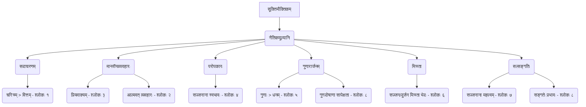

# Class 9 Sanskrit - Shemushi Chapter 104
**Language:** संस्कृतम्

```markdown
# [कक्षा ९] शेमुषी - अध्यायः ४ - सूक्तिमौक्तिकम्

## 🌟 मूलाधाराः अवधारणाः (Core Concepts)
अस्मिन् पाठे प्रस्तुतानां नैतिकमूल्यानां श्रेणिबद्धं चित्रणम्।

*   **नैतिकमूल्यानि (Moral Values)**
    *   **सदाचरणस्य महत्त्वम् (Importance of Good Conduct)**
        *   चरित्रसंरक्षणस्य आवश्यकता (Need to protect character) - श्लोकः १ (मनुस्मृतिः)
        *   वित्तस्य (धनस्य) क्षणभङ्गुरता (Transitory nature of wealth) - श्लोकः १
    *   **मानवीयव्यवहारः (Human Conduct)**
        *   प्रियवाण्याः आवश्यकता (Need for Pleasant Speech) - श्लोकः ३ (चाणक्यनीतिः)
        *   आत्मौपम्येन व्यवहारः (Treating others as oneself; The Golden Rule) - श्लोकः २ (विदुरनीतिः)
    *   **परोपकारः (Benevolence/Helping Others)**
        *   परोपकारिणां स्वभावः (Nature of the benevolent) - श्लोकः ४ (सुभाषितरत्नभाण्डागारम्)
        *   प्रकृतेः निःस्वार्थभावः (Selfless nature of Nature - rivers, trees, clouds) - श्लोकः ४
    *   **गुणारार्जनम् (Acquisition of Virtues)**
        *   गुणानां महत्त्वम् धनस्य अपेक्षया (Importance of virtues over wealth) - श्लोकः ५ (मृच्छकटिकम्)
        *   गुणानां सापेक्षता (Contextual nature of virtues/faults) - श्लोकः ८ (हितोपदेशः)
    *   **मित्रता (Friendship)**
        *   सज्जन-दुर्जनमित्रतायाः स्वरूपभेदः (Difference in nature between friendship with the good and the wicked) - श्लोकः ६ (नीतिशतकम्)
    *   **सत्सङ्गतिः (Good Company)**
        *   सत्सङ्गतेः प्रशंसा / प्रभावः (Praise / Effect of good company) - श्लोकः ७ (भामिनीविलासः), श्लोकः ८ (हितोपदेशः)
        *   सज्जनानां महत्त्वम् (Importance of good people in society) - श्लोकः ७

📊 **अवधारणा मानचित्रम् (Conceptual Diagram):**


## 📘 मुख्यशिक्षणानि (Key Learnings)
श्लोकानां सरलसंस्कृतेन विस्तृता व्याख्याः, रेखाचित्रैः सहिताः।

1.  **श्लोकः १ (मनुस्मृतिः): वृत्तं यत्नेन संरक्षेत्...**
    *   **सारः:** मनुष्येण स्वस्य चरित्रस्य (वृत्तस्य) प्रयत्नपूर्वकं रक्षणं करणीयम्। धनं (वित्तम्) तु आगच्छति गच्छति च। धनात् क्षीणः जनः वस्तुतः क्षीणः न भवति, परन्तु चरित्रात् क्षीणः जनः मृतसदृशः एव भवति।
    *   **शिक्षा:** चरित्रं धनात् अधिकं महत्त्वपूर्णम् अस्ति।
    *   📈 **रेखाचित्रम्:** एका तुला (scale) यस्याः एकस्मिन् पलडे 'चरित्रम्' (गुरु) स्थापितम्, अपरस्मिन् पलडे 'धनम्' (लघु) स्थापितम्। चरित्रस्य पलडः अधः नतः।

2.  **श्लोकः २ (विदुरनीतिः): श्रूयतां धर्मसर्वस्वं...**
    *   **सारः:** धर्मस्य सारं शृणोतु, श्रुत्वा च मनसि धारयतु। यत् आचरणम् आत्मनः कृते प्रतिकूलं (इष्टं न) भवति, तादृशम् आचरणं परेषां कृते अपि न करणीयम्।
    *   **शिक्षा:** यद् व्यवहारं भवान् स्वस्मै नेच्छति, तं व्यवहारं परान् प्रति मा कुरुत। (आत्मौपम्यम्)
    *   📈 **रेखाचित्रम्:** एकः व्यक्तिः (A) अपरं व्यक्तिं (B) प्रति किमपि कार्यं करोति। ततः पूर्वं सः (A) आत्मनि चिन्तयति - "किम् एतत् मह्यं रोचते?" (यदि उत्तरं 'न', तर्हि तत् कार्यं न करोति)।

3.  **श्लोकः ३ (चाणक्यनीतिः): प्रियवाक्यप्रदानेन...**
    *   **सारः:** सर्वे प्राणिनः (मनुष्याः, पशवः च) मधुरवचनैः प्रसन्नाः भवन्ति। अतः सदैव प्रियं वचनम् एव वक्तव्यम्। मधुरं वचने का दरिद्रता (कृपणता)? अर्थात् प्रियवचनस्य व्ययः शून्यः भवति।
    *   **शिक्षा:** मधुरभाषणेन सर्वान् वशीकर्तुं शक्यते, अतः कटुवचनं त्यक्त्वा प्रियं वदेत्।
    *   📈 **रेखाचित्रम्:** वक्ता → प्रियवाक्यम् → श्रोता (😊 प्रसन्नमुखम्)। वक्ता → कटुवाक्यम् → श्रोता (😞 दुःखितमुखम्)।

4.  **श्लोकः ४ (सुभाषितरत्नभाण्डागारम्): पिबन्ति नद्यः स्वयमेव नाम्भः...**
    *   **सारः:** नद्यः स्वयं स्वकीयं जलं न पिबन्ति। वृक्षाः स्वयं स्वफलानि न खादन्ति। मेघाः (वारिवाहाः) स्वयं उत्पादितानि सस्यानि (अन्नम्) न खादन्ति। एवमेव सज्जनानां सम्पत्तयः (विभूतयः) परेषाम् उपकाराय एव भवन्ति।
    *   **शिक्षा:** सज्जनाः परोपकारिणः निःस्वार्थाः च भवन्ति, यथा प्रकृतिः।
    *   📈 **रेखाचित्रम्:** नदी → जलम् (न स्वस्मै), वृक्षः → फलम् (न स्वस्मै), मेघः → अन्नम् (न स्वस्मै) ===> सज्जनः → सम्पत्तिः (परोपकाराय)।

5.  **श्लोकः ५ (मृच्छकटिकम्): गुणेष्वेव हि कर्तव्यः...**
    *   **सारः:** पुरुषैः सदैव गुणान् अर्जयितुम् एव प्रयत्नः करणीयः। गुणयुक्तः निर्धनः अपि गुणहीनैः ईश्वरैः (धनिकैः) समः न भवति, अपितु श्रेष्ठः भवति।
    *   **शिक्षा:** गुणाः एव मनुष्यस्य वास्तविकं धनम्, न तु केवलं भौतिकसम्पत्तिः।
    *   📈 **रेखाचित्रम्:** गुणयुक्तः निर्धनः (⬆️) > गुणहीनः धनिकः (⬇️)।

6.  **श्लोकः ६ (नीतिशतकम्): आरम्भगुर्वी क्षयिणी क्रमेण...**
    *   **सारः:** दुर्जनस्य (खलस्य) मित्रता आरम्भे विशाला (गुर्वी) भवति, परन्तु क्रमेण क्षीणा (क्षयिणी) भवति (यथा दिनस्य पूर्वार्धस्य छाया)। सज्जनस्य मित्रता आरम्भे लघ्वी भवति, परन्तु पश्चात् वर्धते (वृद्धिम् एति) (यथा दिनस्य परार्धस्य छाया)। अनयोः मित्रता भिन्ना भवति।
    *   **शिक्षा:** सज्जनैः सह मित्रता श्रेयस्करी, दुर्जनैः सह हानिकारक्री।
    *   📈 **रेखाचित्रम्:** द्वे रेखाचित्रे (समयः x मित्रतायाः गाढता)।
        *   दुर्जनमित्रता: आरम्भे उच्चा, क्रमेण न्यूना। (पूर्वाह्नच्छाया इव)
        *   सज्जनमित्रता: आरम्भे न्यूना, क्रमेण उच्चा। (अपराह्नच्छाया इव)

7.  **श्लोकः ७ (भामिनीविलासः): यत्रापि कुत्रापि गता भवेयुः...**
    *   **सारः:** हंसाः पृथिवीमण्डलं शोभयितुं यत्र कुत्रापि गच्छेयुः, परन्तु हानिः तु तेषां सरोवराणाम् एव भवति, येषां सरोवराणां हंसैः सह वियोगः भवति।
    *   **शिक्षा:** सज्जनाः यत्र गच्छन्ति तत्र शोभां वर्धयन्ति, परन्तु यस्मात् स्थानात् ते गच्छन्ति, तस्य स्थानस्य हानिः भवति। सज्जनानां सान्निध्यं महत्त्वपूर्णम्।

8.  **श्लोकः ८ (हितोपदेशः): गुणा गुणज्ञेषु गुणा भवन्ति...**
    *   **सारः:** गुणाः (सदगुणाः) गुणज्ञेषु (गुणान् ये जानन्ति तेषु) जनेषु एव गुणाः तिष्ठन्ति। ते एव गुणाः निर्गुणं (गुणहीनं) जनं प्राप्य दोषाः भवन्ति। यथा स्वादिष्टजलपूर्णाः (आस्वाद्यतोयाः) नद्यः प्रवहन्ति, परन्तु ताः एव नद्यः समुद्रं प्राप्य अपेयाः (पानार्थम् अयोग्याः) भवन्ति।
    *   **शिक्षा:** सङ्गत्याः पात्रस्य च प्रभावेण गुणाः अपि दोषेषु परिवर्तन्ते। अतः सत्पात्रस्य सङ्गतिः एव करणीया।
    *   📈 **रेखाचित्रम्:** सद्गुणः → गुणज्ञः = सद्गुणः। सद्गुणः → निर्गुणः = दोषः। नदीजलम् (स्वादिष्टम्) → समुद्रः = अपेयम् जलम्।

## 🧩 सक्रिय-अधिगमः (Active Learning)

*   **गतिविधिः (Activity): शोध-आधारित-अध्ययनम् (Research-based case study analysis) 🔍**
    *   **विषयः:** "भारतस्य केचन प्रसिद्धाः परोपकारिणः तेषां कार्याणि च।" (Some famous philanthropists of India and their work.)
    *   **निर्देशः:** छात्रैः भारतस्य प्राचीन-अर्वाचीन-कालीनानां केषाञ्चन परोपकारिणां (यथा - राजर्षिः हरिश्चन्द्रः, कर्णः, महात्मा गान्धी, विनोबा भावे, मदर टेरेसा, अज़ीम प्रेमजी इत्यादयः) विषये शोधकार्यं कृत्वा तेषां परोपकारकार्याणां संक्षिप्तं विवरणं लेखनीयम्। (श्लोक ४ इत्यनेन सह सम्बद्धम्)।
    *   **उद्देश्यम्:** परोपकारस्य महत्त्वं वास्तविकजीवने उदाहरणैः सह अवगन्तुम्। (Bloom's: Applying/Analyzing)

*   **चर्चा (Discussion): वास्तविक-जगति प्रभावस्य आलोचनात्मकं विश्लेषणम् (Critical analysis of real-world impacts) 🌍**
    *   **प्रश्नः:** "सत्सङ्गतेः कुसङ्गतेः च प्रभावः छात्रजीवने कथं दृश्यते? स्वानुभवान् विचारान् च प्रकटयत।" (How are the effects of good and bad company observed in student life? Share your experiences and thoughts.)
    *   **उद्देश्यम्:** सत्सङ्गतेः महत्त्वं (श्लोक ६, ७, ८) स्वानुभवैः सह सम्बद्ध्य मूल्याङ्कनं कर्तुम्। (Bloom's: Evaluating)

## 📝 मूल्याङ्कन-सिद्धता (Assessment Prep)

*   **प्रकरण-अध्ययनम् (Case Studies):**
    *   लघुस्थितयः प्रदास्यन्ते, छात्रैः सम्बद्धः श्लोकः तस्य नीतिः च उल्लिखनीया।
        *   **उदाहरणम्:** "कश्चन छात्रः परीक्षायां साफल्यं प्राप्तुम् असत्यमार्गमनुसरति। तस्य मित्रं तं वारयति यत् 'चरित्रं रक्षणीयम्, साफल्यं तु पुनः प्राप्स्यसि'। अत्र कस्य श्लोकस्य (केषां श्लोकानां) भावः निहितः?" (उत्तरम् - श्लोकः १, कदाचित् श्लोकः ५ अपि)
*   **रेखाचित्र-आधारित-प्रश्नाः (Diagram-based Questions) 📝:**
    *   प्रदत्तानां रेखाचित्राणां व्याख्या कर्तुं निर्देशः।
    *   कस्यचित् श्लोकस्य कृते स्वयं रेखाचित्रं रचयितुं निर्देशः। यथा - "श्लोकसंख्या ६ (मित्रता) कृते रेखाचित्रं रचयत यत् दुर्जन-सज्जनयोः मित्रतायाः स्वरूपभेदं दर्शयेत्।"

## 🌏 भारतीय-सन्दर्भः (Bharatiya Context)

*   **नैतिकमूल्यानि भारतीयसंस्कृतौ:** पाठे वर्णितानि नैतिकमूल्यानि (सदाचारः, प्रियवाक्यम्, परोपकारः, गुणारार्जनम्, सत्सङ्गतिः) भारतीयसंस्कृतेः अभिन्नम् अङ्गम् सन्ति।
    *   **परोपकारः (श्लोकः ४):** भारतदेशे 'दानम्', 'सेवा', 'अतिथिदेवो भव' इति परम्पराः सुदृढाः सन्ति। **उदाहरणानि:** रामकृष्ण मिशन, अनेके सामाजिकसंस्थानानि, तथा च आधुनिककाले अज़ीम प्रेमजी, शिव नाडर सदृशाः उद्योगपतयः ये स्वसम्पदः महद्भागं समाजहिताय ददति। (अनेन 'आर्थिक-आंकडा' इति सांस्कृतिकसन्दर्भस्य अप्रत्यक्षः सम्बन्धः स्थाप्यते)।
    *   **आत्मौपम्येन व्यवहारः (श्लोकः २):** 'वसुधैव कुटुम्बकम्' इति विचारधारा अस्यैव सिद्धान्तस्य प्रतिध्वनिः अस्ति। सर्वेषु आत्मवत् व्यवहारः भारतीयदर्शनस्य मूलम्।
    *   **चरित्रस्य महत्त्वम् (श्लोकः १):** रामायणे भगवतः रामस्य चरित्रम्, महाभारते युधिष्ठिरस्य धर्मपरायणता च चरित्रस्य महत्त्वं दर्शयतः।
    *   **सत्सङ्गतेः प्रभावः (श्लोकः ८):** "सत्संगत्वे निस्संगत्वं, निस्संगत्वे निर्मोहत्वम्..." (आदि शंकराचार्य) इत्यादिषु उक्तिषु सत्सङ्गतेः महिमा वर्णिता।
*   **सामाजिक-आर्थिक-आंकडा-सन्दर्भः (Social/Economic Data Context):** यद्यपि पाठः प्रत्यक्षतः आर्थिक-आंकडाभिः सह न सम्बद्धः, तथापि अत्र वर्णिताः गुणाः (यथा - सदाचारः, परोपकारः, गुणारार्जनम्) समाजस्य राष्ट्रस्य च आर्थिक-सामाजिक-प्रगतये आवश्यकाः सन्ति। यस्मिन् समाजे एतेषां मूल्यानां पालनं भवति, तत्र विश्वासः, सहयोगः, स्थिरता च वर्धते, यत् आर्थिकविकासस्य आधारः भवति। गुणारार्जनस्य प्रेरणा (श्लोकः ५) भारतस्य 'कौशल-विकास' (Skill Development) इति योजनाभिः सह अपि योजयितुं शक्यते।
```