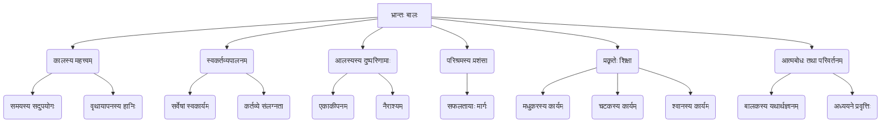

# Class 9 Sanskrit - Shemushi Chapter 105
**Language:** संस्कृतम्

```markdown
# [कक्षा ९] शेमुषी - अध्यायः १०५ - भ्रान्तः बालः

## 🌟 मूलाधाराः अवधारणाः (Core Concepts)
अस्मिन् पाठे प्रतिपादिताः मुख्याः अवधारणाः अधः दत्ताः सन्ति 📊:

1.  **कालस्य महत्त्वम् (समय का मूल्य):**
    *   जीवनस्य प्रत्येकं क्षणः मूल्यवान् अस्ति।
    *   वृथा समययापनं हानिकरम्।
2.  **स्वकर्तव्यपालनम् (अपने कर्तव्य का पालन):**
    *   प्रत्येकस्य जीवस्य (मनुष्यस्य, पशोः, पक्षिणः च) स्वकीयं निर्धारितं कार्यम् अस्ति।
    *   स्वकर्तव्ये संलग्नता एव जीवनस्य सार्थकता।
3.  **आलस्यस्य दुष्परिणामाः (आलस्य के बुरे परिणाम):**
    *   आलस्येन (तन्द्रालुतया) मनुष्यः एकाकी, निराशः च भवति।
    *   प्रगतिः अवरुद्धा भवति।
4.  **परिश्रमस्य प्रशंसा (परिश्रम की प्रशंसा):**
    *   ये स्वकर्मणि रताः सन्ति, ते एव सफलाः भवन्ति।
    *   विद्यार्थिनः कर्तव्यम् अध्ययनम् अस्ति।
5.  **प्रकृतेः शिक्षा (प्रकृति से शिक्षा):**
    *   पशवः पक्षिणः अपि स्व-स्व कार्येषु व्यस्ताः सन्ति, तेभ्यः प्रेरणा प्राप्तव्या।
6.  **आत्मबोधः तथा परिवर्तनम् (आत्म-ज्ञान और परिवर्तन):**
    *   स्वदोषान् ज्ञात्वा सम्यक् मार्गे आगमनाय निश्चयः।



## 📘 मुख्याः शिक्षाः (Key Learnings)
अयं पाठः एकस्य आलसीबालकस्य कथां वर्णयति यः अध्ययनात् विमुखः भूत्वा क्रीडितुम् इच्छति। तस्य माध्यमेन वयं महत्त्वपूर्णान् जीवनपाठान् शिक्षामहे 📈:

1.  **प्रारम्भिक स्थितिः:** एकः बालकः (भ्रान्तः) पाठशालागमनसमये क्रीडितुम् उद्यानं गच्छति। तस्य मित्राणि अध्ययनार्थं विद्यालयं गन्तुं त्वरां कुर्वन्ति। सः एकाकी अनुभवति।
2.  **क्रीडासाथिनः अन्वेषणम्:**
    *   **मधुकरः (भौंरा):** बालकः मधुकरं क्रीडितुम् आह्वयति। मधुकरः "वयं हि मधुसङ्ग्रहव्यग्राः" इति उक्त्वा तस्य आह्वानं तिरस्करोति। (शिक्षा: सर्वे स्वकार्ये व्यस्ताः)।
    *   **चटकः (चिड़िया):** बालकः तृणशलाकां चञ्च्वा आददानं चटकं पश्यति, क्रीडितुं च लोभं ददाति। चटकः "मया वटद्रुमस्य शाखायां नीडं कार्यम्" इति उक्त्वा स्वकर्मणि व्यग्रः भवति। (शिक्षा: भविष्यस्य कृते कार्यम् आवश्यकम्)।
    *   **श्वान् (कुत्ता):** बालकः एकं श्वानं क्रीडासहायकत्वेन आह्वयति। श्वानः प्रत्यवदत् - "यः मां पुत्रप्रीत्या पोषयति, तस्य स्वामिनः गृहे रक्षाकार्यात् मया ईषदपि न भ्रष्टव्यम्।" (शिक्षा: स्वामिभक्तिः, कर्तव्यनिष्ठा च)।
3.  **बालकस्य बोधोदयः:** यदा कोऽपि पशुः पक्षी वा तेन सह क्रीडितुं सज्जः न भवति, तदा बालकः चिन्तयति - "कथमस्मिन् जगति प्रत्येकं स्व-स्वकार्ये निमग्नो भवति। न कोऽपि अहमिव वृथा कालक्षेपं सहते।" सः स्वस्य आलस्यं (तन्द्रालुतां) निन्दति।
4.  **परिवर्तनं परिणामश्च:** बालकः वृथा समययापनं त्यक्त्वा पाठशालां गच्छति। ततः परं सः विद्याव्यसनी भूत्वा महतीं विद्वत्तां (वैदुषीं), प्रसिद्धिं (प्रथां) सम्पत्तिं च प्राप्नोति।
5.  **व्याकरणबिन्दवः:** पाठे 'सति सप्तमी' (यथा - हठमाचरति बाले) तथा 'बहुव्रीहि समासस्य' (यथा - भग्नमनोरथः, दत्तदृष्टिः) प्रयोगाः द्रष्टव्याः। 'नमः' योगे चतुर्थी विभक्तिः (एतेभ्यः नमः) अपि अभ्यसनीया।

**(चित्रम्/Diagram Idea 📈):** बालकस्य मानसिकयात्रायाः प्रवाहचित्रम् - क्रीडारुचिः → एकाकीपनम् → पशु-पक्षिभिः तिरस्कारः → आत्मबोधः (सर्वे कार्यरताः) → कर्तव्यनिष्ठायाः निश्चयः → अध्ययनम् → सफलता।

## 🧩 सक्रिय-अधिगमः (Active Learning)

*   **गतिविधिः (Activity): शोध-आधारित-प्रकरण-अध्ययन-विश्लेषणम् (Research-based case study analysis) 🔍**
    *   **विषयः:** "पशु-पक्षिणां कार्यनिष्ठा"।
    *   **कार्यम्:** छात्राः समूहेषु विभज्य कथायां उल्लिखितानां प्राणिनां (मधुकरः, चटकः, श्वानः) विषये शोधकार्यं कुर्युः। तेषां स्वाभाविकं जीवनं, कार्याणि, तेषां महत्त्वं च अन्विष्य एकं लघु प्रतिवेदनं प्रस्तुवन्तु। कथायाः पात्रैः सह तुलनां कुर्वन्तु। किं तेषां कार्याणि केवलं कथाकल्पना उत वास्तविकी?
*   **चर्चा (Discussion): वास्तविक-जगति प्रभावस्य आलोचनात्मकं विश्लेषणम् (Critical analysis of real-world impacts) 🌍**
    *   **प्रश्नः:** "समयस्य सदुपयोगः, कर्तव्यनिष्ठा च कथं व्यक्तिस्य, समाजस्य, राष्ट्रस्य च विकासाय आवश्यके स्तः?"
    *   **चर्चाबिन्दवः:** छात्राः स्वानुभवान्, उदाहरणानि च दत्त्वा चर्चां कुर्युः। यथा - परिश्रमिणः छात्राः कथं सफलाः भवन्ति? यदि सर्वे नागरिकाः स्वकर्तव्यं सम्यक् पालयेयुः तर्हि राष्ट्रस्य का उन्नतिः भवेत्? आलस्यस्य सामाजिक-आर्थिक-दुष्परिणामाः के?

## 📝 मूल्याङ्कन-सिद्धता (Assessment Prep)
परीक्षायाः दृष्ट्या एते बिन्दवः महत्त्वपूर्णाः सन्ति 📝:

1.  **प्रकरण-अध्ययनम् (Case Studies):**
    *   बालकस्य मधुकरेण सह संवादः (तस्य तिरस्कारस्य कारणम्)।
    *   बालकस्य चटकेन सह संवादः (चटकस्य कार्यम्, बालकस्य लोभः)।
    *   बालकस्य श्वानेन सह संवादः (श्वानस्य कर्तव्यनिष्ठा)।
    *   एतेषु प्रसङ्गेषु निहितं सन्देशं स्पष्टीकर्तुं प्रश्नाः भवितुम् अर्हन्ति।
2.  **आरेखणानि/चित्राणि (Diagrams):**
    *   कथायाः घटनाक्रमस्य प्रवाहचित्रम् (Flowchart)।
    *   मुख्यपात्राणां स्वभावचित्रणम् (Character sketch)।
    *   पाठस्य मूलाधाराणां मनःचित्रम् (Mind map)।
3.  **प्रश्नप्रकाराः:**
    *   एकपदेन/पूर्णवाक्येन उत्तरत।
    *   प्रश्ननिर्माणम् (स्थूलपदानि आधृत्य)।
    *   श्लोकस्य/पाठस्य भावार्थः/सारांशः (हिन्द्याम्/आङ्ग्लभाषायाम्/संस्कृतेन)।
    *   व्याकरणम्: समासविग्रहः (विशेषतः बहुव्रीहिः), 'नमः' योगे चतुर्थी, विशेषण-विशेष्य-चयनम्, सति सप्तमी प्रयोगः।
    *   कथायाः नैतिकशिक्षा।

## 🌏 भारतीय-सन्दर्भः (Bharatiya Context)
अयं पाठः भारतीय-संस्कृतेः महत्त्वपूर्णान् मूल्यान् प्रतिपादयति 📊:

1.  **कर्मण्येवाधिकारस्ते (कर्म पर अधिकार):** भगवद्गीतायाः अयं सिद्धान्तः पाठस्य मूलभावेन सह सम्बद्धः अस्ति। प्रत्येकं जनः स्वस्य निर्धारितं कर्म (कर्तव्यम्) करोतु, फलस्य चिन्तां मा करोतु। मधुकरः, चटकः, श्वानः च स्व-स्व कर्मणि एव रताः आसन्।
2.  **समयस्य मूल्यम् (कालमहिमा):** भारतीयपरम्परायां कालः देवस्वरूपः मन्यते। तस्य सदुपयोगः एव जीवनस्य उन्नतिः। वृथा समययापनं निन्दनीयम्। बालकस्य अन्ते बोधोदयः अस्यैव महत्त्वं दर्शयति।
3.  **विद्याधनं सर्वधनप्रधानम्:** बालकस्य अन्ते विद्याव्यसनी भूत्वा सफलता प्राप्तिः भारतीयसमाजे विद्यायाः महत्त्वं सूचयति। **'सर्व शिक्षा अभियान'** तथा **'राष्ट्रिय शिक्षा नीति २०२०'** इत्यादीनि सर्वकारीय-प्रयासाः अपि अस्यैव मूल्यस्य पोषकाः सन्ति।
4.  **राष्ट्रनिर्माणं प्रति योगदानम्:** यदा प्रत्येकः नागरिकः (छात्रः, श्रमिकः, सैनिकः, वैद्यः इत्यादयः) स्वकर्तव्यं निष्ठया करोति, तदा एव राष्ट्रस्य समग्रः विकासः सम्भवति। **'कौशल भारत' (Skill India)** तथा **'आत्मनिर्भर भारत'** इत्यनयोः आह्वानेषु अपि कर्तव्यनिष्ठायाः महत्त्वं निहितम् अस्ति।
5.  **प्रकृतिः पूजनीया शिक्षिका च:** भारतीयदर्शने प्रकृतिः माता इव पूज्यते। अस्यां कथायां पशुपक्षिणः अपि बालकाय कर्तव्यस्य पाठं पाठयन्ति, यत् प्रकृतेः सकाशात् अपि वयं शिक्षामहे इति दर्शयति।

अयं पाठः केवलं कथा नास्ति, अपितु सफल-सार्थकजीवनस्य मार्गदर्शिका अस्ति, या भारतीयमूल्यैः सह सम्बद्धा।
```