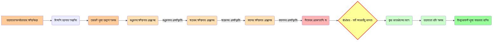

# Class 9 Sanskrit - Shemushi Chapter 105
**Language:** संस्कृतम्

```markdown
# [कक्षा ९] शेमुषी - अध्यायः १०५ - भ्रान्तो बालः

## 🌟 प्रमुख-अवधारणाः (Core Concepts)

अस्मिन् पाठे प्रतिपादिताः प्रमुखाः अवधारणाः अधः दत्ताः सन्ति:

```mermaid
graph TD
    A[भ्रान्तः बालः (पाठस्य केन्द्रीयभावः)] --> B(कर्तव्यस्य महत्त्वम्);
    A --> C(समयस्य सदुपयोगः);
    A --> D(आलस्यस्य दुष्परिणामाः);
    B --> E(सर्वेषां प्राणिनां स्वकार्येषु संलग्नता);
    C --> F(वृथा कालक्षेपस्य त्यागः);
    D --> G(नैराश्यम् एकाकीपनं च);
    E --> H(बालकस्य बोधोदयः);
    F --> H;
    G --> H;
    H --> I(विद्याभ्यासे प्रवृत्तिः);
    I --> J(सफलता प्राप्तिः);

    style A fill:#f9f,stroke:#333,stroke-width:2px
    style B fill:#ccf,stroke:#333,stroke-width:1px
    style C fill:#ccf,stroke:#333,stroke-width:1px
    style D fill:#ccf,stroke:#333,stroke-width:1px
    style E fill:#9cf,stroke:#333,stroke-width:1px
    style F fill:#9cf,stroke:#333,stroke-width:1px
    style G fill:#9cf,stroke:#333,stroke-width:1px
    style H fill:#fcc,stroke:#333,stroke-width:2px
    style I fill:#9fc,stroke:#333,stroke-width:1px
    style J fill:#cfc,stroke:#333,stroke-width:1px
```

**📊 अवधारणा-सोपानम्:**
1.  **स्वकर्तव्यपालनम्:** प्रत्येकं जीवः स्वस्य कर्तव्ये निरतः अस्ति।
2.  **समयस्य मूल्यम्:** समयः अमूल्यः अस्ति, तस्य वृथा क्षेपः न करणीयः।
3.  **आलस्यं परित्यज्य कर्मण्यता:** आलस्यं त्यक्त्वा स्वकर्मणि संलग्नता एव जीवनस्य सार्थकता।
4.  **बोधप्राप्तिः:** यथार्थं ज्ञात्वा सत्पथे प्रवृत्तिः।

## 📘 मुख्य-शिक्षणीय-बिन्दवः (Key Learnings)

अयं पाठः एकां रोचककथां वर्णयति यस्यां कश्चन आलसी बालः पठनात् विमुखः भूत्वा क्रीडितुम् इच्छति। परन्तु तस्य मित्राणि, मधुकरः, चटकः, श्वानः च सर्वे स्व-स्व कार्येषु व्यस्ताः सन्ति, तेन सह क्रीडितुं कोऽपि न आगच्छति। अनेन बालः अन्ते स्वस्य भ्रान्तिं जानाति यत् संसारे सर्वेऽपि स्वकर्तव्यं पालयन्ति, अतः तेनापि स्वकर्तव्यं (अध्ययनम्) पालनीयम्।

**📈 बालकस्य विचारयात्रा (Boy's Thought Journey):**



**मुख्यशिक्षणाणि:**
1.  **कर्तव्यनिष्ठा:** यथा मधुकरः मधुसंग्रहे, चटकः नीडनिर्माणे, श्वानः स्वामिरक्षायां च व्यस्ताः आसन्, तथैव सर्वेषां स्वकर्तव्येषु निष्ठा आवश्यकी।
2.  **समयस्य महत्त्वम्:** यः समयस्य दुरुपयोगं करोति, सः जीवने पश्चात्तापं प्राप्नोति। बालकः अन्ते समयस्य मूल्यं ज्ञातवान्।
3.  **सङ्गत्याः प्रभावः:** यद्यपि बालकेन सह क्रीडितुं कोऽपि पशु-पक्षी न आसीत्, तथापि तेषां कर्मण्यता दृष्ट्वा सः प्रेरितः अभवत्।
4.  **आत्मबोधः परिवर्तनं च:** स्वदोषान् ज्ञात्वा, तान् दूरीकृत्य सम्यक् मार्गे चलनमेव वास्तविकं परिवर्तनम्।

## 🧩 सक्रिय-अधिगमः (Active Learning)

**🔍 क्रियाकलापः (Activity): शोध-आधारित-प्रकरण-अध्ययन-विश्लेषणम् (Research-based Case Study Analysis)**
*   छात्रसमूहाः विभिन्नेषु क्षेत्रेषु (यथा - क्रीडा, कला, विज्ञानम्, समाजसेवा) सफलव्यक्तिनां जीवनवृत्तान्तान् अन्विष्य, तेषां सफलतायां 'समयस्य सदुपयोगस्य' तथा 'कर्तव्यनिष्ठायाः' किं योगदानम् आसीत् इति विषये एकं संक्षिप्तं प्रतिवेदनं प्रस्तुवन्तु। (उदा. - ए.पी.जे. अब्दुल कलामस्य जीवनम्, सचिन तेन्दुलकरस्य परिश्रमः)।

**🌍 परिचर्चा (Discussion): वास्तविक-जगति प्रभावस्य आलोचनात्मकं विश्लेषणम् (Critical Analysis of Real-world Impacts)**
*   **विषयः:** "आलस्यं कथं व्यक्तिस्य समाजस्य च प्रगतौ बाधकं भवति?" (How does laziness hinder the progress of an individual and society?)
    *   छात्रैः स्वानुभवाः, समाजे दृष्टाः घटनाः (उदा. - परीक्षासु छात्राणाम् असफलता, सार्वजनिककार्येषु विलम्बः) च आधारीकृत्य चर्चा करणीया।
    *   "कर्मण्येवाधिकारस्ते मा फलेषु कदाचन" (भगवद्गीता) - अस्य वचनस्य आधुनिकसन्दर्भे का प्रासंगिकता अस्ति? इति विषये विचाराः प्रकटनीयाः।

## 📝 मूल्याङ्कन-सिद्धता (Assessment Prep)

*   **प्रकरण-अध्ययनम् (Case Studies):**
    *   पाठस्य आधारेण बालकस्य चरित्रचित्रणं कुर्वन्तु। तस्य स्वभावपरिवर्तनस्य कारणानि लिखन्तु।
    *   मधुकरस्य, चटकस्य, श्वानस्य च प्रतिक्रियाः तेषां कर्तव्यनिष्ठां कथं प्रदर्शयन्ति? विश्लेषणं कुर्वन्तु।
*   **रेखाचित्राणि/प्रवाहचित्राणि (Diagrams):**
    *   उपर्युक्तं 'बालकस्य विचारयात्रा' प्रवाहचित्रं स्मृत्वा तस्य व्याख्यां कर्तुं सज्जाः भवन्तु।
    *   'समयस्य सदुपयोगः' बनाम 'समयस्य दुरुपयोगः' इत्यनयोः परिणामान् दर्शयत् एकं तुलनात्मकं चित्रं रचयन्तु।
*   **व्याकरणम्:**
    *   पाठे प्रयुक्तानां **'सति सप्तमी'** (यथा - *gBekpjfr ckys*) तथा **'बहुव्रीहि-समासस्य'** (यथा - *HkXueuksjFk%*, *nÙkn`f"V%*) उदाहरणानाम् अभ्यासः करणीयः। (पाठस्य अन्ते 'भाषिकविस्तारः' द्रष्टव्यः)।
    *   **विशेषण-विशेष्य-पदानि** चित्वा लिखत (यथा - *f[kUu% cky%*, *Loknwu~ Hk{;doyku~*)।

## 🌏 भारतीय-सन्दर्भः (Bharatiya Context)

अयं पाठः भारतीय-संस्कृतौ निहितमूल्यानां सुन्दरं प्रतिनिधित्वं करोति:
1.  **कर्मयोगः:** भगवद्गीतायां प्रतिपादितं 'कर्मण्येवाधिकारस्ते' इति सिद्धान्तस्य सरलम् उदाहरणम् अत्र दृश्यते। प्रत्येकं जीवः स्वकर्मणि रतः अस्ति। मधुकरः, चटकः, श्वानः च स्वधर्मं (कर्तव्यम्) पालयन्ति।
2.  **समयस्य मूल्यम्:** भारतीयपरम्परायां 'कालः' देवतास्वरूपः मन्यते। तस्य व्यर्थं यापनं न उचितम्। बालकस्य बोधोदयः अस्यैव मूल्यस्य प्रतिध्वनिः अस्ति।
3.  **विद्यायाः महत्त्वम्:** "विद्याधनं सर्वधनप्रधानम्"। बालकः अन्ते विद्यार्जनस्य मार्गे प्रवृत्तः भूत्वा महतीं सफलतां प्राप्नोति, यत् भारतीयसमाजे विद्यायाः प्रतिष्ठां दर्शयति।
4.  **प्रकृतिः शिक्षिका:** पशुपक्षिणः अपि मनुष्यं कर्तव्यपालनस्य शिक्षां ददति। भारतीयचिन्तने प्रकृतिः सदैव मार्गदर्शिका रूपेण स्वीकृता अस्ति। (उदा. पञ्चतन्त्रकथाः)।
5.  **राष्ट्रीय-आर्थिक/सामाजिक-आंकडा (National Economic/Social Data - *Illustrative Connection*):** यद्यपि पाठः प्रत्यक्षतः आर्थिक-आंकडैः सह न सम्बद्धः, तथापि अस्य मूलसन्देशः (कर्तव्यनिष्ठा, समयस्य सदुपयोगः) देशस्य आर्थिक-सामाजिक-प्रगत्याः आधारशिला अस्ति। यदि प्रत्येकः नागरिकः (छात्रः, श्रमिकः, अधिकारी) स्वकर्तव्यं सम्यक् पालयेत्, तर्हि **भारतस्य सकल-घरेलु-उत्पादने (GDP)** वृद्धिः, **मानव-विकास-सूचकाङ्के (HDI)** च उन्नतिः अवश्यं भवेत्। आलस्यं, कार्येषु विलम्बः च देशस्य प्रगतौ बाधकाः भवन्ति।

*(**टिप्पणी:** 'आर्थिक-आंकडा' इति सन्दर्भः निर्देशानुसारं योजितः, परन्तु पाठस्य मुख्यभावः नैतिक-सामाजिकः अस्ति।)*
```