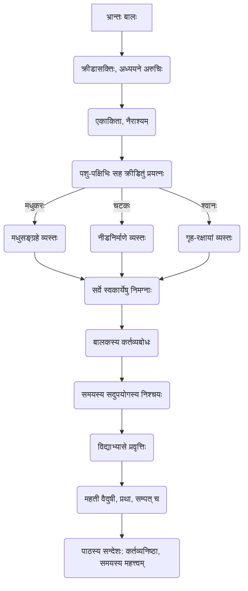

# Class 9 Sanskrit - Shemushi Chapter 105
**Language:** संस्कृतम्

```markdown
# [कक्षा ९] शेमुषी - पाठः १०५ - भ्रान्तः बालः

## 🌟 आधारभूताः अवधारणाः (Core Concepts)

अस्मिन् पाठे प्रस्तुताः मुख्याः विचाराः एवं सन्ति:

1.  **बालकस्य स्वभावः** 👦
    *   क्रीडायां रुचिः (Interest in playing)
    *   अध्ययनात् विमुखता (Aversion to studies)
    *   एकाकितायाः अनुभवः (Feeling of loneliness)
2.  **समयस्य महत्त्वम्** ⏳
    *   बालकेन समयस्य दुरुपयोगः (Boy's misuse of time)
    *   इतरैः प्राणिभिः स्व-स्वकार्येषु संलग्नता (Other creatures engaged in their duties)
    *   समयस्य सदुपयोगस्य आवश्यकतायाः बोधः (Realization of the need for proper time utilization)
3.  **कर्तव्यनिष्ठायाः महत्त्वम्** 💪
    *   सर्वेषां प्राणिनां स्वकर्तव्येषु तत्परता (All creatures dedicated to their duties)
        *   मधुकरः -> मधुसङ्ग्रहः 🐝 (Bee -> Honey collection)
        *   चटकः -> नीडनिर्माणम् 🐦 (Sparrow -> Nest building)
        *   श्वानः -> स्वामिनः गृहस्य रक्षा 🐕 (Dog -> Guarding master's house)
    *   बालकस्य कर्तव्यबोधः (Boy's realization of duty) -> अध्ययनं प्रति प्रवृत्तिः (Inclination towards studies)
4.  **परिश्रमस्य फलम्** 🏆
    *   विद्यार्जनं प्रति बालकस्य निश्चयः (Boy's resolve towards learning)
    *   अन्ते सफलता प्राप्तिः (Achieving success in the end) -> वैदुषी, प्रथा, सम्पत् च (Scholarship, fame, and wealth)

📊 **अवधारणा-सोपानम् (Concept Hierarchy):**


## 📘 मुख्याः शिक्षाः (Key Learnings)

1.  **कथायाः सारः (Story Summary):**
    *   एकः अलसः बालः पाठशालागमनसमये क्रीडितुम् उद्यानं गच्छति यतः तस्य मित्राणि अध्ययनाय विद्यालयं गन्तुं त्वरां कुर्वन्ति स्म।
    *   सः उद्याने मधुकरं, चटकं, श्वानं च क्रमेण क्रीडार्थम् आह्वयति।
    *   परन्तु सर्वे पशुपक्षिणः स्व-स्वकार्येषु (मधुसङ्ग्रहः, नीडनिर्माणम्, स्वामिगृहस्य रक्षा) व्यस्ताः सन्तः तेन सह क्रीडितुं निराकुर्वन्ति।
    *   अन्ते, सर्वेषां स्वकर्तव्येषु संलग्नतां दृष्ट्वा बालः खिन्नः भवति, स्वस्य समयस्य व्यर्थतां च अवगच्छति।
    *   सः अपि स्वकर्तव्यं (अध्ययनम्) कर्तुं निश्चयं करोति, पाठशालां गच्छति च।
    *   ततः परं सः विद्याव्यसनी भूत्वा महान् विद्वान्, यशस्वी, धनवान् च अभवत्।

2.  **नैतिकशिक्षा (Moral):**
    *   अस्मिन् जगति प्रत्येकं जीवः स्व-स्वकर्तव्येषु संलग्नः अस्ति।
    *   अस्माभिः वृथा समयः न यापनीयः, अपितु स्वकर्तव्यपालने ध्यानं दातव्यम्।
    *   परिश्रमः एव सफलतायाः कुञ्चिका अस्ति। अध्ययनेन एव ज्ञानं, प्रतिष्ठा, सम्पत्तिः च लभ्यते।

3.  **व्याकरणबिन्दवः (Grammar Points):**
    *   **सति सप्तमी / भावे सप्तमी:** यदा एका क्रिया अपरक्रियायाः कालस्य सूचनां ददाति, तदा पूर्वक्रियायाः कर्तरि सप्तमी विभक्तिः प्रयुज्यते।
        *   उदाहरणम्: `हठमाचरति बाले सः मधुकरः अगायत।` (बालकेन हठे आचरिते सति मधुकरः अगायत।) - When the boy insisted, the bee sang.
    *   **बहुव्रीहिसमासः:** यस्मिन् समासे पूर्वपदम् उत्तरपदं च मिलित्वा अन्यपदार्थस्य बोधं कारयतः, सः बहुव्रीहिसमासः भवति।
        *   उदाहरणम्:
            *   `दत्तदृष्टिः` - दत्ता दृष्टिः येन सः (बालः) - One who has cast his glance.
            *   `भग्नमनोरथः` - भग्नः मनोरथः यस्य सः (बालः) - One whose desires are broken.
            *   `पुस्तकदासाः` - पुस्तकानां दासाः (छात्राः) - Slaves of books (Here it's technically षष्ठी तत्पुरुष, but the text might use it loosely or imply a possessive sense fitting Bahuvrihi contextually, though the provided analysis lists it under Bahuvrihi examples in the original text's explanation section, which is unusual. Let's follow the text's implication for this exercise, noting the grammatical nuance. The provided `शब्दार्थाः` correctly identifies it as षष्ठी तत्पुरुष. Let's stick to clearer examples like `दत्तदृष्टिः` and `भग्नमनोरथः`.)

📈 **कथाप्रवाहः (Story Flowchart):**
```mermaid
graph LR
    A[बालः पठनात् विमुखः] --> B(क्रीडितुम् उद्यानं गच्छति);
    B --> C{क्रीडासाथिनः अन्वेषणम्};
    C -- मधुकरम् आह्वयति --> D[मधुकरः निराकरोति (मधुसङ्ग्रहः)];
    C -- चटकम् आह्वयति --> E[चटकः निराकरोति (नीडनिर्माणम्)];
    C -- श्वानम् आह्वयति --> F[श्वानः निराकरोति (स्वामिरक्षा)];
    D & E & F --> G(सर्वे स्वकार्येषु व्यस्ताः);
    G --> H[बालकस्य खिन्नता];
    H --> I(कर्तव्यस्य बोधः);
    I --> J(समयस्य सदुपयोगस्य निश्चयः);
    J --> K[पाठशालां गमनम्];
    K --> L(विद्याव्यसनी भूत्वा सफलता प्राप्तिः);
```

## 🧩 सक्रियम् अधिगमनम् (Active Learning)

1.  **गतिविधिः (Activity): शोध-आधारितं व्यक्ति-अध्ययनम् (Research-based Case Study Analysis) 🔍**
    *   **विषयः:** "परिश्रमेण सफलता" (Success through Hard Work)
    *   **कार्यम्:** एतादृशानां भारतीयानां विषये शोधं कुरुत ये प्रारम्भिकजीवने समयं व्यर्थं यापितवन्तः स्युः अथवा अनेकाः बाधाः अनुभूतवन्तः स्युः, परन्तु पश्चात् कठोरेण परिश्रमेण स्वक्षेत्रे महतीं सफलतां प्राप्तवन्तः। (उदा. - धीरूभाई अंबानी, नवाज़ुद्दीन सिद्दीकी, अथवा अन्यः कोऽपि)। तेषां जीवनस्य मुख्यघटनाः, तेषां परिवर्तनस्य कारणानि, तेषां सफलतायाः रहस्यं च विश्लेषयत। एकं संक्षिप्तं वृत्तं लिखत।
    *   **उद्देश्यम्:** परिश्रमस्य, दृढनिश्चयस्य च महत्त्वं वास्तविकजीवनस्य उदाहरणैः अवगन्तुम्।

2.  **विमर्शः (Discussion): वास्तविकजीवने प्रभावस्य विश्लेषणम् (Critical analysis of real-world impacts) 🌍**
    *   **प्रश्नः:** आलस्यस्य (तन्द्रालुतायाः) तथा कर्मण्यतायाः (परिश्रमस्य) व्यक्तिस्य जीवने, समाजे, राष्ट्रे च के प्रभावाः भवन्ति?
    *   **चर्चाबिन्दवः:**
        *   आलस्येन व्यक्तिगतविकासः कथं रुध्यते? (स्वास्थ्यम्, ज्ञानम्, आर्थिकस्थितिः)
        *   कर्मण्यतया व्यक्तिः समाजाय कथं योगदानं करोति?
        *   एकस्य राष्ट्रस्य प्रगतये तस्य नागरिकाणां कर्मण्यता कथम् आवश्यकी? (उदा. - आर्थिकवृद्धिः, सामाजिकसमस्यानां समाधानम्)
        *   'भ्रान्तः बालः' कथायाः सन्देशः अद्यतने युगे कथं प्रासंगिकः अस्ति?
    *   **उद्देश्यम्:** स्वकर्मणः महत्त्वं बृहत्तरे सन्दर्भे (सामाजिके, राष्ट्रिये च) अवगन्तुं, विश्लेषणात्मकचिन्तनं च प्रोत्साहयितुम्।

## 📝 मूल्याङ्कनसिद्धता (Assessment Prep)

*   **कथा-अवबोधः:** पाठस्य कथां, पात्राणां स्वभावं, मुख्यघटनाः च सम्यक् अवगच्छन्तु। 📖
*   **प्रश्नोत्तराणि:** एकपदेन उत्तरत, पूर्णवाक्येन उत्तरत इत्यादीनां प्रश्नानाम् अभ्यासः करणीयः।
*   **सारांशलेखनम्:** कथायाः सारांशं स्वशब्दैः संस्कृतेन अथवा हिन्दी/आङ्ग्लभाषया लेखितुम् अभ्यस्यन्तु।
*   **प्रश्ननिर्माणम्:** स्थूलपदानि आधृत्य प्रश्ननिर्माणस्य अभ्यासः महत्त्वपूर्णः।
*   **शब्दार्थाः:** पाठे आगतानां नवीनानां शब्दानाम् अर्थान् स्मरन्तु। 📝
*   **व्याकरणम्:**
    *   **सति सप्तमी:** लक्षणानि उदाहरणानि च अवगच्छन्तु। वाक्येषु प्रयोगं अभ्यस्यन्तु।
    *   **बहुव्रीहिसमासः:** अस्य समासस्य विग्रहं समस्तपदं च ज्ञातुम् अभ्यासं कुर्वन्तु।
    *   **विशेषण-विशेष्य:** पाठे आगतानि विशेषण-विशेष्यपदानि चित्वा तेषां सम्बन्धम् अवगच्छन्तु।
    *   **विभक्तिप्रयोगः:** 'नमः' योगे चतुर्थी विभक्तेः प्रयोगम् अभ्यस्यन्तु। (यथा - `गुरुभ्यः नमः`)

## 🌏 भारतीयः सन्दर्भः (Bharatiya Context)

*   **कर्मणः महत्त्वम्:** अयं पाठः श्रीमद्भगवद्गीतायाः "कर्मण्येवाधिकारस्ते मा फलेषु कदाचन" इति उपदेशं स्मारयति। स्वकर्तव्यस्य पालनं फलाशां विना करणीयम् इति भारतीयदर्शनस्य महत्त्वपूर्णः अंशः अस्ति। 🕉️
*   **समयस्य मूल्यम्:** भारतीयसंस्कृतौ समयः देवतातुल्यः मन्यते ('कालो हि बलवान्')। अस्य पाठस्य बालः अन्ते समयस्य मूल्यं ज्ञात्वा स्वजीवनं सफलं करोति।
*   **परिश्रमस्य प्रतिष्ठा:** भारतस्य अनेके महापुरुषाः (यथा - महात्मा गान्धी, डॉ. ए.पी.जे. अब्दुल कलामः, सरदार वल्लभभाई पटेलः) स्वस्य परिश्रमेण एव राष्ट्रनिर्माणाय अतुलनीयं योगदानं कृतवन्तः। तेषां जीवनम् अस्मान् कर्मठतां प्रति प्रेरयति। 🇮🇳
*   **राष्ट्रियविकासः:** अद्यत्वे भारतसर्वकारस्य 'कौशलभारतम्' (Skill India), 'आत्मनिर्भरभारतम्' इत्यादयः कार्यक्रमाः नागरिकाणां कर्मकौशलं वर्धयित्वा, तेषां परिश्रमेण राष्ट्रस्य आर्थिक-सामाजिकविकासं साधयितुं लक्ष्यं धारयन्ति। 📊 देशस्य साक्षरतादरस्य वर्धनम्, युवानां उत्पादनकार्येषु संलग्नता च राष्ट्रस्य प्रगतेः सूचकाः सन्ति, यत्र अस्य पाठस्य सन्देशः (समयस्य सदुपयोगः, कर्तव्यनिष्ठा च) अतीव प्रासंगिकः अस्ति।
```