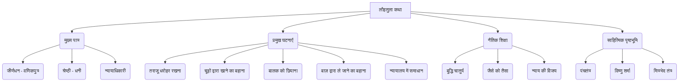

# Class 9 Sanskrit - Shemushi Chapter 106
**Language:** हिंदी

```markdown
# [Class 9] Shemushi - Chapter 106 - लौहतुला

## 🌟 Core Concepts

यह पाठ विष्णु शर्मा द्वारा रचित प्रसिद्ध कथाग्रंथ "पंचतंत्र" के "मित्रभेद" नामक तंत्र से लिया गया है। इसमें बुद्धि और चतुराई से अन्याय का सामना करने और न्याय प्राप्त करने की कहानी है।

1.  **मुख्य कथा (Main Story):**
    *   **पात्र (Characters):**
        *   जीर्णधन (Jirnadhana): एक बुद्धिमान वणिकपुत्र (व्यापारी का बेटा)।
        *   श्रेष्ठी (Shreshthi): एक धनी परन्तु धूर्त व्यक्ति।
        *   धनदेव (Dhanadeva): श्रेष्ठी का पुत्र।
        *   धर्माधिकारी/न्यायाधिकारी (Judge): न्याय करने वाला।
    *   **घटनाक्रम (Sequence of Events):**
        *   जीर्णधन का विदेश जाने से पहले अपनी लोहे की तराजू (लौहतुला) श्रेष्ठी के पास धरोहर (निक्षेप) रखना।
        *   वापस आकर तराजू माँगने पर श्रेष्ठी का बहाना - "तराजू चूहे (मूषक) खा गए"।
        *   जीर्णधन का श्रेष्ठी के पुत्र को स्नान के बहाने ले जाकर गुफा (गिरिगुहा) में छिपाना।
        *   पूछने पर जीर्णधन का उत्तर - "बच्चे को बाज़ (श्येन) उठा ले गया"।
        *   विवाद होने पर न्यायालय (राजकुल) जाना।
        *   न्यायाधीश द्वारा दोनों की बात सुनकर तराजू और बच्चे को वापस दिलवाकर न्याय करना।

2.  **नैतिक शिक्षा (Moral Lesson):**
    *   बुद्धि चातुर्य से धूर्तता का सामना किया जा सकता है (Wit can counter deceit)।
    *   जैसे को तैसा (Tit for tat) - व्यवहार के अनुसार ही प्रतिक्रिया देना।
    *   न्याय की विजय (Triumph of Justice)।
    *   धरोहर का सम्मान (Respect for deposited items/trust)।

3.  **साहित्यिक संदर्भ (Literary Context):**
    *   **पंचतंत्र:** विष्णु शर्मा द्वारा रचित, नीति कथाओं का संग्रह।
    *   **मित्रभेद तंत्र:** पंचतंत्र का पहला भाग, जिससे यह कथा ली गई है।

4.  **व्याकरण बिंदु (Grammar Points):**
    *   'तसिल्' प्रत्यय का प्रयोग (पंचमी विभक्ति के अर्थ में)।
    *   अभितः, परितः, उभयतः, प्रति आदि शब्दों के योग में द्वितीया विभक्ति का प्रयोग।

📊 **मुख्य अवधारणाओं का पदानुक्रम:**



## 📘 Key Learnings

1.  **कथासार (Story Summary):**
    किसी स्थान पर जीर्णधन नामक वणिकपुत्र रहता था। धन की कमी होने पर उसने विदेश जाकर व्यापार करने का सोचा। उसके घर में पूर्वजों की लोहे की बनी एक तराजू (लौहतुला) थी। उसने वह तराजू एक श्रेष्ठी (सेठ) के घर धरोहर (निक्षेप) के रूप में रखी और विदेश चला गया। बहुत समय बाद जब वह अपने नगर वापस लौटा, तो उसने सेठ से अपनी धरोहर वाली तराजू माँगी। सेठ ने कहा, "अरे! वह तो नहीं है, तुम्हारी तराजू को तो चूहे (मूषकैः) खा गए।" जीर्णधन समझ गया कि सेठ झूठ बोल रहा है, पर उसने शांति से कहा, "सेठजी, इसमें आपका दोष नहीं है, यदि चूहे खा गए। यह संसार ऐसा ही है, यहाँ कुछ भी स्थायी नहीं है। पर मैं नदी पर स्नान के लिए जाऊँगा। तुम अपने इस पुत्र धनदेव को स्नान की सामग्री हाथ में देकर मेरे साथ भेज दो।" सेठ ने अपने पुत्र से कहा, "बेटा! ये तुम्हारे चाचा हैं, स्नान के लिए जाएँगे, तुम इनके साथ जाओ।"
    जब जीर्णधन स्नान कर चुका, तो उसने उस बालक को पर्वत की गुफा (गिरिगुहा) में छिपा दिया और गुफा के द्वार को एक बड़ी चट्टान (बृहत्शिला) से ढककर शीघ्र घर लौट आया। सेठ ने पूछा, "अरे अतिथि! बताओ मेरा शिशु कहाँ है जो तुम्हारे साथ नदी पर गया था?" जीर्णधन ने कहा, "तुम्हारे पुत्र को नदी तट से बाज़ (श्येन) उठाकर ले गया।" सेठ क्रोधित होकर बोला, "झूठे! क्या कभी बाज़ बालक को उठाकर ले जा सकता है? मेरा पुत्र लौटाओ, नहीं तो मैं राजदरबार में शिकायत करूँगा।" जीर्णधन ने कहा, "अरे सत्यवादी! जैसे बाज़ बालक को नहीं ले जा सकता, वैसे ही चूहे भी लोहे की बनी तराजू को नहीं खा सकते। तो मेरी तराजू लौटा दो, यदि पुत्र से प्रयोजन है।"
    इस प्रकार झगड़ते हुए वे दोनों राजदरबार (राजकुलम्) पहुँचे। वहाँ न्यायाधीश (धर्माधिकारी) ने पूरी बात सुनी। जीर्णधन ने समझाया, "राजन! जहाँ हज़ार किलो लोहे की तराजू को चूहे खा जाते हैं, वहाँ बाज़ बालक को उठा ले जाए, इसमें क्या आश्चर्य?" न्यायाधीश हँस पड़े और उन्होंने दोनों को समझा-बुझाकर तराजू और बालक का आदान-प्रदान करवाकर संतुष्ट किया।

2.  **नैतिक शिक्षा एवं महत्त्व (Moral Lesson & Importance):**
    *   यह कथा सिखाती है कि यदि कोई आपके साथ छल करे, तो घबराने की बजाय बुद्धि और युक्ति से उसका सामना करना चाहिए। जीर्णधन ने श्रेष्ठी के झूठ का जवाब उसी के तरीके से दिया।
    *   **सत्यनिष्ठा का महत्व:** धरोहर या अमानत में रखी वस्तु को पूरी ईमानदारी से वापस करना चाहिए। श्रेष्ठी ने लालच में झूठ बोला।
    *   **न्याय:** अंत में न्याय की जीत होती है। न्यायालय ने दोनों पक्षों को सुनकर उचित निर्णय दिया।
    *   **पंचतंत्र का उद्देश्य:** यह कथा पंचतंत्र के मूल उद्देश्य – व्यवहारिक ज्ञान और नीति सिखाना – को दर्शाती है।

3.  **व्याकरण बिंदु (Grammar Points):**
    *   **तसिल् (त:) प्रत्यय:** यह प्रत्यय पंचमी विभक्ति (से / अलग होने के अर्थ में) के स्थान पर प्रयोग होता है।
        *   उदाहरण: ग्रामात् -> ग्राम**तः** (गाँव से), आदितः (आरम्भ से), प्रथमतः (पहले से)। पाठ में 'आदितः' (आरम्भ से) शब्द आया है जब जीर्णधन ने न्यायाधीश को *शुरू से* सारी घटना बताई (आदितः सर्वं वृत्तान्तं न्यवेदयत्)।
    *   **द्वितीया विभक्ति का विशेष प्रयोग:** कुछ अव्ययों (indeclinables) और शब्दों के साथ हमेशा द्वितीया विभक्ति लगती है।
        *   **शब्द:** अभितः (दोनों ओर), परितः (चारों ओर), उभयतः (दोनों ओर), सर्वतः (सब ओर), समया (समीप), निकषा (निकट), हा (हाय!), प्रति (की ओर)।
        *   **उदाहरण (पाठ से संबंधित):**
            *   `नदीं प्रति` (नदी की ओर) - `सः बालकं स्नानार्थं नदीं प्रति नयति।`
            *   `राजकुलं प्रति` (राजदरबार की ओर) - `तौ विवादमानौ राजकुलं प्रति गतौ।`

    📈 **कथा प्रवाह चित्र (Story Flowchart):**

    ```mermaid
    graph LR
        A[जीर्णधन का विदेश गमन] --> B(लौहतुला श्रेष्ठी के पास धरोहर);
        B --> C(जीर्णधन का वापस आना);
        C --> D{तराजू माँगना};
        D --> E[श्रेष्ठी का बहाना: चूहे खा गए];
        E --> F(जीर्णधन का प्रत्युत्तर: बालक को स्नान हेतु ले जाना);
        F --> G[बालक को गुफा में छिपाना];
        G --> H{श्रेष्ठी द्वारा बालक के बारे में पूछना};
        H --> I[जीर्णधन का बहाना: बाज़ ले गया];
        I --> J(विवाद);
        J --> K[न्यायालय गमन];
        K --> L(न्यायाधीश द्वारा सत्य जानना);
        L --> M[न्याय: तराजू और बालक का आदान-प्रदान];
    ```

## 🧩 Active Learning

1.  **Activity: शोध-आधारित केस स्टडी विश्लेषण (Research-based Case Study Analysis) 🔍**
    *   **कार्य:** आजकल के जीवन में या समाचारों में ऐसी घटनाओं को खोजें जहाँ किसी व्यक्ति ने जीर्णधन की तरह चतुराई या कानूनी युक्ति का प्रयोग करके किसी धोखेधड़ी या अन्याय का सामना किया हो।
    *   **विश्लेषण:** उस स्थिति का वर्णन करें, व्यक्ति द्वारा अपनाई गई रणनीति क्या थी, और उसका परिणाम क्या हुआ? जीर्णधन की कहानी से उसकी तुलना करें। अपनी खोज को कक्षा में प्रस्तुत करें।
    *   **उद्देश्य:** कहानी की शिक्षा को समकालीन परिदृश्यों से जोड़ना और समस्या-समाधान कौशल का मूल्यांकन करना।

2.  **Discussion: वास्तविक प्रभावों का आलोचनात्मक विश्लेषण (Critical Analysis of Real-world Impacts) 🌍**
    *   **चर्चा बिंदु:**
        *   क्या जीर्णधन द्वारा श्रेष्ठी के पुत्र को छिपाना नैतिक रूप से सही था? क्या उसके पास कोई और विकल्प था? (Evaluating)
        *   यदि श्रेष्ठी सच बोल रहा होता (कि चूहे वास्तव में कुछ नुकसान कर सकते हैं, भले ही लोहे की तराजू नहीं), तो कहानी कैसे बदलती?
        *   आज के समाज में, यदि कोई आपकी अमानत वापस न करे तो आप क्या कानूनी या सामाजिक कदम उठा सकते हैं? (Creating solutions)
        *   पंचतंत्र जैसी कहानियाँ आज भी प्रासंगिक क्यों हैं? वे हमें क्या सिखाती हैं?
    *   **उद्देश्य:** नैतिक दुविधाओं पर विचार करना, वैकल्पिक समाधानों का सृजन करना, और कहानी की सार्वभौमिक प्रासंगिकता का मूल्यांकन करना।

## 📝 Assessment Prep

इस पाठ से परीक्षा की तैयारी के लिए निम्नलिखित बिंदुओं पर ध्यान दें:

1.  **कथा-आधारित प्रश्न:**
    *   **एक शब्द में उत्तर (Ek Paden Uttara):** जैसे - वणिकपुत्र का नाम क्या था? (जीर्णधनः), तराजू कैसी थी? (लौहघटिता)
    *   **पूर्ण वाक्य में उत्तर (Purnavakyen Uttara):** जैसे - जीर्णधन ने विदेश जाने की इच्छा क्यों की? (विभवक्षयात्), श्रेष्ठी ने तराजू के विषय में क्या कहा? (तव तुला मूषकैः भक्षिता)
    *   **प्रश्न निर्माण (Prashna Nirman):** रेखांकित शब्दों के आधार पर प्रश्न बनाना। जैसे - `जीर्णधनः` विदेश गया। -> `कः` विदेशं गतः? `बृहत्शिलया` द्वारं पिधाय... -> `कया` द्वारं पिधाय...?

2.  **श्लोकों का अन्वय (Anvaya of Shlokas):** पाठ में आए श्लोकों (जैसे - `यत्र देशेऽथवा स्थाने...`, `तुलां लौहसहस्रस्य...`) का अन्वय पूरा करना। अन्वय का अर्थ है कर्ता, कर्म, क्रिया आदि को सही क्रम में लगाना।

3.  **व्याकरण (Grammar):**
    *   **सन्धि/सन्धि-विच्छेद:** जैसे - श्रेष्ठीकथयत् = श्रेष्ठी + अकथयत्, पुरुषोपार्जिता = पुरुष + उपार्जिता।
    *   **समास/विग्रह:** जैसे - स्नानस्य उपकरणम् = स्नानोपकरणम्, गिरेः गुहायाम् = गिरिगुहायाम्।
    *   **प्रत्यय पहचान:** विशेष रूप से 'ल्यप्' प्रत्यय (जैसे - विहस्य, संबोध्य, आदाय) और 'तसिल्' प्रत्यय (जैसे - आदितः)।
    *   **विभक्ति प्रयोग:** विशेष रूप से द्वितीया विभक्ति का प्रयोग (अभितः, परितः, प्रति आदि के साथ) और षष्ठी विभक्ति की पहचान।

4.  **कथा का सारांश (Story Summary):** दिए गए शब्दों की सहायता से या स्वतंत्र रूप से कथा का सार संस्कृत या हिंदी में लिखना।

📝 **केस स्टडी के रूप में कथा:** यह कहानी एक विवाद (conflict) और उसके समाधान (resolution) का उत्कृष्ट उदाहरण है। इसे एक केस स्टडी के रूप में समझा जा सकता है:
*   **समस्या:** धरोहर वापस न मिलना, झूठ बोलना।
*   **प्रतिक्रिया:** चतुराईपूर्ण युक्ति (जैसे को तैसा)।
*   **समाधान:** न्यायालय द्वारा हस्तक्षेप और न्याय।

## 🌏 Bharatiya Context

1.  **पंचतंत्र का योगदान (Contribution of Panchatantra) 📊:** पंचतंत्र भारतीय साहित्य की एक अमूल्य निधि है। यह विश्व की अनेक भाषाओं में अनुवादित हुई है और इसने कथा साहित्य के माध्यम से नीति और व्यवहार कुशलता का ज्ञान पूरी दुनिया में फैलाया है। यह भारतीय ज्ञान परम्परा का एक महत्वपूर्ण हिस्सा है।

2.  **व्यापार और धरोहर की परंपरा (Tradition of Trade and Trust) 📊:** भारत में प्राचीन काल से ही वाणिज्य (व्यापार) का महत्वपूर्ण स्थान रहा है। वणिक (व्यापारी) समुदाय और एक-दूसरे पर विश्वास करके धरोहर (निक्षेप) रखने की प्रथा भारतीय सामाजिक-आर्थिक व्यवस्था का अंग रही है। यह कहानी उस समय की व्यापारिक ईमानदारी और उसके उल्लंघन के परिणामों को दर्शाती है।

3.  **न्याय और धर्म (Justice and Dharma) ⚖️:** कहानी में धर्माधिकारी (न्यायाधीश) का निर्णय भारतीय न्याय-परंपरा को दर्शाता है, जहाँ सत्य और तर्क के आधार पर उचित निर्णय लिया जाता था। 'धर्म' की व्यापक अवधारणा में न्याय भी शामिल है।

4.  **लोक कथाओं का महत्व (Importance of Folk Tales) 📊:** पंचतंत्र जैसी लोक कथाएँ भारतीय समाज में मूल्यों (values), नैतिकता (ethics) और बुद्धिमत्ता (wisdom) को पीढ़ी-दर-पीढ़ी हस्तांतरित करने का सशक्त माध्यम रही हैं। ये कहानियाँ मनोरंजन के साथ-साथ जीवन जीने की कला सिखाती हैं।
```