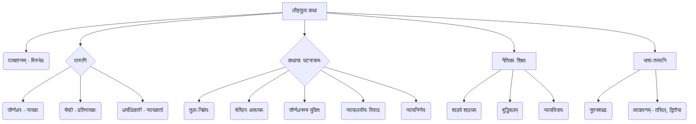
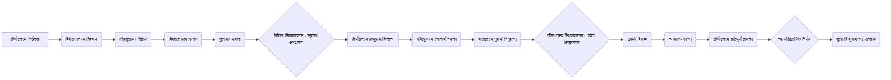

# Class 9 Sanskrit - Shemushi Chapter 106
**Language:** संस्कृतम्

```markdown
# [नवमी कक्षा] शेमुषी - पाठः १०६ - लौहतुला

## 🌟 प्रमुख-अवधारणाः (Core Concepts)

अस्मिन् पाठे आगताः प्रमुखाः अवधारणाः अधः दत्ताः सन्ति:

1.  **कथायाः स्रोतः**:
    *   विष्णुशर्मणा विरचितं "पञ्चतन्त्रम्" (कथाग्रन्थः)।
    *   "मित्रभेद" नामकं तन्त्रम्।
2.  **पात्राणि**:
    *   **जीर्णधनः**: निर्धनः वणिक्पुत्रः, बुद्धिमान्।
    *   **श्रेष्ठी**: धनिकः वणिक्, लोभी, कपटी।
    *   **श्रेष्ठिपुत्रः (धनदेवः)**: बालकः।
    *   **धर्माधिकारी/न्यायाधिकारी**: न्यायकर्ता।
3.  **कथावस्तु**:
    *   **निक्षेपरूपेण तुलास्थापनम्**: जीर्णधनस्य विदेशगमनात् पूर्वं स्वस्य लौहतुलायाः श्रेष्ठिनः गृहे निक्षेपरूपेण स्थापनम्।
    *   **श्रेष्ठिनः कपटम्**: जीर्णधनस्य प्रत्यागमनानन्तरं श्रेष्ठिना तुलायाः मूषकैः भक्षणस्य मिथ्याकथनम्।
    *   **जीर्णधनस्य प्रत्युत्तरम् (बुद्धिकौशलम्)**: श्रेष्ठिपुत्रं स्नानार्थं नीत्वा गुहायां निगूहनम्, श्येनेन अपहरणस्य मिथ्याकथनम्।
    *   **विवादः न्यायश्च**: उभयोः विवादः, न्यायालयगमनम्, जीर्णधनस्य तर्कपूर्णं कथनम् ("तुलां लौहसहस्रस्य..."), न्यायाधिकारिणः न्यायनिर्णयः (तुला-शिशु-प्रदानम्)।
4.  **नैतिकाः शिक्षाः**:
    *   शाठ्यं प्रति शाठ्यम् (जैसे को तैसा)।
    *   बुद्ध्या कपटस्य निवारणम्।
    *   न्यायस्य विजयः।
    *   लोभस्य दुष्परिणामः।
5.  **भाषा-अंशाः**:
    *   **शब्दावली**: निक्षेपः, लौहघटिता, श्येनः, विवदमानौ, धर्माधिकारी, आदि।
    *   **व्याकरणम्**:
        *   'तसिल्' प्रत्ययस्य प्रयोगः (पञ्चमी विभक्तेः अर्थे - यथा: ग्रामात् = ग्रामतः)।
        *   'अभितः', 'परितः', 'समया', 'निकषा', 'हा', 'प्रति' योगे द्वितीया विभक्तिः।

📊 **अवधारणा-सोपानम् (Concept Hierarchy):**


## 📘 मुख्याः शिक्षाः (Key Learnings)

1.  **कथासारः**: जीर्णधननामकः वणिक्पुत्रः धनक्षयात् विदेशं गन्तुम् इच्छन् स्वस्य पूर्वजैः अर्जितां लौहनिर्मितां तुलां कस्यचित् श्रेष्ठिनः गृहे धरोहररूपेण (निक्षेपरूपेण) स्थापयित्वा गच्छति। विदेशात् प्रत्यागत्य यदा सः स्वतुलां याचते, तदा लोभी श्रेष्ठी वदति यत् तां तुलां मूषकाः अभक्षयन्। जीर्णधनः तस्य कपटं ज्ञात्वा, प्रत्युपायं चिन्तयति। सः श्रेष्ठिनः पुत्रं स्नानार्थं नदीं नयति, तं च पर्वतीयगुहायां गोपयित्वा गृहं प्रत्यागच्छति। श्रेष्ठिना पृष्टः सः वदति यत् तस्य पुत्रं श्येनः (बाजपक्षी) नद्याः तटात् अपहृतवान्।
2.  **विवादस्य समाधानम्**: श्रेष्ठी क्रोधितः भवति, कथयति च यत् श्येनः बालकं हर्तुं न शक्नोति। तदा जीर्णधनः तर्कयति - "भोः सत्यवादिन्! यदि मूषकाः लोहनिर्मितां तुलां खादितुं शक्नुवन्ति, तर्हि श्येनः बालकं कथं न हर्तुं शक्नोति?" (तुलां लौहसहस्रस्य यत्र खादन्ति मूषकाः। राजन् तत्र हरेच्छ्येनो बालकं, नात्र संशयः॥)। उभौ विवदमानौ न्यायालयं गच्छतः। तत्र न्यायाधिकारी सर्वं वृत्तान्तं श्रुत्वा, जीर्णधनस्य बुद्धिं ज्ञात्वा, हसित्वा, उभौ अपि सम्बोध्य तुलायाः तथा शिशोः परस्परं प्रदानेन सन्तुष्टौ करोति।
3.  **नैतिक-सन्देशः**: इयं कथा शिक्षयति यत् लोभः विनाशाय भवति तथा च बुद्धिकौशलेन कपटिनः अपि पराजेतुं शक्यन्ते। सत्यस्य तथा न्यायस्य अन्ते विजयः भवति।
4.  **व्याकरण-ज्ञानम्**:
    *   **तसिल्-प्रत्ययः**: पञ्चमी विभक्तेः स्थाने 'तसिल्' (तः) प्रत्ययः प्रयुज्यते। यथा - ग्रामात् = ग्रामतः, आदितः = आरम्भतः, वृक्षात् = वृक्षतः। अनेन वाक्यरचना सरला भवति।
    *   **द्वितीया-विभक्तिः**: 'अभितः' (दोनों ओर), 'परितः' (चारों ओर), 'समया' (समीप), 'निकषा' (निकट), 'हा' (हाय!), 'प्रति' (की ओर) इत्यादिभिः शब्दैः सह द्वितीया विभक्तिः भवति। यथा - ग्रामं परितः जलम् अस्ति। छात्रः विद्यालयं प्रति गच्छति।

📈 **कथाप्रवाह-चित्रम् (Story Flowchart):**


## 🧩 सक्रिय-अधिगमः (Active Learning)

*   **गतिविधिः (Activity): शोध-आधारित-विश्लेषणम् 🔍**
    *   **विषयः**: "पञ्चतन्त्रस्य अन्यासु कथासु अथवा लोककथासु 'बुद्धिचातुर्येण समस्या-समाधानम्' इति विषयम् अधिकृत्य एकां कथाम् अन्विष्य लिखत। तस्याः कथायाः लौहतुला-कथया सह साम्यं वैषम्यं च प्रदर्शयत।"
    *   **उद्देश्यम्**: विभिन्नासु कथासु नैतिकशिक्षायाः तथा युक्ति-कौशलस्य तुलनात्मकम् अध्ययनम् (Evaluating)। कथालेखनमाध्यमेन सृजनात्मकतायाः विकासः (Creating)।
*   **चर्चा (Discussion): वास्तविक-जगति प्रभावस्य आलोचनात्मक-विश्लेषणम् 🌍**
    *   **प्रश्नः**:
        1.  श्रेष्ठिनः लोभपूर्णं व्यवहारं कथं पश्यन्ति भवन्तः? किं तस्य कार्यं समाजाय उचितम्?
        2.  जीर्णधनस्य प्रत्युपायः (बालकस्य अपहरणम्) किं सर्वथा नैतिकः आसीत्? किं तस्य अन्यः विकल्पः आसीत्?
        3.  अद्यतने समाजे यदि कोऽपि एवं कपटं करोति, तर्हि न्यायप्राप्त्यर्थं के उपायाः सन्ति?
    *   **उद्देश्यम्**: कथायाः नैतिक-पक्षस्य गहन-विश्लेषणम् (Analyzing)। पात्रणां कार्याणाम् औचित्यस्य मूल्यांकनम् (Evaluating)। वर्तमान-सामाजिक-न्याय-व्यवस्थायाः विषये चिन्तनम्।

## 📝 मूल्याङ्कन-सिद्धता (Assessment Prep)

*   **उदाहरण-आधारित-प्रश्नः (Case Study):**
    *   "कल्पयतु यत् कश्चन आपणिकः ग्राहकाय अल्पगुणवत्तायाः वस्तु दत्त्वा अधिकं मूल्यं स्वीकरोति। ग्राहकः एतत् जानाति। लौहतुला-कथायाः आधारेण ग्राहकः किं प्रत्युपायं कर्तुं शक्नोति? अथवा सः किं न्यायपूर्णं मार्गं स्वीकुर्यात्?" अस्य विश्लेषणं कुरुत।
*   **रेखाचित्र-निर्माणम् (Diagram Creation):**
    *   लौहतुला-कथायाः प्रमुख-घटनानां क्रमं दर्शयितुं एकं प्रवाहचित्रं रचयत।
    *   जीर्णधनस्य तथा श्रेष्ठिनः चरित्र-गुणानां तुलनां कुर्वन् एकं तालिकाचित्रं निर्मान्तु।
*   **व्याकरण-अभ्यासः**:
    *   अधोलिखितेषु वाक्येषु 'तसिल्' प्रत्ययस्य प्रयोगं कुरुत:
        *   सः गृहात् आगच्छति। -> ______
        *   वृक्षात् पत्राणि पतन्ति। -> ______
    *   उचितैः शब्दैः सह द्वितीयां विभक्तिं प्रयुज्य रिक्तस्थानानि पूरयत (विद्यालयम्, आपणम्, दुर्जनम्):
        *   ______ परितः वृक्षाः सन्ति।
        *   हा ______!
        *   सः ______ प्रति गच्छति।
*   **श्लोक-व्याख्या**: "तुलां लौहसहस्रस्य..." इति श्लोकस्य आशयं स्वशब्दैः लिखत।

## 🌏 भारतीय-सन्दर्भः (Bharatiya Context)

1.  **पञ्चतन्त्रस्य परम्परा**: पञ्चतन्त्रं भारतस्य विश्वप्रसिद्धः कथाग्रन्थः अस्ति। एषः ग्रन्थः नीतिशास्त्रस्य, व्यवहारज्ञानस्य च शिक्षां मनोरञ्जक-कथामाध्यमेन ददाति। अस्य रचना राजपुत्रान् राजनीति-व्यवहारयोः कुशलान् कर्तुं अभवत्। अस्य प्रभावः विश्वस्य अनेकासु भाषासु साहित्येषु च दृश्यते।
2.  **प्राचीन-वाणिज्य-व्यवहारः**: भारते प्राचीने काले वाणिज्य-व्यवहारेषु 'निक्षेपः' (धरोहर) महत्त्वपूर्णः आसीत्। परस्परं विश्वासः व्यापारस्य आधारः आसीत्। इयं कथा दर्शयति यत् विश्वासघातस्य किं परिणामः भवति तथा च तदानीमपि न्यायव्यवस्था विवाद-समाधानाय आसीत्। वाणिज्ये सत्यनिष्ठायाः महत्त्वम् अद्यापि प्रासंगिकम् अस्ति।
3.  **न्याय-परम्परा**: कथायां 'धर्माधिकारी' अथवा 'न्यायाधिकारी' विवादस्य समाधानं करोति। एतत् भारतस्य सुदीर्घायाः न्यायपरम्परायाः सङ्केतः अस्ति, यत्र सत्यस्य अन्वेषणं कृत्वा, तर्कस्य आधारेण, उभयोः पक्षयोः श्रवणानन्तरं न्यायः प्रदीयते स्म।
4.  **सामाजिक-मूल्यानि**: कथायां प्रतिपादितं यत् लोभः, कपटः च सामाजिक-सम्बन्धान् दूषयति। बुद्धिचातुर्येण असत्यस्य प्रतिकारः, अन्ते च न्यायस्य प्रतिष्ठापनं भारतीय-मूल्य-परम्परायाः अभिन्नम् अङ्गम् अस्ति।

```