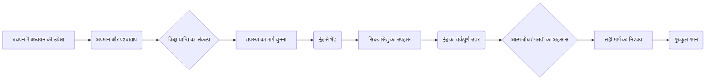

# Class 9 Sanskrit - Shemushi Chapter 107
**Language:** हिंदी

```markdown
# [कक्षा 9] शेमुषी - अध्याय 107 - सिकतासेतुः (रेत का पुल)

यह नाट्यांश सोमदेव द्वारा रचित प्रसिद्ध कथाग्रंथ "कथासरित्सागर" के सातवें अध्याय (लम्बक) पर आधारित है। इसमें तपस्या के द्वारा विद्या प्राप्त करने का प्रयास कर रहे तपोदत्त नामक कुमार की कहानी है। उसका मार्गदर्शन करने के लिए देवराज इंद्र पुरुष का वेश धारण कर आते हैं और नदी में बालू से पुल बनाने का प्रयास करते हैं। तपोदत्त उनका उपहास करता है, जिस पर इंद्र उसे समझाते हैं कि यदि बिना पढ़े-लिखे, केवल तपस्या से विद्या प्राप्त की जा सकती है, तो बालू से पुल भी बनाया जा सकता है। यह सुनकर तपोदत्त को अपनी भूल का एहसास होता है और वह विद्या प्राप्ति के लिए गुरुकुल चला जाता है।

## 🌟 मुख्य अवधारणाएँ (Core Concepts)

यहाँ प्रस्तुत है अवधारणाओं का विस्तृत पदानुक्रम:

1.  **ज्ञान प्राप्ति (विद्या प्राप्ति):**
    *   **महत्त्व:** जीवन में सफलता और सम्मान के लिए आवश्यक।
    *   **उचित मार्ग:**
        *   **अध्ययन:** विषयों को पढ़ना और समझना।
        *   **श्रवण:** गुरुओं और विद्वानों से सुनना।
        *   **लिप्यक्षरज्ञान:** लिपि और अक्षरों का ज्ञान (लिखना-पढ़ना)।
        *   **अभ्यास:** निरंतर प्रयास करना।
        *   **गुरुकुल गमन:** गुरु के पास जाकर शिक्षा ग्रहण करना।
        *   **पुरुषार्थ (परिश्रम):** सही दिशा में कठिन परिश्रम करना।
    *   **अनुचित मार्ग:**
        *   **केवल तपस्या:** बिना अध्ययन के सिर्फ तपस्या करना (विद्या प्राप्ति के लिए व्यर्थ)।
        *   **शॉर्टकट (Shortcut):** बिना परिश्रम के लक्ष्य पाने की कोशिश करना।

2.  **प्रतीकात्मकता (Symbolism):**
    *   **सिकतासेतु (रेत का पुल):** असंभव या व्यर्थ कार्य का प्रतीक; बिना उचित प्रयास के लक्ष्य पाने की कोशिश।
    *   **इंद्र का कार्य:** तपोदत्त को उसकी गलती का अहसास कराने का माध्यम।

3.  **नैतिक शिक्षा (Moral Lesson):**
    *   **परिश्रम का महत्त्व:** सफलता के लिए सही विधि और कठिन परिश्रम अनिवार्य है।
    *   **ज्ञान का सही मार्ग:** विद्या अध्ययन, अभ्यास और गुरु के मार्गदर्शन से ही प्राप्त होती है।
    *   **आत्म-बोध (Self-Realization):** अपनी गलतियों को समझना और सुधारना।

4.  **पात्र परिचय:**
    *   **तपोदत्तः** वह नायक जो बचपन में पढ़ाई से भागा और अब तपस्या से विद्या पाना चाहता है।
    *   **इंद्र:** देवराज, जो पुरुष वेश में तपोदत्त को सही राह दिखाते हैं।

## 📘 प्रमुख शिक्षाएँ (Key Learnings)

इस अध्याय से हमें निम्नलिखित प्रमुख बातें सीखने को मिलती हैं:

1.  **लक्ष्य प्राप्ति के लिए सही साधन आवश्यक हैं:** जैसे पुल बनाने के लिए पत्थर चाहिए, रेत नहीं, वैसे ही विद्या प्राप्ति के लिए अध्ययन, श्रवण, और अभ्यास रूपी साधन चाहिए, केवल तपस्या नहीं।
    *   **तुलना:**
        *   `तपस्या द्वारा विद्या पाना` ⟺ `रेत (सिकता) से पुल (सेतु) बनाना`
        *   दोनों ही प्रयास व्यर्थ और असंभव हैं।

2.  **बचपन में की गई गलतियों का परिणाम:** तपोदत्त बचपन में पिता के समझाने पर भी नहीं पढ़ा, जिसके कारण उसे मित्रों, परिवारजनों से अपमानित होना पड़ा। यह शिक्षा के महत्त्व को दर्शाता है।

3.  **पुरुषार्थ का महत्त्व:** इंद्र तपोदत्त को समझाते हैं कि बिना प्रयास (पुरुषार्थ) के लक्ष्य प्राप्त नहीं होता (`पुरुषार्थैरेव लक्ष्यं प्राप्यते`)। केवल इच्छा करने या तपस्या करने से ज्ञान नहीं मिलता।

4.  **गुरु का महत्त्व और गुरुकुल परम्परा:** अंत में तपोदत्त को समझ आता है कि विद्या प्राप्ति के लिए गुरु के पास जाना (`गुरुगृहं गत्वैव विद्याभ्यासो मया करणीयः`) ही सही मार्ग है। यह भारतीय गुरु-शिष्य परम्परा के महत्त्व को उजागर करता है।

5.  **आत्म-विश्लेषण और सुधार:** इंद्र के व्यंग्य से तपोदत्त को अपनी मूर्खता का अहसास होता है (`उम्मीलितं मे नयनयुगलम्`) और वह सही मार्ग अपनाने का निश्चय करता है।

**रेखाचित्र (Diagram): तपोदत्त की यात्रा**



**रेखाचित्र (Diagram): सादृश्य (Analogy)**

```mermaid
graph TD
    subgraph व्यर्थ प्रयास (Futile Effort)
        A(केवल तपस्या से विद्या पाना)
        B(बालू से पुल बनाना)
    end
    A <--> B;
```

## 🧩 सक्रिय अधिगम (Active Learning)

1.  **गतिविधि: शोध-आधारित केस स्टडी विश्लेषण (Research-based Case Study Analysis) 🔍**
    *   **विषय:** "तपोदत्त का मामला: शॉर्टकट बनाम सही प्रयास"।
    *   **कार्य:** पाठ के आधार पर तपोदत्त के चरित्र का विश्लेषण करें।
        *   उसकी प्रारंभिक सोच क्या थी?
        *   उसने तपस्या का मार्ग क्यों चुना?
        *   इंद्र के हस्तक्षेप ने उसकी सोच को कैसे बदला?
        *   यदि आप इंद्र की जगह होते, तो तपोदत्त को कैसे समझाते?
    *   **शोध:** कथासरित्सागर या पंचतंत्र की अन्य कहानियों को खोजें जहाँ परिश्रम और सही मार्ग के महत्त्व पर बल दिया गया हो। उनकी तुलना तपोदत्त की कहानी से करें।

2.  **चर्चा: वास्तविक दुनिया के प्रभावों का आलोचनात्मक विश्लेषण (Critical Analysis of Real-World Impacts) 🌍**
    *   **प्रश्न:** क्या आज के जीवन में भी लोग तपोदत्त जैसी गलतियाँ करते हैं? उदाहरण दें (जैसे - बिना पढ़े परीक्षा पास करने की कोशिश, बिना अभ्यास के कौशल पाने की इच्छा)।
    *   "सफलता का कोई शॉर्टकट नहीं होता" - इस कथन पर कक्षा में चर्चा करें।
    *   ज्ञान/कौशल प्राप्ति में परिश्रम, सही मार्गदर्शन (गुरु/शिक्षक/mentor), और निरंतर अभ्यास की भूमिका पर अपने विचार व्यक्त करें।
    *   क्या केवल प्रतिभा या भाग्य परिश्रम का स्थान ले सकते हैं? तर्क सहित उत्तर दें।

## 📝 मूल्यांकन तैयारी (Assessment Prep)

*   **केस स्टडी (Case Studies):**
    *   तपोदत्त की स्थिति का विश्लेषण करें: समस्या, उसका गलत समाधान, इंद्र का हस्तक्षेप, और अंतिम परिणाम।
    *   एक काल्पनिक स्थिति पर विचार करें: एक छात्र जो संगीत सीखना चाहता है लेकिन रियाज़ करने के बजाय केवल प्रार्थना करता है। तपोदत्त की कहानी के आधार पर उसे क्या सलाह देंगे?
*   **रेखाचित्र (Diagrams):**
    *   ऊपर दिए गए तपोदत्त की यात्रा और सादृश्य (Analogy) वाले रेखाचित्रों को समझें और बनाने का अभ्यास करें। ये कहानी के सार को समझने में मदद करते हैं।
*   **महत्वपूर्ण प्रश्न:**
    *   तपोदत्त क्यों दुखी था?
    *   उसने विद्या प्राप्ति के लिए क्या मार्ग चुना?
    *   इंद्र ने रेत से पुल बनाने का प्रयास क्यों किया?
    *   इंद्र के किस कथन से तपोदत्त को अपनी भूल का अहसास हुआ?
    *   कहानी का मुख्य संदेश क्या है?
    *   `सिकतासेतुः` का प्रतीकात्मक अर्थ क्या है?
    *   व्याकरण संबंधी प्रश्न (पाठ पर आधारित): सर्वनाम पद किसके लिए प्रयुक्त हुए, किसने किससे कहा, प्रश्न निर्माण, समास विग्रह/समस्त पद, अव्यय पदों (अलम्, अनु, विना, यावत्) का प्रयोग।

## 🌏 भारतीय संदर्भ (Bharatiya Context)

1.  **साहित्यिक धरोहर:** यह कहानी भारत के प्राचीन और समृद्ध कथा साहित्य "कथासरित्सागर" (सोमदेव द्वारा रचित) का अंश है, जो भारतीय संस्कृति और ज्ञान परंपरा का महत्वपूर्ण हिस्सा है।
2.  **गुरु-शिष्य परम्परा:** कहानी में गुरुकुल जाकर विद्या प्राप्त करने का निर्णय लेना भारत की प्राचीन गुरु-शिष्य परम्परा के महत्त्व को दर्शाता है, जहाँ गुरु के मार्गदर्शन में ही सम्पूर्ण ज्ञान संभव माना जाता था।
3.  **पुरुषार्थ का सिद्धांत:** भारतीय दर्शन में 'पुरुषार्थ' (धर्म, अर्थ, काम, मोक्ष) का विशेष महत्त्व है। यहाँ कहानी परिश्रम और सही प्रयास (जो धर्म सम्मत है) को लक्ष्य प्राप्ति के लिए अनिवार्य बताती है।
4.  **सांस्कृतिक प्रतीक:**
    *   **रामसेतु:** इंद्र द्वारा राम के पत्थर के पुल (रामसेतु) का उल्लेख (`रामो बबन्ध यं सेतुं शिलाभिः...`) भारतीय महाकाव्य रामायण के गहरे सांस्कृतिक प्रभाव को दिखाता है।
    *   **हनुमान (आञ्जनेय):** तपोदत्त द्वारा इंद्र की तुलना हनुमान से करना (`आञ्जनेयमपि अतिक्रामसि!`) भी रामायण के पात्रों की लोकमानस में पैठ को दर्शाता है।
    *   **तपस्या:** तपस्या भारतीय परंपरा का अंग है, परन्तु यह कहानी बताती है कि हर लक्ष्य केवल तपस्या से नहीं साधा जा सकता, विशेषकर व्यावहारिक ज्ञान और कौशल।
5.  **शिक्षा का महत्त्व:** यह कहानी प्राचीन काल से ही भारत में व्यवस्थित शिक्षा और ज्ञानार्जन के महत्त्व को रेखांकित करती है। आज भी, 'स्किल इंडिया' या नई शिक्षा नीति जैसे प्रयास इसी सिद्धांत पर आधारित हैं कि सही प्रशिक्षण और परिश्रम से ही व्यक्ति और राष्ट्र का विकास संभव है।
```