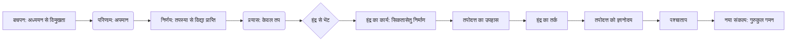

# Class 9 Sanskrit - Shemushi Chapter 107
**Language:** हिंदी

```markdown
# [कक्षा 9] शेमुषी - पाठ 7: सिकतासेतुः (रेत का पुल)

*(कृपया ध्यान दें: प्रदान किए गए पाठ के अनुसार, यह अध्याय 7, "सिकतासेतुः" है, न कि अध्याय 107।)*

## 🌟 मुख्य अवधारणाएँ (Core Concepts)

इस पाठ की मुख्य अवधारणाओं को निम्नलिखित पदानुक्रम में समझा जा सकता है:

1.  **विद्या प्राप्ति का सही मार्ग:**
    *   गुरु के पास जाकर अध्ययन (अध्ययन, श्रवण, पठन)।
    *   परिश्रम और अभ्यास का महत्व।
    *   लिपि और अक्षर ज्ञान की अनिवार्यता।
2.  **तपस्या का वास्तविक अर्थ:**
    *   केवल शारीरिक तपस्या से ज्ञान प्राप्ति संभव नहीं।
    *   ज्ञान प्राप्ति के लिए उचित कर्म (अध्ययन) आवश्यक।
3.  **शॉर्टकट (अनुचित मार्ग) की व्यर्थता:**
    *   बिना परिश्रम के सफलता की इच्छा (जैसे रेत से पुल बनाना)।
    *   अनुचित साधनों से लक्ष्य प्राप्ति का प्रयास निरर्थक।
4.  **पश्चाताप और सुधार:**
    *   गलती का एहसास होना (तपोदत्त का पश्चाताप)।
    *   सही मार्ग पर पुनः चलने का संकल्प।
5.  **मार्गदर्शन का महत्व:**
    *   इंद्र का वेश बदलकर तपोदत्त को सही राह दिखाना।
    *   परोक्ष उपदेश द्वारा ज्ञान देना।

📊 **अवधारणा पदानुक्रम:**

```mermaid
graph TD
    A[लक्ष्य: विद्या प्राप्ति] --> B(मार्ग);
    B --> C{उचित मार्ग};
    B --> D{अनुचित मार्ग};
    C --> C1[गुरुगृह गमन];
    C --> C2[अध्ययन/अभ्यास];
    C --> C3[परिश्रम];
    D --> D1[केवल तपस्या];
    D --> D2[शॉर्टकट (सिकतासेतु)];
    D --> E[असफलता/निरर्थकता];
    A --> F(परिणाम);
    C --> F --> G[सफलता/ज्ञान];
    D --> F --> H[पश्चाताप];
    H --> C;
    I[इंद्र का मार्गदर्शन] --> D;
    I --> H;
```

## 📘 प्रमुख शिक्षाएँ (Key Learnings)

यह नाट्यांश सोमदेव द्वारा रचित 'कथासरित्सागर' से लिया गया है और हमें महत्वपूर्ण शिक्षाएँ देता है:

1.  **ज्ञान प्राप्ति का एकमात्र मार्ग परिश्रम है:** तपोदत्त बचपन में पढ़ाई से जी चुराता है और बाद में केवल तपस्या (तपश्चर्या) के बल पर विद्या पाना चाहता है। इंद्र उसे रेत से पुल (सिकतासेतु) बनाने का प्रयास करते हुए मिलते हैं। यह देखकर तपोदत्त हंसता है, लेकिन इंद्र उसे समझाते हैं कि अगर बिना अक्षर ज्ञान और अध्ययन के केवल तप से विद्या मिल सकती है, तो रेत से पुल भी बन सकता है।
    *   **शिक्षा:** किसी भी लक्ष्य, विशेषकर ज्ञान प्राप्ति के लिए, शॉर्टकट नहीं होते। सही विधि और सतत प्रयास ही सफलता दिलाते हैं।

2.  **गलती का एहसास और सुधार:** इंद्र के तर्कपूर्ण उपहास से तपोदत्त को अपनी गलती का एहसास होता है। वह समझ जाता है कि बिना गुरु के पास जाए और विधिवत अध्ययन किए ज्ञान प्राप्त करना उतना ही असंभव है जितना रेत से पुल बनाना। वह पश्चाताप करता है और विद्या अध्ययन के लिए गुरुकुल जाने का निश्चय करता है।
    *   **शिक्षा:** अपनी भूल को स्वीकार करना और सही मार्ग पर वापस लौटना महत्वपूर्ण है। देर से ही सही, सही दिशा में उठाया गया कदम सार्थक होता है ("दिन में मार्ग भूला शाम को घर आ जाए तो भूला नहीं कहलाता")।

3.  **प्रयास की सही दिशा:** इंद्र का रेत से पुल बनाने का प्रयास प्रतीकात्मक है। यह दर्शाता है कि प्रयास करना ही काफी नहीं है, प्रयास सही दिशा और सही तरीके से किया जाना चाहिए।
    *   **शिक्षा:** ऊर्जा और समय का निवेश सही साधनों और विधियों में करना चाहिए।

📈 **तपोदत्त की यात्रा:**



## 🧩 सक्रिय अधिगम (Active Learning)

1.  **गतिविधि: शोध-आधारित केस स्टडी विश्लेषण (Research-based case study analysis) 🔍**
    *   **विषय:** "परिश्रम का महत्व: भारतीय संदर्भ में सफलता की कहानियाँ"।
    *   **कार्य:** छात्र समूह में भारत के ऐसे व्यक्तियों (जैसे वैज्ञानिक, उद्यमी, कलाकार, खिलाड़ी) पर शोध करें जिन्होंने कठिन परिश्रम और सही मार्ग अपनाकर असाधारण सफलता प्राप्त की हो। उनकी यात्रा में 'सिकतासेतु' जैसी शॉर्टकट की सोच की अनुपस्थिति और 'गुरुकुल' (मार्गदर्शन/सीखने की प्रक्रिया) के महत्व को रेखांकित करें। उदाहरण: डॉ. ए.पी.जे. अब्दुल कलाम, धीरूभाई अंबानी, या किसी स्थानीय सफल व्यक्ति का अध्ययन।
    *   **प्रस्तुति:** निष्कर्षों को कक्षा में प्रस्तुत करें, जिसमें चुनौतियों, अपनाए गए सही तरीकों और सफलता के बीच संबंध दर्शाया गया हो।

2.  **चर्चा: वास्तविक दुनिया के प्रभावों का आलोचनात्मक विश्लेषण (Critical analysis of real-world impacts) 🌍**
    *   **प्रश्न:**
        *   आज के समय में 'सिकतासेतु' बनाने जैसी सोच कहाँ-कहाँ दिखती है? (जैसे - परीक्षा में नकल, जल्दी अमीर बनने की योजनाएँ, बिना सीखे कोई कौशल पाने की इच्छा)।
        *   इस प्रकार की सोच व्यक्ति, समाज और देश की प्रगति (विशेषकर आर्थिक) को कैसे प्रभावित करती है?
        *   'स्किल इंडिया' या 'नई शिक्षा नीति' जैसी पहलें 'सिकतासेतु' की सोच को हतोत्साहित करने और 'गुरुकुल' (सही प्रशिक्षण/शिक्षा) को बढ़ावा देने में कैसे सहायक हो सकती हैं?
        *   क्या केवल तपस्या (जैसे बिना समझे रटना) आधुनिक शिक्षा प्रणाली में भी एक समस्या है? यदि हाँ, तो इसका समाधान क्या हो सकता है?

## 📝 मूल्यांकन तैयारी (Assessment Prep)

1.  **केस स्टडी (Case Studies):**
    *   **स्थिति 1:** तपोदत्त के प्रारंभिक निर्णय (केवल तपस्या से विद्या) का मूल्यांकन करें। उसके इस निर्णय के पीछे क्या कारण थे और यह क्यों अव्यावहारिक था? पाठ से उदाहरण देकर स्पष्ट करें।
    *   **स्थिति 2:** इंद्र ने तपोदत्त को सीधे उपदेश देने के बजाय रेत का पुल बनाने का नाटक क्यों किया? इस अप्रत्यक्ष विधि की प्रभावशीलता का विश्लेषण करें।
    *   **स्थिति 3:** यदि इंद्र तपोदत्त से नहीं मिलते, तो तपोदत्त के जीवन का क्या होता? उसकी तपस्या के संभावित परिणामों की कल्पना करें और तर्क दें।

2.  **रेखाचित्र/फ्लोचार्ट आधारित प्रश्न (Diagram-based Questions):**
    *   ऊपर दिए गए 'तपोदत्त की यात्रा' फ्लोचार्ट के आधार पर प्रश्न:
        *   इंद्र से भेंट तपोदत्त के जीवन में एक महत्वपूर्ण मोड़ क्यों था?
        *   'ज्ञानोदय' के बाद तपोदत्त के विचारों में क्या परिवर्तन आया?
    *   एक वेन डायग्राम बनाएं जिसमें 'केवल तपस्या द्वारा ज्ञान प्राप्ति' और 'अध्ययन द्वारा ज्ञान प्राप्ति' के प्रयासों की तुलना की गई हो (समानताएं, अंतर, परिणाम)।

## 🌏 भारतीय संदर्भ (Bharatiya Context)

यह कथा भारतीय संस्कृति में ज्ञान, गुरु और परिश्रम के महत्व को दर्शाती है।

*   **गुरु-शिष्य परंपरा:** कथा में गुरु के पास जाकर विद्या ग्रहण करने (गुरुगृहं गत्वैव विद्याभ्यासो मया करणीयः) के महत्व पर जोर दिया गया है, जो भारत की प्राचीन गुरु-शिष्य परंपरा को दर्शाता है।
*   **पुरुषार्थ का महत्व:** सफलता के लिए सही दिशा में किए गए प्रयास ('पुरुषार्थैरेव लक्ष्यं प्राप्यते') को आवश्यक माना गया है। यह भारतीय दर्शन के कर्म सिद्धांत से जुड़ा है।
*   **राष्ट्रीय आर्थिक/सामाजिक डेटा से संबंध (Conceptual Link):**
    *   **शिक्षा और कौशल:** भारत सरकार की 'स्किल इंडिया', 'मेक इन इंडिया' और 'नई शिक्षा नीति' जैसी पहलें इस बात पर जोर देती हैं कि देश की आर्थिक प्रगति के लिए केवल इच्छाशक्ति (तपस्या) काफी नहीं, बल्कि उचित शिक्षा, प्रशिक्षण और कौशल (सही मार्ग/अध्ययन) आवश्यक हैं।
    *   **मानव संसाधन विकास:** जिस प्रकार तपोदत्त को अपनी क्षमता का सही उपयोग करने के लिए सही मार्ग की आवश्यकता थी, उसी प्रकार भारत की विशाल युवा जनसंख्या को देश के विकास में योगदान देने के लिए गुणवत्तापूर्ण शिक्षा और कौशल प्रशिक्षण (सही 'सेतु' निर्माण) की आवश्यकता है। राष्ट्रीय सांख्यिकी कार्यालय (NSO) या शिक्षा मंत्रालय के डेटा (जैसे साक्षरता दर, व्यावसायिक प्रशिक्षण नामांकन) इस दिशा में हुई प्रगति और चुनौतियों को दर्शाते हैं।
    *   **उदाहरण:** भारत में उच्च शिक्षा में सकल नामांकन अनुपात (GER) का बढ़ना या व्यावसायिक पाठ्यक्रमों में छात्रों की बढ़ती रुचि दिखाती है कि समाज 'सिकतासेतु' के बजाय ज्ञान और कौशल के ठोस 'सेतु' बनाने की दिशा में अग्रसर है, जिसका सीधा प्रभाव देश की आर्थिक वृद्धि और सामाजिक विकास पर पड़ता है।

यह पाठ हमें सिखाता है कि सफलता का कोई शॉर्टकट नहीं होता और ज्ञान प्राप्ति के लिए समर्पण, सही मार्गदर्शन और सतत परिश्रम अनिवार्य है – यह सिद्धांत व्यक्तिगत जीवन के साथ-साथ राष्ट्रीय प्रगति पर भी लागू होता है।
```