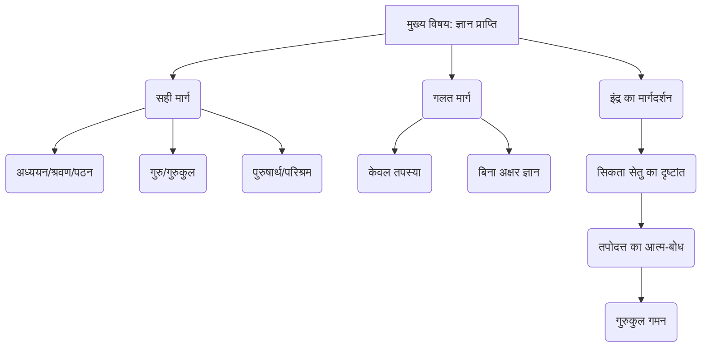
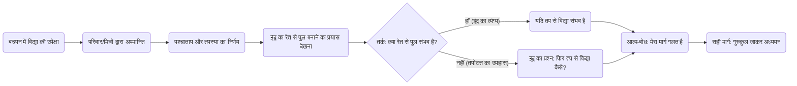

# Class 9 Sanskrit - Shemushi Chapter 107
**Language:** हिंदी

```markdown
# [कक्षा 9] शेमुषी - पाठ 107: सिकतासेतुः

## 🌟 मुख्य अवधारणाएँ (Core Concepts)

यह पाठ एक नाट्यांश है जो सोमदेव द्वारा रचित 'कथासरित्सागर' से लिया गया है। इसमें परिश्रम और सही विधि के बिना ज्ञान प्राप्ति की निरर्थकता को दर्शाया गया है।

1.  **ज्ञान प्राप्ति का सही मार्ग (The Correct Path to Knowledge Acquisition):**
    *   **अध्ययन का महत्व:** विद्या केवल पढ़ने (पठन), सुनने (श्रवण) और अक्षर-ज्ञान (लिप्यक्षरज्ञान) से ही प्राप्त होती है।
    *   **गुरु की भूमिका:** ज्ञान प्राप्ति के लिए गुरु के पास जाना (गुरुगृहं गत्वा) और उनसे सीखना आवश्यक है।
    *   **पुरुषार्थ (प्रयत्न) की अनिवार्यता:** लक्ष्य प्राप्ति के लिए केवल इच्छा नहीं, बल्कि उचित प्रयास (पुरुषार्थ) और परिश्रम (श्रम) अनिवार्य है।

2.  **तपस्या की सीमा (Limitations of Penance):**
    *   **तपस्या बनाम अध्ययन:** तपस्या शारीरिक और मानसिक अनुशासन के लिए है, परन्तु यह अध्ययन और सीखने की प्रक्रिया का विकल्प नहीं है।
    *   **तपोदत्त की भ्रांति:** तपोदत्त का यह सोचना कि केवल तपस्या (तपश्चर्या) से विद्या प्राप्त हो सकती है, एक भ्रम है।

3.  **प्रतीकात्मकता (Symbolism):**
    *   **सिकता सेतु (रेत का पुल):** यह असंभव कार्य का प्रतीक है, ठीक वैसे ही जैसे बिना पढ़े-लिखे केवल तप से विद्या पाना असंभव है।
    *   **इंद्र का वेश:** देवराज इंद्र का पुरुष वेश में आना और तपोदत्त को सही मार्ग दिखाना, मार्गदर्शन के महत्व को दर्शाता है।

4.  **आत्म-बोध और सुधार (Self-Realization and Correction):**
    *   **गलती का एहसास:** इंद्र के तर्क और रेत से पुल बनाने के प्रयास को देखकर तपोदत्त को अपनी गलती (दुष्बुद्धि) का एहसास होता है।
    *   **सही मार्ग चुनना:** अंत में तपोदत्त तपस्या छोड़कर विद्या अध्ययन के लिए गुरुकुल जाने का निर्णय लेता है।

📊 **अवधारणा पदानुक्रम:**



## 📘 मुख्य शिक्षाएँ (Key Learnings)

1.  **परिश्रम का कोई विकल्प नहीं:** किसी भी लक्ष्य, विशेषकर विद्या प्राप्ति के लिए, उचित परिश्रम और सही विधि अपनाना अनिवार्य है। शॉर्टकट या अनुचित तरीके (जैसे तपोदत्त की केवल तपस्या) सफलता नहीं दिलाते।
    *   *उदाहरण:* जैसे रेत (सिकता) से पुल (सेतु) बनाना असंभव है, वैसे ही बिना पढ़े (अध्ययनं विना) विद्या प्राप्त करना असंभव है।

2.  **ज्ञानार्जन की सही प्रक्रिया:** विद्या प्राप्ति के लिए बचपन से ही प्रयास करना चाहिए। यदि अवसर चूक जाए, तो भी सही मार्ग (गुरुकुल जाकर अध्ययन) अपनाना आवश्यक है।
    *   *श्लोक संदर्भ:* `विना लिप्यक्षरज्ञानं तपोभिरेव केवलम्। यदि विद्या वशे स्युस्ते, सेतुस्तेष तथा मम॥` (यदि बिना लिपि और अक्षर ज्ञान के केवल तपस्या से विद्या तुम्हारे वश में हो सकती है, तो मेरा यह (रेत का) पुल भी बन सकता है।)

3.  **आत्म-मूल्यांकन और सुधार:** अपनी गलतियों को पहचानना और उन्हें सुधारने के लिए कदम उठाना बुद्धिमानी है। तपोदत्त इंद्र के माध्यम से अपनी भूल समझता है और सही रास्ता चुनता है।
    *   *तपोदत्त का कथन:* `...तपोमात्रेण विद्यामवाप्तुं प्रयमानोऽहमपि सिकताभिरेव सेतुनिर्माणप्रयासं करोमि। तदिदानीं विद्याध्ययनाय गुरुकुलमेव गच्छामि।` (...केवल तपस्या से विद्या पाने का प्रयास करता हुआ मैं भी रेत से ही पुल बनाने का प्रयास कर रहा हूँ। इसलिए अब विद्या अध्ययन के लिए गुरुकुल ही जाता हूँ।)

4.  **ज्ञान का महत्व:** व्यक्ति की शोभा केवल वस्त्रों और आभूषणों से नहीं, बल्कि ज्ञान से होती है। ज्ञानहीन व्यक्ति सभा में या घर में सुशोभित नहीं होता।
    *   *श्लोक संदर्भ:* `परिधानैरलङ्कारैर्भूषितोऽपि न शोभते। नरो निर्मणिभोगीव सभायां यदि वा गृहे॥` (वस्त्रों और आकारों से सजा होने पर भी मनुष्य (बिना विद्या के) उसी प्रकार सुशोभित नहीं होता जैसे बिना मणि वाला साँप, चाहे वह सभा में हो या घर में।)

📈 **तपोदत्त की ज्ञान यात्रा:**



## 🧩 सक्रिय शिक्षण (Active Learning)

1.  **Activity: कहानी विश्लेषण (Story Analysis) 🔍**
    *   **कार्य:** पाठ में आए मुहावरेदार वाक्यों/कहावतों को पहचानें और उनके अर्थ लिखें। उदाहरण के लिए:
        *   "सुबह का भूला शाम को घर लौट आये, तो भूला नहीं कहलाता।" (पाठ में संस्कृत वाक्य: `दिवसे मार्गभ्रान्तः संध्यां यावद् यदि गृहमुपैति तदपि वरम्। नाऽसौ भ्रान्तो मन्यते।`)
        *   "मेरी आँखें खुल गईं।" (पाठ में संस्कृत वाक्य: `भवादिभिः उन्मीलितं मे नयनयुगलम्।`)
    *   **उद्देश्य:** पाठ की गहरी समझ और भाषा के व्यावहारिक प्रयोग को जानना।

2.  **Discussion: वास्तविक जीवन से जुड़ाव (Real-world Connection) 🌍**
    *   **विषय:** "क्या आज के समय में भी लोग बिना उचित प्रयास या सही तरीके के सफलता (जैसे परीक्षा में अच्छे अंक, नौकरी) पाने की कोशिश करते हैं? इसके क्या परिणाम हो सकते हैं?"
    *   **चर्चा बिंदु:** शॉर्टकट की मानसिकता, नकल या अनुचित साधनों का प्रयोग, परिश्रम के महत्व की अनदेखी, दीर्घकालिक सफलता बनाम तात्कालिक लाभ।
    *   **उद्देश्य:** पाठ की शिक्षा को समकालीन परिप्रेक्ष्य में समझना और आलोचनात्मक चिंतन विकसित करना।

## 📝 परीक्षा तैयारी (Assessment Prep)

*   **कथावस्तु:** पाठ की कहानी, पात्र (तपोदत्त, इंद्र), और मुख्य घटनाक्रम (तपस्या, रेत का पुल, संवाद, बोध) को समझें।
*   **मुख्य संदेश:** पाठ का केंद्रीय भाव - परिश्रम और सही विधि से ही ज्ञान मिलता है - स्पष्ट होना चाहिए।
*   **शब्दार्थ:** पाठ में दिए गए कठिन शब्दों (जैसे - सिकता, सेतु, तपश्चर्या, क्लेश्यमानः, गहितः, निर्मणिभोगी, मार्गभ्रान्तः, उन्मीलितम्) के अर्थ याद करें।
*   **श्लोक:** महत्वपूर्ण श्लोकों (विशेषकर श्लोक 1, 2, 3) का अर्थ और अन्वय समझें।
*   **व्याकरण:**
    *   **सर्वनाम प्रयोग:** `कस्मै प्रयुक्तानि` (जैसे 'तव', 'अहं', 'भवादिभिः', 'मे' किसके लिए प्रयुक्त हुए हैं)।
    *   **संवाद:** `कः कं प्रति कथयति` (किसने किससे कहा)।
    *   **प्रश्न निर्माण:** स्थूल पदों के आधार पर प्रश्न बनाना।
    *   **समास:** समस्त पद बनाना और विग्रह करना (पाठ के अभ्यास से)।
    *   **कारक/विभक्ति:** 'अलम्', 'अनु', 'विना', 'यावत्' के योग में सही विभक्ति का प्रयोग।
*   **दृष्टांत:** रेत के पुल (सिकता सेतु) के दृष्टांत का महत्व और उसकी व्याख्या करने में सक्षम हों।

📝 **केस स्टडी / डायग्राम:**
*   तपोदत्त के चरित्र का विश्लेषण करें: उसकी प्रारंभिक सोच, उसकी गलती, और अंत में उसका परिवर्तन।
*   ऊपर दिए गए फ्लोचार्ट्स (अवधारणा पदानुक्रम, तपोदत्त की ज्ञान यात्रा) को समझने और बनाने का अभ्यास करें।

## 🌏 भारतीय संदर्भ (Bharatiya Context)

1.  **गुरुकुल परंपरा:** पाठ में 'गुरुकुल' जाने का उल्लेख भारत की प्राचीन शिक्षा प्रणाली को दर्शाता है, जहाँ छात्र गुरु के सान्निध्य में रहकर विद्या और जीवन मूल्य सीखते थे।
2.  **विद्या का महत्व:** भारतीय संस्कृति में ज्ञान (विद्या) को सर्वोच्च धन माना गया है (`विद्याधनं सर्वधनप्रधानम्`)। यह पाठ इसी मूल्य को पुष्ट करता है।
3.  **पुरुषार्थ:** 'पुरुषार्थ' (प्रयत्न/उद्यम) भारतीय दर्शन का महत्वपूर्ण अंग है। यह पाठ सिखाता है कि लक्ष्य सिद्धि के लिए उचित कर्म और प्रयास आवश्यक हैं।
4.  **पौराणिक संदर्भ:**
    *   **राम सेतु:** भगवान राम द्वारा पत्थरों (शिलाभिः) से समुद्र पर सेतु बनाने का संदर्भ (रामो बबन्ध यं सेतुं...) भारतीय महाकाव्य रामायण से जुड़ा है, जो दृढ़ संकल्प और सामर्थ्य का प्रतीक है।
    *   **आञ्जनेय (हनुमान):** हनुमान जी की छलांग लगाने की क्षमता का उल्लेख (`आञ्जनेयमप्यतिक्रामसि!`) उनके अतुलनीय बल और सामर्थ्य को दर्शाता है।
    *   **इंद्र:** देवराज इंद्र का मार्गदर्शक के रूप में प्रकट होना देवताओं द्वारा मनुष्यों की सहायता करने की पौराणिक मान्यताओं को दर्शाता है।
5.  **साहित्यिक धरोहर:** यह नाट्यांश 'कथासरित्सागर' जैसे महान संस्कृत कथा ग्रन्थ का अंश है, जो भारत की समृद्ध साहित्यिक और कथावाचन परंपरा का परिचायक है। सोमदेव (कश्मीर निवासी) जैसे विद्वानों के योगदान को उजागर करता है।
```