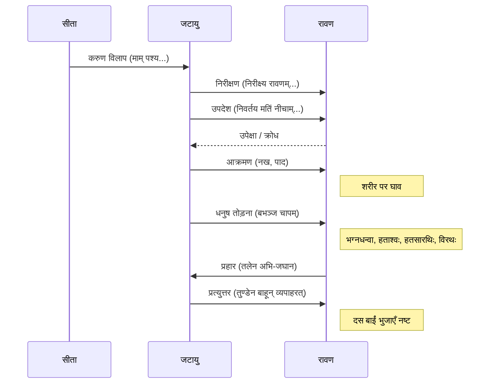

# Class 9 Sanskrit - Shemushi Chapter 108
**Language:** हिंदी

```markdown
# [कक्षा 9] शेमुषी - पाठ १०८: जटायोः शौर्यम्

## 🌟 मुख्य अवधारणाएँ (Core Concepts)

यह पाठ महर्षि वाल्मीकि द्वारा रचित **रामायण** के **अरण्यकाण्ड** से लिया गया है। इसमें पक्षीराज **जटायु** की वीरता का वर्णन है जब वे सीता का अपहरण कर रहे रावण से युद्ध करते हैं।

**मुख्य अवधारणाओं का पदानुक्रम:**

1.  **पाठ का स्रोत और संदर्भ:**
    *   ग्रंथ: रामायण (आदिकवि वाल्मीकि)
    *   काण्ड: अरण्यकाण्ड
    *   प्रसंग: सीता हरण के समय जटायु का हस्तक्षेप

2.  **प्रमुख पात्र:**
    *   **जटायु:** वृद्ध पक्षीराज (गिद्ध), सूर्य के सारथी अरुण के पुत्र, धर्मपरायण, वीर।
    *   **रावण:** राक्षसराज, अधर्मी, शक्तिशाली, सीता का अपहरणकर्ता।
    *   **सीता:** राम की पत्नी, असहाय अवस्था में विलाप करती हुई।

3.  **कथानक (घटनाक्रम):**
    *   सीता का करुण विलाप सुनना।
    *   जटायु का आगमन और रावण को अधर्म से रोकना।
    *   रावण द्वारा जटायु की उपेक्षा।
    *   जटायु और रावण के बीच भीषण युद्ध।
    *   जटायु द्वारा रावण को क्षति पहुँचाना (धनुष तोड़ना, रथ, सारथी, घोड़ों को मारना, शरीर पर घाव करना)।
    *   क्रोधित रावण का जटायु पर प्रहार।
    *   जटायु द्वारा रावण की बाईं भुजाओं को नष्ट करना।
    *   जटायु का घायल होकर गिरना और वीरगति पाना (पाठ्यांश के बाद का संदर्भ)।

4.  **नैतिक शिक्षा और मूल्य:**
    *   **कर्तव्यपरायणता:** अपनी वृद्धावस्था के बावजूद जटायु का कर्तव्य निभाना।
    *   **शौर्य और वीरता:** शक्तिशाली शत्रु के सामने भी साहस न छोड़ना।
    *   **धर्म का पालन:** अधर्म (परस्त्री हरण) का विरोध करना।
    *   **शरणागत की रक्षा:** असहाय सीता की रक्षा का प्रयास।
    *   **न्याय के लिए संघर्ष:** अन्याय के विरुद्ध आवाज़ उठाना।

📊 **अवधारणा मानचित्र (Concept Map Idea):**

```
      [जटायोः शौर्यम्]
           |
     +-----+-----+
     |           |
 [पात्र]     [घटनाक्रम]
     |           |
+----+----+  +---+---+---+---+
| जटायु | सीता | रावण | विलाप | उपदेश | युद्ध | क्षति |
     |           |
 [नैतिक मूल्य] <---+
     |
+----+----+----+----+
| कर्तव्य | शौर्य | धर्म | रक्षा |
```

## 📘 मुख्य शिक्षाएँ (Key Learnings)

इस पाठ से हम सीखते हैं कि धर्म और न्याय की रक्षा के लिए आयु या शक्ति का अंतर मायने नहीं रखता। जटायु का चरित्र हमें सिखाता है कि:

1.  **दूसरों की पीड़ा के प्रति संवेदनशीलता:** जटायु सो रहे थे, परन्तु सीता का करुण क्रंदन सुनकर वे तुरंत जाग गए और सहायता के लिए पहुँचे (`तं शब्दमवसुप्तस्तु जटायुरथ शुश्रुवे`)।
2.  **अधर्म का विरोध:** जटायु ने रावण को स्पष्ट रूप से कहा कि पराई स्त्री का स्पर्श (`परदाराभिमर्शनात्`) नीच कर्म है और एक वीर पुरुष को ऐसा कार्य नहीं करना चाहिए जिसकी दूसरे निंदा करें (`न तत्समाचरेद्धीरो यत्परोऽस्य विगर्हयेत्`)। यह नैतिक साहस का प्रतीक है।
3.  **अदम्य साहस:** जटायु वृद्ध थे (`वृद्धोऽहं`), जबकि रावण युवा, धनुर्धारी, रथयुक्त, कवचधारी और बाणों से युक्त था (`त्वं युवा धन्वी सरथः कवची शरी`)। फिर भी जटायु ने चुनौती स्वीकार की और कहा कि रावण सीता को लेकर कुशलतापूर्वक नहीं जा पाएगा (`न चाप्यादाय कुशली वैदेहीं मे गमिष्यसि`)।
4.  **युद्ध कौशल और वीरता:** जटायु ने अपने तीक्ष्ण नखों (`तीक्ष्णनखाभ्याम्`) और पंजों (`चरणाभ्याम्`) से रावण के शरीर पर अनेक घाव (`व्रणान्`) कर दिए। उन्होंने रावण का मोतियों और मणियों से सुसज्जित धनुष (`मुक्तामणिविभूषितम् सशरं चापम्`) तोड़ दिया (`बभञ्ज`)।
5.  **रावण को भारी क्षति:** जटायु के आक्रमण से रावण धनुष-रहित (`भग्नधन्वा`), रथ-विहीन (`विरथः`), मरे हुए घोड़ों वाला (`हताश्वः`) और मारे गए सारथी वाला (`हतसारथिः`) हो गया।
6.  **अंतिम प्रहार:** क्रोधित रावण के थप्पड़ मारने पर भी जटायु ने हार नहीं मानी और अपनी चोंच (`तुण्डेन`) से रावण की बाईं ओर की दस भुजाओं (`वामबाहून् दश`) को उखाड़ फेंका (`व्यपाहरत्`)।

📈 **घटनाक्रम प्रवाह (Sequence Diagram Idea):**



## 🧩 सक्रिय अधिगम (Active Learning)

1.  **गतिविधि: शोध-आधारित केस स्टडी विश्लेषण (Research-based Case Study Analysis) 🔍**
    *   **विषय:** "जटायु: कर्तव्यनिष्ठा और बलिदान का प्रतीक"।
    *   **कार्य:** रामायण या अन्य भारतीय ग्रंथों/इतिहास से ऐसे अन्य पात्रों (जैसे - अभिमन्यु, दधीचि, शिवाजी महाराज के सैनिक) के बारे में शोध करें जिन्होंने कर्तव्य या धर्म की रक्षा के लिए विषम परिस्थितियों में वीरता दिखाई हो। जटायु के कार्यों से उनकी तुलना करें और एक संक्षिप्त रिपोर्ट प्रस्तुत करें। विश्लेषण करें कि इन कहानियों का भारतीय समाज पर क्या प्रभाव पड़ा है।

2.  **चर्चा: वास्तविक दुनिया के प्रभावों का आलोचनात्मक विश्लेषण (Critical Analysis of Real-world Impacts) 🌍**
    *   **प्रश्न:** आज के समाज में, जब हम अन्याय या किसी को संकट में देखते हैं, तो जटायु की कहानी हमें क्या प्रेरणा देती है? क्या केवल दर्शक बने रहना उचित है? समूह में चर्चा करें कि एक व्यक्ति या समुदाय के रूप में अन्याय के विरुद्ध खड़े होने में क्या चुनौतियाँ हैं और जटायु के उदाहरण से हम क्या सीख सकते हैं। उन समकालीन घटनाओं पर विचार करें जहाँ लोगों ने दूसरों की मदद के लिए साहस दिखाया है।

## 📝 मूल्यांकन तैयारी (Assessment Prep)

*   **केस स्टडी आधारित प्रश्न:**
    *   यदि आप जटायु की जगह होते और रावण जैसे शक्तिशाली व्यक्ति को अधर्म करते देखते, तो आप क्या करते? अपने उत्तर के समर्थन में पाठ से तर्क दें।
    *   जटायु के कार्यों का मूल्यांकन करें। क्या उनका रावण से युद्ध करना बुद्धिमानी थी, यह जानते हुए कि वे वृद्ध थे और रावण अधिक शक्तिशाली था? क्यों या क्यों नहीं?
*   **श्लोक आधारित प्रश्न:**
    *   `"निवर्तय मतिं नीचाम्..."` - इस पंक्ति का क्या अर्थ है और यह जटायु के किस गुण को दर्शाती है?
    *   `"भग्नधन्वा विरथः हताश्वः हतसारथिः"` - इन शब्दों का प्रयोग किसके लिए हुआ है और यह स्थिति कैसे उत्पन्न हुई?
*   **व्याकरणिक प्रश्न:**
    *   पाठ से `क्तिन्` (जैसे मतिः), `णिनि` (जैसे धन्वी, कवची, शरी) और `टाप्`/`ङीप्` (जैसे करुणा, विलापन्ती, वैदेही) प्रत्यय वाले शब्दों को पहचानें और उनका मूल शब्द व प्रत्यय अलग करें।
    *   रावण और जटायु के लिए प्रयुक्त विशेषणों को छाँटकर लिखें (अभ्यास प्रश्न 3(अ) देखें)।
*   **रेखाचित्र/प्रवाह चार्ट आधारित प्रश्न:**
    *   ऊपर दिए गए घटनाक्रम प्रवाह चार्ट के आधार पर जटायु और रावण के युद्ध का क्रमबद्ध वर्णन करें।
    *   जटायु और रावण के गुणों/अवगुणों की तुलना करते हुए एक तालिका बनाएं।

## 🌏 भारतीय संदर्भ (Bharatiya Context)

यह पाठ भारतीय संस्कृति और मूल्यों की गहरी समझ प्रदान करता है:

1.  **रामायण का सांस्कृतिक महत्व:** रामायण केवल एक महाकाव्य नहीं, बल्कि भारतीय सभ्यता, संस्कृति और नैतिकता का आधार स्तंभ है। इसके पात्र (राम, सीता, हनुमान, जटायु आदि) आदर्शों के प्रतीक हैं। यह कथा भारत में कला, साहित्य, रंगमंच (रामलीला), त्योहारों (दशहरा, दिवाली) और दैनिक जीवन में नैतिक मार्गदर्शन का स्रोत है।
2.  **धर्म की अवधारणा:** जटायु का कार्य 'धर्म' (कर्तव्य, नैतिकता, न्याय) की रक्षा का उत्कृष्ट उदाहरण है। भारतीय परंपरा में धर्म को व्यक्तिगत लाभ से ऊपर माना गया है। जटायु ने अपने प्राणों की आहुति देकर भी धर्म का पालन किया।
3.  **प्रकृति और जीवों का सम्मान:** जटायु एक पक्षी (गिद्ध) हैं, जिन्हें रामायण में अत्यंत सम्माननीय पात्र के रूप में दर्शाया गया है। यह भारतीय संस्कृति में प्रकृति और अन्य जीवों के प्रति सम्मान और सह-अस्तित्व की भावना को दर्शाता है। पंचवटी जैसे स्थान आज भी भारत में पवित्र माने जाते हैं।
4.  **वीरता और बलिदान का आदर्श:** जटायु का शौर्य और बलिदान भारतीय मानस में वीरता के उच्चतम आदर्शों में से एक है। केरल में स्थित **'जटायु अर्थ सेंटर' (Jatayu Earth's Centre)**, जिसमें जटायु की विशाल मूर्ति है, इसी वीरता और नारी सम्मान की रक्षा के प्रतीक को समर्पित एक आधुनिक उदाहरण है।
5.  **अतिथि देवो भव और शरणागत रक्षा:** यद्यपि सीता प्रत्यक्ष रूप से जटायु की अतिथि नहीं थीं, पर संकट में उनकी पुकार सुनकर जटायु ने शरणागत की रक्षा का धर्म निभाया, जो भारतीय संस्कृति का एक महत्वपूर्ण मूल्य है।

यह पाठ छात्रों को न केवल संस्कृत भाषा सिखाता है, बल्कि उन्हें भारतीय संस्कृति के मूल नैतिक मूल्यों और वीरता की परंपरा से भी परिचित कराता है।
```