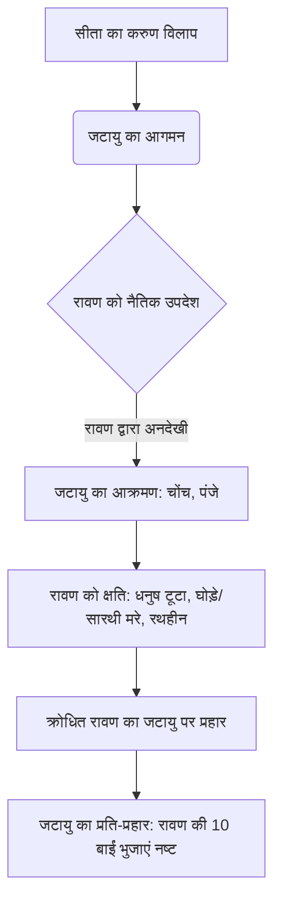

# Class 9 Sanskrit - Shemushi Chapter 108
**Language:** हिंदी

```markdown
# [कक्षा 9] शेमुषी - अध्याय 108: जटायोः शौर्यम्

## 🌟 मुख्य अवधारणाएँ (Core Concepts)
यह पाठ महर्षि वाल्मीकि द्वारा रचित 'रामायण' के अरण्यकाण्ड से लिया गया है। इसमें जटायु और रावण के युद्ध का वर्णन है, जो सीता के अपहरण के समय घटित हुआ।

**अवधारणा पदानुक्रम 📊:**

1.  **पाठ का स्रोत:**
    *   वाल्मीकि रामायण (अरण्यकाण्ड)
2.  **मुख्य घटना:**
    *   रावण द्वारा सीता का अपहरण
    *   सीता का करुण विलाप
3.  **जटायु का हस्तक्षेप:**
    *   सीता की पुकार सुनना
    *   रावण को अधर्म (परस्त्री स्पर्श) से रोकना
    *   नैतिक उपदेश देना ("न तत्समाचरेद्धीरो यत्परोऽस्य विगर्हयेत्")
4.  **जटायु-रावण युद्ध:**
    *   जटायु का भीषण आक्रमण (चोंच, पंजे, नाखून)
    *   रावण को क्षति पहुँचाना:
        *   धनुष तोड़ना (भग्नधन्वा)
        *   घोड़ों को मारना (हताश्वः)
        *   सारथी को मारना (हतसारथिः)
        *   रथहीन करना (विरथः)
        *   शरीर पर घाव करना (व्रणी)
    *   रावण का क्रोधित होकर प्रति-आक्रमण
    *   जटायु द्वारा रावण की बाईं दस भुजाओं को उखाड़ना
5.  **पाठ का संदेश:**
    *   शौर्य और वीरता का प्रदर्शन
    *   कर्तव्यपरायणता (विशेषकर असहाय की रक्षा)
    *   अधर्म का विरोध
    *   वृद्धावस्था में भी पराक्रम

## 📘 प्रमुख शिक्षाएँ (Key Learnings)
इस अध्याय से हमें कई महत्वपूर्ण बातें सीखने को मिलती हैं:

1.  **सीता का विलाप और जटायु की प्रतिक्रिया:**
    *   जब रावण सीता का अपहरण करके ले जा रहा था, तब वे अत्यंत दुखी होकर विलाप कर रही थीं (`विलपन्ती सुदुःखिता`)।
    *   उनकी करुणामयी पुकार (`करुणा वाचः`) सुनकर पेड़ पर बैठे वृद्ध गिद्धराज जटायु (`वनस्पतिगतं गृध्रं`) ने उन्हें देखा और उनकी सहायता के लिए तत्पर हुए।

2.  **नैतिकता और धर्म का उपदेश:**
    *   जटायु ने रावण को समझाया कि पराई स्त्री का स्पर्श (`परदाराभिमर्शनात्`) नीच कर्म है और उसे ऐसा कार्य नहीं करना चाहिए जिसकी दूसरे लोग निंदा करें (`यत्परोऽस्य विगर्हयेत्`)।
    *   यह दर्शाता है कि वीर पुरुष को हमेशा धर्म और नैतिकता का पालन करना चाहिए।

3.  **अदम्य साहस और युद्ध कौशल:**
    *   जटायु वृद्ध (`वृद्धोऽहं`) थे, जबकि रावण युवा (`त्वं युवा`), धनुर्धारी (`धन्वी`), रथयुक्त (`सरथः`), कवचधारी (`कवची`) और बाणों से युक्त (`शरी`) था।
    *   इसके बावजूद, जटायु ने साहस नहीं खोया और रावण को चुनौती दी कि वह सीता को लेकर कुशलतापूर्वक (`कुशली`) नहीं जा सकेगा।
    *   उन्होंने अपने तीखे नाखूनों (`तीक्ष्णनखाभ्याम्`) और पंजों (`चरणाभ्याम्`) से रावण के शरीर पर अनेक घाव (`व्रणान्`) कर दिए।
    *   उन्होंने रावण के मोतियों-मणियों से सजे धनुष (`मुक्तामणिविभूषितं सशरं चापम्`) को तोड़ दिया (`बभञ्ज`)।

4.  **युद्ध का परिणाम (अंशतः):**
    *   जटायु के आक्रमण से रावण धनुष-रहित, रथ-रहित, हत-अश्व और हत-सारथी हो गया।
    *   क्रोधित रावण ने जटायु पर प्रहार किया, परन्तु पक्षीराज जटायु ने पलटवार करते हुए अपनी चोंच (`तुण्डेन`) से रावण की बाईं ओर की दस भुजाओं (`वामबाहून् दश`) को नष्ट कर दिया (`व्यपाहरत्`)।

**युद्ध प्रगति प्रवाह 📈:**



## 🧩 सक्रिय अधिगम (Active Learning)

*   **गतिविधि: शोध-आधारित केस स्टडी विश्लेषण 🔍**
    *   **विषय:** "वर्तमान समाज में अन्याय के विरुद्ध जटायु जैसी वीरता"।
    *   **कार्य:** छात्र किसी ऐसी वास्तविक घटना (समाचार पत्रों, इंटरनेट आदि से) का शोध करें जहाँ किसी व्यक्ति ने अपनी सुरक्षा की परवाह किए बिना किसी असहाय की मदद की हो या अन्याय का विरोध किया हो।
    *   **विश्लेषण:** उस व्यक्ति के कार्य की तुलना जटायु के शौर्य से करें। उनके उद्देश्यों, जोखिमों, परिणामों और सामाजिक प्रभाव का मूल्यांकन करें। एक संक्षिप्त रिपोर्ट या प्रस्तुति तैयार करें। (Bloom's: Evaluating/Creating)

*   **चर्चा: वास्तविक दुनिया के प्रभावों का आलोचनात्मक विश्लेषण 🌍**
    *   **विषय:** जटायु का उपदेश - "न तत्समाचरेद्धीरो यत्परोऽस्य विगर्हयेत्" (वीर पुरुष को वह कार्य नहीं करना चाहिए जिसकी दूसरे निंदा करें) की प्रासंगिकता।
    *   **प्रश्न:** यह सिद्धांत आज व्यक्तिगत नैतिकता, सामाजिक व्यवहार और यहाँ तक कि राष्ट्रीय/अंतर्राष्ट्रीय स्तर पर कितना महत्वपूर्ण है? क्या हमेशा दूसरों की निंदा के डर से कार्य करना उचित है? इसके पक्ष और विपक्ष में तर्क दें। (Bloom's: Evaluating)

## 📝 मूल्यांकन तैयारी (Assessment Prep)

*   **केस स्टडी (Case Studies) 📝:**
    *   **स्थिति:** कल्पना करें कि आप देखते हैं कि कोई शक्तिशाली व्यक्ति किसी कमजोर व्यक्ति के साथ अन्याय कर रहा है। हस्तक्षेप करने में व्यक्तिगत जोखिम है। जटायु के चरित्र और कार्यों के आधार पर, आप क्या करेंगे और क्यों? अपने निर्णय का नैतिक आधार स्पष्ट करें। (Bloom's: Evaluating)
    *   **प्रश्न:** जटायु के वृद्ध होते हुए भी युवा, सशस्त्र रावण से लड़ने के निर्णय का मूल्यांकन करें। क्या यह बुद्धिमानी थी? अपने उत्तर के पक्ष में तर्क दें। (Bloom's: Evaluating)

*   **रेखाचित्र/चित्रण (Diagrams) 📝:**
    *   **कार्य:** जटायु और रावण के चरित्रों की तुलना करते हुए एक वेन डायग्राम या तालिका बनाएं। उनके गुणों, अवगुणों, प्रेरणाओं और संवादों को पाठ के आधार पर दर्शाएं। (Bloom's: Analyzing/Evaluating)
    *   **कार्य:** पाठ में वर्णित जटायु और रावण के युद्ध के क्रम को दर्शाने वाला एक सचित्र फ्लोचार्ट बनाएं। प्रत्येक चरण के महत्व को संक्षेप में लिखें। (Bloom's: Creating)

*   **व्याकरण एवं बोध प्रश्न:**
    *   पाठ में प्रयुक्त विशेषण शब्दों (जैसे - वृद्धः, युवा, कवची, हताश्वः, भग्नधन्वा) को पहचानें और उनका वाक्यों में प्रयोग करें।
    *   `णिन्` प्रत्यय लगाकर शब्द बनाएं (उदा. गुण + णिन् = गुणिन्)।
    *   श्लोकों का अन्वय और सरल हिंदी में अर्थ लिखें।
    *   विलोम शब्द और पर्यायवाची शब्द (पाठ पर आधारित)।

## 🌏 भारतीय संदर्भ (Bharatiya Context)

1.  **रामायण का सांस्कृतिक महत्व:** रामायण भारतीय संस्कृति का एक अभिन्न अंग है। यह केवल एक महाकाव्य नहीं, बल्कि नैतिकता, कर्तव्य, धर्म और आदर्श जीवन मूल्यों का स्रोत है। जटायु जैसे पात्र इन मूल्यों को मूर्त रूप देते हैं।
2.  **जटायु - कर्तव्यनिष्ठा का प्रतीक:** भारतीय परंपरा में जटायु को केवल एक पक्षी नहीं, बल्कि धर्म और कर्तव्य के लिए प्राणों की आहुति देने वाले एक महान नायक के रूप में पूजा जाता है। उनका बलिदान (`आत्मोत्सर्ग`) असहाय की रक्षा के कर्तव्य का सर्वोच्च उदाहरण है।
3.  **"परदाराभिमर्शनात्" का नैतिक संदेश:** पराई स्त्री का सम्मान भारतीय संस्कृति का एक मूल सिद्धांत रहा है। जटायु का रावण को दिया गया उपदेश इसी नैतिक मूल्य को रेखांकित करता है और अधर्म के प्रति स्पष्ट चेतावनी देता है।
4.  **वाल्मीकि - आदिकवि:** महर्षि वाल्मीकि को संस्कृत का 'आदिकवि' माना जाता है और रामायण को 'आदिकाव्य'। उनकी रचना ने भारतीय साहित्य और चिंतन धारा पर अमिट प्रभाव डाला है।
5.  **प्रकृति और सह-अस्तित्व:** यद्यपि यह पाठ मुख्यतः शौर्य पर केंद्रित है, जटायु (पक्षीराज) का एक मनुष्य (सीता) की रक्षा के लिए आगे आना, प्रकृति के विभिन्न तत्वों के बीच एक अंतर्निहित संबंध और सह-अस्तित्व की भावना को भी दर्शाता है, जो भारतीय दर्शन का हिस्सा है।

*(नोट: इस अध्याय का संबंध सीधे तौर पर आर्थिक या सामाजिक आंकड़ों (Economic/Social Data 📊) से नहीं है, बल्कि यह नैतिक, सांस्कृतिक और साहित्यिक संदर्भों पर केंद्रित है।)*
```