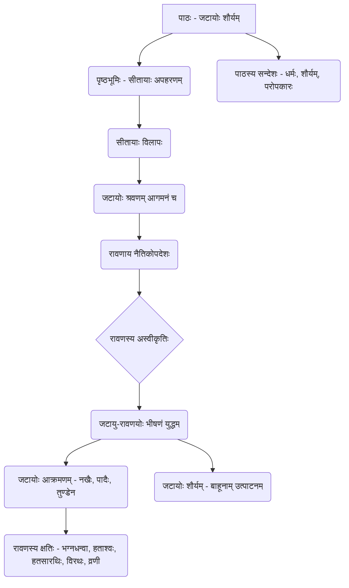

# Class 9 Sanskrit - Shemushi Chapter 108
**Language:** संस्कृतम्

```markdown
# [कक्षा ९] शेमुषी - पाठः १०८ - जटायोः शौर्यम्

## 🌟 मूल-अवधारणाः (Core Concepts) 📊

अयं पाठः आदिकवि-वाल्मीकि-विरचितस्य 'रामायणम्' इति महाकाव्यस्य अरण्यकाण्डात् सङ्कलितः अस्ति। अस्मिन् पाठे पक्षिराजस्य जटायोः अद्भुतं शौर्यं वर्णितम्।

1.  **पाठस्य पृष्ठभूमिः:**
    *   रावणेन सीतायाः अपहरणम्।
    *   पञ्चवटी-कानने सीतायाः करुणः विलापः।
2.  **जटायोः प्रवेशः:**
    *   वृद्धः पक्षिराजः जटायुः सीतायाः क्रन्दनं शृणोति।
    *   सः साहाय्यार्थम् आगच्छति।
3.  **रावणाय उपदेशः:**
    *   जटायुः रावणं परस्त्रीस्पर्शरूपं नीचकर्म त्यक्तुं कथयति।
    *   सः नीतिवचनं वदति यत् धीरः पुरुषः तत् कर्म न कुर्यात् यत् अन्ये निन्देयुः।
4.  **जटायु-रावणयोः युद्धम्:**
    *   रावणः जटायोः वचनं न स्वीकरोति।
    *   जटायुः स्वस्य वार्धक्यं विगणय्य अपि रावणेन सह युद्धं करोति।
    *   **जटायोः पराक्रमः:**
        *   तीक्ष्णनखैः पादाभ्यां च रावणस्य गात्रे बहुविधान् व्रणान् करोति।
        *   रावणस्य मुक्तामणिभिः भूषितं सशरं चापं (धनुषं) भङ्क्ते।
        *   रावणस्य दश वामबाहून् स्वतुण्डेन उत्पाटयति।
    *   **रावणस्य अवस्था:**
        *   भग्नधन्वा (यस्य धनुः भग्नम्)
        *   हताश्वः (यस्य अश्वाः हताः)
        *   हतसारथिः (यस्य सारथिः हतः)
        *   विरथः (रथरहितः)
        *   व्रणी (घायलः)
        *   क्रोधमूर्च्छितः (क्रोधेन मूर्च्छितः)
5.  **पाठस्य सन्देशः:**
    *   अन्यायस्य विरोधः करणीयः।
    *   धर्मरक्षणार्थं, परोपकारार्थं च स्वप्राणाः अपि देयाः।
    *   शौर्यं वयसि न, अपितु मनसि तिष्ठति।

**अवधारणा-सोपानम् (Concept Hierarchy):**


## 📘 मुख्याः शिक्षणबिन्दवः (Key Learnings) 📈

1.  **सीतायाः आर्तरवः:** राक्षसराजेन रावणेन अपह्रियमाणा (नीयमाना) दुःखिता सीता वने एकं गृध्रं (जटायुम्) पश्यति तम् आर्तस्वरेण साहाय्यार्थम् आह्वयति। (श्लोक १-२)
2.  **जटायोः प्रतिक्रिया:** सुप्तः अपि जटायुः सीतायाः करुणशब्दं श्रुत्वा जागर्ति। सः शीघ्रं रावणं सीतां च पश्यति। (श्लोक ३)
3.  **जटायोः नीतिपूर्णः उपदेशः:** पर्वतशिखरवत् विशालः, तीक्ष्णचञ्चुयुक्तः, श्रीमान् पक्षिराजः जटायुः वृक्षस्थितः एव रावणम् उद्दिश्य शुभं वचनं वदति - "हे रावण! परस्त्रीस्पर्शरूपं नीचं विचारं त्यज। यतः सज्जनः तत् कार्यं कदापि न कुर्यात्, यस्य कार्याय अन्ये तस्य निन्दां कुर्युः।" (श्लोक ४-५)
4.  **शौर्यपूर्णः निश्चयः:** जटायुः वदति - "अहं वृद्धः अस्मि, त्वं तु युवा, धनुर्धारी, कवची, रथी, बाणयुक्तः च असि। तथापि, मम जीवति सति त्वं सीतां गृहीत्वा कुशलतापूर्वकं गन्तुं न शक्ष्यसि।" अनेन तस्य दृढनिश्चयः शौर्यं च प्रकटितं भवति। (श्लोक ६)
5.  **युद्धस्य प्रारम्भः तथा जटायोः प्रहाराः:** महाबली पक्षिराजः जटायुः स्वस्य तीक्ष्णनखाभ्यां चरणाभ्यां च रावणस्य शरीरे अनेकान् व्रणान् (घावान्) अकरोत्। (श्लोक ७)
6.  **रावणस्य शस्त्रनाशः:** ततः परं महातेजस्वी जटायुः रावणस्य मोतिभिः मणिभिश्च सुसज्जितं, बाणसहितं धनुः स्वचरणाभ्यां भग्नं कृतवान्। (श्लोक ८)
7.  **रावणस्य दयनीया स्थितिः:** जटायोः प्रहारैः रावणः भग्नधनुः, हताश्वः, हतसारथिः, रथरहितश्च अभवत्। एवं सति क्रोधेन मूर्च्छितः रावणः वेगेन जटायुं मुष्टिना (तलेन) प्राहरत्। (श्लोक ९)
8.  **जटायोः अन्तिमः प्रहारः:** शत्रुनाशकः पक्षिराजः जटायुः रावणस्य तं प्रहारम् अतिक्रम्य (बचाकर), स्वचञ्च्वा (तुण्डेन) तस्य रावणस्य दश वामबाहून् सहसा उत्पाटितवान् (उखाड़ दिया)। (श्लोक १०)

**युद्धस्य प्रगतिः (Battle Progression Flow):**
सीतायाः क्रन्दनम् → जटायोः आगमनम् → रावणाय उपदेशः → युद्धस्य आरम्भः → जटायुना रावणस्य शरीरे व्रणाः → जटायुना रावणस्य चापभङ्गः → रावणः विरथः, हताश्वः, हतसारथिः → क्रुद्धेन रावणेन जटायुं प्रति प्रहारः → जटायुना रावणस्य दशबाहूनाम् उत्पाटनम्।

## 🧩 सक्रिय-अधिगमः (Active Learning)

*   **गतिविधिः (Activity):** **'धर्मसंकटे जटायुः' - एकस्य नैतिक-निर्णयस्य विश्लेषणम् (🔍)**
    छात्राः समूहेषु विभज्य चर्चां कुर्युः - यदि जटायुः वृद्धः अशक्तः च सन् रावणस्य सामनां न अकरिष्यत्, तर्हि किं तत् उचितम् अभविष्यत्? जटायुः स्वप्राणान् संकटं नीत्वा अपि युद्धं किमर्थं कृतवान्? तस्य निर्णयस्य नैतिक-आधारान् लिखन्तु। (Analyze 'Jatayu in a moral dilemma'. Students discuss in groups - If Jatayu, being old and relatively weak, hadn't confronted Ravana, would it be justified? Why did Jatayu fight despite risking his life? Write the ethical basis of his decision.)

*   **चर्चा (Discussion):** **'जटायोः शौर्यम्' - अद्यत्वे प्रासङ्गिकता (🌍)**
    अस्मिन् पाठे वर्णिताः गुणाः - यथा अन्यायस्य प्रबलः विरोधः, शरणागतस्य रक्षणम्, स्त्रीसम्मानस्य महत्त्वम्, कर्तव्यनिष्ठा च - एतेषां मूल्यानां वर्तमानसमाजे का आवश्यकता अस्ति? एतादृशाः गुणाः समाजस्य उन्नत्यै कथं सहायकाः भवितुम् अर्हन्ति? वास्तविकजीवनात् उदाहरणानि दत्त्वा स्पष्टीकुरुत। (Discuss the contemporary relevance of Jatayu's valor. What is the need for values like strongly opposing injustice, protecting the surrendered, respecting women, and devotion to duty in today's society? How can such qualities help in societal progress? Explain with real-life examples.)

## 📝 मूल्याङ्कन-सिद्धता (Assessment Prep)

*   **प्रसङ्ग-विश्लेषणम् (Contextual Analysis) 📝:**
    *   "**वृद्धोऽहं त्वं युवा धन्वी... न चाप्यादाय कुशली वैदेहीं मे गमिष्यसि॥**" (श्लोक ६) - अस्यां पंक्तौ जटायोः कः मनोभावः व्यक्तः भवति? अनेन तस्य चरित्रस्य किं वैशिष्ट्यं ज्ञायते? (What attitude of Jatayu is expressed in this verse? What characteristic feature is known from this?)
    *   रावणस्य अवस्थायाः वर्णनं कुरुत यदा सः **"भग्नधन्वा विरथः हताश्वः हतसारथिः"** (श्लोक ९) अभवत्। एषा स्थितिः जटायोः शौर्यं कथं प्रमाणयति? (Describe Ravana's condition when he became... How does this situation prove Jatayu's valor?)
*   **व्याकरणम् (Grammar):**
    *   **णिन्-प्रत्ययान्त-शब्दाः:** पाठे आगतान् णिन्-प्रत्ययान्त-शब्दान् (यथा - गुणिन्, धनिन्, कवचिन, शरिन) चित्वा तेषां मूलशब्दं प्रत्ययं च लिखत। (Identify words with 'ṇini' suffix).
    *   **विशेषण-विशेष्य-चयनम्:** अधोलिखितेषु युग्मेषु विशेषणं विशेष्यं च पृथक् कुरुत - तीक्ष्णतुण्डः, शुभाम् गिरम्, महाबलः, भग्नधन्वा। (Separate adjectives and nouns).
    *   **पर्याय/विलोमशब्दाः:** पाठे प्रयुक्तानां पदानां (यथा - खगः, शीघ्रम्, वामः, वृद्धः, करुणम्) पर्यायवाचिनः विलोमशब्दान् वा लिखत। (Write synonyms/antonyms).
    *   **समासः:** 'पञ्चवटी', 'सप्तपदी', 'अष्टभुजा', 'चतुर्मुखः' एतेषां पदानां विग्रहं कृत्वा समासस्य नाम लिखत (यथा अभ्यासप्रश्नेषु)। (Analyze compound words).
*   **रेखाचित्रम् (Diagram):** जटायोः शौर्यं प्रदर्शयितुं युद्धस्य घटनाक्रमं सोपानैः अथवा प्रवाहचित्रेण प्रदर्शयत। (Show the sequence of the battle using steps or a flowchart to highlight Jatayu's bravery).

## 🌏 भारतीय-सन्दर्भः (Bharatiya Context) 📊

1.  **धर्मस्य मूर्तिमान् प्रतीकः:** जटायुः भारतीयसंस्कृतौ धर्मस्य, कर्तव्यनिष्ठायाः, निःस्वार्थ-परोपकारस्य च प्रतीकः मन्यते। सः ज्ञातवान् यत् रावणः अत्यन्तं शक्तिशाली अस्ति तथापि सः अधर्मं दृष्ट्वा मौनं स्थातुं न अशक्नोत्। (Jatayu is considered a symbol of Dharma, duty, and selfless service in Indian culture. He knew Ravana was powerful, yet he couldn't remain silent seeing injustice.)
2.  **परोपकाराय बलिदानम्:** 'परोपकाराय सतां विभूतयः' (सज्जनानां सम्पत्तिः परोपकारार्थम् एव भवति) इति भारतीय-आदर्शस्य जटायुः उत्कृष्टम् उदाहरणम् अस्ति। पक्षिराजः भूत्वा अपि सः एकस्याः असहायाः नार्याः रक्षणार्थं स्वप्राणान् अत्यजत्। (Jatayu is a prime example of the Indian ideal 'Good beings' wealth/power is for helping others'. Despite being a bird king, he sacrificed his life to protect a helpless woman.)
3.  **रामायणस्य नैतिकं महत्त्वम्:** रामायणस्य कथाः, विशेषतः जटायोः शौर्यगाथा, युगेभ्यः भारतीयेभ्यः प्रेरणां यच्छन्ति। एताः कथाः साहसस्य, नैतिकतायाः, अन्यायस्य विरोधस्य च पाठं पाठयन्ति, याः भारतीय-मूल्यव्यवस्थायाः आधारशिलाः सन्ति। (Stories from the Ramayana, especially Jatayu's tale of valor, have inspired Indians for ages. They teach lessons of courage, morality, and opposing injustice, which are cornerstones of the Indian value system.)
4.  **'अतिथिदेवो भव' तथा शरणागतरक्षा:** यद्यपि सीता तस्य अतिथिः न आसीत्, तथापि तस्याः आर्तनादं श्रुत्वा तस्याः रक्षणं सः स्वकर्तव्यम् अमन्यत। एतत् शरणागतस्य रक्षणस्य भारतीय-परम्परायाः अपि द्योतकम् अस्ति। (Although Sita wasn't his guest, hearing her cry for help, he considered it his duty to protect her. This also reflects the Indian tradition of protecting those who seek refuge.)

(अयं पाठः आर्थिक-आंकडानां विषये नास्ति, अपितु रामायणस्य एकं वीरगाथां वर्णयति, यत् भारतीय-संस्कृतेः नैतिक-आध्यात्मिक-मूल्यानां महत्त्वपूर्णः भागः अस्ति।)
```