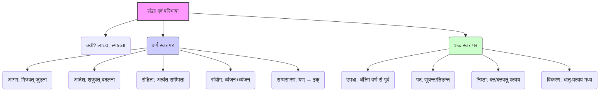

# Class 9 Sanskrit - Vyakranvidhi Chapter 102
**Language:** हिंदी

```markdown
# [कक्षा 9] व्याकरणवीथि - अध्याय 2: संज्ञा एवं परिभाषा प्रकरण

## 🌟 मुख्य अवधारणाएँ (Core Concepts)

यह अध्याय संस्कृत व्याकरण को समझने के लिए आवश्यक कुछ आधारभूत **संज्ञाओं (विशेष नामों)** और **परिभाषाओं** से परिचय कराता है। ये नियम और शब्द व्याकरण की प्रक्रिया को सरल और स्पष्ट बनाते हैं।

**मुख्य पारिभाषिक शब्दों का पदानुक्रम:**

1.  **व्याकरण में संज्ञा/परिभाषा का महत्व:**
    *   लाघव (संक्षिप्तता) के लिए प्रयोग।
    *   व्याकरण प्रक्रिया को समझने में सहायक।
2.  **वर्ण-परिवर्तन/संयोजन से संबंधित संज्ञाएँ:**
    *   **आगम:** मित्र की तरह किसी वर्ण का अतिरिक्त जुड़ना।
    *   **आदेश:** शत्रु की तरह किसी वर्ण को हटाकर उसके स्थान पर दूसरे वर्ण का आना।
    *   **संहिता:** वर्णों की अत्यधिक निकटता (संधि का आधार)।
    *   **संयोग:** स्वरों के बिना व्यंजनों का एक साथ आना।
    *   **सम्प्रसारण:** यण् (य्, व्, र्, ल्) का इक् (इ, उ, ऋ, ऌ) में बदलना।
3.  **शब्द-संरचना से संबंधित संज्ञाएँ:**
    *   **उपधा:** किसी शब्द के अंतिम वर्ण से ठीक पहले वाला वर्ण।
    *   **पद:** सुप् या तिङ् प्रत्यय से युक्त शब्द (वाक्य में प्रयोग योग्य)।
    *   **निष्ठा:** क्त (त) और क्तवतु (तवत्) प्रत्ययों का नाम (भूतकाल)।
    *   **विकरण:** धातु और तिङ् प्रत्यय के बीच आने वाला प्रत्यय (गणों का भेदक)।

📊 **अवधारणा मानचित्र:**


## 📘 मुख्य शिक्षाएँ (Key Learnings)

1.  **आगम (मित्रवदागमः):** जब कोई नया वर्ण दो वर्णों के बीच मित्र की तरह आकर जुड़ जाता है, उसे आगम कहते हैं।
    *   उदाहरण: वृक्ष + छाया = वृक्ष**च्**छाया। यहाँ 'च्' का आगम हुआ है।
    *   अन्य उदाहरण: तरु + छाया = तरु**च्**छाया, अनु + छेदः = अनु**च्**छेदः।
    *   📈 **चित्रण:** वर्ण1 + (नया वर्ण) + वर्ण2

2.  **आदेश (शत्रुवदादेशः):** जब कोई वर्ण किसी दूसरे वर्ण को हटाकर शत्रु की तरह उसका स्थान ले लेता है, उसे आदेश कहते हैं। यह पूर्व वर्ण, पर (बाद वाले) वर्ण या दोनों के स्थान पर हो सकता है (एकादेश)।
    *   उदाहरण: यदि + अपि = य**द्य**पि। यहाँ 'इ' के स्थान पर 'य्' आदेश हुआ है।
    *   अन्य उदाहरण: इति + आदि = इ**त्या**दि ('इ' को 'य्')।
    *   📈 **चित्रण:** वर्ण1 (हट गया) → नया वर्ण

3.  **उपधा (अलोऽन्त्यात् पूर्व उपधा):** किसी शब्द के अंतिम वर्ण (अल्) से ठीक पहले वाले वर्ण को उपधा कहते हैं।
    *   उदाहरण: 'चित्' में अंतिम वर्ण 'त्' है, उससे पहले 'इ' उपधा है। 'महत्' में अंतिम वर्ण 'त्' है, उससे पहले 'ह' में स्थित 'अ' उपधा है।

4.  **पद (सुप्तिङन्तं पदम्):** जिस शब्द के अंत में सुप् (नाम/संज्ञा शब्दों में लगने वाले 21 प्रत्यय जैसे - सु, औ, जस्) या तिङ् (क्रिया शब्दों में लगने वाले 18 प्रत्यय जैसे - तिप्, तस्, झि) प्रत्यय लगे हों, उसे पद कहते हैं। केवल 'पद' का ही वाक्य में प्रयोग किया जा सकता है (अपदं न प्रयुञ्जीत)।
    *   उदाहरण: राम (शब्द) + सु (प्रत्यय) = रामः (पद)। पठ् (धातु) + तिप् (प्रत्यय) = पठति (पद)।
    *   'राम', 'पठ्' आदि केवल शब्द या धातु हैं, पद नहीं।

5.  **निष्ठा (क्तक्तवतू निष्ठा):** क्त (त) और क्तवतु (तवत्) – इन दो प्रत्ययों की 'निष्ठा' संज्ञा होती है। ये मुख्य रूप से भूतकाल का अर्थ बताने वाले कृदन्त (participle) बनाते हैं।
    *   उदाहरण: गम् + क्त = गतः (गया हुआ), गम् + क्तवतु = गतवान् (गया)।

6.  **विकरण:** धातु और तिङ् प्रत्यय के बीच में आने वाले शप् (अ), श्यन् (य) आदि प्रत्ययों को विकरण कहते हैं। इन्हीं विकरणों के आधार पर धातुओं को 10 गणों (classes) में बाँटा जाता है।
    *   उदाहरण: भू (धातु) + शप् (विकरण) + ति (तिङ् प्रत्यय) = भव् + अ + ति = भवति।

7.  **संयोग (हलोऽनन्तराः संयोगः):** जब दो या अधिक व्यंजन वर्णों के बीच कोई स्वर न हो, तो उनके मेल को संयोग कहते हैं।
    *   उदाहरण: 'महत्त्व' में 'त्', 'त्' और 'व्' का संयोग है (त् + त् + व्)। 'उद्यानम्' में 'द्' और 'य्' का संयोग है (द् + य्)। 'गच्छति' में 'च्' और 'छ्' का संयोग है (च् + छ्)।

8.  **संहिता (परः सन्निकर्षः संहिता):** वर्णों की अत्यधिक समीपता (बिना किसी व्यवधान के) को संहिता कहते हैं। संधि कार्य हमेशा संहिता की स्थिति में ही होते हैं।
    *   उदाहरण: वाक् + ईशः = वागीशः। यहाँ 'क्' और 'ई' के बीच संहिता होने के कारण संधि हुई।

9.  **सम्प्रसारण (इग्यणः सम्प्रसारणम्):** यण् वर्णों (य्, व्, र्, ल्) के स्थान पर क्रमशः इक् वर्णों (इ, उ, ऋ, ऌ) का आना सम्प्रसारण कहलाता है। यह प्रायः यणादेश का उलटा होता है।
    *   उदाहरण: यज् धातु से 'इज्' (इज्यते), वच् धातु से 'उच्' (उच्यते)। यहाँ 'य्' को 'इ' और 'व्' को 'उ' हुआ है।

## 🧩 सक्रिय अधिगम (Active Learning)

*   **गतिविधि: शोध-आधारित केस स्टडी विश्लेषण 🔍**
    *   अपनी संस्कृत पाठ्यपुस्तक (जैसे शेमुषी) के किसी एक गद्यांश या पद्यांश को चुनें।
    *   उसमें से कम से कम 5 ऐसे शब्द छाँटें जिनमें **संयोग** हुआ हो।
    *   **आगम** या **आदेश** से बने संधि-युक्त पदों को पहचानें और उनका विच्छेद करें (जैसे 'इत्यादि', 'वृक्षच्छाया')।
    *   **पद** संज्ञा वाले शब्दों (सुबन्त और तिङन्त) की सूची बनाएँ।
    *   **निष्ठा** प्रत्यय (क्त/क्तवतु) से बने शब्दों को खोजें।
    *   किसी क्रियापद में **विकरण** को पहचानने का प्रयास करें (जैसे 'पठति' में 'अ')।
    *   **उपधा** वर्ण को कुछ शब्दों में चिह्नित करें (जैसे 'राजन्' में 'अ')।

*   **चर्चा: वास्तविक दुनिया के प्रभावों का आलोचनात्मक विश्लेषण 🌍**
    *   कक्षा में चर्चा करें: संस्कृत व्याकरण में इन सटीक परिभाषाओं (जैसे 'पद', 'संयोग', 'संहिता') की आवश्यकता क्यों है? इनके बिना क्या भ्रम उत्पन्न हो सकते हैं?
    *   'आगम' और 'आदेश' में क्या अंतर है? इन्हें 'मित्र' और 'शत्रु' की उपमा क्यों दी गई है? अपने दैनिक जीवन से उदाहरण देकर इस अंतर को स्पष्ट करें।
    *   'पद' की अवधारणा वाक्य निर्माण के लिए क्यों महत्वपूर्ण है? क्या हिंदी या अन्य भारतीय भाषाओं में भी ऐसी कोई अवधारणा है? तुलना करें।

## 📝 मूल्यांकन तैयारी (Assessment Prep)

*   **केस स्टडीज और आरेख 📝:**
    *   दिए गए शब्दों (जैसे: यद्यपि, अनुच्छेदः, महत्त्वम्, सज्जनः, अस्ति) में आगम, आदेश या संयोग पहचानें।
    *   शब्दों की सूची (जैसे: सः, पठ्, गच्छामि, मुनिः, ते, राम) में से 'पद' संज्ञा वाले शब्दों को छाँटें।
    *   वाक्यों में प्रयुक्त शब्दों में उपधा, निष्ठा, विकरण, संहिता और सम्प्रसारण के उदाहरण पहचानने का अभ्यास करें।
    *   **अभ्यास प्रश्न:**
        1.  'प्रत्येकम्' पद में कौन सा आदेश हुआ है? (इ → य्)
        2.  'धर्मः' शब्द में किन वर्णों का संयोग है? (र् + म्)
        3.  'गतवान्' में कौन सा (निष्ठा) प्रत्यय है? (क्तवतु)
        4.  'भवन्ति' क्रियापद में विकरण क्या है? (अ)
        5.  'जगदीशः' पद किन दो शब्दों की संहिता से बना है? (जगत् + ईशः)

## 🌏 भारतीय संदर्भ (Bharatiya Context)

*   **राष्ट्रीय आर्थिक/सामाजिक डेटा 📊 (व्याकरणिक संदर्भ में):**
    *   **पाणिनि की अष्टाध्यायी:** ये सभी पारिभाषिक शब्द महर्षि पाणिनि द्वारा रचित विश्व के प्राचीनतम और सर्वाधिक वैज्ञानिक व्याकरण ग्रंथ 'अष्टाध्यायी' से लिए गए हैं। यह भारतीय मेधा और विश्लेषण क्षमता का उत्कृष्ट उदाहरण है।
    *   **सूत्र शैली:** संस्कृत व्याकरण (और अन्य भारतीय शास्त्र) में ज्ञान को संक्षिप्त और सारगर्भित 'सूत्रों' में प्रस्तुत करने की परंपरा रही है। ये परिभाषाएँ (जैसे 'सुप्तिङन्तं पदम्') उसी सूत्र शैली का अंग हैं, जो कम शब्दों में गहरा अर्थ समेटे होती हैं।
    *   **भाषा की स्पष्टता:** संस्कृत व्याकरण की यह सूक्ष्मता और स्पष्टता सुनिश्चित करती है कि भाषा का प्रयोग सटीक हो। यह वैज्ञानिक और दार्शनिक विचारों की अभिव्यक्ति के लिए अत्यंत महत्वपूर्ण रहा है, जैसा कि प्राचीन भारतीय गणित (जैसे शून्य की अवधारणा), खगोल विज्ञान और दर्शन ग्रंथों में देखा जा सकता है। इन सटीक परिभाषाओं ने अर्थ के अनर्थ को रोकने में मदद की।
    *   **अन्य भारतीय भाषाओं पर प्रभाव:** संस्कृत व्याकरण की इस सुव्यवस्थित संरचना ने भारत की अन्य प्रादेशिक भाषाओं के व्याकरणों के विकास को भी प्रभावित किया है।

```