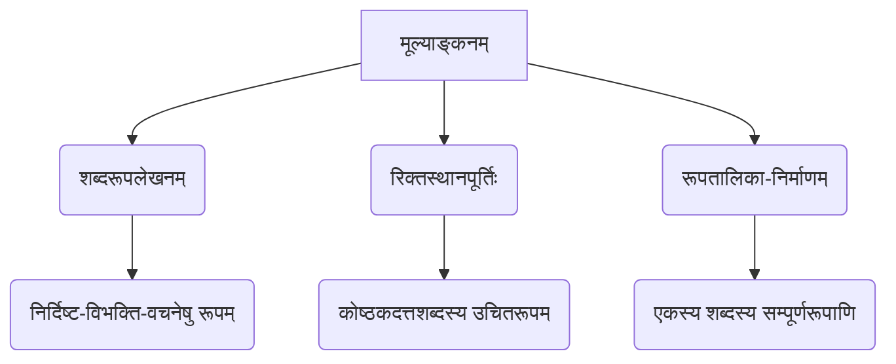

# Class 9 Sanskrit - Vyakranvidhi Chapter 104
**Language:** संस्कृतम्

```markdown
# [कक्षा ९] व्याकरणविधिः - अध्यायः ४ - शब्दरूप-सामान्यपरिचयः

## 🌟 मूलसिद्धान्ताः (Core Concepts)

अस्मिन् अध्याये वयं शब्दरूपाणां विषये पठामः। व्याकरणस्य आधारभूताः केचन सिद्धान्ताः अत्र चर्चिताः सन्ति।

```mermaid
graph TD
    A[वाक्यम्] --> B(शब्दः - वाक्यस्य लघुत्तमा इकाई);
    B --> C{पदम्};
    C --> D[नामपदम् (संज्ञा, सर्वनाम, विशेषणम्)];
    C --> E[क्रियापदम्];
    D --> F(संज्ञाशब्दः);
    F --> G{पदनिर्माणम्};
    G -- विभक्तिप्रत्यययोगेन --> H(पदम्);
    H --> I{विभक्तयः};
    I --> J[प्रथमा];
    I --> K[द्वितीया];
    I --> L[तृतीया];
    I --> M[चतुर्थी];
    I --> N[पञ्चमी];
    I --> O[षष्ठी];
    I --> P[सप्तमी];
    I --> Q[सम्बोधनम् (प्रथमा एव)];
    H --> R{वचनानि};
    R --> S[एकवचनम्];
    R --> T[द्विवचनम्];
    R --> U[बहुवचनम्];
    H --> V{लिङ्गानि};
    V --> W[पुंल्लिङ्गम्];
    V --> X[स्त्रीलिङ्गम्];
    V --> Y[नपुंसकलिङ्गम्];
    F --> Z{शब्दप्रकाराः (अन्त्यवर्णानुसारेण)};
    Z --> AA[स्वरान्तः (अजन्तः) - यस्य अन्ते स्वरः];
    AA --> AB(अकारान्तः - बालक);
    AA --> AC(आकारान्तः - लता);
    AA --> AD(इकारान्तः - मुनि);
    AA --> AE(...अन्यस्वरान्ताः);
    Z --> AF[व्यञ्जनान्तः (हलन्तः) - यस्य अन्ते व्यञ्जनम्];
    AF --> AG(चकारान्तः - वाच्);
    AF --> AH(तकारान्तः - जगत्);
    AF --> AI(नकारान्तः - राजन्);
    AF --> AJ(...अन्यव्यञ्जनान्ताः);
    D --> AK(सर्वनामशब्दः);
    D --> AL(संख्यावाचकशब्दः);

    style B fill:#f9f,stroke:#333,stroke-width:2px
    style C fill:#ccf,stroke:#333,stroke-width:2px
    style H fill:#ccf,stroke:#333,stroke-width:2px
    style I fill:#ff9,stroke:#333,stroke-width:2px
    style R fill:#ff9,stroke:#333,stroke-width:2px
    style V fill:#ff9,stroke:#333,stroke-width:2px
    style Z fill:#9cf,stroke:#333,stroke-width:2px
```

**📊 मुख्यसंकल्पनानां क्रमः:**
1.  **शब्दः:** वाक्यस्य लघुत्तमा अर्थयुक्ता इकाई।
2.  **पदम्:** वाक्ये प्रयोगार्थं शब्देषु विभक्तिप्रत्ययान् योजयित्वा निर्मितं रूपम्। (संज्ञा, सर्वनाम इत्यादि शब्देभ्यः 'सुप्' प्रत्ययाः योज्यन्ते)।
3.  **विभक्तिः:** शब्दानां कारकं (कर्तृ, कर्म, करण इत्यादि) वचनं च सूचयितुं योज्यमानाः प्रत्ययाः (प्रथमातः सप्तमीपर्यन्तं सप्त विभक्तयः, सम्बोधनं च)।
4.  **वचनम्:** संख्याबोधकम् (एकवचनम्, द्विवचनम्, बहुवचनम्)।
5.  **लिङ्गम्:** (पुंल्लिङ्गम्, स्त्रीलिङ्गम्, नपुंसकलिङ्गम्)।
6.  **शब्दप्रकाराः:**
    *   **संज्ञाशब्दाः:** व्यक्ति, वस्तु, स्थान, भाव इत्यादीनां नामानि।
    *   **सर्वनामशब्दाः:** संज्ञास्थाने प्रयुज्यमानाः शब्दाः (यथा - तत्, इदम्, अस्मद्, युष्मद्)।
    *   **संख्यावाचकशब्दाः:** संख्यां बोधयन्ति (यथा - एक, द्वि, त्रि)।
7.  **अन्त्यवर्णानुसारं वर्गीकरणम्:**
    *   **स्वरान्तः (अजन्तः):** येषां शब्दानाम् अन्ते स्वरवर्णः भवति (अ, आ, इ, ई, उ, ऊ, ऋ, ए, ओ, औ)। यथा - बालक (अ), लता (आ), मुनि (इ), नदी (ई), गुरु (उ), पितृ (ऋ)।
    *   **व्यञ्जनान्तः (हलन्तः):** येषां शब्दानाम् अन्ते व्यञ्जनवर्णः भवति (क्, च्, त्, न्, स् इत्यादि)। यथा - राजन् (न्), जगत् (त्), वाच् (च्), पयस् (स्)।

## 📘 प्रमुखशिक्षणबिन्दवः (Key Learnings)

1.  **पदनिर्माणप्रक्रिया:** संस्कृते वाक्ये केवलं 'पदम्' एव प्रयोक्तुं शक्यते, न तु केवलं 'शब्दः'। संज्ञा/सर्वनामशब्देभ्यः पदनिर्माणार्थं 'सुप्' इति २१ (७ विभक्तयः × ३ वचनानि) प्रत्ययाः योज्यन्ते। एते प्रत्ययाः पाणिनेः अष्टाध्याय्याम् उल्लिखिताः सन्ति।

    **सुप्-प्रत्ययाः (संक्षेपेण)**
    | विभक्तिः  | एकवचनम् | द्विवचनम् | बहुवचनम् |
    | :-------- | :------ | :-------- | :-------- |
    | प्रथमा    | सु (स्>ः) | औ         | जस् (अस्) |
    | द्वितीया   | अम्      | औट् (औ)   | शस् (अस्) |
    | तृतीया    | टा (आ)   | भ्याम्      | भिस् (भिः)|
    | चतुर्थी   | ङे (ए)   | भ्याम्      | भ्यस् (भ्यः)|
    | पञ्चमी    | ङसि (अस्)| भ्याम्      | भ्यस् (भ्यः)|
    | षष्ठी     | ङस् (अस्)| ओस् (ओः)  | आम्       |
    | सप्तमी    | ङि (इ)   | ओस् (ओः)  | सुप् (सु)  |
    *(एतेषां प्रत्ययानां प्रयोगेण शब्देषु परिवर्तनं भवति, यथा 'बालक + सु -> बालकः')*

2.  **शब्दानां वर्गीकरणम्:** शब्दान् अन्ते विद्यमानस्य वर्णस्य आधारेण मुख्यतया द्विधा विभजन्ति - स्वरान्ताः (अजन्ताः) व्यञ्जनान्ताः (हलन्ताः) च।
    *   **स्वरान्ताः:** अकारान्तः (बालक, फल), आकारान्तः (लता, बालिका), इकारान्तः (मुनि, पति), ईकारान्तः (नदी), उकारान्तः (गुरु, भानु), ऊकारान्तः (वधू), ऋकारान्तः (पितृ, मातृ) इत्यादयः।
    *   **व्यञ्जनान्ताः:** चकारान्तः (वाच्), जकारान्तः (वणिज्), तकारान्तः (जगत्, भवत्), नकारान्तः (राजन्, आत्मन्), सकारान्तः (पयस्, विद्वस्) इत्यादयः।

3.  **लिङ्ग-वचन-विभक्त्यनुसारं रूपभेदः:** एकस्य एव शब्दस्य लिङ्ग-वचन-विभक्तिभेदेन भिन्नानि रूपाणि भवन्ति। एतानि रूपाणि एव 'शब्दरूपाणि' इति कथ्यन्ते।

    **उदाहरणानि:**

    *   **अकारान्तः पुंल्लिङ्गः 'बालक' शब्दः:**
        ```mermaid
        graph LR
            A[बालक] --> B(प्रथमा: बालकः, बालकौ, बालकाः);
            A --> C(द्वितीया: बालकम्, बालकौ, बालकान्);
            A --> D(तृतीया: बालकेन, बालकाभ्याम्, बालकैः);
            A --> E(चतुर्थी: बालकाय, बालकाभ्याम्, बालकेभ्यः);
            A --> F(पञ्चमी: बालकात्, बालकाभ्याम्, बालकेभ्यः);
            A --> G(षष्ठी: बालकस्य, बालकयोः, बालकानाम्);
            A --> H(सप्तमी: बालके, बालकयोः, बालकेषु);
            A --> I(सम्बोधनम्: हे बालक!, हे बालकौ!, हे बालकाः!);
        ```
        *एवमेव वृक्ष, अध्यापक, छात्र, नर, देव इत्यादयः अकारान्तपुंल्लिङ्गशब्दाः भवन्ति।*

    *   **आकारान्तः स्त्रीलिङ्गः 'बालिका' शब्दः:**
        *   प्रथमा: बालिका, बालिके, बालिकाः
        *   द्वितीया: बालिकाम्, बालिके, बालिकाः
        *   तृतीया: बालिकया, बालिकाभ्याम्, बालिकाभिः
        *   ... (एवमेव लता, बाला, विद्या इत्यादयः)

    *   **अकारान्तः नपुंसकलिङ्गः 'फल' शब्दः:**
        *   प्रथमा: फलम्, फले, फलानि
        *   द्वितीया: फलम्, फले, फलानि
        *   तृतीया: फलेन, फलाभ्याम्, फलैः (पुंल्लिङ्गवत्)
        *   ... (सप्तमी पर्यन्तं पुंल्लिङ्गवत्)
        *   *टिप्पणी: अकारान्तनपुंसकलिङ्गे तृतीयातः सप्तमीपर्यन्तं रूपाणि प्रायः अकारान्तपुंल्लिङ्गवत् भवन्ति।* (एवमेव मित्र, वन, मुख, कमल, पुष्प इत्यादयः)

    *   **नकारान्तः पुंल्लिङ्गः 'राजन्' शब्दः:**
        *   प्रथमा: राजा, राजानौ, राजानः
        *   द्वितीया: राजानम्, राजानौ, राज्ञः
        *   तृतीया: राज्ञा, राजभ्याम्, राजभिः
        *   ... (अस्य रूपाणि अकारान्तात् भिन्नानि सन्ति)

4.  **सम्बोधनम्:** सम्बोधने प्रथमा विभक्तिः एव भवति, परन्तु एकवचने रूपं किञ्चित् भिन्नं भवितुम् अर्हति (यथा - बालकः -> हे बालक!)।

## 🧩 सक्रिय-अधिगमः (Active Learning)

### 🔍 गतिविधिः (Activity): वाक्यविश्लेषणम् (Sentence Analysis)
अधोदत्तेषु वाक्येषु रेखाङ्कितानां पदानां मूलशब्दं, लिङ्गं, विभक्तिं, वचनं च लिखत। तेषां प्रयोगस्य कारणमपि स्पष्टीकुरुत (कारकम्)।
*(Research-based case study analysis - adapted to grammatical analysis)*

1.  **<u>गङ्गायाः</u>** जलं पवित्रं वर्तते।
2.  **<u>बालिकाभिः</u>** इदं कार्यं कृतम्।
3.  **<u>गगने</u>** प्रातः भानुः उदेति।
4.  **<u>धेनोः</u>** दुग्धं मधुरं भवति।
5.  सः **<u>भवन्तम्</u>** उपगम्य किं करोति?
6.  **<u>राज्ञः</u>** आज्ञा पालनीया।
7.  **<u>फलेषु</u>** माधुर्यम् अस्ति।
8.  **<u>साधवः</u>** सन्मार्गं प्रदर्शयन्ति।

*(छात्रैः एतेषां पदानां विश्लेषणं करणीयम्, यथा - 'गङ्गायाः' -> मूलशब्दः-गङ्गा, लिङ्गम्-स्त्रीलिङ्गम्, विभक्तिः-षष्ठी, वचनम्-एकवचनम्, कारणम्-सम्बन्धकारकम्)*

### 🌍 विमर्शः (Discussion): विभक्तीनां प्रयोगस्य महत्त्वम्
*(Critical analysis of real-world impacts - adapted to linguistic impact)*

कक्षायां छात्राः एतेषु विषयेषु विमर्शं कुर्युः:
1.  यदि वाक्ये शब्दानां विभक्तिः अशुद्धा भवति तर्हि अर्थे कः प्रभावः भवति? उदाहरणानि दत्त्वा स्पष्टीकुरुत। (यथा - 'रामः रावणं हन्ति' इत्यस्य स्थाने 'रामं रावणः हन्ति' इति वदामः चेत् कः अर्थभेदः?)
2.  संस्कृते शब्दरूपाणि स्मर्तुं कानि सरलानि उपायानि सन्ति? परस्परं स्वानुभवान् वदन्तु।
3.  'बालक' शब्दस्य रूपाणि ज्ञात्वा अन्येषां केषां शब्दानां रूपाणि ज्ञातुं शक्यन्ते? (समानरूपि-शब्दानां चर्चा)
4.  स्वरान्त-व्यञ्जनान्तशब्दानां रूपेषु किं मुख्यं भेदं पश्यन्ति?

## 📝 मूल्याङ्कनसिद्धता (Assessment Prep)

*   **शब्दरूपलेखनम्:** अधोनिर्दिष्टानां शब्दानां निर्दिष्टविभक्तिषु वचनेषु च रूपाणि लिखत:
    *   'नदी' (तृतीया एकवचन, षष्ठी बहुवचन)
    *   'गुरु' (पञ्चमी एकवचन, सप्तमी द्विवचन)
    *   'पितृ' (द्वितीया बहुवचन, चतुर्थी एकवचन)
    *   'जगत्' (प्रथमा बहुवचन, सप्तमी एकवचन)
    *   'अस्मद्' (प्रथमा बहुवचन, षष्ठी एकवचन)
    *   'तत्' (पुंल्लिङ्गम् - चतुर्थी एकवचन, स्त्रीलिङ्गम् - द्वितीया बहुवचन)

*   **रिक्तस्थानपूर्तिः:** कोष्ठके दत्तस्य शब्दस्य उचितं विभक्तिरूपं चित्वा रिक्तस्थानानि पूरयत (अभ्यासकार्यस्य प्रश्नाः इव)।
    *   उदाहरणम्: अहं ______ सह गच्छामि। (मित्र - तृतीया, एकवचन) -> मित्रेण

*   **रेखाचित्रम्/तालिका:** 'लता' (आकारान्त-स्त्रीलिङ्ग) अथवा 'मुनि' (इकारान्त-पुंल्लिङ्ग) शब्दस्य पूर्णरूपतालिकां रचयत।



## 🌏 भारतीयसन्दर्भः (Bharatiya Context)

1.  **पाणिनीयं व्याकरणम्:** संस्कृतव्याकरणस्य, विशेषतः शब्दरूपाणां धातु रूपाणां च व्यवस्था, महर्षिणा पाणिनिना 'अष्टाध्यायी' इति ग्रन्थे सुव्यवस्थिता कृता। 'सुप्' प्रत्ययानां कल्पना अस्याः एव परम्परायाः भागः अस्ति। इयं वैज्ञानिकव्यवस्था भारतीयज्ञानपरम्परायाः महत्त्वपूर्णम् अङ्गम् अस्ति।
2.  **भाषायां स्पष्टता:** विभक्तीनां सम्यक् प्रयोगेण एव संस्कृते वाक्यस्य अर्थः सुस्पष्टः भवति। कर्ता कः, कर्म किम्, केन साधनेन क्रिया भवति इत्यादिकं सर्वं विभक्तिभिः एव ज्ञायते। भारतीयशास्त्रेषु, काव्येषु च अस्याः व्यवस्थायाः सुन्दरः प्रयोगः दृश्यते।
    *   **उदाहरणम्:** 'वृक्षात् फलानि पतन्ति' - अत्र 'वृक्षात्' (पञ्चमी) इति पदात् 'वृक्षतः (separation)' इति अर्थः स्पष्टः भवति। 'वृक्षे फलानि पतन्ति' (सप्तमी) इति चेत् अर्थः भिन्नः (वृक्षस्य उपरि) भवति।
3.  **विविधशब्दाः:** संस्कृते विभिन्नप्रकारकाः (अकारान्ताः, नकारान्ताः इत्यादयः) शब्दाः सन्ति ये भारतस्य समृद्धसांस्कृतिकपरिवेशस्य वस्तूनि, विचाराणि च अभिव्यञ्जयन्ति। यथा - नदी, गिरि, गुरु, पितृ, मातृ, राजन्, विद्वस् इत्यादयः। एतेषां शब्दानां रूपाणि ज्ञात्वा वयं प्राचीनग्रन्थान् अवगन्तुं शक्नुमः।

*(अत्र आर्थिक/सामाजिक-आंकडानां (Economic/Social Data) स्थाने व्याकरणस्य भारतीयमूलं, भाषायां तस्य महत्त्वं, सांस्कृतिकशब्दानां च उल्लेखः कृतः, यतः सः एव अस्य अध्यायस्य विषयेण सह अधिकः सङ्गतः अस्ति।)*
```