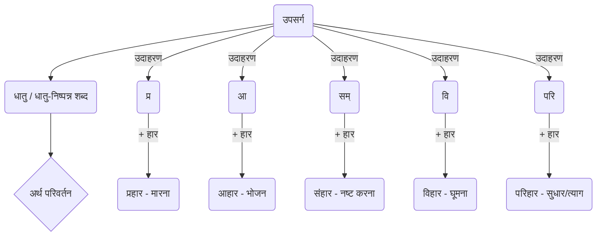

# Class 9 Sanskrit - Vyakranvidhi Chapter 106
**Language:** हिंदी

```markdown
# [Class 9] Vyakranvidhi - Chapter 106 - उपसर्ग (Prefixes)

## 🌟 मुख्य अवधारणाएँ (Core Concepts)

**उपसर्ग क्या हैं?**
उपसर्ग वे शब्द या शब्दांश होते हैं जो धातु (क्रिया के मूल रूप) या धातुओं से बने शब्दों से पहले जुड़कर उनके अर्थ में परिवर्तन ला देते हैं। संस्कृत में कहा गया है:
*उपसर्गेण धात्वर्थो बलादन्यत्र नीयते।*
*प्रहाराहार-संहार-विहार-परिहारवत्॥*
अर्थात्, उपसर्ग के द्वारा धातु का अर्थ बलपूर्वक दूसरी ओर ले जाया जाता है (बदल दिया जाता है), जैसे हार शब्द प्र, आ, सम्, वि, परि उपसर्ग लगने से क्रमशः प्रहार, आहार, संहार, विहार, परिहार बन जाता है, जिनके अर्थ भिन्न होते हैं।

**अवधारणा पदानुक्रम (Concept Hierarchy) 📊**



**संस्कृत में उपसर्ग (Prefixes in Sanskrit):**
संस्कृत व्याकरण में मुख्यतः 22 उपसर्ग माने गए हैं:
प्र, परा, अप, सम्, अनु, अव, निर्, निस्, दुस्, दुर्, वि, आङ् (आ), नि, अधि, अति, सु, उत् (उद्), अभि, प्रति, परि, उप, अपि।

**मुख्य बिंदु:**
*   उपसर्गों का अकेले (स्वतंत्र रूप से) प्रयोग नहीं होता है।
*   ये हमेशा किसी धातु या शब्द के आरंभ में जुड़ते हैं।

## 📘 प्रमुख शिक्षाएँ (Key Learnings)

**1. उपसर्ग से अर्थ परिवर्तन:**
उपसर्ग धातु या शब्द के मूल अर्थ को कई प्रकार से बदल सकते हैं:
*   **अर्थ को पूरी तरह बदलना:** जैसे 'हार' (माला) शब्द में विभिन्न उपसर्ग लगने पर:
    *   **प्र + हार = प्रहार** (अर्थ: मारना)
    *   **आ + हार = आहार** (अर्थ: भोजन)
    *   **सम् + हार = संहार** (अर्थ: नष्ट करना)
    *   **वि + हार = विहार** (अर्थ: घूमना-फिरना)
    *   **परि + हार = परिहार** (अर्थ: सुधार करना, त्याग करना)
*   **अर्थ में विशेषता लाना:** कभी-कभी उपसर्ग मूल अर्थ को और विशिष्ट या तीव्र बना देते हैं।

**2. 22 उपसर्ग और उनके उदाहरण:**

| उपसर्ग | उदाहरण शब्द | वाक्य प्रयोग (उदाहरण) |
|---|---|---|
| 1. प्र | प्रभवति (निकलती है) | गङ्गा हिमालयात् प्रभवति। |
| 2. परा | पराजयते (हारता है) | सैनिकः शत्रून् पराजयते। |
| 3. अप | अपहरति (चुराता है) | चौरः धनम् अपहरति। |
| 4. सम् | संस्करोति (सुधारता है) | अध्यापकः छात्रं संस्करोति। |
| 5. अनु | अनुगच्छति (पीछे जाता है) | शिष्यः गुरुम् अनुगच्छति। |
| 6. अव | अवगच्छति (समझता है) | रामः भवन्तम् अवगच्छति। |
| 7. निर् | निर्गच्छति (निकलता है) | प्राचार्यः कार्यालयात् निर्गच्छति। |
| 8. निस् | निस्सरति (निकलता है) | सर्पः बिलाद् निस्सरति। |
| 9. दुस् | दुस्त्यज्यः (कठिनता से त्यागने योग्य) | स्वभावः दुस्त्यज्यः भवति। |
| 10. दुर् | दुर्बोधयः (कठिनता से समझने योग्य) | अयं गूढविषयः दुर्बोधयः अस्ति। |
| 11. वि | विजयते (विजय पाता है) | धर्मः सदा विजयते। |
| 12. आ (आङ्) | आकण्ठम् (गले तक) | आकण्ठं जलं पीतम्। |
| 13. नि | निगदति (कहता है) | पुत्रः पितरं निगदति। |
| 14. अधि | अधिराजते (सुशोभित होता है) | विद्वान् सर्वत्र अधिराजते। |
| 15. अति | अतिवादः (बहुत अधिक बोलना) | अतिवादो न कर्तव्यः। |
| 16. सु | सुशोभते (सुंदर लगता है) | उद्याने पुष्पाणि सुशोभन्ते। |
| 17. उत् (उद्) | उड्डयते (उड़ता है) | पक्षिणः आकाशे उड्डयन्ते। |
| 18. अभि | अभ्यागतः (अतिथि) | अभ्यागतः सर्वैः सदा पूजनीयः। |
| 19. प्रति | प्रत्यवदत् (उत्तर दिया) | पुत्री मातरं प्रत्यवदत्। |
| 20. परि | परित्यजामि (त्यागता हूँ) | अहं दुष्टं परित्यजामि। |
| 21. उप | उपगच्छति (पास जाता है) | शिष्यः अध्ययनाय गुरुम् उपगच्छति। |
| 22. अपि | अपिदधाति (ढकता है) | द्वारपालः द्वारम् अपिदधाति (पिदधाति)। |

**3. विभिन्न लकारों (काल/अवस्था) में उपसर्ग का प्रयोग:**
जब किसी उपसर्ग युक्त धातु का वाक्य में प्रयोग करना होता है, तो पहले धातु का सामान्य रूप (जैसे लट् लकार, लङ् लकार आदि में) बना लेते हैं, फिर उस बने हुए पद (रूप) के शुरू में उपसर्ग को सन्धि के नियमों के अनुसार जोड़ते हैं।

**उदाहरण: √गम् (जाना) + अनु (पीछे)**

| लकार | धातु रूप (√गम्) | उपसर्ग + धातु रूप | सन्धि नियम (यदि लागू हो) |
|---|---|---|---|
| लट् (वर्तमान काल) | गच्छति | अनु + गच्छति = **अनुगच्छति** | - |
| लृट् (भविष्यत् काल) | गमिष्यति | अनु + गमिष्यति = **अनुगमिष्यति** | - |
| लङ् (भूतकाल) | अगच्छत् | अनु + अगच्छत् = **अन्वगच्छत्** | यण् सन्धि (उ + अ = व्) |
| लोट् (आज्ञा) | गच्छतु | अनु + गच्छतु = **अनुगच्छतु** | - |
| विधिलिङ् (चाहिए अर्थ में) | गच्छेत् | अनु + गच्छेत् = **अनुगच्छेत्** | - |

📈 **Diagram:** उपसर्ग + (धातु + प्रत्यय [लकार के अनुसार]) = उपसर्गयुक्त क्रियापद

## 🧩 सक्रिय अधिगम (Active Learning)

**1. गतिविधि: उपसर्ग अन्वेषक (Prefix Explorer) 🔍**
*   **कार्य:** कोई एक धातु चुनें (जैसे - √कृ - करना, √भू - होना, √हृ - हरण करना, √नी - ले जाना)।
*   **शोध:** कम से कम 5 अलग-अलग उपसर्गों को उस धातु के साथ जोड़कर नए शब्द बनाएँ।
*   **विश्लेषण:** प्रत्येक नए शब्द का अर्थ लिखें और बताएँ कि उपसर्ग ने मूल धातु के अर्थ को कैसे बदला।
*   **प्रस्तुति:** अपने निष्कर्षों को कक्षा में प्रस्तुत करें, उदाहरण वाक्यों का प्रयोग करते हुए। (यह गतिविधि छात्रों में शोध और विश्लेषण कौशल विकसित करेगी)।

**2. चर्चा: अर्थ की सूक्ष्मता (Nuances of Meaning) 🌍**
*   कक्षा में चर्चा करें: 'अपहरति' (चुराता है), 'संहरति' (संहार करता है), 'विहरति' (घूमता है), और 'प्रहरति' (प्रहार करता है) - इन सभी में √हृ धातु है, पर उपसर्गों ने अर्थ को कितना भिन्न बना दिया है?
*   वास्तविक जीवन के उदाहरणों पर विचार करें जहाँ सही उपसर्ग का प्रयोग संचार को सटीक बनाता है। गलत उपसर्ग के प्रयोग से क्या भ्रम हो सकता है? (यह छात्रों में आलोचनात्मक सोच और भाषा के व्यावहारिक प्रयोग की समझ विकसित करेगा)।

## 📝 मूल्यांकन तैयारी (Assessment Prep)

**अभ्यास प्रश्न:**

1.  **उपसर्ग और धातु अलग करें:** (निम्नलिखित पदों में उपसर्ग और धातु पहचान कर लिखें)
    *   निर्गच्छति = निर् + गम्
    *   प्रत्यवदत् = प्रति + वद्
    *   उड्डयते = उत् + डी
    *   संस्करोति = सम् + कृ
    *   विजयते = वि + जि

2.  **सही उपसर्गयुक्त पद चुनें:** (कोष्ठक से उचित पद चुनकर रिक्त स्थान भरें)
    *   शिष्यः गुरुम् _________ । (अनुगच्छति / अवगच्छति)
    *   धर्मः सदा _________ । (पराजयते / विजयते)
    *   चौरः धनम् _________ । (अपहरति / उपहरति)
    *   गङ्गा हिमालयात् _________ । (प्रभवति / अनुभवति)

3.  **शब्द निर्माण और वाक्य प्रयोग:**
    *   'आ', 'वि', 'सम्' उपसर्गों को 'चार' शब्द से जोड़कर नए शब्द बनाएँ और उनके अर्थ लिखकर वाक्य में प्रयोग करें। (जैसे: आ + चार = आचार)
    *   √भू (होना) धातु के लट् लकार (भवति) रूप के साथ 'अनु', 'प्र', 'उद्' उपसर्ग जोड़कर नए क्रियापद बनाएँ और वाक्य बनाएँ। (जैसे: अनु + भवति = अनुभवति)

**केस स्टडी / अनुच्छेद:**
नीचे दिए गए अनुच्छेद में रिक्त स्थानों की पूर्ति कोष्ठक में दिए गए उपसर्गों को उचित धातु रूप के साथ जोड़कर करें: (उपसर्ग: प्र, वि, अनु, निर्)
एकः शिष्यः गुरोः आश्रमं (1)_________ (√विश्)। सः प्रतिदिनं गुरुं (2)_________ (√सृ)। एकदा सः वने (3)_________ (√हृ)। तदा सः आश्रमात् (4)_________ (√गम्)।
*(उत्तर: 1. प्राविशत्, 2. अन्वसरत्/अनुसरति स्म, 3. व्यहरत्/विहरति स्म, 4. निरगच्छत्/निर्गच्छति स्म)*

**Diagram Reference:** (See Key Learnings section for the diagram showing prefix addition to verb forms)

## 🌏 भारतीय संदर्भ (Bharatiya Context)

*   **सांस्कृतिक और भौगोलिक उदाहरण:** इस अध्याय में दिए गए उदाहरण वाक्य भारतीय संस्कृति और भूगोल से जुड़े हैं, जैसे:
    *   `गङ्गा हिमालयात् प्रभवति।` (गंगा नदी और हिमालय पर्वत का भौगोलिक संदर्भ)
    *   `शिष्यः गुरुम् अनुगच्छति।` (गुरु-शिष्य परंपरा का सांस्कृतिक संदर्भ)
    *   `धर्मः सदा विजयते।` (धर्म की विजय का नैतिक और सांस्कृतिक मूल्य)
    *   `अभ्यागतः सर्वैः सदा पूजनीयः।` (अतिथि सत्कार का सामाजिक महत्व)
*   **आधुनिक भारतीय भाषाओं से संबंध:** संस्कृत के ये 22 उपसर्ग आज भी हिंदी, मराठी, गुजराती, बंगाली जैसी कई आधुनिक भारतीय भाषाओं की शब्दावली का अभिन्न अंग हैं। शब्द जैसे - `प्रगति, अपमान, संभव, अनुसार, अवगुण, निर्धन, दुर्लभ, विजय, आजन्म, अधिकार, अतिशय, सुपुत्र, उत्पन्न, अभिमान, प्रतिदिन, परिचय, उपयोग` आदि सीधे संस्कृत उपसर्गों से बने हैं और दैनिक जीवन में प्रयोग होते हैं। यह भारत की भाषाई निरंतरता और संस्कृत के प्रभाव को दर्शाता है। 📊
```