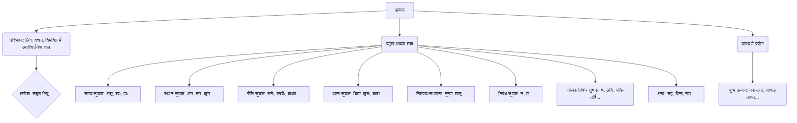

# Class 9 Sanskrit - Vyakranvidhi Chapter 107
**Language:** हिंदी

```markdown
# [कक्षा 9] व्याकरणविधि - अध्याय 107: अव्यय

## 🌟 मुख्य अवधारणाएँ (Core Concepts)

**अव्यय की परिभाषा एवं प्रकृति:**
*   **अव्यय:** वे शब्द जो संस्कृत भाषा में सदा एक जैसे ही रहते हैं, जिनमें लिंग, वचन या विभक्ति के आधार पर कोई परिवर्तन नहीं होता।
    *   **श्लोक:** सदृशं त्रिषु लिङ्गेषु, सर्वासु च विभक्तिषु। वचनेषु च सर्वेषु यन्न व्येति तदव्ययम्॥
    *   **अर्थ:** जो तीनों लिंगों में, सभी विभक्तियों में और सभी वचनों में समान रहता है, जिसमें कोई विकार (परिवर्तन) नहीं आता, वह अव्यय कहलाता है।

**अव्यय शब्दों की सूची एवं अर्थ (उदाहरण):**
*   **समय-सूचक:** अद्य (आज), श्वः (आने वाला कल), ह्यः (बीता हुआ कल), इदानीम्/सम्प्रति/अधुना (इस समय), यदा (जब), तदा (तब), कदा (कब), सर्वदा (हमेशा), प्रातः (सवेरे), सायम् (शाम), पुरा (पहले), अचिरात् (शीघ्र ही), चिरम् (देर तक), नक्तम् (रात में)
*   **स्थान-सूचक:** अत्र (यहाँ), तत्र (वहाँ), कुत्र (कहाँ), सर्वत्र (सब जगह), अन्यत्र (दूसरी जगह), इतस्ततः (इधर-उधर), उभयतः (दोनों ओर), परितः (चारों ओर), अभितः (दोनों ओर), बहिः (बाहर), पुरतः/पुरस्तात् (सामने)
*   **रीति/प्रकार-सूचक:** शनैः (धीरे), उच्चैः (जोर से), नीचैः (नीचे), कथम् (कैसे), यथा (जैसे), तथा (वैसे), एवम् (इस प्रकार), सहसा (अचानक), वृथा (व्यर्थ), तूष्णीम् (चुपचाप)
*   **प्रश्न-सूचक:** किम् (क्या), कुतः (कहाँ से), कथम् (कैसे), कदा (कब)
*   **निश्चय/संभावना-सूचक:** नूनम् (निश्चित ही), खलु (निश्चित ही), जातु (कभी)
*   **निषेध-सूचक:** न (नहीं), मा (मत), अलम् (बस, मत करो - तृतीया के योग में)
*   **समुच्चयबोधक/योजक:** च (और), अपि (भी), वा (या), अथवा (या), यदि-तर्हि (अगर-तो), यद्यपि-तथापि (हालांकि-फिर भी), यावत्-तावत् (जब तक-तब तक), यथा-तथा (जैसे-वैसे)
*   **अन्य:** सह (साथ - तृतीया के योग में), विना (बिना - द्वितीया, तृतीया, पंचमी के योग में), नमः (नमस्कार - चतुर्थी के योग में), अलम् (पर्याप्त - चतुर्थी के योग में), धिक् (धिक्कार - द्वितीया के योग में), ईषत् (थोड़ा), अतीव (बहुत), भूयः/मुहुर्मुहुः (बार-बार)

**📊 अवधारणा पदानुक्रम (Concept Hierarchy):**



## 📘 मुख्य सीख (Key Learnings)

**1. अव्यय की पहचान:**
*   अव्यय वे शब्द हैं जिनका रूप कभी नहीं बदलता। चाहे कर्ता पुल्लिंग हो या स्त्रीलिंग, एकवचन हो या बहुवचन, वाक्य किसी भी काल में हो, अव्यय ज्यों के त्यों रहते हैं।
*   उदाहरण:
    *   बालकः **अद्य** पठति। (लड़का आज पढ़ता है।)
    *   बालिका **अद्य** पठति। (लड़की आज पढ़ती है।)
    *   बालकाः **अद्य** पठन्ति। (लड़के आज पढ़ते हैं।)
    *   (यहाँ 'अद्य' अव्यय है, जो कर्ता के लिंग या वचन बदलने पर भी नहीं बदला।)

**2. अव्यय के अर्थ एवं प्रयोग:**
*   प्रत्येक अव्यय का अपना विशिष्ट अर्थ होता है जो वाक्य के भाव को स्पष्ट करता है।
*   **📈 उदाहरण तालिका:**

| अव्यय        | अर्थ             | वाक्य प्रयोग (पाठ से)                       |
| :------------ | :--------------- | :------------------------------------------ |
| शनैः शनैः   | धीरे-धीरे        | कच्छपः **शनैः शनैः** चलति।                 |
| श्वः          | आने वाला कल     | अहं **श्वः** वाराणसीं गमिष्यामि।           |
| ह्यः          | बीता हुआ कल     | **ह्यः** मम गृहे उत्सवः आसीत्।              |
| सहसा        | अचानक           | **सहसा** निर्णयः न करणीयः।                 |
| इदानीम्      | इस समय          | **इदानीम्** अहं संस्कृतं पठामि।             |
| यद्यपि-तथापि | हालाँकि - फिर भी | **यद्यपि** अद्य अवकाशः अस्ति **तथापि** अहं कार्यमुक्तः नास्मि। |
| अत्र          | यहाँ             | **अत्र** आगच्छ।                             |
| इतस्ततः      | इधर-उधर         | कुक्कुरः **इतस्ततः** भ्रमति।                 |
| यत्र-तत्र     | जहाँ-वहाँ        | **यत्र-यत्र** धूमः **तत्र-तत्र** अग्निः।       |
| पुरा          | पहले             | **पुरा** अशोकः राजा आसीत्।                  |
| विना          | बिना             | धनं **विना** जीवनं वृथा भवति।              |
| अथ           | अब (आरम्भ)      | **अथ** रामायणकथा आरभ्यते।                 |
| मा            | मत (निषेध)      | कोलाहलं **मा** कुरु।                       |
| बहिः         | बाहर            | गृहात् **बहिः** मा गच्छ।                    |

**3. युग्म अव्ययों का प्रयोग:**
*   कुछ अव्यय जोड़ों में प्रयुक्त होते हैं, जैसे - यद्यपि-तथापि, यथा-तथा, यदि-तर्हि, यत्र-तत्र, यावत्-तावत्, यदा-तदा।
*   इनका प्रयोग प्रायः एक साथ ही वाक्य में करना चाहिए, अन्यथा वाक्य अपूर्ण रह सकता है।
*   उदाहरण: **यावत्** परीक्षाकालः न आयाति **तावत्** परिश्रमं कुरु। (जब तक परीक्षा का समय नहीं आता, तब तक परिश्रम करो।)

**📈 अव्यय की अपरिवर्तनीयता:**

```mermaid
graph LR
    A[अव्यय शब्द (जैसे: अद्य)] -- लिंग --> B{कोई परिवर्तन नहीं};
    A -- वचन --> B;
    A -- विभक्ति --> B;
    A -- काल --> B;
```

## 🧩 सक्रिय अधिगम (Active Learning)

**🔍 गतिविधि: शोध-आधारित केस स्टडी विश्लेषण (Research-based Case Study Analysis)**
1.  **कार्य:** अपनी संस्कृत पाठ्यपुस्तक (रुचिरा या अन्य) से कोई एक लघु कथा या संवाद चुनें।
2.  **विश्लेषण:** उस कथा/संवाद में प्रयुक्त सभी अव्यय शब्दों को रेखांकित करें।
3.  **तालिका निर्माण:** एक तालिका बनाएं जिसमें क्रम संख्या, अव्यय शब्द, उसका अर्थ और वाक्य में उसका क्या कार्य है (समय बताना, स्थान बताना, जोड़ना, निषेध करना आदि) लिखें।
4.  **प्रस्तुति:** अपनी कक्षा में विश्लेषण प्रस्तुत करें और चर्चा करें कि इन अव्ययों के बिना कथा/संवाद का अर्थ कैसे बदल सकता था।

**🌍 चर्चा: वास्तविक दुनिया के प्रभावों का आलोचनात्मक विश्लेषण (Critical Analysis of Real-world Impacts)**
*   **विषय:** संस्कृत वाक्यों में अव्ययों का सटीक प्रयोग अर्थ की स्पष्टता और सटीकता के लिए क्यों महत्वपूर्ण है?
*   **चर्चा बिंदु:**
    *   क्या अव्ययों के गलत प्रयोग से भ्रम उत्पन्न हो सकता है? उदाहरण देकर समझाएं। (जैसे 'श्वः' की जगह 'ह्यः' का प्रयोग)।
    *   संस्कृत के श्लोकों, सूक्तियों या मंत्रों में अव्यय किस प्रकार संक्षिप्तता और गहन अर्थ प्रदान करते हैं? कुछ प्रसिद्ध उदाहरणों पर चर्चा करें (जैसे 'यत्र नार्यस्तु पूज्यन्ते रमन्ते तत्र देवताः' में 'यत्र-तत्र')।
    *   आधुनिक भारतीय भाषाओं में प्रयुक्त होने वाले उन शब्दों पर चर्चा करें जो संस्कृत अव्ययों से मिलते-जुलते हैं या उनसे विकसित हुए हैं। (जैसे हिंदी में 'और' (च), 'यहाँ' (अत्र), 'वहाँ' (तत्र), 'कब' (कदा), 'जब-तब' (यदा-तदा))।

## 📝 मूल्यांकन तैयारी (Assessment Prep)

**केस स्टडी आधारित प्रश्न:**
*   नीचे दिए गए अनुच्छेद को पढ़ें और इसमें प्रयुक्त अव्ययों को पहचानकर उनकी सूची बनाएं तथा अर्थ लिखें:
    *   "**पुरा** दशरथः नाम राजा आसीत्। सः **अतीव** धर्मात्मा **च** प्रजापालकः च आसीत्। **यदा** सः वृद्धः अभवत् **तदा** सः श्रीरामं युवराजपदे स्थापयितुम् ऐच्छत्। **परन्तु** कैकेय्याः वचनात् श्रीरामः **सह** लक्ष्मणः सीतया **च** वनम् अगच्छत्। जनाः **उच्चैः** अरुदन्। **शनैः शनैः** तेषां दुःखम् अपगतम्।"

**रेखाचित्र/तालिका आधारित प्रश्न:**
*   निम्नलिखित वाक्यों में रेखांकित शब्दों को देखें और बताएं कि वे अव्यय क्यों हैं। अपने उत्तर का कारण लिंग, वचन, विभक्ति के संदर्भ में दें।
    *   सा **सर्वदा** सत्यं वदति।
    *   ते **सर्वदा** सत्यं वदन्ति।
    *   त्वं **कुत्र** गच्छसि?
    *   यूयं **कुत्र** गच्छथ?

**अभ्यास प्रश्न (पाठ्यपुस्तक आधारित):**
*   **रिक्त स्थान पूर्ति:** (मञ्जूषा से उचित अव्यय चुनें)
    *   सिंहः ______ गर्जति। (उच्चैः/शनैः)
    *   ______ अहं विद्यालयं न गमिष्यामि। (श्वः/ह्यः)
    *   परिश्रमं कुरु, ______ सफलो न भविष्यसि। (अन्यथा/यथा)
    *   गृहात् ______ मा क्रीड। (बहिः/अन्तः)
*   **अव्यय पद चुनकर लिखें:**
    *   अद्य अहं आपणं गमिष्यामि। (अव्यय: ______)
    *   त्वं किम् पठसि? (अव्यय: ______)
    *   यथा राजा तथा प्रजा। (अव्यय: ______, ______)

## 🌏 भारतीय संदर्भ (Bharatiya Context)

*   **शास्त्रीय ग्रंथों में अव्यय:** संस्कृत के महान ग्रन्थ जैसे वेद, उपनिषद्, रामायण, महाभारत, गीता आदि अव्ययों से भरे पड़े हैं। ये अव्यय श्लोकों और सूत्रों को संक्षिप्त, सारगर्भित और लयबद्ध बनाने में मदद करते हैं। उदाहरण के लिए, 'अथ' शब्द का प्रयोग कई ग्रंथों के आरम्भ में होता है (जैसे 'अथ योगानुशासनम्' - योगसूत्र)। 'इति' का प्रयोग समाप्ति या उद्धरण दर्शाने के लिए होता है। 'च' (और) तथा 'वा' (या) का प्रयोग विकल्पों या समुच्चयों को जोड़ने में महत्वपूर्ण है।
*   **धार्मिक एवं सांस्कृतिक महत्व:** दैनिक पूजा-पाठ में प्रयोग होने वाले कई मंत्रों और स्तोत्रों में अव्यय प्रमुख भूमिका निभाते हैं। 'नमः' (जैसे 'ॐ गणेशाय नमः'), 'स्वस्ति', 'तथास्तु' जैसे शब्द अव्यय प्रकृति के हैं और भारतीय संस्कृति में गहरे रचे-बसे हैं। इनका सही उच्चारण और अर्थ समझना धार्मिक क्रियाओं के लिए आवश्यक माना जाता है।
*   **भाषा विकास:** संस्कृत के अव्ययों ने भारत की अनेक आधुनिक भाषाओं (जैसे हिंदी, मराठी, गुजराती, बंगाली आदि) के शब्द भंडार को समृद्ध किया है। कई तत्सम अव्यय सीधे प्रयोग होते हैं (जैसे 'अतः', 'यद्यपि', 'तथापि') और कई तद्भव रूपों में विकसित हुए हैं। इससे संस्कृत और अन्य भारतीय भाषाओं के बीच का संबंध स्पष्ट होता है।

**📊 उदाहरण:**
*   **गीता:** "यदा यदा हि धर्मस्य ग्लानिर्भवति भारत..." - यहाँ 'यदा यदा' (जब-जब) और 'हि' (निश्चित ही) अव्यय हैं।
*   **मंत्र:** "ॐ भूर्भुवः स्वः..." - यहाँ 'स्वः' (स्वर्गलोक) अव्यय के रूप में प्रयुक्त होता है।
*   **दैनिक जीवन:** हिंदी में "यहाँ-वहाँ मत घूमो" (अत्र-तत्र मा भ्रम) संस्कृत अव्ययों के प्रभाव को दर्शाता है।
```