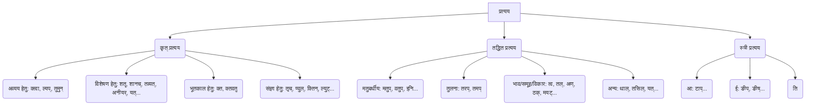

# Class 9 Sanskrit - Vyakranvidhi Chapter 108
**Language:** हिंदी

```markdown
# [Class 9] Vyakranvidhi - Chapter 108 - प्रत्यय (Suffixes)

## 🌟 Core Concepts

यह अध्याय संस्कृत व्याकरण के महत्वपूर्ण अंग 'प्रत्यय' पर केंद्रित है। प्रत्यय वे शब्दांश होते हैं जो किसी धातु (क्रिया मूल) या शब्द (संज्ञा, विशेषण आदि) के अंत में जुड़कर उसके अर्थ में परिवर्तन लाते हैं।

**प्रत्ययों का वर्गीकरण:**

1.  **कृत् प्रत्यय (Primary Suffixes):** धातुओं के अंत में जुड़ने वाले प्रत्यय।
    *   **अव्यय बनाने वाले:** क्त्वा, ल्यप्, तुमुन् (Indeclinable formers)
    *   **विशेषण बनाने वाले:** शतृ, शानच्, तव्यत्, अनीयर्, यत्, ण्यत्, क्यप् (Adjective formers)
    *   **भूतकालिक क्रिया:** क्त, क्तवतु (Past Participles)
    *   **संज्ञा बनाने वाले:** तृच्, ण्वुल्, क्तिन्, ल्युट्, णिनि (Noun formers)

2.  **तद्धित प्रत्यय (Secondary Suffixes):** संज्ञा, सर्वनाम, विशेषण आदि शब्दों के अंत में जुड़ने वाले प्रत्यय।
    *   **'वाला'/'युक्त' अर्थ:** मतुप्, वतुप्, इनि, इतच् (Possessive)
    *   **तुलना:** तरप्, तमप् (Comparative/Superlative)
    *   **विकार/प्रचुरता:** मयट् ('Made of'/'Full of')
    *   **अपत्य/भाव:** अण्, ठक्, त्व, तल् (Descendant/Abstract quality)
    *   **अन्य:** यत् (Body parts related), थाल् (Manner), तसिल् (Ablative sense)

3.  **स्त्री प्रत्यय (Feminine Suffixes):** पुल्लिंग शब्दों को स्त्रीलिंग में बदलने वाले प्रत्यय।
    *   **आ:** टाप्, डाप्, चाप्
    *   **ई:** ङीप्, ङीष्, ङीन्
    *   **ति**

📊 **प्रत्यय पदानुक्रम (Suffix Hierarchy):**



## 📘 Key Learnings

इस अध्याय में हम विभिन्न प्रत्ययों के प्रयोग, उनके अर्थ और उनसे बनने वाले शब्दों के रूपों को समझेंगे।

**1. कृत् प्रत्यय:**

*   **क्त्वा (त्वा):** 'करके' अर्थ में, मुख्य क्रिया से पहले होने वाली क्रिया दर्शाने के लिए। यह अव्यय बनाता है।
    *   *उदाहरण:* पठ् + क्त्वा = पठित्वा (पढ़कर) -> `छात्रः पठित्वा गृहं गच्छति।`
*   **ल्यप् (य):** 'करके' अर्थ में, जब धातु से पहले उपसर्ग लगा हो। यह भी अव्यय बनाता है।
    *   *उदाहरण:* प्र + नम् + ल्यप् = प्रणम्य (प्रणाम करके) -> `शिष्यः गुरुं प्रणम्य पठति।`
*   **तुमुन् (तुम्):** 'के लिए' अर्थ में, क्रिया के उद्देश्य को बताने के लिए। यह अव्यय बनाता है।
    *   *उदाहरण:* पठ् + तुमुन् = पठितुम् (पढ़ने के लिए) -> `सः पठितुम् विद्यालयं गच्छति।`
*   **शतृ (अत्/अन्):** 'करता हुआ/करती हुई' अर्थ में, वर्तमान कालिक क्रिया दर्शाते हुए विशेषण बनाता है (परस्मैपदी धातुओं से)। इसके रूप तीनों लिंगों में चलते हैं।
    *   *उदाहरण:* गम् (गच्छ्) + शतृ = गच्छन् (जाता हुआ), गच्छन्ती (जाती हुई) -> `गच्छन् बालकः पश्यति।`
*   **शानच् (मान/आन):** 'करता हुआ/करती हुई' अर्थ में, वर्तमान कालिक क्रिया दर्शाते हुए विशेषण बनाता है (आत्मनेपदी धातुओं से)। इसके रूप तीनों लिंगों में चलते हैं।
    *   *उदाहरण:* सेव् + शानच् = सेवमानः (सेवा करता हुआ), सेवमाना (सेवा करती हुई) -> `सेवमानः पुत्रः शोभते।`
*   **क्त (तः, ता, तम्):** भूतकाल की क्रिया दर्शाने के लिए (कर्मवाच्य या भाववाच्य में)। विशेषण के रूप में भी प्रयुक्त।
    *   *उदाहरण:* गम् + क्त = गतः (गया), गता (गयी), गतम् (गया हुआ) -> `तेन ग्रन्थः पठितः।` (उसके द्वारा ग्रन्थ पढ़ा गया।)
*   **क्तवतु (तवान्, तवती, तवत्):** भूतकाल की क्रिया दर्शाने के लिए (कर्तृवाच्य में)।
    *   *उदाहरण:* गम् + क्तवतु = गतवान् (गया), गतवती (गयी) -> `सः गृहं गतवान्।` (वह घर गया।)
*   **तव्यत् (तव्य), अनीयर् (अनीय):** 'चाहिए' या 'योग्य' अर्थ में। कर्मवाच्य या भाववाच्य में प्रयुक्त होते हैं।
    *   *उदाहरण:* पठ् + तव्यत् = पठितव्यम् (पढ़ना चाहिए/पढ़ने योग्य) -> `मया पुस्तकं पठितव्यम्।`
    *   *उदाहरण:* कृ + अनीयर् = करणीयम् (करना चाहिए/करने योग्य) -> `एतत् कार्यं करणीयम्।`
*   **तृच् (तृ), ण्वुल् (अक):** 'करने वाला' (कर्ता) अर्थ में संज्ञा बनाते हैं।
    *   *उदाहरण:* कृ + तृच् = कर्तृ (कर्ता) -> प्रथमा विभक्ति: कर्ता
    *   *उदाहरण:* पठ् + ण्वुल् = पाठकः (पढ़ने वाला)
*   **क्तिन् (ति), ल्युट् (अन):** भाववाचक संज्ञा बनाते हैं। क्तिन् से स्त्रीलिंग, ल्युट् से नपुंसकलिंग शब्द बनते हैं।
    *   *उदाहरण:* कृ + क्तिन् = कृतिः (रचना, कार्य)
    *   *उदाहरण:* पठ् + ल्युट् = पठनम् (पढ़ना)

**2. तद्धित प्रत्यय:**

*   **मतुप् (मत्), वतुप् (वत्):** 'वाला', 'युक्त' अर्थ में। अकारान्त/आकारान्त शब्दों के बाद प्रायः वतुप् (वान्, वती), अन्य स्वरान्त के बाद मतुप् (मान्, मती) लगता है।
    *   *उदाहरण:* बुद्धि + मतुप् = बुद्धिमान् (बुद्धि वाला)
    *   *उदाहरण:* धन + वतुप् = धनवान् (धन वाला)
*   **इनि (इन्):** 'वाला', 'युक्त' अर्थ में (अकारान्त शब्दों से)।
    *   *उदाहरण:* गुण + इनि = गुणी (गुण वाला)
*   **तरप् (तर), तमप् (तम):** दो की तुलना में 'तर', बहुतों में से एक की श्रेष्ठता बताने के लिए 'तम'।
    *   *उदाहरण:* लघु + तरप् = लघुतरः (दो में से छोटा)
    *   *उदाहरण:* लघु + तमप् = लघुतमः (सबसे छोटा)
*   **त्व (त्वम्), तल् (ता):** भाववाचक संज्ञा बनाते हैं। त्व से नपुंसकलिंग, तल् से स्त्रीलिंग।
    *   *उदाहरण:* महत् + त्व = महत्त्वम् (महत्ता)
    *   *उदाहरण:* महत् + तल् = महत्ता (महत्ता)
*   **अण् (अ), ठक् (इक):** अपत्य (संतान) या भाव अर्थ में। आदि स्वर की वृद्धि होती है।
    *   *उदाहरण:* वसुदेव + अण् = वासुदेवः (वसुदेव का पुत्र)
    *   *उदाहरण:* धर्म + ठक् = धार्मिकः (धर्म से संबंधित)

**3. स्त्री प्रत्यय:**

*   **टाप् (आ):** अकारान्त पुल्लिंग शब्दों को स्त्रीलिंग बनाने के लिए। यदि अंत में 'अक' हो तो 'इक' + 'आ' होता है।
    *   *उदाहरण:* अज + टाप् = अजा (बकरी)
    *   *उदाहरण:* बालक + टाप् = बालिका (लड़की)
*   **ङीप् (ई):** ऋकारान्त, नकारान्त, शतृ प्रत्ययान्त तथा कुछ अन्य अकारान्त शब्दों को स्त्रीलिंग बनाने के लिए।
    *   *उदाहरण:* कर्तृ + ङीप् = कर्त्री (करने वाली)
    *   *उदाहरण:* गुणिन् + ङीप् = गुणिनी (गुण वाली)
    *   *उदाहरण:* गच्छत् + ङीप् = गच्छन्ती (जाती हुई)
    *   *उदाहरण:* देव + ङीप् = देवी

📈 **प्रत्यय निर्माण प्रक्रिया (उदाहरण):**

*   **क्त्वा:** धातु + क्त्वा → अव्यय (गम् + क्त्वा → गत्वा)
*   **ल्यप्:** उपसर्ग + धातु + ल्यप् → अव्यय (आ + गम् + ल्यप् → आगत्य)
*   **क्तवतु:** धातु + क्तवतु → विशेषण/क्रिया (पठ् + क्तवतु → पठितवान्)
*   **तल्:** शब्द + तल् → स्त्रीलिंग संज्ञा (लघु + तल् → लघुता)
*   **टाप्:** अकारान्त शब्द + टाप् → स्त्रीलिंग संज्ञा (अश्व + टाप् → अश्वा)

## 🧩 Active Learning

**गतिविधि: वाक्य विश्लेषण 🔍**

नीचे दिए गए वाक्यों में रेखांकित पदों में प्रयुक्त प्रत्ययों को पहचानें, उनका मूल धातु/शब्द बताएँ और वाक्य में उनके अर्थ/कार्य को स्पष्ट करें:

1.  बालकः **पठित्वा** क्रीडति।
2.  **आगत्य** जलं पिबतु।
3.  सः फलं **खादितुम्** इच्छति।
4.  **गच्छन्** नरः मार्गे अपतत्।
5.  **सेवमाना** कन्या पुरस्कारं प्राप्नोत्।
6.  रामेण पत्रं **लिखितम्**।
7.  सीता भोजनं **कृतवती**।
8.  एतत् कार्यं **करणीयम्**।
9.  सः **धनवान्** अस्ति।
10. **लघुता** एव शोभा।
11. **अजा** क्षेत्रे चरति।

*(विश्लेषण:*
*1. पठित्वा = पठ् + क्त्वा (पढ़कर, पूर्वकालिक क्रिया)*
*2. आगत्य = आ + गम् + ल्यप् (आकर, पूर्वकालिक क्रिया, उपसर्ग युक्त)*
*3. खादितुम् = खाद् + तुमुन् (खाने के लिए, उद्देश्य)*
*4. गच्छन् = गम् (गच्छ्) + शतृ (जाता हुआ, विशेषण)*
*5. सेवमाना = सेव् + शानच् (सेवा करती हुई, विशेषण)*
*6. लिखितम् = लिख् + क्त (लिखा गया, कर्मवाच्य भूतकाल)*
*7. कृतवती = कृ + क्तवतु (किया, कर्तृवाच्य भूतकाल, स्त्रीलिंग)*
*8. करणीयम् = कृ + अनीयर् (करने योग्य/करना चाहिए, कर्मवाच्य)*
*9. धनवान् = धन + वतुप् (धन वाला, विशेषण/संज्ञा)*
*10. लघुता = लघु + तल् (छोटापन, भाववाचक संज्ञा)*
*11. अजा = अज + टाप् (बकरी, स्त्रीलिंग संज्ञा)*)

**चर्चा: प्रत्ययों का महत्त्व 🌍**

*   संस्कृत भाषा में प्रत्ययों की क्या भूमिका है? वे अर्थ को कैसे सूक्ष्म और सटीक बनाते हैं?
*   कृत्, तद्धित और स्त्री प्रत्ययों के बीच मुख्य अंतर क्या हैं और उनके उपयोग के उदाहरण दें।
*   प्रत्ययों का ज्ञान संस्कृत साहित्य (जैसे पंचतंत्र, गीता) को समझने में कैसे सहायक होता है?
*   क्या आधुनिक भारतीय भाषाओं में संस्कृत प्रत्ययों का प्रभाव दिखाई देता है? उदाहरण सहित चर्चा करें।

## 📝 Assessment Prep

परीक्षा की तैयारी के लिए निम्नलिखित प्रकार के प्रश्नों का अभ्यास करें:

1.  **प्रकृति-प्रत्यय संयोजन:** धातु/शब्द और प्रत्यय को जोड़कर पद बनाना।
    *   *उदाहरण:* `कृ + क्त्वा = ?` (कृत्वा), `बल + वतुप् = ?` (बलवान्)
2.  **प्रकृति-प्रत्यय विभाजन:** दिए गए पद में धातु/शब्द और प्रत्यय को अलग करना।
    *   *उदाहरण:* `दृष्ट्वा = ? + ?` (दृश् + क्त्वा), `पाठकः = ? + ?` (पठ् + ण्वुल्)
3.  **रिक्त स्थान पूर्ति:** कोष्ठक में दिए गए धातु/शब्द और प्रत्यय से उचित पद बनाकर रिक्त स्थान भरना।
    *   *उदाहरण:* सः जलं ______ (पा + तुमुन्) गच्छति। (पातुम्)
4.  **वाक्य संयोजन:** दो वाक्यों को क्त्वा, ल्यप् या तुमुन् प्रत्यय का प्रयोग करके जोड़ना।
    *   *उदाहरण:* बालकः पठति। सः क्रीडति। → बालकः पठित्वा क्रीडति।
5.  **वाच्य परिवर्तन:** क्त या क्तवतु प्रत्यय का प्रयोग करके भूतकाल के वाक्यों को कर्तृवाच्य से कर्मवाच्य में या विपरीत बदलना।
    *   *उदाहरण:* रामः ग्रन्थम् अपठत्। → रामः ग्रन्थं पठितवान्। / रामेण ग्रन्थः पठितः।
6.  **लिंग परिवर्तन:** स्त्री प्रत्ययों का प्रयोग करके पुल्लिंग शब्दों को स्त्रीलिंग में बदलना या विलोम।
    *   *उदाहरण:* बालकः → ? (बालिका), नदी → ? (नदः)
7.  **प्रत्यय पहचान:** वाक्य में प्रयुक्त प्रत्ययान्त शब्दों को पहचानना और प्रत्यय का नाम बताना।

📝 **मुख्य ध्यान देने योग्य बातें:**

*   प्रत्यय लगने पर धातु या शब्द में होने वाले आंतरिक परिवर्तन (जैसे गुण, वृद्धि, सम्प्रसारण)।
*   प्रत्ययान्त शब्दों के रूप (लिंग, वचन, विभक्ति) कैसे चलते हैं (विशेषकर विशेषण और संज्ञा बनाने वाले प्रत्यय)।
*   अव्यय बनाने वाले प्रत्ययों से बने शब्द अपरिवर्तित रहते हैं।

## 🌏 Bharatiya Context

प्रत्यय संस्कृत व्याकरण की आत्मा हैं और भारतीय भाषा तथा संस्कृति में इनकी गहरी जड़ें हैं।

*   **भाषाई प्रभाव:** संस्कृत के प्रत्यय (कृत्, तद्धित, स्त्री) हजारों वर्षों से भारतीय भाषाओं के विकास को प्रभावित करते रहे हैं। हिन्दी, मराठी, गुजराती, बंगाली जैसी अनेक आधुनिक आर्य भाषाओं में प्रत्ययों की व्यवस्था संस्कृत पर आधारित है। उदाहरण के लिए, हिन्दी का 'वाला' (जैसे 'दूधवाला') संस्कृत के 'मतुप्/वतुप्' से संबंधित है, 'ता' (जैसे 'सुंदरता') संस्कृत के 'तल्' प्रत्यय से।
*   **सांस्कृतिक शब्दावली:** अनेक सांस्कृतिक, दार्शनिक और धार्मिक शब्द प्रत्ययों के योग से बने हैं।
    *   *उदाहरण:* `मानव` (मनु + अण् - मनु की संतान), `वासुदेव` (वसुदेव + अण् - वसुदेव के पुत्र, कृष्ण), `भारतीय` (भारत + ईय - भारत से संबंधित), `पौराणिक` (पुराण + ठक् - पुराण से संबंधित)।
*   **साहित्यिक समझ:** रामायण, महाभारत, वेद, उपनिषद्, पुराण, कालिदास की रचनाएँ आदि समझने के लिए प्रत्ययों का ज्ञान अनिवार्य है। शब्दों के सूक्ष्म अर्थ भेद और उनके व्याकरणिक प्रकार को पहचानने में प्रत्यय मदद करते हैं। उदाहरण के लिए, क्रिया के काल (क्त, क्तवतु), कर्ता (तृच्, ण्वुल्), भाव (क्तिन्, ल्युट्, त्व, तल्) आदि को समझना प्रत्ययों से ही संभव होता है।

इस प्रकार, प्रत्ययों का अध्ययन केवल व्याकरणिक नियम सीखना नहीं है, बल्कि यह भारतीय भाषा, साहित्य और संस्कृति की गहरी समझ विकसित करने का एक महत्वपूर्ण साधन है।
```