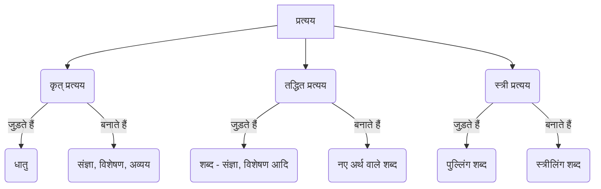

# Class 9 Sanskrit - Vyakranvidhi Chapter 108
**Language:** हिंदी

```markdown
# [Class 9] Vyakranvidhi - Chapter 108: प्रत्यय (Suffixes)

## 🌟 Core Concepts

प्रत्यय वे शब्दांश होते हैं जो किसी धातु (क्रिया के मूल रूप) या शब्द के अंत में जुड़कर उसके अर्थ में परिवर्तन लाते हैं। संस्कृत व्याकरण में प्रत्ययों का वर्गीकरण इस प्रकार है:

1.  **कृत् प्रत्यय (Krit Pratyaya):**
    *   **किसके साथ जुड़ते हैं?** - धातुओं (Verb Roots) के साथ।
    *   **क्या बनाते हैं?** - संज्ञा (Noun), विशेषण (Adjective), या अव्यय (Indeclinable) शब्द।
    *   **उदाहरण:** पठ् + क्त्वा = पठित्वा (पढ़कर), गम् + तुमुन् = गन्तुम् (जाने के लिए), कृ + तव्यत् = कर्तव्यम् (करना चाहिए)।

2.  **तद्धित प्रत्यय (Taddhit Pratyaya):**
    *   **किसके साथ जुड़ते हैं?** - संज्ञा, सर्वनाम, विशेषण आदि शब्दों (प्रातिपदिक) के साथ।
    *   **क्या करते हैं?** - नए अर्थ वाले शब्द बनाते हैं।
    *   **उदाहरण:** धन + वतुप् = धनवान् (धन वाला), समाज + ठक् = सामाजिक (समाज से संबंधित), लघु + तल् = लघुता (छोटापन)।

3.  **स्त्री प्रत्यय (Stri Pratyaya):**
    *   **किसके साथ जुड़ते हैं?** - पुल्लिंग (Masculine) शब्दों के साथ।
    *   **क्या बनाते हैं?** - स्त्रीलिंग (Feminine) शब्द।
    *   **उदाहरण:** अज + टाप् = अजा (बकरी), बालक + टाप् = बालिका (लड़की), नर्तक + ङीप् = नर्तकी (नाचने वाली)।

📊 **प्रत्यय वर्गीकरण:**


## 📘 Key Learnings

यहाँ कुछ प्रमुख प्रत्ययों और उनके प्रयोगों का विस्तृत वर्णन दिया गया है:

### 1. कृत् प्रत्यय

ये प्रत्यय धातुओं में जुड़ते हैं।

*   **अव्यय बनाने वाले प्रत्यय:**
    *   **क्त्वा (त्वा):** 'करके' अर्थ में, पूर्वकालिक क्रिया बनाने के लिए। धातु के बाद लगता है।
        *   `गम् + क्त्वा = गत्वा` (जाकर) - *अहं गृहं गत्वा पठिष्यामि।* (मैं घर जाकर पढूँगा।)
        *   `दृश् + क्त्वा = दृष्ट्वा` (देखकर) - *मयूरः मेघं दृष्ट्वा नृत्यति।* (मोर बादल देखकर नाचता है।)
    *   **ल्यप् (य):** 'करके' अर्थ में, जब धातु से पहले उपसर्ग (Prefix) लगा हो। क्त्वा के स्थान पर प्रयुक्त होता है।
        *   `प्र + नम् + ल्यप् = प्रणम्य` (प्रणाम करके) - *गुरुं प्रणम्य सः पठति।* (गुरु को प्रणाम करके वह पढ़ता है।)
        *   `आ + गम् + ल्यप् = आगत्य` (आकर) - *गृहात् आगत्य सः पठति।* (घर से आकर वह पढ़ता है।)
    *   **तुमुन् (तुम्):** 'के लिए' (Purpose) अर्थ में।
        *   `पठ् + तुमुन् = पठितुम्` (पढ़ने के लिए) - *सुरेशः पठितुं विद्यालयं गच्छति।* (सुरेश पढ़ने के लिए विद्यालय जाता है।)
        *   `खाद् + तुमुन् = खादितुम्` (खाने के लिए) - *बालकः आम्रं खादितुम् इच्छति।* (बालक आम खाने के लिए चाहता है।)
        *   'शक्' (सकना) और 'इष्' (चाहना) धातुओं के साथ भी इसका प्रयोग होता है: *अहं पठितुं शक्नोमि।* (मैं पढ़ सकता हूँ।)

*   **विशेषण बनाने वाले प्रत्यय (वर्तमान कालिक):**
    *   **शतृ (अत्):** परस्मैपदी धातुओं के साथ 'करता हुआ/करती हुई' अर्थ में। विशेषण की तरह प्रयोग होता है।
        *   `पठ् + शतृ = पठत्` -> पुं. `पठन्`, स्त्री. `पठन्ती` (पढ़ता हुआ/पढ़ती हुई) - *गच्छन् बालकः पतति।* (जाता हुआ बालक गिरता है।)
    *   **शानच् (आन/मान):** आत्मनेपदी धातुओं के साथ 'करता हुआ/करती हुई' अर्थ में।
        *   `सेव् + शानच् = सेवमान` -> पुं. `सेवमानः`, स्त्री. `सेवमाना` (सेवा करता हुआ/सेवा करती हुई) - *माता सेवमानाय पुत्राय आशीः ददाति।* (माता सेवा करते हुए पुत्र को आशीर्वाद देती है।)

*   **भूतकालिक क्रिया/विशेषण बनाने वाले प्रत्यय:**
    *   **क्त (त):** भूतकाल (Past Tense) अर्थ में। कर्मवाच्य (Passive Voice) या भाववाच्य में प्रयोग होता है। अकर्मक धातुओं के साथ कर्तृवाच्य (Active Voice) में भी।
        *   `गम् + क्त = गतः` (गया हुआ) - *तेन ग्रामः गतः।* (उसके द्वारा गाँव जाया गया।) / *सः ग्रामं गतः।* (वह गाँव गया।)
        *   `कृ + क्त = कृतः` (किया हुआ) - *रामेण कार्यं कृतम्।* (राम के द्वारा कार्य किया गया।)
    *   **क्तवतु (तवत्):** भूतकाल अर्थ में, कर्तृवाच्य (Active Voice) में प्रयोग होता है।
        *   `गम् + क्तवतु = गतवत्` -> पुं. `गतवान्`, स्त्री. `गतवती` (गया/गयी) - *रामः गृहं गतवान्।* (राम घर गया।) *सीता गृहं गतवती।* (सीता घर गयी।)

*   **'चाहिए' या 'योग्य' अर्थ वाले प्रत्यय (विधिलिङ् लकार के अर्थ में):**
    *   **तव्यत् (तव्य):** 'चाहिए' या 'करने योग्य' अर्थ में। कर्मवाच्य या भाववाच्य में प्रयोग।
        *   `पठ् + तव्यत् = पठितव्य` -> नपुं. `पठितव्यम्` (पढ़ना चाहिए/पढ़ने योग्य) - *मया पुस्तकं पठितव्यम्।* (मुझे पुस्तक पढ़नी चाहिए।)
    *   **अनीयर् (अनीय):** 'चाहिए' या 'करने योग्य' अर्थ में। कर्मवाच्य या भाववाच्य में प्रयोग।
        *   `कृ + अनीयर् = करणीय` -> नपुं. `करणीयम्` (करना चाहिए/करने योग्य) - *अस्माभिः देशसेवा करणीया।* (हमें देशसेवा करनी चाहिए।)
    *   **यत् (य):** अजन्त (स्वरान्त) धातुओं के साथ 'चाहिए/योग्य' अर्थ में।
        *   `दा + यत् = देयम्` (देने योग्य), `पा + यत् = पेयम्` (पीने योग्य)।

*   **संज्ञा बनाने वाले प्रत्यय:**
    *   **तृच् (तृ):** 'करने वाला' (कर्ता) अर्थ में।
        *   `कृ + तृच् = कर्तृ` -> प्रथमा `कर्ता` (करने वाला)
        *   `दा + तृच् = दातृ` -> प्रथमा `दाता` (देने वाला)
    *   **णवुल् (अक):** 'करने वाला' (कर्ता) अर्थ में।
        *   `पठ् + णवुल् = पाठकः` (पढ़ने वाला)
        *   `लिख् + णवुल् = लेखकः` (लिखने वाला)
    *   **क्तिन् (ति):** भाववाचक स्त्रीलिंग संज्ञा बनाने के लिए।
        *   `कृ + क्तिन् = कृतिः` (रचना, कार्य)
        *   `गम् + क्तिन् = गतिः` (चाल, दशा)
    *   **ल्युट् (अन):** भाववाचक नपुंसकलिंग संज्ञा बनाने के लिए।
        *   `पठ् + ल्युट् = पठनम्` (पढ़ना)
        *   `लिख् + ल्युट् = लेखनम्` (लिखना)

### 2. तद्धित प्रत्यय

ये प्रत्यय संज्ञा, विशेषण आदि शब्दों में जुड़ते हैं।

*   **मतुप् (मत्) / वतुप् (वत्):** 'वाला' या 'युक्त' अर्थ में। अकारान्त शब्दों में प्रायः 'वतुप्' और अन्य स्वरान्त शब्दों में 'मतुप्' लगता है।
    *   `ज्ञान + वतुप् = ज्ञानवत्` -> पुं. `ज्ञानवान्` (ज्ञान वाला)
    *   `बुद्धि + मतुप् = बुद्धिमत्` -> पुं. `बुद्धिमान्` (बुद्धि वाला)
*   **इनि (इन्):** 'वाला' या 'युक्त' अर्थ में, अकारान्त शब्दों के साथ।
    *   `गुण + इनि = गुणिन्` -> पुं. `गुणी` (गुण वाला)
    *   `धन + इनि = धनिन्` -> पुं. `धनी` (धन वाला)
*   **तरप् (तर) / तमप् (तम):** तुलना (Comparison) के लिए। 'तरप्' दो में से एक को श्रेष्ठ बताने के लिए, 'तमप्' सब में से एक को श्रेष्ठतम बताने के लिए।
    *   `लघु + तरप् = लघुतर` (दो में से छोटा) - *रामः श्यामत् लघुतरः अस्ति।*
    *   `लघु + तमप् = लघुतम` (सबसे छोटा) - *कक्षायां मोहनः लघुतमः अस्ति।*
*   **मयट् (मय):** 'प्रचुरता' (Abundance) या 'बना हुआ' (Made of) अर्थ में।
    *   `आनन्द + मयट् = आनन्दमय` (आनन्द से भरपूर)
    *   `स्वर्ण + मयट् = स्वर्णमय` (सोने का बना हुआ)
*   **अण् (अ):** 'संतान' (अपत्य) या 'भाव' अर्थ में। शब्द के आदि स्वर की वृद्धि होती है।
    *   `वसुदेव + अण् = वासुदेवः` (वसुदेव का पुत्र)
    *   `मनु + अण् = मानवः` (मनु की संतान)
    *   `गुरु + अण् = गौरवम्` (गुरु का भाव, भारीपन)
*   **ठक् (इक):** 'संबंधी' या 'भाव' अर्थ में। शब्द के आदि स्वर की वृद्धि होती है।
    *   `धर्म + ठक् = धार्मिकः` (धर्म से संबंधित)
    *   `समाज + ठक् = सामाजिकः` (समाज से संबंधित)
*   **त्व (त्वम्) / तल् (ता):** भाववाचक संज्ञा बनाने के लिए। 'त्व' प्रत्ययान्त शब्द नपुंसकलिंग, 'तल्' (ता) प्रत्ययान्त शब्द स्त्रीलिंग होते हैं।
    *   `महत् + त्व = महत्त्वम्` (महत्ता)
    *   `महत् + तल् = महत्ता` (महत्ता)
    *   `मित्र + त्व = मित्रत्वम्` (मित्रता)
    *   `मित्र + तल् = मित्रता` (मित्रता)
*   **तसिल् (तः):** पंचमी विभक्ति ('से' - Separation) के अर्थ में। इससे बने शब्द अव्यय होते हैं।
    *   `ग्राम + तसिल् = ग्रामतः` (गाँव से) - *सः ग्रामतः आगच्छति।*
    *   `वृक्ष + तसिल् = वृक्षतः` (पेड़ से) - *वृक्षतः फलानि पतन्ति।*

### 3. स्त्री प्रत्यय

पुल्लिंग शब्दों को स्त्रीलिंग बनाने के लिए।

*   **टाप् (आ):** अकारान्त पुल्लिंग शब्दों को स्त्रीलिंग बनाने के लिए। यदि अंत में 'अक' हो तो 'इक' हो जाता है।
    *   `अज + टाप् = अजा` (बकरी)
    *   `बालक + टाप् = बालिका` (लड़की)
    *   `शिक्षक + टाप् = शिक्षिका` (शिक्षिका)
*   **ङीप् (ई):** ऋकारान्त (जैसे कर्तृ), नकारान्त (जैसे गुणिन्), अकारान्त (जैसे देव) और शतृ प्रत्ययान्त (जैसे गच्छत्) शब्दों को स्त्रीलिंग बनाने के लिए।
    *   `कर्तृ + ङीप् = कर्त्री` (करने वाली)
    *   `गुणिन् + ङीप् = गुणिनी` (गुण वाली)
    *   `देव + ङीप् = देवी` (देवी)
    *   `गच्छत् + ङीप् = गच्छन्ती` (जाती हुई)
*   **ङीष् (ई):** कुछ विशेष पुल्लिंग शब्दों (जैसे इन्द्र, वरुण) से पत्नी अर्थ में स्त्रीलिंग बनाने के लिए।
    *   `इन्द्र + ङीष् = इन्द्राणी` (इन्द्र की पत्नी)
    *   `वरुण + ङीष् = वरुणानी` (वरुण की पत्नी)

## 🧩 Active Learning

*   **Activity: वाक्य विश्लेषण (Sentence Analysis) 🔍**
    *   नीचे दिए गए वाक्यों में रेखांकित पदों में प्रयुक्त प्रत्यय पहचानें, मूल धातु/शब्द बताएं और प्रत्यय का प्रकार (कृत्, तद्धित, स्त्री) लिखें।
        1.  बालकः पठितुम् विद्यालयं गच्छति। (रेखांकित: `पठितुम्`)
        2.  *विश्लेषण:*
            *   पद: पठितुम्
            *   मूल धातु: पठ्
            *   प्रत्यय: तुमुन्
            *   प्रकार: कृत् प्रत्यय (अव्यय बनाने वाला)
            *   अर्थ: पढ़ने के लिए
        3.  धनवान् जनः दानं करोति। (रेखांकित: `धनवान्`)
        4.  *विश्लेषण:*
            *   पद: धनवान्
            *   मूल शब्द: धन
            *   प्रत्यय: वतुप्
            *   प्रकार: तद्धित प्रत्यय
            *   अर्थ: धन वाला
        5.  गच्छन्ती बालिका मधुरं गायति। (रेखांकित: `गच्छन्ती`)
        6.  *विश्लेषण:*
            *   पद: गच्छन्ती
            *   मूल धातु: गम् (गच्छ्) + शतृ + ङीप्
            *   प्रत्यय: शतृ (कृत्) + ङीप् (स्त्री)
            *   प्रकार: कृत् एवं स्त्री प्रत्यय
            *   अर्थ: जाती हुई

*   **Discussion: प्रत्ययों का भाषा में महत्व 🌍**
    *   चर्चा करें कि संस्कृत भाषा में प्रत्ययों का क्या महत्व है?
    *   प्रत्यय कैसे नए शब्दों का निर्माण करते हैं? (उदाहरण दें: पठ् -> पाठकः, पठनम्, पठित्वा, पठितव्यम्)
    *   प्रत्ययों के प्रयोग से भाषा कैसे संक्षिप्त और प्रभावशाली बनती है? (जैसे, दो वाक्यों को क्त्वा/ल्यप् से जोड़ना)
    *   क्या आधुनिक भारतीय भाषाओं में भी संस्कृत प्रत्ययों का प्रभाव दिखता है? कैसे? (उदाहरण: हिन्दी में 'लेखक', 'कर्ता', 'सामाजिक', 'मानवता')

## 📝 Assessment Prep

परीक्षा की तैयारी के लिए इन बिंदुओं पर ध्यान दें:

*   **प्रत्यय पहचानना:** दिए गए शब्द में मूल धातु/शब्द और प्रत्यय अलग करना।
    *   उदाहरण: `कर्तव्यम्` -> कृ + तव्यत्, `पठित्वा` -> पठ् + क्त्वा, `सामाजिकः` -> समाज + ठक्
*   **प्रत्यय जोड़ना:** दिए गए धातु/शब्द और प्रत्यय को जोड़कर सही शब्द बनाना।
    *   उदाहरण: `श्रु + क्त्वा = ?` (श्रुत्वा), `बल + वतुप् = ?` (बलवान्), `अज + टाप् = ?` (अजा)
*   **वाक्य प्रयोग:** प्रत्यय युक्त शब्दों का वाक्यों में सही प्रयोग करना (लिंग, वचन, विभक्ति का ध्यान रखते हुए)।
    *   उदाहरण: (पठ् + शतृ, पुं.) बालकः पठन् गच्छति। (पठ् + शतृ, स्त्री.) बालिका पठन्ती गच्छति।
*   **वाक्य परिवर्तन/संयोजन:** क्त्वा, ल्यप्, तुमुन् आदि का प्रयोग कर वाक्यों को जोड़ना या बदलना।
    *   उदाहरण: `बालकः पठति। सः क्रीडति।` -> `बालकः पठित्वा क्रीडति।`
    *   `सः पठितुम् इच्छति। सः विद्यालयं गच्छति।` -> `सः पठितुं विद्यालयं गच्छति।`
*   **तालिका मिलान:** धातु/शब्द को सही प्रत्यय और उसके अर्थ से मिलाना।

**उदाहरण प्रश्न:**
1.  `कृ + क्तवतु` (स्त्रीलिंग, प्रथमा एकवचन) रूपं किम्? (उत्तर: कृतवती)
2.  `आगत्य` पदे कः प्रत्ययः? (उत्तर: ल्यप्)
3.  `मानवः` पदे प्रकृति-प्रत्ययं विभजत। (उत्तर: मनु + अण्)
4.  `गुरु + तल्` योगेन किं पदं भवति? (उत्तर: गुरुता)
5.  `बालकेन पाठः पठितव्यः।` - अत्र कर्तृपदं किम्? कर्मपदं किम्? क्रियापदं किम्? (उत्तर: कर्तृपदम् - बालकेन, कर्मपदम् - पाठः, क्रियापदम् - पठितव्यः)

## 🌏 Bharatiya Context

संस्कृत के प्रत्यय केवल व्याकरण के नियम नहीं हैं, बल्कि ये भारतीय भाषा और संस्कृति की गहरी जड़ों से जुड़े हैं।

1.  **आधुनिक भारतीय भाषाओं पर प्रभाव:** संस्कृत के अनेक कृत् और तद्धित प्रत्यय (जैसे -कः (अक), -ता, -त्व, -मान, -वान्, -इन् (ई), -इक) थोड़े परिवर्तनों के साथ हिन्दी, मराठी, गुजराती, बंगाली आदि कई आधुनिक भारतीय भाषाओं में पाए जाते हैं। उदाहरण: हिन्दी में `लेखक` (लिख्+णवुल्), `पाठक` (पठ्+णवुल्), `मानवता` (मानव+तल्), `बुद्धिमान` (बुद्धि+मतुप्), `धनी` (धन+इनि), `सामाजिक` (समाज+ठक्)।
2.  **शास्त्रीय ग्रंथों में प्रयोग:** वेद, उपनिषद्, रामायण, महाभारत, पुराण आदि ग्रंथों में प्रत्ययों का भरपूर प्रयोग मिलता है। दार्शनिक विचारों (जैसे `आत्मज्ञानम्`, `कर्तव्यम्`, `अहिंसा`) और कथाओं के पात्रों (जैसे `वासुदेवः`, `पाण्डवः`, `कौरवः` - अण् प्रत्यय से निर्मित) को व्यक्त करने में प्रत्ययों की महत्वपूर्ण भूमिका है।
3.  **सांस्कृतिक शब्दावली:** अनेक सांस्कृतिक और धार्मिक शब्द प्रत्ययों से बने हैं, जैसे `धार्मिकः` (धर्म+ठक्), `यजमानः` (यज्+शानच्), `दाता` (दा+तृच्), `भक्तिः` (भज्+क्तिन्)। ये शब्द भारतीय जीवन शैली और मूल्यों को दर्शाते हैं।

इस प्रकार, संस्कृत प्रत्ययों का अध्ययन न केवल भाषा की संरचना को समझने में मदद करता है, बल्कि भारतीय भाषाओं और संस्कृति के विकास को जानने की दृष्टि भी प्रदान करता है।
```