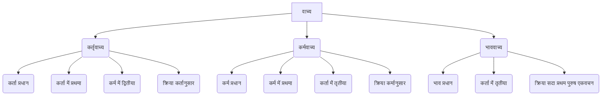

# Class 9 Sanskrit - Vyakranvidhi Chapter 111
**Language:** हिंदी

```markdown
# [कक्षा 9] व्याकरणविधि - अध्याय 11: वाच्य परिवर्तन

## 🌟 मुख्य अवधारणाएँ

**वाच्य:** अभिव्यक्ति या कथन को प्रकट करने की विधि को वाच्य कहते हैं। संस्कृत में वाच्य तीन प्रकार के होते हैं:

1.  **कर्तृवाच्य (Active Voice):**
    *   कर्ता प्रधान होता है।
    *   क्रिया कर्ता के अनुसार (पुरुष, वचन) होती है।
    *   कर्ता में प्रथमा विभक्ति।
    *   कर्म में द्वितीया विभक्ति।

2.  **कर्मवाच्य (Passive Voice):**
    *   कर्म प्रधान होता है।
    *   क्रिया कर्म के अनुसार (लिंग, पुरुष, वचन) होती है।
    *   कर्म में प्रथमा विभक्ति।
    *   कर्ता में तृतीया विभक्ति।

3.  **भाववाच्य (Impersonal Voice):**
    *   भाव (क्रिया का अर्थ) प्रधान होता है।
    *   कर्ता में तृतीया विभक्ति।
    *   क्रिया हमेशा प्रथम पुरुष, एकवचन में होती है (कर्ता के वचन पर निर्भर नहीं करती)।
    *   यह प्रायः अकर्मक धातुओं के साथ होता है।

**वाच्य परिवर्तन:** एक वाच्य से दूसरे वाच्य में वाक्य को बदलना।

**अवधारणा पदानुक्रम:**



## 📘 प्रमुख शिक्षण बिंदु

**1. कर्तृवाच्य:**
*   **परिभाषा:** जिस वाक्य में कर्ता की प्रधानता हो और क्रिया कर्ता के अनुसार चले।
*   **नियम:**
    *   कर्ता: प्रथमा विभक्ति
    *   कर्म: द्वितीया विभक्ति
    *   क्रिया: कर्ता के पुरुष और वचन के अनुसार।
*   **उदाहरण:**
    *   `रामः गृहं गच्छति।` (राम घर जाता है।) - यहाँ 'रामः' कर्ता (प्रथमा), 'गृहम्' कर्म (द्वितीया), 'गच्छति' क्रिया (रामः के अनुसार एकवचन)।
    *   `बालिका पाठम् पठितवती।` (लड़की ने पाठ पढ़ा।)
    *   `सैनिकः देशं रक्षति।` (सैनिक देश की रक्षा करता है।)

**2. कर्मवाच्य:**
*   **परिभाषा:** जिस वाक्य में कर्म की प्रधानता हो और क्रिया कर्म के अनुसार चले।
*   **नियम:**
    *   कर्ता: तृतीया विभक्ति
    *   कर्म: प्रथमा विभक्ति
    *   क्रिया: कर्म के पुरुष और वचन के अनुसार। क्रियापद में प्रायः धातु + य + आत्मनेपद प्रत्यय लगते हैं (जैसे पठ् + य + ते = पठ्यते)।
*   **उदाहरण:**
    *   `रामेण गृहं गम्यते।` (राम के द्वारा घर जाया जाता है।) - यहाँ 'रामेण' कर्ता (तृतीया), 'गृहम्' कर्म (प्रथमा - नपुंसकलिंग), 'गम्यते' क्रिया (गृहम् के अनुसार एकवचन)।
    *   `विद्यार्थिना पाठः पठ्यते।` (विद्यार्थी द्वारा पाठ पढ़ा जाता है।) - 'पाठः' कर्म (प्रथमा), 'पठ्यते' क्रिया (पाठः के अनुसार एकवचन)।
    *   `मया चित्रे दृश्येते।` (मेरे द्वारा दो चित्र देखे जाते हैं।) - 'चित्रे' कर्म (प्रथमा, द्विवचन), 'दृश्येते' क्रिया (चित्रे के अनुसार द्विवचन)।

**3. भाववाच्य:**
*   **परिभाषा:** जिस वाक्य में क्रिया (भाव) की प्रधानता हो। यह अकर्मक क्रियाओं के साथ होता है।
*   **नियम:**
    *   कर्ता: तृतीया विभक्ति
    *   क्रिया: सदैव प्रथम पुरुष, एकवचन में रहती है, चाहे कर्ता किसी भी वचन में हो। क्रियापद कर्मवाच्य की तरह ही बनते हैं (धातु + य + ते)।
*   **उदाहरण:**
    *   `मया सुप्यते।` (मेरे द्वारा सोया जाता है।)
    *   `त्वया सुप्यते।` (तुम्हारे द्वारा सोया जाता है।)
    *   `अस्माभिः सुप्यते।` (हम सबके द्वारा सोया जाता है।)
    *   `छात्रैः हस्यते।` (छात्रों द्वारा हँसा जाता है।)

**4. वाच्य परिवर्तन के नियम:**

*   **वर्तमान काल:**
    *   कर्तृवाच्य से कर्मवाच्य/भाववाच्य में बदलते समय कर्ता में तृतीया, कर्म में प्रथमा (यदि हो) और क्रियापद में परिवर्तन होता है।
    *   **क्रिया परिवर्तन तालिका:**
        | कर्तृवाच्य क्रिया | कर्मवाच्य/भाववाच्य क्रिया |
        |-----------------|--------------------------|
        | पठति            | पठ्यते                   |
        | लिखति           | लिख्यते                  |
        | खादति           | खाद्यते                  |
        | हसति            | हस्यते                   |
        | करोति           | क्रियते                  |
        | गच्छति           | गम्यते                   |
        | नयति            | नीयते                   |

*   **भूतकाल (क्तवतु/क्त प्रत्यय):**
    *   कर्तृवाच्य में जहाँ 'क्तवतु' प्रत्यय का प्रयोग होता है, वहाँ कर्मवाच्य में 'क्त' प्रत्यय का प्रयोग होता है।
    *   कर्ता में तृतीया विभक्ति होती है।
    *   'क्त' प्रत्यय से बना शब्द कर्म के लिंग, वचन के अनुसार होता है।
    *   **उदाहरण:**
        *   कर्तृवाच्य: `सः फलानि खादितवान्।` (उसने फल खाए।)
        *   कर्मवाच्य: `तेन फलानि खादितानि।` (उसके द्वारा फल खाए गए।)
        *   कर्तृवाच्य: `अहम् ग्रन्थान् पठितवान्।` (मैंने ग्रंथ पढ़े।)
        *   कर्मवाच्य: `मया ग्रन्थाः पठिताः।` (मेरे द्वारा ग्रंथ पढ़े गए।)
        *   कर्तृवाच्य: `वयम् गुरुम् पूजितवन्तः।` (हमने गुरु की पूजा की।)
        *   कर्मवाच्य: `अस्माभिः गुरुः पूजितः।` (हमारे द्वारा गुरु पूजे गए।)

**वाच्य परिवर्तन का सारांश (तालिका):**

| विशेषता        | कर्तृवाच्य             | कर्मवाच्य              | भाववाच्य               |
|-----------------|----------------------|-----------------------|------------------------|
| **प्रधानता**    | कर्ता                | कर्म                  | भाव (क्रिया)           |
| **कर्ता विभक्ति** | प्रथमा               | तृतीया                | तृतीया                 |
| **कर्म विभक्ति** | द्वितीया              | प्रथमा                | (कर्म नहीं होता)       |
| **क्रिया**       | कर्तानुसार           | कर्मानुसार            | सदा प्र. पु. एकवचन    |
| **उदाहरण**     | `छात्रः पठति।`       | `छात्रेण पाठः पठ्यते।` | `छात्रेण हस्यते।`      |

## 🧩 सक्रिय अधिगम (Active Learning)

*   **गतिविधि: वाक्य विश्लेषण:**
    *   सरल संस्कृत कहानियों (जैसे पंचतंत्र) या अपने दैनिक जीवन से संबंधित सरल संस्कृत वाक्यों को पढ़ें।
    *   प्रत्येक वाक्य में वाच्य पहचानें (कर्तृवाच्य, कर्मवाच्य, या भाववाच्य)।
    *   पहचाने गए वाक्यों को दूसरे वाच्य में बदलने का अभ्यास करें।
    *   उदाहरण:
        *   `माता भोजनं पचति।` (कर्तृवाच्य) -> `मात्रा भोजनं पच्यते।` (कर्मवाच्य)
        *   `शिशुः रोदिति।` (कर्तृवाच्य) -> `शिशुना रुद्यते।` (भाववाच्य)
        *   `कृषकैः क्षेत्रं कृष्यते।` (कर्मवाच्य) -> `कृषकाः क्षेत्रं कर्षन्ति।` (कर्तृवाच्य)

*   **चर्चा: वाच्य का प्रयोग क्यों?**
    *   सोचें और चर्चा करें कि कब कर्तृवाच्य और कब कर्मवाच्य या भाववाच्य का प्रयोग अधिक उपयुक्त होता है।
    *   हिंदी या अंग्रेजी में कर्मवाच्य (Passive Voice) के प्रयोग पर विचार करें (जैसे वैज्ञानिक लेखों में, समाचारों में जहाँ क्रिया या परिणाम कर्ता से अधिक महत्वपूर्ण होता है)।
    *   संस्कृत में विभिन्न वाच्यों का प्रयोग कथन के किस पहलू पर जोर देता है? (कर्ता पर, कर्म पर, या केवल क्रिया पर?)

## 📝 मूल्यांकन तैयारी

*   **अभ्यास:** पाठ्यपुस्तक में दिए गए अभ्यास प्रश्नों (प्रश्न 1-5) को हल करें।
*   **वाच्य परिवर्तन:** कर्तृवाच्य से कर्मवाच्य/भाववाच्य में और इसके विपरीत वाक्यों को बदलने का अभ्यास करें। कर्ता, कर्म और क्रिया में सही विभक्ति और रूप परिवर्तन पर ध्यान दें।
*   **रिक्त स्थान पूर्ति:** वाच्य के अनुसार कर्ता, कर्म या क्रिया के सही रूप को भरने का अभ्यास करें।
*   **नियम स्मरण:** तीनों वाच्यों में कर्ता और कर्म की विभक्ति तथा क्रिया के रूप संबंधी नियमों को याद रखें। विशेष रूप से क्रिया परिवर्तन (जैसे `पठति -> पठ्यते`, `करोति -> क्रियते`) और भूतकाल में `क्तवतु -> क्त` परिवर्तन को समझें।
*   **बहुविकल्पीय प्रश्न (MCQs):** वाच्य के नियमों पर आधारित MCQs का अभ्यास करें, जैसे कि किस वाच्य में कर्ता/कर्म की कौन-सी विभक्ति होती है (प्रश्न 5 देखें)।

**उदाहरण अभ्यास:**
*   `अहं कार्यं कृतवान्।` (कर्तृवाच्य) को कर्मवाच्य में बदलें -> `मया कार्यं कृतम्।`
*   `छात्रैः दुग्धं पीतम्।` (कर्मवाच्य) को कर्तृवाच्य में बदलें -> `छात्राः दुग्धं पीतवन्तः।`
*   `सः गायति।` (कर्तृवाच्य) को भाववाच्य में बदलें -> `तेन गीयते।`

## 🌏 भारतीय संदर्भ

*   **सांस्कृतिक प्रासंगिकता:** वाच्य परिवर्तन का ज्ञान संस्कृत भाषा के गहन अध्ययन के लिए आवश्यक है। यह हमें भारत के प्राचीन ग्रंथों जैसे वेद, उपनिषद, रामायण, महाभारत, पुराण, और अन्य शास्त्रीय साहित्य को सही ढंग से समझने में मदद करता है, क्योंकि इन ग्रंथों में तीनों प्रकार के वाच्यों का प्रयोग मिलता है।
*   **उदाहरण:**
    *   `रामेण रावणः हतः।` (राम के द्वारा रावण मारा गया।) - कर्मवाच्य का प्रसिद्ध उदाहरण।
    *   `गुरुणा शिष्यः पाठ्यते।` (गुरु द्वारा शिष्य पढ़ाया जाता है।) - भारतीय गुरु-शिष्य परंपरा का संदर्भ।
    *   `मया गीता पठ्यते।` (मेरे द्वारा गीता पढ़ी जाती है।) - धार्मिक/दार्शनिक ग्रंथ का संदर्भ।
    *   `कृषकैः अन्नम् उत्पाद्यते।` (किसानों द्वारा अन्न उगाया जाता है।) - भारतीय कृषि समाज का संदर्भ।

संस्कृत वाच्य का अध्ययन न केवल व्याकरणिक नियम सिखाता है, बल्कि भाषा की अभिव्यक्ति क्षमता और भारतीय वाङ्मय की समझ को भी समृद्ध करता है।
```