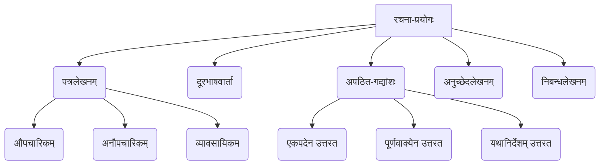

# Class 9 Sanskrit - Vyakranvidhi Chapter 112
**Language:** संस्कृतम्

```markdown
# [कक्षा ९] व्याकरणवीथिः - अध्यायः १२ (रचना-प्रयोगः)

**सूचना**: अयं सारांशः पाठ्यपुस्तके प्रदत्तस्य **द्वादश-अध्यायस्य (१२)** **'रचना-प्रयोगः'** इत्यस्य उपरि आधारितः अस्ति, न तु अध्यायसंख्या ११२ उपरि। प्रदत्तः विषयः (आर्थिक-आँकडा) अपि अस्मिन् अध्याये मुख्यतया न चर्चितः, अपितु विविध-रचना-कौशलानि अभ्यस्यन्ते।

## 🌟 मुख्याः अवधारणाः (Core Concepts)
अस्मिन् अध्याये छात्रान् संस्कृतेन रचनाकौशलं वर्धयितुं प्रेरयति। एतेषु प्रामुख्येन एते विषयाः सन्ति:

1.  **पत्रलेखनम्**:
    *   औपचारिक-पत्राणि (यथा - अवकाशार्थं, शुल्कक्षमापनार्थं प्रधानाचार्यं प्रति)।
    *   अनौपचारिक-पत्राणि (यथा - मित्रं प्रति, पितरं प्रति)।
    *   व्यावसायिक-पत्राणि (यथा - प्रकाशकं प्रति पुस्तकप्रेषणाय)।
2.  **दूरभाषवार्ता**: दैनन्दिन-जीवने दूरभाष-माध्यमेन सरल-संस्कृत-सम्भाषणस्य अभ्यासः।
3.  **अपठित-गद्यांश-अवबोधनम्**: प्रदत्तान् अनुच्छेदान् पठित्वा तेषाम् आधारेण प्रश्नानाम् उत्तराणि दातुम् अभ्यासः (एकपदेन, पूर्णवाक्येन, निर्देशानुसारम्)।
4.  **अनुच्छेदलेखनम्**: निर्दिष्टविषये सङ्क्षिप्तविचारान् क्रमेण संस्कृतेन लेखितुम् अभ्यासः।
5.  **निबन्धलेखनम्**: प्रदत्तविषयेषु विस्तृतरूपेण स्वविचारान् प्रकटयितुं, तर्कसहितं लेखितुं च अभ्यासः।

**अवधारणा-सोपानम् (Concept Hierarchy):**


## 📘 प्रमुखाः शिक्षणबिन्दवः (Key Learnings)

1.  **पत्रलेखनस्य प्रारूपम् (Letter Format)**:
    *   **औपचारिकपत्रम्**: सम्बोधनम् (सेवायां, मान्यवराः), विषयः, मुख्य-विषयवस्तु, समापनम् (भवतां विनीतः शिष्यः/भवदीयः), प्रेषकस्य नाम, कक्षा, दिनांकः।
    *   **अनौपचारिकपत्रम्**: स्थानम्, दिनांकः, प्रिय-सम्बोधनम् (प्रिय मित्र/पूज्य पितृचरणाः), कुशलक्षेम-प्रश्नः, मुख्य-विषयः, समापनम् (भवदीयः/भवत्पुत्रः), प्रेषकस्य नाम।
    *   **उदाहरणम् (Diagram):**
        ```mermaid
        graph TD
            subgraph औपचारिकपत्रम्
                A[सम्बोधनम्] --> B(विषयः);
                B --> C(मुख्यभागः);
                C --> D(धन्यवादाः);
                D --> E(भवदीयः/विनीतः);
                E --> F(नाम/कक्षा/दिनांकः);
            end
            subgraph अनौपचारिकपत्रम्
                G[स्थानम्/दिनांकः] --> H(प्रिय-सम्बोधनम्);
                H --> I(कुशलक्षेमम्);
                I --> J(मुख्यविषयः);
                J --> K(समापन-वाक्यानि);
                K --> L(भवदीयः/स्नेहाभिलाषी);
                L --> M(नाम);
            end
        ```

2.  **सम्भाषणकौशलम् (Conversation Skills)**: दूरभाषवार्तायां प्रश्नोत्तर-माध्यमेन सरल-संस्कृत-वाक्यानां प्रयोगः। यथा - रमेशः पितुः सकाशात् प्रवासार्थं धनं याचते।

3.  **अवबोधन-क्षमता (Comprehension Skills)**: अपठित-गद्यांशान् पठित्वा तद्गतान् भावान् अवगन्तुं, प्रश्नानां समुचितम् उत्तरं दातुं च सामर्थ्यम्। विशेषतः विशेषण-विशेष्य-चयनं, कर्तृ-क्रियापद-अन्वेषणं, विलोम/पर्याय-पद-ज्ञानं च महत्त्वपूर्णम्।

4.  **लघु-रचना-कौशलम् (Paragraph Writing)**: एकस्मिन् विषये (यथा - नैतिकशिक्षा, सत्सङ्गतिः) सीमित-शब्देषु विचारान् स्पष्टतया प्रकटयितुं सामर्थ्यम्।

5.  **विस्तृत-रचना-कौशलम् (Essay Writing)**: विविध-विषयेषु (यथा - पर्यावरणम्, संस्कृतभाषा, भारतीयसंस्कृतिः, महापुरुषाः) क्रमबद्धं, विस्तृतं, प्रभावपूर्णं च लेखनम्। अत्र प्रस्तावना, विषयविस्तारः, उपसंहारः इति भागत्रयं महत्त्वपूर्णम्।

## 🧩 सक्रिय-शिक्षणम् (Active Learning)

*   **गतिविधिः (Activity)**: प्रदत्तानां पत्राणाम्/निबन्धानां प्रारूपम् आधृत्य स्वयमेकं पत्रं/निबन्धं लिखत। यथा - 'विद्यालयस्य वार्षिकोत्सवं वर्णयन् मित्रं प्रति पत्रं लिखत' अथवा 'मम प्रियं पुस्तकम्' इति विषये अनुच्छेदं लिखत। (Write your own letter/paragraph based on the given models).
    *   **विश्लेषणम् (Analysis)**: प्रदत्तेषु अपठित-गद्यांशेषु (यथा - अमर्त्यसेनः, सुकरातस्य पत्नी) वर्णितस्य पात्रस्य/घटनायाः सामाजिकं/नैतिकं महत्त्वं विश्लेषयत। (Analyze the social/moral significance of characters/events in unseen passages).
*   **चर्चा (Discussion)**: 'पर्यावरण-रक्षणे अस्माकं किं योगदानं भवितुम् अर्हति?' अथवा 'सत्सङ्गतेः जीवने किं महत्त्वम् अस्ति?' इति विषयेषु कक्षायां चर्चां कुरुत। (Discuss topics like 'Our contribution to environmental protection' or 'Importance of good company').

## 📝 मूल्याङ्कन-सिद्धता (Assessment Prep)

*   **प्रारूप-अभ्यासः (Format Practice)**: औपचारिक-अनौपचारिक-पत्राणां प्रारूपं सम्यक् स्मृत्वा अभ्यासः करणीयः।
*   **अपठित-गद्यांश-अभ्यासः (Unseen Passage Practice)**: प्रतिदिनम् एकम् अपठित-गद्यांशं पठित्वा प्रश्नानाम् उत्तराणि लेखनीयानि। विशेषतः 'यथानिर्देशम् उत्तरत' इति प्रश्नेषु ध्यानं देयम्।
*   **शब्दभण्डार-वर्धनम् (Vocabulary Building)**: पाठे आगतान् नूतनशब्दान्, तेषाम् अर्थान् च ज्ञात्वा वाक्येषु प्रयोगः करणीयः।
*   **रचना-अभ्यासः (Composition Practice)**: प्रदत्तान् अनुच्छेद-निबन्धान् पठित्वा तेषाम् आधारेण स्वशब्देषु लघु-निबन्धान् लेखितुं प्रयत्नः करणीयः।
*   **उदाहरण-विश्लेषणम् (Case Studies/Diagrams)**: पाठे प्रदत्तानि पत्राणि (यथा - शुल्कक्षमापनार्थं पत्रम्) 'केस स्टडी' रूपेण विश्लेष्य, तेषां संरचनां (diagrams इव) अवगन्तुं शक्यते।

## 🌏 भारतीय-सन्दर्भः (Bharatiya Context)

अस्मिन् अध्याये बहवः भारतीय-सन्दर्भाः समाविष्टाः सन्ति, ये छात्रान् भारतीय-संस्कृतिं, समाजं, गौरवं च प्रति जागरूकान् कुर्वन्ति:

1.  **पत्राणि**: भारतीय-विद्यालयानां (केन्द्रीय-विद्यालयः), नगराणां (नवदेहली, मणिपुरी, आगरा) च उल्लेखः। शुल्कक्षमापन-पत्रेण सामान्य-भारतीय-परिवारस्य आर्थिक-स्थित्याः सङ्केतः मिलति।
2.  **महापुरुषाः/ग्रन्थाः**: महामना मदनमोहनमालवीयः, कालिदासः, वाल्मीकिः, श्रीरामः, श्रीकृष्णः, अमर्त्यसेनः, गान्धी, सुभाषः इत्यादयः भारतीयाः। भगवद्गीता, रामायणम्, वेदाः इत्यादीनां ग्रन्थानां महत्त्वम्।
3.  **संस्कृतिः/भाषा**: भारतीय-संस्कृतेः (वसुधैव कुटुम्बकम्, सर्वे भवन्तु सुखिनः), संस्कृतभाषायाः महत्त्वं च विस्तरेण वर्णितम्। सत्सङ्गतेः, परोपकारस्य च मूल्यानि भारतीये समाजे प्रतिष्ठितानि।
4.  **भूगोलः/पर्यावरणम्**: हिमालयस्य, गङ्गा-यमुना-सिन्धु-नदीनां महत्त्वम्। पर्यावरण-संरक्षणस्य आवश्यकता (गङ्गा-शुद्धीकरणम्)।
5.  **आधुनिक-भारतम्**: दूरदर्शनस्य, मैट्रो-रेलसेवा (देहली), स्वतन्त्रता-दिवसस्य च वर्णनम् आधुनिक-भारतस्य चित्रं प्रस्तुतं करोति।

**(नोट: यद्यपि प्रारम्भिक-निर्देशेषु 'National economic/social data' इत्यस्य उल्लेखः आसीत्, तथापि अस्मिन् अध्याये साक्षात् आर्थिक-आँकडा (economic data) न प्रदत्तः, अपितु सामाजिक-सांस्कृतिक-शैक्षिक-विषयाः एव प्रामुख्येन चर्चिताः सन्ति।)**
```