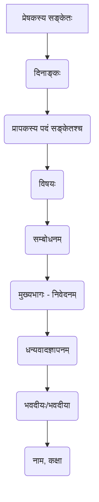

# Class 9 Sanskrit - Vyakranvidhi Chapter 112
**Language:** संस्कृतम्

```markdown
# [कक्षा ९] व्याकरणवीथिः - अध्यायः १२ - रचनाप्रयोगः

## 🌟 मूलाधाराः (Core Concepts)

अस्मिन् अध्याये छात्राः संस्कृतभाषायां रचनाकौशलस्य विभिन्नप्रकारान् अभ्यसन्ति। एतेषु प्रामुख्येन सन्ति:

1.  **पत्रलेखनम्** 📝
    *   **औपचारिकम्** (Formal)
        *   अवकाशप्राप्तये (Leave Application - रुग्णता)
        *   शुल्कक्षमापनार्थम् (Fee Concession)
        *   पुस्तकप्रेषणाय प्रकाशकं प्रति (Ordering Books)
    *   **अनौपचारिकम्** (Informal)
        *   भगिन्याः विवाहे आमन्त्रणम् (Invitation for Sister's Wedding)
        *   परीक्षापरिणामसूचनं पितरं प्रति (Informing Father about Results)
2.  **दूरभाषवार्ता** ☎️
    *   पितृ-पुत्रयोः मध्ये संवादः (Conversation between Father and Son)
3.  **अपठित-गद्यांश-अवबोधनम्** 📖
    *   गद्यांशं पठित्वा प्रश्नानाम् उत्तराणि (Comprehending Unseen Passages)
        *   एकपदेन उत्तरत
        *   पूर्णवाक्येन उत्तरत
        *   यथानिर्देशम् उत्तरत (विशेषण-विशेष्य-चयनम्, कर्तृ-क्रिया-चयनम्, पर्याय/विलोम-चयनम्, शीर्षकलेखनम्)
4.  **अनुच्छेदलेखनम्** ✍️
    *   प्रदत्तविषये विचाराणां क्रमबद्धं लेखनम् (Paragraph Writing on given topics)
        *   उदाहरणानि: नैतिकशिक्षायाः महत्त्वम्, महामना मदनमोहनमालवीयः, सत्सङ्गतिः, परोपकारः, छात्रजीवनम्।
5.  **निबन्धलेखनम्** 📜
    *   प्रदत्तविषये विस्तृतरूपेण विचाराणां प्रकटनम् (Essay Writing on given topics)
        *   उदाहरणानि: पर्यावरणम्, दूरदर्शनम्, संस्कृतभाषायाः महत्त्वम्, भारतीया संस्कृतिः, कविः कालिदासः, आदिकविः वाल्मीकिः, भगवद्गीता, हिमालयः, जननी जन्मभूमिश्च, मम प्रियं भारतम्, मैट्रो-रेलसेवा, स्वतन्त्रता-दिवसः।

## 📘 प्रमुख-अधिगमबिन्दवः (Key Learnings)

**१. पत्रलेखनस्य संरचना एवं प्रकाराः:**
*   **औपचारिकपत्रम्:**
    *   प्रेषकस्य/प्रापकस्य सङ्केतः (Address)
    *   दिनाङ्कः
    *   सम्बोधनम् (उदा. सेवायाम्, मान्यवराः)
    *   विषयः
    *   मुख्यभागः (विनयपूर्वकं स्पष्टं निवेदनम्)
    *   समापनम् (उदा. भवतां विनीतः शिष्यः)
    *   हस्ताक्षरम्/नाम
*   **अनौपचारिकपत्रम्:**
    *   प्रेषकस्य सङ्केतः, दिनाङ्कः
    *   प्रिय-सम्बोधनम् (उदा. प्रिय मित्र, पूज्याः पितृचरणाः)
    *   कुशलप्रश्नः/वार्ता
    *   मुख्यविषयस्य वर्णनम्
    *   समापनम् (उदा. भवदीयः पुत्रः, तव मित्रम्)
    *   नाम

**पत्रस्य संरचना (उदाहरणम् - औपचारिकम्):**


**२. दूरभाषवार्तालापस्य स्वरूपम्:**
*   संक्षिप्तता, स्पष्टता च।
*   सम्बोधनस्य, अभिवादनस्य, समापनस्य च प्रयोगः (उदा. कः वदति?, प्रणमामि, नमो नमः, धन्यवादः, ध्वनि यन्त्रं निदधामि)।

**३. अपठित-गद्यांश-अवबोधनस्य प्रक्रिया:**
*   गद्यांशस्य ध्यानपूर्वकं पठनम्।
*   मुख्यविचाराणां ग्रहणम्।
*   प्रश्नानुसारम् उत्तरलेखनम् (एकपदेन, पूर्णवाक्येन)।
*   व्याकरणसम्बद्धानां प्रश्नानां (यथानिर्देशम्) समाधानम् - यथा विशेषण-विशेष्य, कर्तृ-क्रिया, पर्याय-विलोमपदानां चयनम्, अनुच्छेदस्य कृते शीर्षकलेखनम् च।

**४. अनुच्छेद/निबन्धलेखनस्य पद्धतिः:**
*   **प्रस्तावना:** विषयस्य परिचयः।
*   **मध्यभागः:** विषयस्य विस्तारः, उदाहरणैः सह विचाराणां समर्थनम्, क्रमबद्धता।
*   **उपसंहारः:** सारांशः, निष्कर्षः वा स्वमतप्रकटनम्।
*   सरलसंस्कृतस्य, शुद्धव्याकरणस्य, उचितशब्दानां च प्रयोगः।

## 🧩 सक्रिय-अधिगमः (Active Learning)

*   **क्रियाकलापः (Activity):** 🔍
    1.  **पत्रलेखनाभ्यासः:** प्रदत्तानां पत्राणाम् आधारेण स्वयम् एकम् औपचारिकम् (यथा - अस्वस्थताकारणात् दिनद्वयस्य अवकाशाय प्राचार्यं प्रति) एकम् अनौपचारिकं च (यथा - स्वमित्रं जन्मदिनोत्सवे आमन्त्रयितुम्) पत्रं लिखन्तु।
    2.  **अनुच्छेदविश्लेषणम्:** 'सत्सङ्गतिः' अथवा 'परोपकारः' इति अनुच्छेदेषु प्रतिपादितान् मुख्यविचारान् विश्लेषयन्तु। कथं लेखकः स्वविचारान् समर्थयति?
    3.  **निबन्धसंरचना:** 'पर्यावरणम्' इति निबन्धस्य संरचनां (प्रस्तावना, मध्यभागः, उपसंहारः) विश्लेषयन्तु। तत्र दत्तान् भारतीयसन्दर्भान् (यथा - गङ्गा-यमुनाशुद्धीकरणम्) चिनुवन्तु।
*   **चर्चा (Discussion):** 🌍
    1.  'दूरदर्शनस्य' लाभाः हानयश्च के सन्ति? अद्यत्वे तस्य सामाजिकः प्रभावः कीदृशः अस्ति? चर्चां कुर्वन्तु।
    2.  'भारतीया संस्कृतिः' इत्यस्य कानि प्रमुखानि वैशिष्ट्यानि सन्ति? 'वसुधैव कुटुम्बकम्' इति भावनायाः अद्यत्वे किं महत्त्वम्? स्वविचारान् प्रकटयन्तु।
    3.  अपठितगद्यांशेषु वर्णिताः कथाः (यथा - संन्यासी-नौकादुर्घटना, सिंह-शृगाल-उष्ट्रकथा) कान् नैतिकसन्देशान् ददति? तेषां जीवने उपयोगिताविषये वदन्तु।

## 📝 मूल्याङ्कन-सिद्धता (Assessment Prep)

*   **अभ्यासः:** पाठ्यपुस्तके दत्तानां सर्वेषां पत्राणाम्, अनुच्छेदानां, निबन्धानां च प्रारूपम् अवगच्छन्तु, तेषाम् अभ्यासं च कुर्वन्तु।
*   **अपठित-गद्यांश-कौशलम्:** नियमितरूपेण अपठितगद्यांशान् पठित्वा प्रश्नानाम् उत्तराणि लेखितुं प्रयतध्वम्। शब्दार्थज्ञानं, व्याकरणनियमानां स्मरणं च आवश्यकम्।
*   **रचनात्मक-लेखनम्:** विभिन्नविषयेषु (यथा - मम विद्यालयः, अस्माकं राष्ट्रध्वजः, योगस्य महत्त्वम्) संस्कृतेन अनुच्छेदं निबन्धं वा लेखितुं अभ्यासं कुर्वन्तु।
*   **प्रारूपस्मरणम्:** विशेषतः पत्रलेखनस्य प्रारूपं सम्यक् स्मरन्तु। (यथा उपरि दर्शितं रेखाचित्रम् 📊)।
*   **शब्दज्ञानम्:** नूतनशब्दान् तेषाम् अर्थान् च अवगन्तुं प्रयतध्वम्।

## 🌏 भारतीय-सन्दर्भः (Bharatiya Context)

अयं अध्यायः विविधैः भारतीयसन्दर्भैः परिपूर्णः अस्ति, ये छात्रान् स्वदेशस्य संस्कृतिं, समाजं, पर्यावरणं च प्रति अवधानं दातुं प्रेरयन्ति।

*   **सामाजिक/आर्थिक-स्थितिः:** शुल्कक्षमापनार्थं लिखिते पत्रे (पृ. १३०) पितुः अल्पं मासिकवेतनं (द्विसहस्ररूप्यकमात्रम्) कुटुम्बस्य आर्थिकस्थित्याः सङ्केतं ददाति। पितरं प्रति लिखिते पत्रे (पृ. १३३) पुत्रः पुस्तकक्रयणाय शुल्कप्रदानाय च पञ्चसहस्ररूप्यकाणि याचते, यत् शैक्षिकव्ययान् सूचयति।
*   **सांस्कृतिक-विषयाः:** निबन्धेषु अनुच्छेदेषु च भारतीया संस्कृतिः (पृ. १४५), संस्कृतभाषायाः महत्त्वम् (पृ. १४४), कालिदासः (पृ. १४६), वाल्मीकिः (रामायणम्) (पृ. १४७), भगवद्गीता (पृ. १४८), हिमालयस्य महत्त्वम् (देवभूमिः, तीर्थस्थानानि - केदारनाथः, बदरीनाथः) (पृ. १४८-१४९), जननी जन्मभूमिश्च (रामायणस्य उद्धरणम्) (पृ. १४९-१५०) इत्यादयः विषयाः वर्णिताः।
*   **ऐतिहासिक-राष्ट्रिय-सन्दर्भाः:** महामना मदनमोहनमालवीयः (काशीहिन्दूविश्वविद्यालयस्य स्थापना) (पृ. १४१), स्वतन्त्रता-दिवसः (पृ. १५२-१५३), भारतदेशस्य वर्णनम् (पृ. १५१), चन्द्रशेखर-भगतसिंह-राजगुरु-प्रभृतयः देशभक्ताः (पृ. १५०) इत्यादयः उल्लिखिताः।
*   **पर्यावरण-जागरूकता:** पर्यावरण-निबन्धे (पृ. १४३) गङ्गा-यमुना-नद्योः शुद्धीकरण-अभियानस्य उल्लेखः राष्ट्रियपर्यावरणचिन्तां दर्शयति।
*   **आधुनिक-भारतम्:** मैट्रो-रेलसेवा (दिल्ली-नगरस्य उदाहरणम्) (पृ. १५२) आधुनिक-भारतस्य परिवहन-व्यवस्थायाः चित्रं प्रस्तौति। दूरदर्शनस्य (पृ. १४३-१४४) प्रभावः, ज्ञानदर्शन-कार्यक्रमः च आधुनिक-सूचना-प्रौद्योगिकी-युगं सूचयति।
*   **स्थान-नामानि:** पत्रेषु, निबन्धेषु च भारतस्य विभिन्नस्थानानां (नवदेहली, हिमाचलप्रदेशः, हरियाणा, प्रयागः, काशी, शान्तिनिकेतनम्) उल्लेखः प्राप्यते।

एते सर्वे सन्दर्भाः छात्रान् स्वपरिवेशं, राष्ट्रं, संस्कृतिं च अवगन्तुं साहाय्यं कुर्वन्ति तथा च रचनालेखने वास्तविकताम् आनयन्ति।
```