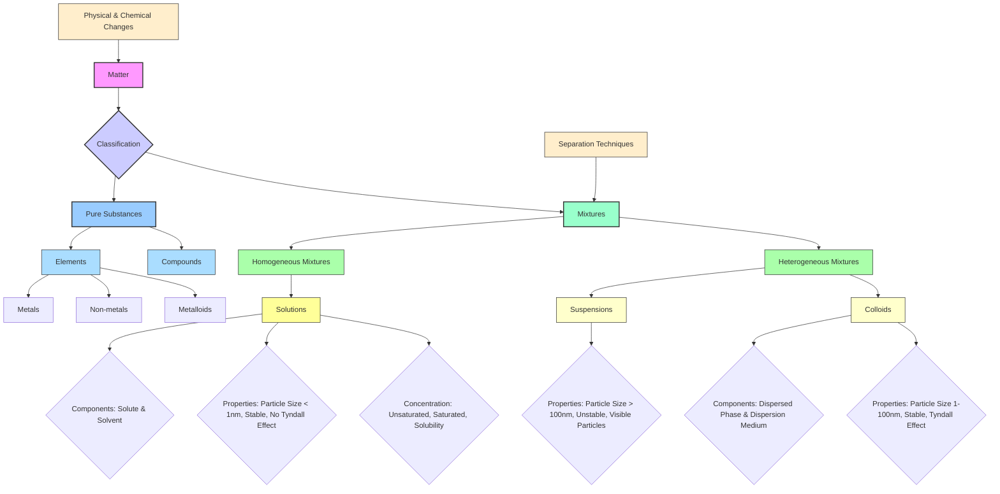

# Class 9 Science - General Chapter 102
**Language:** English

```markdown
# [Class 9] Science - Chapter 2: Is Matter Around Us Pure?

## 🌟 Core Concepts


*   **Matter Classification:** Based on chemical composition, matter is classified into Pure Substances and Mixtures.
*   **Pure Substances:** Consist of only one type of particle (same chemical nature). Examples: Elements (like Iron, Oxygen) and Compounds (like Water, Salt).
*   **Mixtures:** Consist of two or more pure substances physically mixed in any proportion. Examples: Air, Soil, Milk, Sea Water.
*   **Types of Mixtures:**
    *   **Homogeneous:** Uniform composition throughout (e.g., Salt solution, Air, Alloys like Brass). Also known as Solutions.
    *   **Heterogeneous:** Non-uniform composition with physically distinct parts (e.g., Soil, Mixture of sand and salt, Suspension of chalk in water, Milk - technically).
*   **Solutions, Suspensions, Colloids:** Differ based on particle size, stability, and interaction with light.
*   **Physical vs. Chemical Changes:** Physical changes alter form but not chemical identity (e.g., melting ice); Chemical changes result in new substances with different properties (e.g., rusting of iron, burning).

## 📘 Key Learnings

1.  **Pure Substances vs. Mixtures:**
    *   **Pure Substance:** Single type of particle, fixed composition, cannot be separated by physical means (e.g., elements like Copper (Cu), compounds like Sodium Chloride (NaCl)). Has fixed properties like melting/boiling points.
    *   **Mixture:** Multiple types of particles, variable composition, components retain their properties, can often be separated by physical methods (e.g., evaporation, filtration).
    *   *Common vs. Scientific Purity:* Commonly, 'pure' means unadulterated (like pure *ghee*). Scientifically, 'pure' means consisting of only one type of substance (e.g., pure water is only H₂O molecules, while milk is a mixture of water, fat, proteins etc.).

2.  **Types of Mixtures:**
    *   **Homogeneous Mixture (Solution):**
        *   Uniform composition. Particles are molecular/ionic size (< 1 nm).
        *   Components: **Solute** (dissolved substance, lesser amount) and **Solvent** (dissolving medium, larger amount).
        *   Properties: Transparent, stable (particles don't settle), does not scatter light (no Tyndall effect), cannot be separated by filtration.
        *   Examples: Salt in water, Sugar in water, Air (gases in gas), Alloys like Brass (*Pital* - Zinc in Copper), Tincture of Iodine (Iodine in alcohol).
        *   **Concentration:** Amount of solute in a given amount of solvent or solution.
            *   *Unsaturated:* More solute can be dissolved at a given temperature.
            *   *Saturated:* Maximum amount of solute is dissolved at a given temperature. No more solute dissolves.
            *   *Solubility:* The amount of solute present in a saturated solution at a specific temperature. Solubility generally increases with temperature for solids in liquids.
            *   Expressing Concentration:
                *   Mass by mass % = (Mass of solute / Mass of solution) × 100
                *   Mass by volume % = (Mass of solute / Volume of solution) × 100
                *   Volume by volume % = (Volume of solute / Volume of solution) × 100
                ```
                Example Calculation: 40g salt in 320g water.
                Mass of solute = 40g
                Mass of solvent = 320g
                Mass of solution = 40g + 320g = 360g
                Mass % = (40 / 360) * 100 = 11.1%
                ```
    *   **Heterogeneous Mixture:**
        *   Non-uniform composition, visible boundaries of separation.
        *   **Suspension:**
            *   Solid particles dispersed in a liquid without dissolving.
            *   Particle size > 100 nm (visible to naked eye).
            *   Properties: Unstable (particles settle down), scatters light (Tyndall effect may be visible when particles are suspended), can be separated by filtration.
            *   Examples: Chalk powder in water, Muddy water, Wheat flour (*atta*) in water.
            ```mermaid
            graph TD
                A[Suspension (e.g., Muddy Water)] -- Filtration --> B(Separated: Mud Residue);
                A -- Standing --> C(Settled Mud Particles);
                style A fill:#ffc
            ```
        *   **Colloid (Colloidal Solution):**
            *   Appears homogeneous but is heterogeneous at a microscopic level.
            *   Particle size between 1 nm and 100 nm.
            *   Components: **Dispersed Phase** (solute-like) and **Dispersion Medium** (solvent-like).
            *   Properties: Stable (particles don't settle easily), scatters light (**Tyndall Effect**), cannot be separated by simple filtration (requires centrifugation).
            *   Examples: Milk (fat globules in water), Fog/Mist (water droplets in air), Smoke (solid particles in air), Ink, Blood, Jelly.
            *   **Tyndall Effect:** Scattering of a beam of light by colloidal particles, making the path of light visible. Seen in forests (sunlight through canopy mist) or through a projector beam in a dusty room.
            ```mermaid
            graph LR
                subgraph Tyndall Effect
                    direction LR
                    A(Light Source) --> B{Colloidal Solution (e.g., Milk)};
                    B -- Scatters Light --> C(Visible Path of Light);
                end
                subgraph No Tyndall Effect
                    direction LR
                    D(Light Source) --> E{True Solution (e.g., Salt Water)};
                    E -- No Scattering --> F(Path Not Visible);
                end
                style B fill:#ccf
                style E fill:#9cf
            ```

3.  **Physical vs. Chemical Changes:**
    *   **Physical Change:** Change in physical properties (state, shape, size, colour) without change in chemical composition. No new substance formed. Often reversible. Examples: Melting of ice, boiling of water, cutting trees, dissolving salt in water, melting butter.
    *   **Chemical Change:** Change resulting in formation of one or more new substances with different chemical composition and properties. Often irreversible. Also called a chemical reaction. Examples: Burning of wood/paper/candle, rusting of iron (*almirah*), cooking food, digestion, souring of milk.

4.  **Types of Pure Substances:**
    *   **Elements:** Basic form of matter, cannot be broken down into simpler substances by chemical reactions. Composed of only one type of atom. (e.g., Iron (Fe), Gold (Au), Oxygen (O₂), Hydrogen (H₂)).
        *   **Metals:** Lustrous, malleable, ductile, good conductors of heat & electricity, sonorous. (e.g., Iron, Copper, Gold, Silver, Mercury - liquid metal). Commonly used in India for utensils (*pital*, steel), wiring (copper), jewellery (gold, silver).
        *   **Non-metals:** Not lustrous (except iodine), poor conductors, brittle, not malleable/ductile/sonorous. (e.g., Oxygen, Hydrogen, Carbon, Sulphur, Chlorine).
        *   **Metalloids:** Exhibit properties intermediate between metals and non-metals. (e.g., Silicon (Si), Germanium (Ge), Boron (B)). Silicon is crucial for India's electronics industry.
    *   **Compounds:** Formed when two or more elements combine chemically in a fixed proportion. The properties of a compound are entirely different from its constituent elements. Can only be broken down into elements by chemical or electrochemical reactions. (e.g., Water (H₂O), Sodium Chloride (NaCl - common salt), Sugar (C₁₂H₂₂O₁₁), Calcium Carbonate (CaCO₃)).

5.  **Mixtures vs. Compounds:**

    | Feature             | Mixture                                      | Compound                                             |
    | :------------------ | :------------------------------------------- | :--------------------------------------------------- |
    | **Formation**       | Physical mixing, no new substance            | Chemical reaction, new substance formed              |
    | **Composition**     | Variable                                     | Fixed proportion by mass                             |
    | **Properties**      | Shows properties of constituent substances   | Properties entirely different from constituent elements |
    | **Separation**      | By physical methods (filtration, evaporation) | By chemical/electrochemical methods only             |
    | **Energy Change**   | Usually minimal                              | Often involves significant energy change (heat/light) |
    | **Example (Fe + S)**| Iron filings + Sulphur powder (retains magnetism, components separable) | Iron Sulphide (FeS) (non-magnetic, different properties) |

## 🧩 Active Learning

*   **Activity: Household Purity Check & Adulteration Research** 🔍
    1.  List 5 common food items used in your home (e.g., *Haldi* (turmeric powder), *Ghee*, Milk, Honey, *Besan* (gram flour)).
    2.  Classify each as predominantly a pure substance or a mixture based on scientific definitions. If a mixture, identify if it's homogeneous or heterogeneous.
    3.  Research common adulterants found in these items in India (e.g., metanil yellow in turmeric, vanaspati in ghee, water/starch in milk). Use resources like the Food Safety and Standards Authority of India (FSSAI) website or news articles.
    4.  Evaluate: How does the scientific definition of 'pure' contrast with the common concern about 'purity' (adulteration) in the Indian market?
*   **Discussion: Real-world Mixture Impacts & Solutions** 🌍
    1.  **Case Study:** Consider the Yamuna river in Delhi or the Ganga near industrial towns. These water bodies are complex mixtures containing industrial effluents, sewage, and agricultural runoff.
    2.  **Analyze:** Identify the types of mixtures present (solutions, suspensions, colloids). What are the harmful solutes and suspended particles?
    3.  **Evaluate:** Discuss the environmental and health impacts of these heterogeneous mixtures.
    4.  **Create:** Brainstorm and evaluate different methods (linking to separation techniques learned) that are used or could be used for cleaning these rivers or purifying water for drinking in affected areas (e.g., large-scale filtration, chemical treatment, traditional methods like using *matkas* with sand/gravel layers). Discuss the effectiveness and limitations of household water purifiers (RO, UV, candle filters) in the Indian context.

## 📝 Assessment Prep

*   **Case Study 1 (Separation):** You are given a mixture of common salt (NaCl), ammonium chloride (NH₄Cl), and sand (SiO₂). Design a step-by-step procedure using appropriate separation techniques (sublimation, filtration, evaporation) to separate these three components. Draw diagrams for the filtration and evaporation setups.
*   **Case Study 2 (Concentration):** A student dissolves 50 g of sugar in 200 g of water to make a sugar solution.
    *   Calculate the concentration of this solution in terms of mass by mass percentage.
    *   If the solubility of sugar in water at 25°C is approximately 204 g per 100 g of water, is the prepared solution saturated, unsaturated, or supersaturated at 25°C? Justify your answer.
    *   What would happen if this saturated solution at a higher temperature is cooled down?
*   **Diagram Analysis:**
    *   Analyze diagrams showing the Tyndall effect (Fig 2.3, 2.4). Explain why the path of light is visible in milk but not in a copper sulphate solution. Relate this to particle size.
    *   Interpret the setup for filtration (Fig 2.2). Label the filtrate and residue. Explain the principle behind this separation technique.
*   **Classification Task:** Classify the following Indian household/common items as elements, compounds, or mixtures (specify homogeneous/heterogeneous): *Kheer*, Steel utensil, *Nimbu Pani* (lemonade), Oxygen cylinder, Baking Soda (Sodium Bicarbonate), Air in Mumbai, Gold jewellery (22 carat), Distilled water, Tap water, Curd (*Dahi*). Justify your classification.
*   **Distinguish:** Create a table comparing the properties (particle size, visibility, stability, Tyndall effect, filterability) of solutions, suspensions, and colloids.

## 🌏 Bharatiya Context

*   **Purity in Consumption:** The chapter's opening question about judging the purity of milk, *ghee*, butter, salt, spices, etc., directly relates to consumer concerns in India regarding food quality and adulteration. Standards are set by bodies like **FSSAI (Food Safety and Standards Authority of India)**. Scientifically, most of these are mixtures (e.g., milk, *ghee*), but the concern is about harmful or unwanted additions.
*   **Water Resources & Purification:** India faces significant challenges with water purity. Rivers like the Ganga and Yamuna are complex mixtures affected by pollution. Traditional methods like using earthen pots (*mutka*) with sand and gravel (as suggested in the Group Activity) represent simple filtration. Modern household purifiers (RO, UV) are common due to varying tap water quality, which itself is a solution containing dissolved salts and minerals, and sometimes suspensions or colloids.
*   **Common Mixtures & Materials:** Examples like *nimbu pani* (solution), tea (solution after filtration), brass (*pital* - alloy/solid solution) used for utensils, air quality in Indian cities (heterogeneous mixture with pollutants like dust and smoke showing Tyndall effect), and milk and curd (*dahi* - colloids) are highly relevant.
*   **Economic Data Link (Implied):** Concerns about adulteration impact public health and the economy. Data on seizures of adulterated food items or the market size of water purifiers in India reflect the practical importance of understanding pure substances and mixtures. The quality of materials (like metals based on purity) affects industrial output.
```