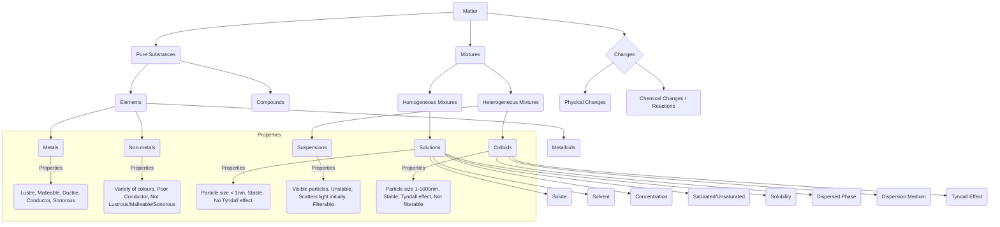

# Class 9 Science - General Chapter 102
**Language:** English

```markdown
# [Class 9] General - Chapter 102: Is Matter Around Us Pure?

## 🌟 Core Concepts

A hierarchical overview of the fundamental ideas presented in the chapter:


📊 **Hierarchy Breakdown:** Matter is classified into Pure Substances (Elements, Compounds) and Mixtures (Homogeneous, Heterogeneous). Mixtures are further detailed into Solutions, Suspensions, and Colloids, each with specific components and properties. Physical and Chemical Changes alter matter.

## 📘 Key Learnings

**1. Pure Substances vs. Mixtures**
*   **Common Understanding:** 'Pure' often implies 'no adulteration' (e.g., pure ghee, pure milk).
*   **Scientific Definition:** A **Pure Substance** consists of only a single type of particle with the same chemical nature. It's a pure single form of matter (e.g., Sodium Chloride, Sugar, Iron, Oxygen). Its composition is fixed, and it has characteristic properties.
*   **Mixture:** Contains more than one kind of pure substance (element or compound) mixed in any proportion. Most matter around us exists as mixtures (e.g., sea water, soil, air, milk). Milk is a mixture of water, fat, proteins, etc.

**2. Types of Mixtures**
*   **Homogeneous Mixture (Solution):**
    *   Has a uniform composition throughout (particles evenly distributed).
    *   Components are not physically distinct.
    *   Examples: Salt in water, sugar in water, air, alloys (like Brass: Zinc + Copper).
    *   Can have variable composition (e.g., different concentrations of copper sulphate solution yield different colour intensities).
*   **Heterogeneous Mixture:**
    *   Has a non-uniform composition.
    *   Contains physically distinct parts.
    *   Examples: Mixture of sodium chloride and iron filings, salt and sulphur, oil and water, soil, milk (colloid), chalk powder in water (suspension).

**3. Solutions**
*   A **solution** is a *homogeneous mixture* of two or more substances.
*   **Components:**
    *   **Solvent:** The component that dissolves the other (usually present in larger amount, e.g., water in sugar solution).
    *   **Solute:** The component that is dissolved (usually present in lesser quantity, e.g., sugar in sugar solution).
*   **Examples:** Lemonade, soda water, tincture of iodine (iodine in alcohol), air (gases in gas), alloys (solid in solid).
*   **Properties:**
    *   Homogeneous.
    *   Particle size < 1 nm (cannot be seen by naked eyes).
    *   Do not scatter light (path of light is not visible - no Tyndall effect).
    *   Stable (solute particles do not settle down).
    *   Solute cannot be separated by filtration.
*   **Concentration:** The amount of solute present in a given amount (mass or volume) of solution or solvent.
    *   Can be expressed as:
        *   Mass by mass percentage = (Mass of solute / Mass of solution) × 100
        *   Mass by volume percentage = (Mass of solute / Volume of solution) × 100
        *   Volume by volume percentage = (Volume of solute / Volume of solution) × 100
    *   **Saturated Solution:** Contains the maximum amount of solute dissolved at a given temperature.
    *   **Unsaturated Solution:** Contains less solute than the saturation level.
    *   **Solubility:** The amount of solute present in a saturated solution at a given temperature. Solubility varies with substance and temperature. Generally, solubility of solids in liquids increases with temperature. 📈

**4. Suspensions**
*   A **suspension** is a *heterogeneous mixture* where solid particles are dispersed in a liquid without dissolving.
*   **Properties:**
    *   Heterogeneous.
    *   Particles are visible to the naked eye.
    *   Particles scatter light, making the beam path visible (Tyndall effect).
    *   Unstable (particles settle down when left undisturbed).
    *   Components can be separated by filtration. (See Fig. 2.2 for filtration setup).

**5. Colloidal Solutions (Colloids)**
*   A **colloid** is a *heterogeneous mixture* where particle size is intermediate between solutions and suspensions. It often appears homogeneous.
*   **Components:**
    *   **Dispersed Phase:** The solute-like component (dispersed particles).
    *   **Dispersion Medium:** The solvent-like component in which particles are suspended.
*   **Examples:** Milk (fat dispersed in water), fog/mist (water droplets in air), smoke (solid particles in air), shaving cream (gas in liquid), jelly (liquid in solid). (See Table 2.1 for types).
*   **Properties:**
    *   Heterogeneous (at microscopic level).
    *   Particle size: 1 nm - 1000 nm (too small for naked eye, larger than solution particles).
    *   Appear homogeneous but are not.
    *   Stable (particles do not settle down).
    *   Show **Tyndall Effect:** Scatter a beam of light, making its path visible. (Observed in milk, fog, smoke through a hole, sunlight through forest canopy - Fig 2.3, 2.4). 📈
    *   Cannot be separated by filtration, but can be separated by **centrifugation**.

**Comparison:**
| Feature         | Solution                     | Colloid                            | Suspension                   |
| :-------------- | :--------------------------- | :--------------------------------- | :--------------------------- |
| **Nature**      | Homogeneous                  | Heterogeneous (appears homo.)      | Heterogeneous                |
| **Particle Size**| < 1 nm                       | 1 nm - 1000 nm                     | > 1000 nm                    |
| **Appearance**  | Clear, transparent           | Often translucent or opaque        | Opaque                       |
| **Tyndall Effect**| No                           | Yes                                | Yes (initially)              |
| **Stability**   | Stable                       | Stable                             | Unstable (settles down)      |
| **Filtration**  | Cannot be separated          | Cannot be separated                | Can be separated             |

**6. Physical vs. Chemical Changes**
*   **Physical Change:** Alters the physical properties (like state, colour, hardness, density, melting/boiling point) without changing the chemical composition or identity of the substance. Interconversion of states (ice to water to steam) is a physical change. No new substance is formed. Examples: Cutting trees, melting butter, boiling water, dissolving salt.
*   **Chemical Change (Chemical Reaction):** Results in a change in chemical composition and properties, forming one or more new substances. Examples: Burning (oil, candle, paper, wood), rusting of iron, cooking food, digestion, electrolysis of water.
    *   Activity 2.4 (Iron + Sulphur):
        *   Group I (Mixing): Physical change, forms a mixture retaining properties of Fe and S. Components separable by physical means (magnetism, dissolving S in CS2). Gas produced with acid is H2 (from Fe).
        *   Group II (Heating): Chemical change, forms a compound (Iron Sulphide - FeS) with new properties, different from Fe and S. Components not easily separable. Gas produced with acid is H2S (smell of rotten eggs).

**7. Types of Pure Substances**
*   **Elements:** Basic form of matter that cannot be broken down into simpler substances by chemical reactions (Defined by Lavoisier).
    *   **Metals:** Lustrous, malleable, ductile, good conductors of heat/electricity, sonorous (e.g., Iron, Copper, Gold, Silver, Mercury - liquid at room temp).
    *   **Non-metals:** Variety of colours, poor conductors, not lustrous/malleable/sonorous (e.g., Oxygen, Hydrogen, Carbon, Sulphur, Bromine - liquid at room temp).
    *   **Metalloids:** Intermediate properties between metals and non-metals (e.g., Boron, Silicon, Germanium).
*   **Compounds:** Substance composed of two or more elements chemically combined in a fixed proportion. The properties of a compound are entirely different from its constituent elements. Examples: Water (H2O), Sodium Chloride (NaCl), Sugar, Iron Sulphide (FeS).

**Mixtures vs. Compounds Summary (Table 2.2):**
| Feature          | Mixture                                    | Compound                                       |
| :--------------- | :----------------------------------------- | :--------------------------------------------- |
| **Formation**    | Elements/compounds mix, no new substance   | Elements react chemically, new substance forms |
| **Composition**  | Variable                                   | Fixed                                          |
| **Properties**   | Shows properties of constituents           | Totally different properties from constituents |
| **Separation**   | By physical methods (filtration, evap.)    | Only by chemical/electrochemical reactions     |

## 🧩 Active Learning

*   **Activity: Research-based Case Study Analysis 🔍**
    *   **Task:** Select 3-4 common packaged food items available in India (e.g., packaged milk, ghee, salt, spices, fruit juice). Examine the packaging for terms like "Pure", "Natural", or quality certifications (like AGMARK, FSSAI logo).
    *   **Research:** Investigate the scientific composition of these items (are they pure substances or mixtures?). Compare the common usage of "pure" on the packaging with the scientific definition. Research the basic quality standards set by FSSAI (Food Safety and Standards Authority of India) for one chosen product.
    *   **Analysis:** Prepare a short report evaluating the claims of purity based on scientific definitions and regulatory standards. Discuss why companies might use the term "pure" in a non-scientific way.
*   **Discussion: Critical Analysis of Real-world Impacts 🌍**
    *   **Topic:** The dual nature of colloids in the Indian context.
    *   **Prompts:**
        *   How do natural colloids like fog and mist impact transportation and daily life in North India during winters?
        *   Discuss the formation and health impacts of smog (an aerosol colloid) in major Indian cities like Delhi. What are its main components (dispersed phase/dispersion medium)?
        *   Consider beneficial colloids: How is milk (an emulsion) vital to India's dairy industry and nutrition? How are colloidal solutions used in Indian industries (e.g., paints, pharmaceuticals)?
        *   Evaluate the challenges and benefits associated with colloids in our environment and economy.

## 📝 Assessment Prep

*   **Case Studies:**
    *   Analyze scenarios similar to Activity 2.2: Given observations (particle visibility, Tyndall effect, stability, filterability) for unknown mixtures, classify them as solutions, suspensions, or colloids and justify your reasoning.
    *   Analyze scenarios similar to Activity 2.4: Predict the outcome (mixture or compound) and properties if different elements are mixed or heated together. Explain the type of change occurring.
    *   Problem Solving: Calculate concentration (mass%, volume%) given solute and solvent/solution amounts (like Example 2.1). Use solubility data (like Table in Q3) to determine saturation levels or predict crystallization upon cooling.
*   **Diagrams:**
    *   Be prepared to interpret or draw simple diagrams illustrating:
        *   Particle arrangement in solutions, suspensions, and colloids.
        *   The Tyndall effect (light beam path visible/invisible). 📈
        *   Basic separation techniques like filtration (Fig 2.2). 📝
        *   Distinguishing physical vs. chemical changes at a particle level (conceptual).

## 🌏 Bharatiya Context

*   **Purity Standards & Consumer Awareness:** The term 'pure' on consumables like milk, ghee, spices, and mineral water in the Indian market relates more to absence of adulteration than the scientific definition. Organizations like **FSSAI (Food Safety and Standards Authority of India)** set standards for food products to ensure safety and quality, which consumers rely on. 📊 Understanding the scientific basis of purity helps in critically evaluating product claims.
*   **Environmental Colloids:** Air pollution, particularly smog in cities like Delhi, Mumbai, and Kolkata, is a critical issue. Smog is an aerosol (a type of colloid) where pollutants (like particulate matter - PM2.5, dust - solid/liquid dispersed phase) are suspended in air (gas dispersion medium). High PM2.5 levels, often reported in **National Air Quality Index (AQI)** data, demonstrate the real-world impact and health hazards of colloids. 📊 The Tyndall effect is visible when sunlight streams through polluted air.
*   **Industrial & Economic Relevance:**
    *   **Separation Techniques:** India's economy relies on separating mixtures. Examples include:
        *   Salt production via evaporation of seawater (e.g., Gujarat coast).
        *   Fractional distillation in petroleum refineries (e.g., Jamnagar, Panipat) to separate crude oil (a mixture) into useful components like petrol, diesel.
        *   Extraction of metals (elements) like Iron, Aluminium, Copper from their ores (mixtures/compounds) found in states like Jharkhand, Odisha, Chhattisgarh, using chemical processes.
    *   **Alloys:** Alloys like brass (Copper + Zinc) and bronze (Copper + Tin) have historical and ongoing significance in India for making utensils, statues, and decorative items. Stainless steel (Iron, Chromium, Nickel, Carbon) is widely used in kitchens. These are solid solutions.
    *   **Dairy Industry:** Milk, a vital part of the Indian diet and economy, is a colloidal emulsion (fat dispersed in water). Processing and quality control are major industrial activities.

```