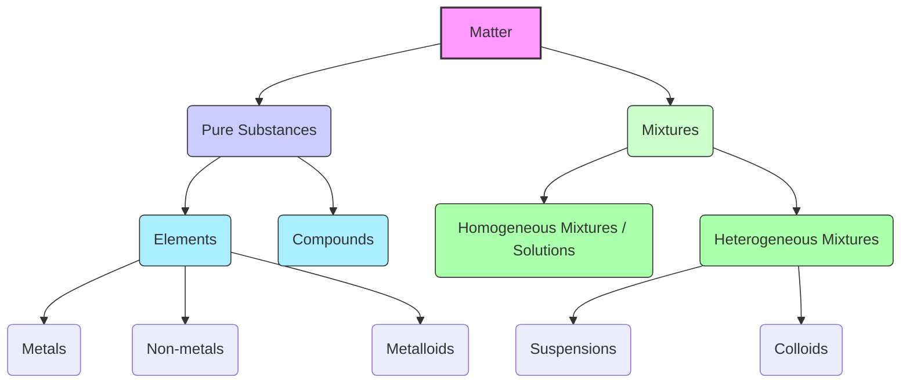

# Class 9 Science - General Chapter 102
**Language:** English

```markdown
# [Class 9] Science - Chapter 2: Is Matter Around Us Pure?

## 🌟 Core Concepts

This chapter explores the classification of matter based on its chemical composition, distinguishing between pure substances and mixtures, and delving into the types and properties of each.



**Hierarchy:**
1.  **Matter:** Anything that occupies space and has mass.
2.  **Pure Substances:** Consist of only one type of particle with a definite chemical nature and fixed properties.
    *   **Elements:** Basic form of matter, cannot be broken down chemically (e.g., Iron, Oxygen, Gold).
        *   **Metals:** Lustrous, malleable, ductile, good conductors (e.g., Copper, Silver).
        *   **Non-metals:** Lack metallic properties (e.g., Hydrogen, Carbon, Iodine).
        *   **Metalloids:** Exhibit properties intermediate between metals and non-metals (e.g., Silicon, Germanium).
    *   **Compounds:** Formed by chemical combination of two or more elements in a fixed proportion (e.g., Water (H₂O), Sodium Chloride (NaCl)).
3.  **Mixtures:** Consist of two or more pure substances physically mixed in any proportion. Components retain their individual properties.
    *   **Homogeneous Mixtures (Solutions):** Uniform composition throughout (e.g., Saltwater, Air, Alloys like Brass).
    *   **Heterogeneous Mixtures:** Non-uniform composition, physically distinct parts (e.g., Soil, Oil and Water).
        *   **Suspensions:** Solid particles dispersed in a liquid, visible, settle down (e.g., Muddy water, Chalk powder in water).
        *   **Colloids:** Appear homogeneous but are heterogeneous at a microscopic level, particles scatter light (Tyndall effect), stable (e.g., Milk, Fog, Ink).

## 📘 Key Learnings

**1. Pure Substances vs. Mixtures:**
*   **Purity:** Scientifically, 'pure' means a substance made of identical particles (e.g., pure gold, pure water). Common usage (like 'pure ghee' or 'pure milk') often means 'unadulterated', but scientifically, milk and ghee are mixtures.
*   **Composition:** Pure substances have fixed composition (e.g., water is always H₂O). Mixtures have variable composition (e.g., saltwater can have varying salt content).
*   **Properties:** Pure substances have fixed characteristic properties (melting point, boiling point). Mixtures exhibit properties of their constituent components.
*   **Separation:** Mixture components can be separated by physical methods (filtration, evaporation). Compound components require chemical or electrochemical reactions.

**2. Types of Mixtures:**
*   **Homogeneous (Solutions):**
    *   **Components:** Solute (dissolved substance, usually lesser amount) and Solvent (dissolving medium, usually larger amount). E.g., Sugar (solute) in Water (solvent).
    *   **Properties:** Particle size < 1 nm (invisible), stable (don't settle), do not scatter light (no Tyndall effect), cannot be separated by filtration. Examples include lemonade, soda water, air, alloys (solid solutions like brass - Zinc & Copper).
    *   **Concentration:** The amount of solute present in a given amount of solution or solvent.
        *   *Unsaturated:* More solute can be dissolved.
        *   *Saturated:* Maximum solute dissolved at a given temperature.
        *   *Solubility:* The amount of solute in a saturated solution at a specific temperature.
        *   *Expressions:* Mass by mass %, Mass by volume %, Volume by volume %.
        *   *Calculation Example:* 40g salt in 320g water. Solution mass = 40+320 = 360g. Concentration = (40g / 360g) * 100 = 11.1% (mass by mass).
*   **Heterogeneous:**
    *   **Suspensions:**
        *   **Properties:** Heterogeneous, particles visible to naked eye, unstable (particles settle), scatter light (path visible), can be separated by filtration. E.g., Chalk in water.
        *   *Diagrammatic Representation (Conceptual based on Fig 2.2 - Filtration):* A filter paper placed in a funnel separates the suspended particles (residue) from the liquid (filtrate) when the suspension is poured through it.
    *   **Colloids (Colloidal Solutions):**
        *   **Properties:** Heterogeneous (appears homogeneous), particle size between solutions and suspensions (approx. 1 nm - 100 nm), stable (don't settle), scatter light (**Tyndall Effect**), cannot be separated by simple filtration (requires centrifugation).
        *   **Components:** Dispersed Phase (solute-like particles) and Dispersion Medium (solvent-like medium).
        *   *Examples (Table 2.1):* Fog/Clouds (Liquid in Gas - Aerosol), Smoke (Solid in Gas - Aerosol), Milk/Face Cream (Liquid in Liquid - Emulsion), Milk of Magnesia/Mud (Solid in Liquid - Sol), Jelly/Cheese (Liquid in Solid - Gel), Coloured Gemstone (Solid in Solid - Solid Sol).
        *   *Tyndall Effect Observation (Conceptual based on Fig 2.3 & 2.4):* A beam of light passing through a true solution (e.g., copper sulphate in water) is not visible. However, the path of light becomes visible when passed through a colloid (e.g., milk in water) or through dusty air or forest canopy (mist droplets act as colloidal particles). This scattering makes the beam visible.

**3. Physical vs. Chemical Changes:**
*   **Physical Change:** Alters physical properties (state, shape, size, colour) without changing the substance's chemical identity. No new substance is formed. Usually reversible. E.g., Melting ice, boiling water, dissolving salt, cutting trees.
*   **Chemical Change (Reaction):** Results in the formation of one or more new substances with entirely different properties and chemical composition. Usually irreversible. E.g., Burning wood/paper, rusting of iron (like an almirah), cooking food, digestion.
    *   *Activity 2.4 Analysis:* Mixing iron filings and sulphur is a physical change (mixture formed, components retain properties like magnetism, separable). Heating the mixture causes a chemical change, forming iron sulphide (a compound) with new properties (non-magnetic, different reaction with acid).

**4. Elements and Compounds:**
*   **Elements:** Fundamental substances (e.g., Oxygen, Iron, Silicon). Defined by Lavoisier. Over 100 known, 92 natural. Most are solids, 11 gases, 2 liquids (Mercury, Bromine) at room temp.
*   **Compounds:** Formed by chemical combination of elements in a fixed ratio (e.g., Water - H:O ratio fixed). Properties differ significantly from constituent elements. Composition is uniform. (See Table 2.2 for Mixture vs. Compound comparison).

## 🧩 Active Learning

*   **Activity: Research-based Case Study Analysis 🔍**
    *   **Case:** Pragya's Solubility Experiment Data (Table in Section 2.3).
    *   **Task:** Analyse the provided solubility data for Potassium Nitrate, Sodium Chloride, Potassium Chloride, and Ammonium Chloride at different temperatures (283K, 293K, 313K, 333K, 353K).
        1.  **Evaluate:** Which substance shows the most significant change in solubility with temperature? Which shows the least?
        2.  **Calculate:** If Pragya dissolves 40g of Potassium Chloride in 100g of water at 353K, is the solution saturated, unsaturated, or supersaturated? Justify. What happens if this solution is cooled to 293K? Estimate the mass of salt that will crystallise out.
        3.  **Create:** Design a hypothetical scenario where understanding solubility differences (like those observed) could be used for separating a mixture of two of these salts. Describe the process.

*   **Discussion: Critical Analysis of Real-world Impacts 🌍**
    *   **Topic:** Scientific Purity vs. Commercial Claims in India.
    *   **Prompts:**
        1.  Consider common Indian products labelled 'Pure' (e.g., 'Pure Ghee', 'Pure Honey', 'Pure Juice'). Based on the scientific definitions learned, critically evaluate these labels. Are they scientifically accurate? What do they likely imply to the consumer?
        2.  Discuss the economic and health implications of adulteration in food products like milk or spices in the Indian context. How does the scientific concept of mixtures help in detecting adulteration?
        3.  How do organisations like the Food Safety and Standards Authority of India (FSSAI) or the Bureau of Indian Standards (BIS) attempt to regulate 'purity' and composition of consumer goods? Relate their standards (if known) to the concepts of mixtures, compounds, and permissible limits.

## 📝 Assessment Prep

*   **Case Study Application:**
    *   A student prepares three mixtures: (A) Sugar in water, (B) Sand in water, (C) Milk in water.
        *   Classify each mixture as a solution, suspension, or colloid. Justify your classification based on properties like particle visibility, stability, filtration results, and Tyndall effect.
        *   Describe how you would separate the components of mixture (A) and mixture (B). Which physical property forms the basis for each separation?
        *   If mixture (A) contains 25g of sugar in 150g of water, calculate its concentration (mass by mass percentage).
*   **Diagram-Based Questions:**
    *   *(Based on Fig 2.2 - Filtration)* Sketch a labelled diagram of the filtration process used to separate an insoluble solid from a liquid. Label the filtrate, residue, filter paper, and funnel. Explain the principle behind this separation technique.
    *   *(Based on Fig 2.3/2.4 - Tyndall Effect)* Draw simple diagrams showing a beam of light passing through (a) a true solution and (b) a colloidal solution. Illustrate why the path of light is visible in (b) but not in (a). Name this phenomenon and give two real-life examples observed in India (e.g., dust particles in a sunbeam entering a room, light through fog/mist during winters in North India).
*   **Distinguishing Concepts:**
    *   Provide two points of difference between:
        *   Homogeneous and Heterogeneous mixtures.
        *   Mixtures and Compounds.
        *   Physical and Chemical changes.
        *   Solutions and Colloids.
        *   Colloids and Suspensions.

## 🌏 Bharatiya Context

*   **Everyday Examples:** The concepts of mixtures and separation are relevant to daily Indian life:
    *   Making *chai* (tea): Water (solvent), sugar/milk (solutes forming solution/colloid), tea leaves (insoluble, separated by filtration using a sieve - residue).
    *   Traditional water purification: Using earthen pots (*mutka*) with layers of sand and pebbles (Group Activity reference) utilizes filtration principles to clean muddy water, a practice seen in rural India.
    *   Food Preparation: Separating butter from curd (*dahi*) involves centrifugation (like churning). Winnowing (using wind to separate husk from grains) is a physical separation technique used widely in agriculture.
*   **Economic/Social Data Context:**
    *   **Food Adulteration:** The scientific distinction between pure substances and mixtures is crucial in addressing food adulteration, a significant issue in India. Reports by FSSAI often highlight common adulterants (e.g., water in milk, brick powder in chilli powder), which are essentially creating harmful mixtures. Understanding properties helps in testing and ensuring food safety.
    *   **Air Quality:** Air is a homogeneous mixture (solution) of gases. However, pollutants like dust, smoke (from vehicles, industries, stubble burning - prevalent in North India post-harvest) form aerosols (colloids/suspensions), making air heterogeneous and causing health issues. Air Quality Index (AQI) data released by Indian agencies reflects the concentration of these particulate pollutants.
    *   **Resource Management:** Minerals mined in India are typically mixtures from which pure elements (like iron from ore) or compounds are extracted using various physical and chemical separation techniques, impacting the national economy. BIS sets standards for the purity of materials like gold (hallmarking) and cement, relating to their composition.
```