# Class 9 Science - General Chapter 104
**Language:** English

```markdown
# [Class 9] Science - Chapter 4: Structure of the Atom

## 🌟 Core Concepts

This chapter delves into the fundamental structure of the atom, moving beyond Dalton's idea of indivisibility.

```mermaid
graph TD
    A[Atom] --> B(Discovery of Subatomic Particles);
    A --> C(Atomic Models);
    A --> D(Atomic Composition);
    A --> E(Electron Arrangement & Valency);

    B --> B1(Electron / J.J. Thomson);
    B --> B2(Proton / E. Goldstein);
    B --> B3(Neutron / J. Chadwick);

    C --> C1(Dalton's Theory - Limitations);
    C --> C2(Thomson's Model);
    C --> C3(Rutherford's Model);
    C --> C4(Bohr's Model);

    D --> D1(Atomic Number / Z);
    D --> D2(Mass Number / A);
    D --> D3(Isotopes);
    D --> D4(Isobars);

    E --> E1(Electron Shells / Energy Levels);
    E --> E2(Bohr-Bury Rules);
    E --> E3(Valence Electrons);
    E --> E4(Valency / Combining Capacity);

    C2 --> F1(Postulates: Positive sphere, embedded electrons, neutrality);
    C2 --> F2(Limitation: Failed to explain experimental results like scattering);

    C3 --> G1(Alpha-Scattering Experiment);
    C3 --> G2(Postulates: Nucleus, orbiting electrons);
    C3 --> G3(Limitation: Could not explain atomic stability);

    C4 --> H1(Postulates: Discrete orbits, no energy radiation in orbits);
    C4 --> H2(Explanation of Stability);

    D1 --> I1(Number of Protons);
    D2 --> J1(Number of Protons + Neutrons / Nucleons);
    D3 --> K1(Same Z, Different A);
    D4 --> L1(Different Z, Same A);

    E2 --> M1(Rule 1: Max electrons = 2n²);
    E2 --> M2(Rule 2: Max 8 electrons in outermost shell);
    E2 --> M3(Rule 3: Stepwise filling);

    E4 --> N1(Achieving Octet);
    E4 --> N2(Losing/Gaining/Sharing Electrons);
```



*   **📊 Hierarchy:** Atom -> Subatomic Particles (Electron, Proton, Neutron) -> Atomic Models (Thomson, Rutherford, Bohr) -> Atomic Properties (Atomic Number, Mass Number) -> Electron Configuration (Shells, Rules) -> Valency -> Isotopes & Isobars.

## 📘 Key Learnings

**1. Discovery of Subatomic Particles:**
*   Experiments with static electricity and gas discharge tubes indicated atoms are divisible.
*   **Electron (e⁻):** Discovered by J.J. Thomson. Negatively charged particle. Mass considered negligible (approx. 1/2000 mass of H atom), charge is -1 unit.
*   **Proton (p⁺):** Stemming from E. Goldstein's discovery of canal rays (positively charged radiations). Positively charged particle. Mass taken as 1 unit, charge is +1 unit. Found in the interior (nucleus) of the atom.
*   **Neutron (n):** Discovered by J. Chadwick (1932). No charge (neutral). Mass nearly equal to a proton (approx. 1 unit). Resides in the nucleus (except in Protium - 1H).
*   **Nucleons:** Protons and neutrons collectively, residing in the nucleus.

**2. Atomic Models:**
*   **Thomson's Model (Plum Pudding/Watermelon Model):**
    *   Proposed atom as a sphere of positive charge with electrons embedded in it (like currants in pudding or seeds in watermelon).
    *   Explained electrical neutrality (positive charge = negative charge).
    *   *Limitation:* Could not explain the results of Rutherford's scattering experiment.
    *   *Diagram:* Refer to Fig. 4.1 in NCERT textbook.
*   **Rutherford's Nuclear Model (Based on α-particle Scattering Experiment):**
    *   *Experiment:* Fast-moving α-particles (doubly charged He ions, 4u mass) bombarded onto a thin gold foil (~1000 atoms thick).
    *   *Observations:*
        1.  Most α-particles passed straight through.
        2.  Some were deflected by small angles.
        3.  Very few (1 in 12000) rebounded (deflected by 180°).
    *   *Conclusions:*
        1.  Most space inside the atom is empty.
        2.  Positive charge occupies very little space.
        3.  All positive charge and most mass are concentrated in a very small volume – the **nucleus**. (Radius of nucleus ~10⁵ times smaller than atom's radius).
    *   *Model Features:*
        1.  Positively charged nucleus at the centre containing nearly all the mass.
        2.  Electrons revolve around the nucleus in circular paths.
    *   *Diagram:* Refer to Fig. 4.2 (Scattering Experiment) in NCERT textbook.
    *   *Drawback:* Could not explain atomic stability. According to classical physics, an accelerating charged particle (electron in orbit) should radiate energy, lose energy, spiral into, and fall into the nucleus, making atoms unstable.
*   **Bohr's Model:**
    *   Addressed Rutherford's model's stability issue.
    *   *Postulates:*
        1.  Electrons revolve only in certain special orbits called **discrete orbits** or **energy levels/shells** (K, L, M, N... or n=1, 2, 3, 4...).
        2.  While revolving in these discrete orbits, electrons **do not radiate energy**.
    *   Atoms with complete outer shells are stable and less reactive.
    *   *Diagram:* Refer to Fig. 4.3 (Energy Levels) in NCERT textbook.

**3. Electron Distribution in Shells (Bohr-Bury Scheme):**
*   Rules for filling electrons in energy levels:
    1.  Maximum number of electrons in a shell = **2n²** (where n = orbit number/energy level index).
        *   K-shell (n=1): Max 2 electrons
        *   L-shell (n=2): Max 8 electrons
        *   M-shell (n=3): Max 18 electrons
        *   N-shell (n=4): Max 32 electrons
    2.  The maximum number of electrons that can be accommodated in the **outermost orbit is 8** (Octet Rule, except for K shell which holds 2).
    3.  Electrons fill shells in a **step-wise manner**, filling inner shells before outer ones.
*   *Diagram:* Refer to Fig. 4.4 (Atomic structure of first 18 elements) in NCERT textbook.
*   *Example:* Sodium (Na, Z=11): Electronic configuration is 2 (K), 8 (L), 1 (M). Carbon (C, Z=6): Electronic configuration is 2 (K), 4 (L).

**4. Valency:**
*   **Valence Electrons:** Electrons present in the outermost shell of an atom.
*   **Combining Capacity:** An atom's tendency to react and form molecules, driven by the goal to achieve a stable, fully-filled outermost shell (usually an **octet** - 8 electrons, or duplet for K shell).
*   Atoms achieve stability by **losing, gaining, or sharing** electrons.
*   **Valency:** The number of electrons an atom loses, gains, or shares to achieve a stable configuration.
    *   *Example 1:* Sodium (Na: 2,8,1) loses 1 electron. Valency = 1. Magnesium (Mg: 2,8,2) loses 2 electrons. Valency = 2.
    *   *Example 2:* Fluorine (F: 2,7) gains 1 electron (easier than losing 7). Valency = 8 - 7 = 1. Oxygen (O: 2,6) gains 2 electrons. Valency = 8 - 6 = 2.
    *   *Example 3:* Elements with filled outermost shells (e.g., Helium (He: 2), Neon (Ne: 2,8), Argon (Ar: 2,8,8)) are inert/noble gases. Valency = 0.
*   *Reference:* Table 4.1 in NCERT textbook lists valencies for the first 18 elements.

**5. Atomic Number (Z) and Mass Number (A):**
*   **Atomic Number (Z):** Equal to the number of **protons** in the nucleus of an atom. It defines the element. All atoms of the same element have the same Z. For a neutral atom, Number of Protons = Number of Electrons.
*   **Mass Number (A):** Equal to the total number of **protons and neutrons** (nucleons) in the nucleus. Mass of an atom is primarily due to protons and neutrons.
*   **Notation:** An element X is represented as AX Z. Example: Nitrogen is 147N (A=14, Z=7).

**6. Isotopes:**
*   Atoms of the **same element** (same Atomic Number, Z) having **different Mass Numbers** (A).
*   They have the same number of protons and electrons, but **different numbers of neutrons**.
*   *Chemical properties* are similar (depend on electron configuration), but *physical properties* (like mass) may differ.
*   *Examples:*
    *   Hydrogen: Protium (11H, 1p, 0n), Deuterium (21H or D, 1p, 1n), Tritium (31H or T, 1p, 2n).
    *   Carbon: 126C (6p, 6n), 146C (6p, 8n).
    *   Chlorine: 3517Cl (17p, 18n), 3717Cl (17p, 20n).
*   **Average Atomic Mass:** For elements existing as isotopes, the atomic mass is the weighted average of the masses of its naturally occurring isotopes.
    *   *Example:* Chlorine occurs as 75% 35Cl and 25% 37Cl (ratio 3:1). Average mass = (35 × 75/100) + (37 × 25/100) = 35.5 u.
*   **Applications:** Some isotopes have special properties useful in various fields (see Bharatiya Context).

**7. Isobars:**
*   Atoms of **different elements** (different Atomic Numbers, Z) having the **same Mass Number** (A).
*   They have different numbers of protons, neutrons, and electrons.
*   *Example:* Calcium (4020Ca: 20p, 20n) and Argon (4018Ar: 18p, 22n). Both have A=40, but different Z (20 and 18).

## 🧩 Active Learning

*   **Activity: Research-based Case Study Analysis 🔍**
    *   **Topic:** The Evolution of Atomic Models or Applications of Radioisotopes.
    *   **Task:** Research the historical context, key experiments (like cathode ray experiments, gold foil experiment), scientists involved, and the evidence that led to the proposal and subsequent refinement or rejection of atomic models (Dalton, Thomson, Rutherford, Bohr). Alternatively, research a specific radioisotope (e.g., Carbon-14, Cobalt-60, Iodine-131, Uranium-235), its properties, production, and applications (e.g., carbon dating, medical imaging/therapy, nuclear energy).
    *   **Analysis:** Prepare a brief case study report or presentation evaluating the significance of the chosen model/isotope, its impact on science and society, and any associated challenges or ethical considerations. (Connects to Bloom's Evaluating/Creating)
*   **Discussion: Critical Analysis of Real-world Impacts 🌍**
    *   **Topic 1:** Why were early atomic models (Thomson, Rutherford) ultimately considered incomplete? Discuss the specific experimental evidence or theoretical problems (like atomic stability) that they failed to explain, and how Bohr's model provided a better (though still not perfect) explanation. (Connects to Bloom's Evaluating)
    *   **Topic 2:** Discuss the implications of the existence of isotopes. How does it affect the concept of atomic mass? Consider the practical applications of isotopes in fields like medicine, agriculture, industry, and energy generation. Are there any risks associated with their use? (Connects to Bloom's Analysis/Evaluation)

## 📝 Assessment Prep

*   **Key Definitions:** Be thorough with definitions of Electron, Proton, Neutron, Nucleus, Atomic Number (Z), Mass Number (A), Isotopes, Isobars, Valency, Valence Electrons, Energy Levels/Shells, Octet Rule.
*   **Atomic Models:** Understand the postulates, diagrams, and limitations of Thomson's, Rutherford's, and Bohr's models. Be able to compare and contrast them.
*   **Rutherford's Experiment:** Know the setup, observations, and conclusions drawn from the α-particle scattering experiment.
*   **Electron Distribution:** Practice writing electronic configurations for the first 20 elements using Bohr-Bury rules (2n², octet rule, stepwise filling). (Refer Fig 4.4, Table 4.1)
*   **Valency Calculation:** Be able to determine the valency of elements based on their electronic configuration (especially for Z=1 to 20).
*   **Calculations:**
    *   Determine the number of protons, neutrons, and electrons from Z and A (and charge, if an ion).
    *   Calculate average atomic mass given isotopic abundances (like Exercise 10 for Bromine).
    *   Solve problems involving relationships between Z, A, and isotopic/isobaric species (like Exercise 13).
*   **Diagrams:** Practice drawing schematic diagrams for Thomson's model, Rutherford's scattering setup (path of α-particles), and Bohr's model showing shells (K, L, M...). (Refer Fig 4.1, 4.2, 4.3, 4.4)
*   **Case Studies:** Be prepared to analyze scenarios involving atomic structure, isotopes, or electron configurations to explain properties or predict behavior.

## 🌏 Bharatiya Context

While the fundamental discoveries occurred globally, the applications and study of atomic structure are highly relevant in India:

1.  **Nuclear Energy:** India has a well-established nuclear power program utilizing isotopes like **Uranium-235** as fuel in reactors managed by organizations like the Nuclear Power Corporation of India Ltd (NPCIL). Research in nuclear physics is actively pursued at institutions like the Bhabha Atomic Research Centre (BARC). Understanding atomic structure is foundational to nuclear technology.
2.  **Medical Applications:** Radioisotopes are crucial in healthcare across India.
    *   **Cobalt-60 (isotope):** Widely used in radiotherapy machines (like the Bhabhatron, developed indigenously) for cancer treatment in numerous Indian hospitals.
    *   **Iodine-131 (isotope):** Used for diagnosis and treatment of thyroid disorders (like goitre and thyroid cancer), which are relevant health concerns in certain regions of India. Technetium-99m (derived from Molybdenum-99 isotope) is another commonly used isotope for diagnostic imaging.
3.  **Agricultural Research:** Isotopic tracers are used in agricultural research institutes in India to study nutrient uptake by plants, fertilizer efficiency, and pest control, contributing to food security.
4.  **Industrial Uses:** Isotopes find applications in non-destructive testing (radiography) of materials, gauging thickness, and sterilization of medical products, supporting various Indian industries.

Understanding the structure of the atom provides the scientific basis for leveraging these technologies for national development in energy, health, agriculture, and industry.
```