# Class 9 Science - General Chapter 107
**Language:** English

```markdown
# [Class 9] General - Chapter 107 (Motion)

## 🌟 Core Concepts

```mermaid
graph TD
    A[Motion] --> B(State of Object);
    B --> B1(Rest);
    B --> B2(Motion);
    A --> C(Describing Motion);
    C --> C1(Reference Point / Origin);
    C --> C2(Path Length / Distance);
    C --> C3(Displacement);
    A --> D(Types of Motion);
    D --> D1(Linear Motion);
    D1 --> D1a(Uniform Motion);
    D1 --> D1b(Non-Uniform Motion);
    D --> D2(Circular Motion);
    D2 --> D2a(Uniform Circular Motion);
    A --> E(Rate of Motion);
    E --> E1(Speed);
    E1 --> E1a(Average Speed);
    E --> E2(Velocity);
    E2 --> E2a(Average Velocity);
    A --> F(Rate of Change of Velocity);
    F --> F1(Acceleration);
    F1 --> F1a(Uniform Acceleration);
    F1 --> F1b(Non-Uniform Acceleration);
    F1 --> F1c(Positive Acceleration);
    F1 --> F1d(Negative Acceleration / Retardation);
    A --> G(Graphical Representation);
    G --> G1(Distance-Time Graphs);
    G --> G2(Velocity-Time Graphs);
    A --> H(Equations of Motion - Uniform Acceleration);
    H --> H1(v = u + at);
    H --> H2(s = ut + ½at²);
    H --> H3(2as = v² - u²);

    style A fill:#f9f,stroke:#333,stroke-width:2px
    style C1 fill:#ccf,stroke:#333
    style C2 fill:#ccf,stroke:#333
    style C3 fill:#ccf,stroke:#333
    style E1 fill:#cfc,stroke:#333
    style E2 fill:#cfc,stroke:#333
    style F1 fill:#fcc,stroke:#333
    style G fill:#ffc,stroke:#333
    style H fill:#cff,stroke:#333
```


📊 **Concept Hierarchy:** The study of motion involves understanding its description using reference points, distance, and displacement. Motion can be classified as uniform or non-uniform based on velocity changes. The rate of motion is quantified by speed and velocity, while the rate of change of velocity is acceleration. Graphical methods and equations of motion provide tools to analyze uniformly accelerated linear motion and uniform circular motion.

## 📘 Key Learnings

**1. Motion and Rest:**
   - An object is in **motion** if its position changes with time relative to a **reference point** (also called the **origin**).
   - An object is at **rest** if its position does not change with time relative to the reference point.
   - Motion is relative; an object can be in motion for one observer and at rest for another (e.g., passengers inside a moving bus are at rest relative to each other but in motion relative to someone outside).

**2. Distance vs. Displacement:**
   - **Distance:** The total path length covered by an object. It is a scalar quantity (only magnitude). SI unit: metre (m).
   - **Displacement:** The shortest distance between the initial and final positions of an object, including direction. It is a vector quantity (magnitude and direction). SI unit: metre (m).
   - *Example:* If an object moves from O to A (60 km) and then back to C (35 km from O, meaning 25 km back from A) along a straight line:
     - Distance = OA + AC = 60 km + 25 km = 85 km.
     - Displacement = Final position (C) - Initial position (O) = +35 km (assuming O is origin and direction O to A is positive).
   - Displacement can be zero even if the distance covered is non-zero (e.g., completing one round trip back to the starting point). The magnitude of displacement is always less than or equal to the distance travelled.
   📈 **Diagram:** Imagine a straight line path O -> C -> B -> A. O(0km), C(35km), B(??km), A(60km). Object goes O->A->C.

**3. Uniform and Non-Uniform Motion:**
   - **Uniform Motion:** An object covers equal distances in equal intervals of time along a straight line. Velocity is constant.
   - **Non-Uniform Motion:** An object covers unequal distances in equal intervals of time, or its direction changes. Velocity is variable (speed or direction or both change). Examples: a car moving in city traffic, an athlete running on a circular track.

**4. Speed and Velocity:**
   - **Speed:** The rate at which an object covers distance (Distance / Time). It is a scalar quantity. SI unit: m/s (metre per second). Other units: km/h, cm/s.
   - **Average Speed:** Total distance travelled divided by the total time taken. `Average Speed = Total Distance / Total Time`. Useful for non-uniform motion.
   - **Velocity:** The rate of change of displacement (Displacement / Time). It is speed with direction, a vector quantity. SI unit: m/s.
   - **Average Velocity:** Total displacement divided by the total time taken. `Average Velocity = Total Displacement / Total Time`.
   - For uniform acceleration along a straight line: `Average Velocity = (Initial Velocity + Final Velocity) / 2 = (u + v) / 2`.
   - The magnitude of average velocity is equal to the average speed only when the object moves along a straight line in the same direction.

**5. Acceleration:**
   - **Acceleration:** The rate of change of velocity per unit time. `Acceleration (a) = (Final Velocity (v) - Initial Velocity (u)) / Time (t)`. It is a vector quantity. SI unit: m/s².
   - **Uniform Acceleration:** Velocity changes by equal amounts in equal intervals of time (e.g., a freely falling body, neglecting air resistance).
   - **Non-Uniform Acceleration:** Velocity changes by unequal amounts in equal intervals of time (e.g., a car's speed changing unpredictably in traffic).
   - **Positive Acceleration:** Velocity increases in the direction of motion.
   - **Negative Acceleration (Retardation/Deceleration):** Velocity decreases, or acceleration is opposite to the direction of velocity (e.g., applying brakes).

**6. Graphical Representation of Motion:**

   - **Distance-Time Graphs:**
     - Time on x-axis, Distance on y-axis.
     - Stationary object: Straight line parallel to the time axis.
     - Uniform speed: Straight line inclined to the time axis. The slope (gradient) gives the speed (`v = (s₂ - s₁) / (t₂ - t₁)`).
     - Non-uniform speed (accelerated motion): Curved line.
     📈 **Diagram:** Show graphs for rest, uniform speed, and non-uniform speed.

   - **Velocity-Time Graphs:**
     - Time on x-axis, Velocity on y-axis.
     - Uniform velocity: Straight line parallel to the time axis. Area under the graph gives displacement (`s = v × (t₂ - t₁)`).
     - Uniform acceleration: Straight line inclined to the time axis. The slope gives the acceleration (`a = (v₂ - v₁) / (t₂ - t₁)`). Area under the graph gives displacement.
     - Non-uniform acceleration: Curved line.
     📈 **Diagram:** Show graphs for uniform velocity, uniform acceleration (positive and negative), and non-uniform acceleration. Show how to calculate area (displacement) and slope (acceleration).

**7. Equations of Motion (for Uniform Acceleration):**
   - These equations relate initial velocity (u), final velocity (v), acceleration (a), time (t), and distance/displacement (s) for an object moving along a straight line with uniform acceleration.
     1.  **Velocity-Time Relation:** `v = u + at`
     2.  **Position-Time Relation:** `s = ut + ½at²`
     3.  **Position-Velocity Relation:** `2as = v² - u²` (derived by eliminating 't' from the first two equations).

**8. Uniform Circular Motion:**
   - Motion of an object along a circular path with **constant speed**.
   - Although the speed is constant, the **velocity changes continuously** because the direction of motion changes at every point (tangential to the circle).
   - Since velocity changes, it is an **accelerated motion**.
   - Speed `v = (2πr) / t`, where `r` is the radius of the circle and `t` is the time taken for one revolution.
   - Examples: Moon revolving around Earth, artificial satellites (like those launched by ISRO) in orbit, athlete running on a circular track, tip of a clock hand.
   📈 **Diagram:** A circle showing radius 'r' and the velocity vector 'v' tangential at a point.

## 🧩 Active Learning

-   **Activity: Research-based case study analysis 🔍**
    -   **Case Study:** Analyze the journey described in Activity 7.4. A car travels from Bhubaneshwar to New Delhi, with the odometer showing a difference of 1850 km.
    -   **Task:**
        1.  Use an online map tool (like Google Maps or ISRO's Bhuvan) to find the approximate road distance between Bhubaneshwar and New Delhi. Compare this with the odometer reading. Discuss possible reasons for any discrepancies.
        2.  Find the approximate straight-line distance (aerial distance) between the two cities. This represents the magnitude of the displacement.
        3.  Calculate the ratio of distance travelled (odometer reading) to the magnitude of displacement. What does this ratio tell you about the path taken?
        4.  If the journey took, say, 30 hours, calculate the average speed and the magnitude of the average velocity. Evaluate why these values are different.

-   **Discussion: Critical analysis of real-world impacts 🌍**
    -   **Topic:** Controlled vs. Uncontrolled Motion (Ref: "Think and Act" section).
    -   **Prompts:**
        1.  Discuss the destructive potential of uncontrolled motion using examples like floods in Assam or Kerala, cyclones hitting coastal areas like Odisha or West Bengal, or landslides in the Himalayas. How is the concept of velocity and acceleration relevant here?
        2.  Conversely, discuss the benefits of controlled motion, citing examples like hydro-electric power generation (controlled flow of water), transportation systems (trains like Vande Bharat, metro systems), or machinery in industries.
        3.  Evaluate the necessity of studying and predicting potentially hazardous natural motions (like tsunamis, cyclones). How can understanding the physics of motion help in disaster management and mitigation strategies in India?

## 📝 Assessment Prep

-   **Case Studies:**
    -   Practice solving numerical problems based on real-life scenarios like those in the NCERT examples (Examples 7.1 to 7.7) and exercises (Joseph jogging, Abdul's trip, motorboat, braking car/train, stone thrown upwards, athlete on circular track).
    -   Focus on identifying given quantities (u, v, a, t, s), choosing the correct unit system (SI units preferred), and applying the appropriate equation(s) of motion or definitions of speed/velocity/acceleration.
    -   *Example Case:* A metro train starts from rest at Station A, accelerates uniformly at 1 m/s² for 10 s, travels at a constant velocity for 30 s, and then decelerates uniformly at -2 m/s² to stop at Station B. Calculate: (i) the maximum velocity reached, (ii) the time taken during deceleration, (iii) the total distance between Station A and B.

-   **Diagrams:**
    -   Be prepared to draw and interpret distance-time and velocity-time graphs for various types of motion (rest, uniform velocity, uniform acceleration, non-uniform motion).
    -   Practice calculating speed/velocity from the slope of a distance-time graph.
    -   Practice calculating acceleration from the slope of a velocity-time graph.
    -   Practice calculating displacement/distance from the area under a velocity-time graph (for both rectangular and triangular sections).
    -   Analyze graphs like Fig 7.10 (comparing motions of A, B, C) and Fig 7.11 (car's speed-time graph).
    📝 **Practice:** Sketch the velocity-time graph for the 'Example Case' mentioned above. Calculate the total distance by finding the area under the graph.

## 🌏 Bharatiya Context

-   **Economic/Social Data & Examples:**
    -   **Transportation:** Concepts of speed, velocity, and acceleration are crucial in analyzing India's vast transportation network.
        -   *Example 1:* Calculating average speed for train journeys (Activity 7.9) considering halts at stations (e.g., Rajdhani Express vs. a local passenger train).
        -   *Example 2:* Analyzing traffic flow in major Indian cities (like Delhi, Mumbai, Bengaluru) involves understanding non-uniform motion and average speeds (Activity 7.5 context). The difference between distance (actual road path) and displacement (straight-line) is significant in city navigation (Activity 7.4 - Bhubaneshwar to New Delhi).
        -   *Example 3:* Speed limits indicated on highways (Fig 7.2b) across India are practical applications related to safe motion.
    -   **Sports:** Analyzing the motion of athletes in popular Indian sports.
        -   *Example 4:* A cricketer bowling (Fig 7.2a) involves acceleration to achieve high speeds (e.g., Jasprit Bumrah's bowling speed). Analyzing a batsman running between wickets involves concepts of distance, displacement, speed, and acceleration.
    -   **Space Technology:** India's space program (ISRO) provides excellent examples of motion.
        -   *Example 5:* Artificial satellites (like Chandrayaan or Mangalyaan missions, or communication satellites) moving in orbits around the Earth or other celestial bodies demonstrate uniform circular motion (or near-circular elliptical motion) as discussed in Section 7.6 and Exercise 10. Calculating orbital speed requires understanding circular paths.
    -   **Natural Phenomena:** Understanding motion helps analyze natural events impacting India.
        -   *Example 6:* Studying the speed and trajectory of monsoon winds or cyclones approaching Indian coasts involves vector concepts (velocity and acceleration).

📊 These examples connect the abstract physics concepts to tangible, relatable situations within the Indian context, enhancing understanding and relevance.
```